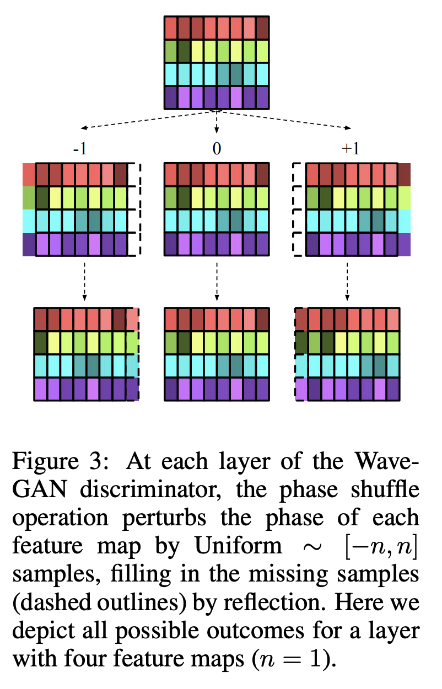

# [Phase Shuffle](https://paperswithcode.com/method/phase-shuffle)

**Phase Shuffle** is a technique for removing pitched noise artifacts that come from using transposed convolutions in audio generation models. Phase shuffle is an operation with hyperparameter $n$. It randomly perturbs the phase of each layer’s activations by −$n$ to $n$ samples before input to the next layer.

In the original application in WaveGAN, the authors only apply phase shuffle to the discriminator, as the latent vector already provides the generator a mechanism to manipulate the phase
of a resultant waveform. Intuitively speaking, phase shuffle makes the discriminator’s job more challenging by requiring invariance to the phase of the input waveform.

source: [source](http://arxiv.org/abs/1802.04208v3)
