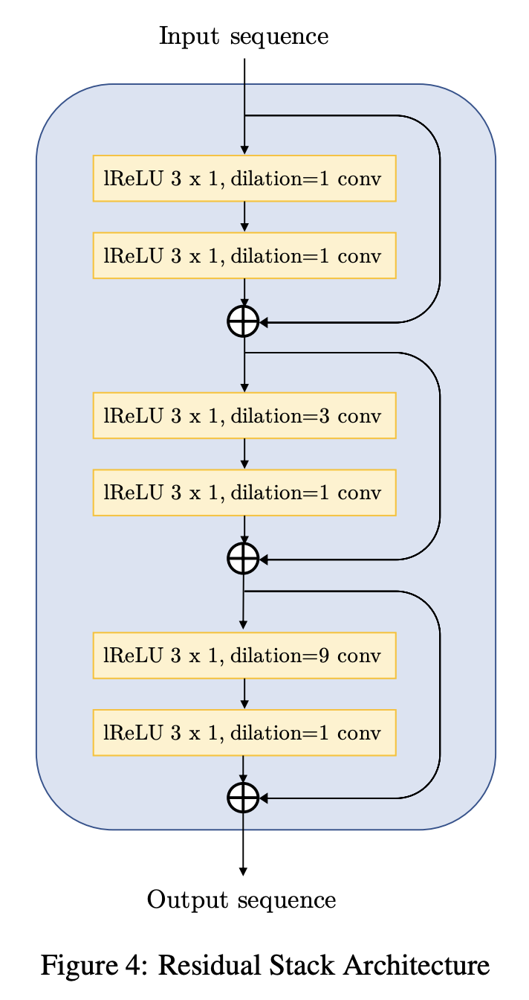
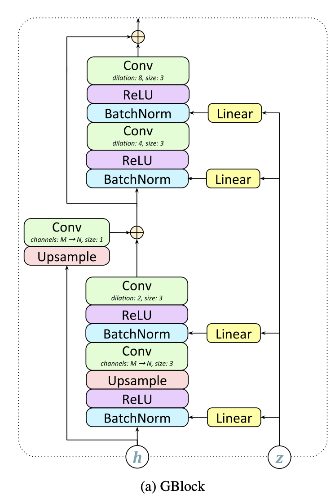
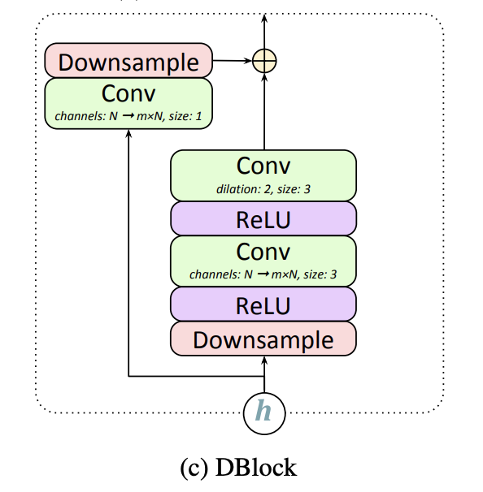
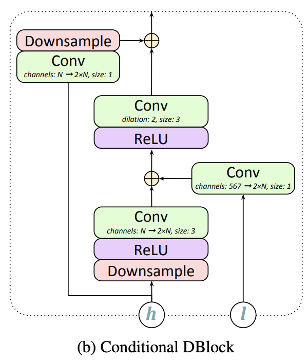

# [MelGAN Residual Block](https://paperswithcode.com/method/melgan-residual-block)

The **MelGAN Residual Block** is a convolutional residual block used in the [MelGAN](https://paperswithcode.com/method/melgan) generative audio architecture. It employs residual connections with dilated convolutions. Dilations are used so that temporally far output activations of each subsequent layer has significant overlapping inputs. Receptive field of a stack of dilated convolution layers increases exponentially with the number of layers. Incorporating these into the MelGAN generator allows us to efficiently increase the induced receptive fields of each output time-step. This effectively implies larger overlap in the induced receptive field of far apart time-steps, leading to better long range correlation.

source: [source](https://arxiv.org/abs/1910.06711v3)
# [GBlock](https://paperswithcode.com/method/gblock)

**GBlock** is a type of residual block used in the [GAN-TTS](https://paperswithcode.com/method/gan-tts) text-to-speech architecture - it is a stack of two residual blocks. As the generator is producing raw audio (e.g. a 2s training clip corresponds
to a sequence of 48000 samples), dilated convolutions are used to ensure that the receptive field of $G$ is large enough to capture long-term dependencies. The four kernel size-3 convolutions in each GBlock have increasing dilation factors: 1, 2, 4, 8. Convolutions are preceded by Conditional Batch Normalisation, conditioned on the linear embeddings of the noise term $z \sim N\left(0, \mathbf{I}_{128}\right)$ in the single-speaker case, or the concatenation of $z$ and a one-hot representation of the speaker ID in the multi-speaker case. The embeddings are different for
each BatchNorm instance. 

A GBlock contains two skip connections, the first of which in GAN-TTS performs upsampling if the output frequency is higher than the input, and it also contains a size-1 convolution
if the number of output channels is different from the input.

source: [source](https://arxiv.org/abs/1909.11646v2)
# [DBlock](https://paperswithcode.com/method/dblock)

**DBlock** is a residual based block used in the discriminator of the [GAN-TTS](https://paperswithcode.com/method/gan-tts) architecture. They are similar to the [GBlocks](https://paperswithcode.com/method/gblock) used in the generator, but without batch normalisation.

source: [source](https://arxiv.org/abs/1909.11646v2)
# [Conditional DBlock](https://paperswithcode.com/method/conditional-dblock)

**Conditional DBlock** is a residual based block used in the discriminator of the [GAN-TTS](https://paperswithcode.com/method/gan-tts) architecture. They are similar to the [GBlocks](https://paperswithcode.com/method/gblock) used in the generator, but without batch normalization. Unlike the [DBlock](https://paperswithcode.com/method/dblock), the Conditional DBlock adds the embedding of the linguistic features after the first convolution.

source: [source](https://arxiv.org/abs/1909.11646v2)
