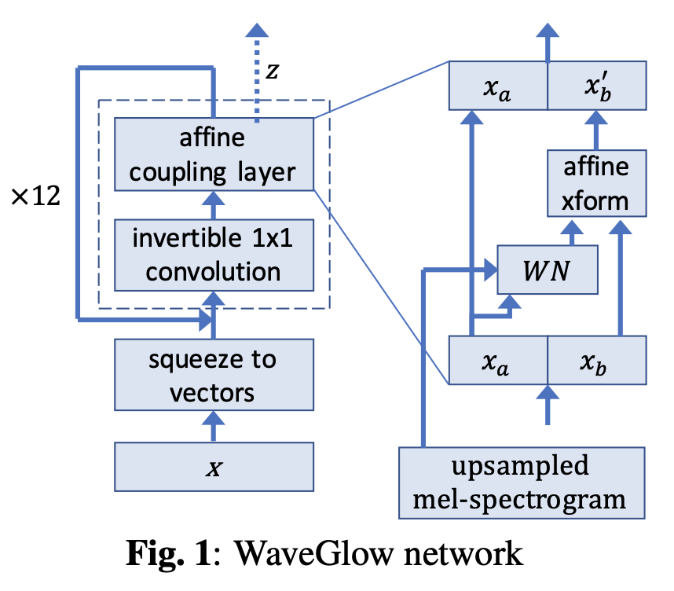
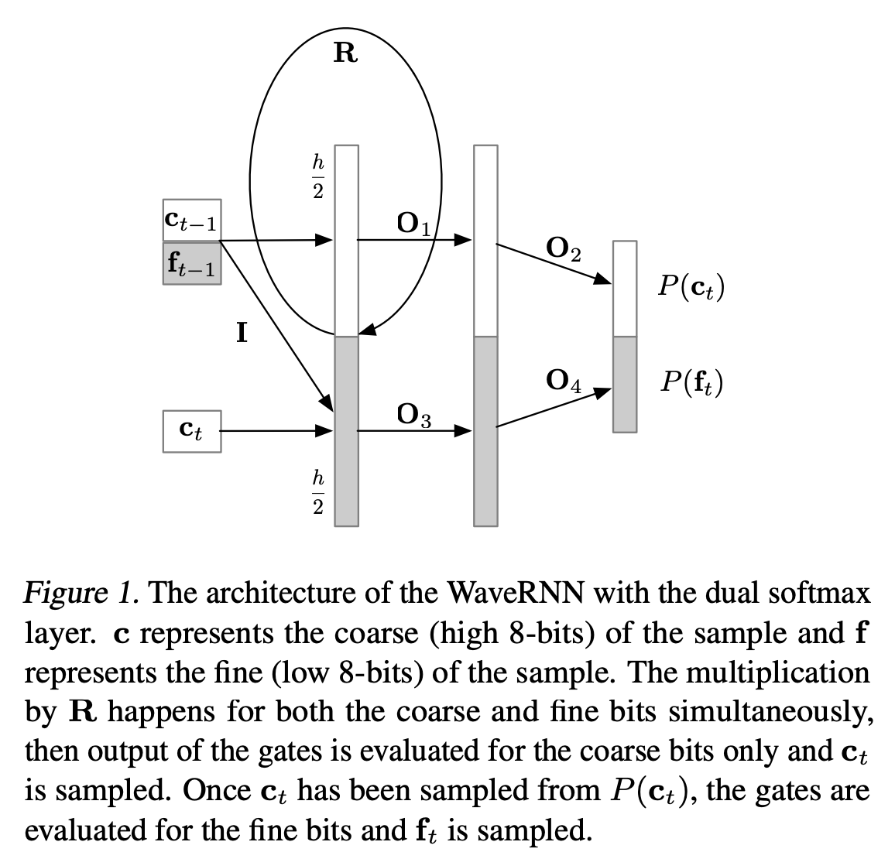
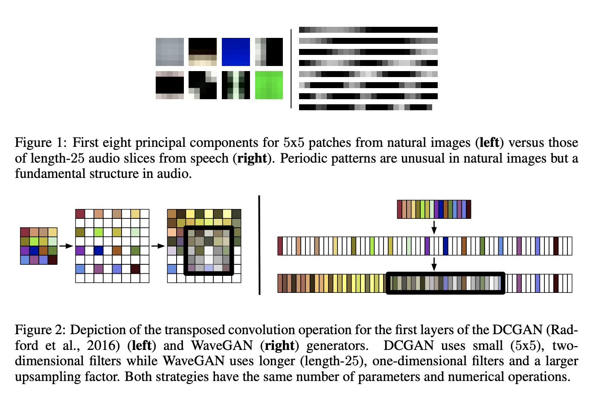
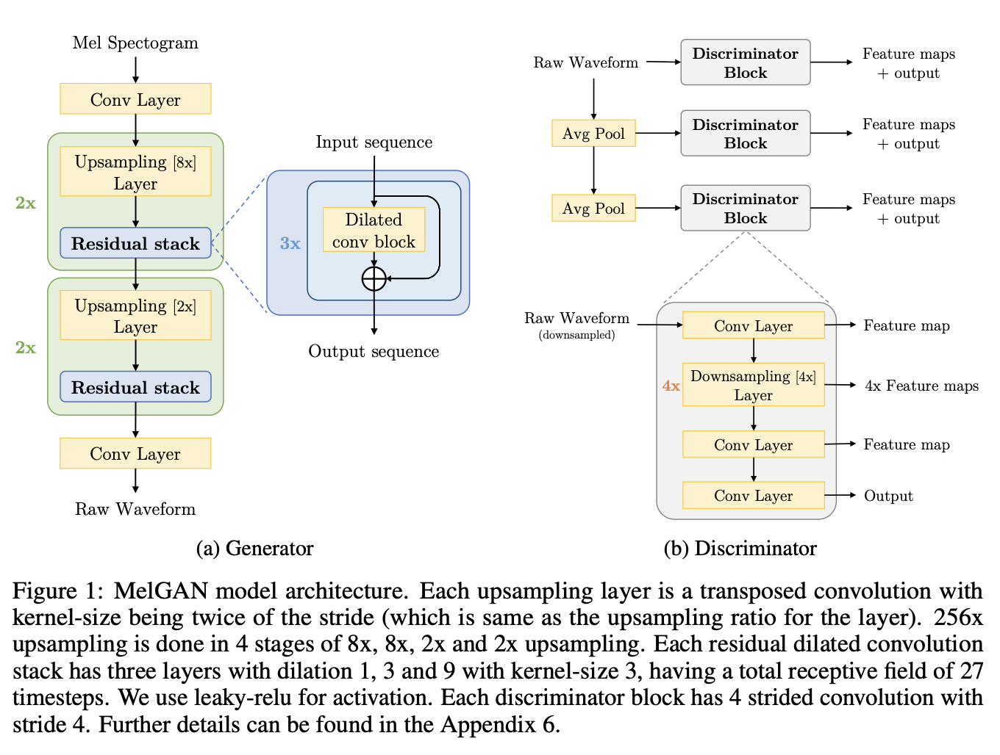
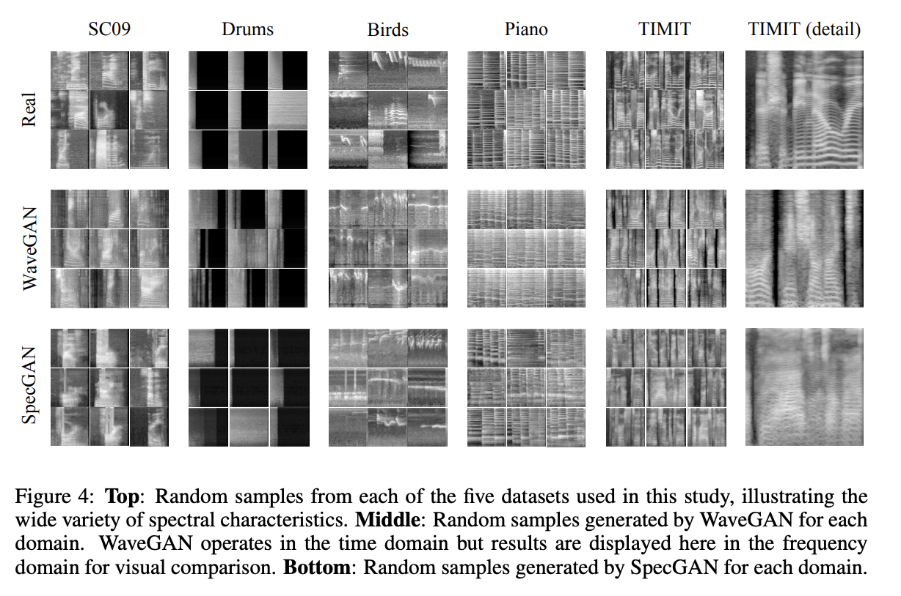

# [WaveNet](https://paperswithcode.com/method/wavenet)

**WaveNet** is an audio generative model based on the [PixelCNN](https://paperswithcode.com/method/pixelcnn) architecture. In order to deal with long-range temporal dependencies needed for raw audio generation, architectures are developed based on dilated causal convolutions, which exhibit very large receptive fields.

The joint probability of a waveform $\vec{x} = { x_1, \dots, x_T }$ is factorised as a product of conditional probabilities as follows:

$$p\left(\vec{x}\right) = \prod_{t=1}^{T} p\left(x_t \mid x_1, \dots ,x_{t-1}\right)$$

Each audio sample $x_t$ is therefore conditioned on the samples at all previous timesteps.

source: [source](http://arxiv.org/abs/1609.03499v2)
# [WaveGlow](https://paperswithcode.com/method/waveglow)

**WaveGlow** is a flow-based generative model that generates audio by sampling from a distribution. Specifically samples are taken from a zero mean spherical Gaussian with the same number of dimensions as our desired output, and those samples are put through a series of layers that transforms the simple distribution to one which has the desired distribution.

source: [source](http://arxiv.org/abs/1811.00002v1)
# [WaveRNN](https://paperswithcode.com/method/wavernn)

**WaveRNN** is a single-layer recurrent neural network for audio generation that is designed efficiently predict 16-bit raw audio samples.

The overall computation in the WaveRNN is as follows (biases omitted for brevity):

$$ \mathbf{x}_{t} = \left[\mathbf{c}_{t−1},\mathbf{f}_{t−1}, \mathbf{c}_{t}\right] $$

$$ \mathbf{u}_{t} = \sigma\left(\mathbf{R}_{u}\mathbf{h}_{t-1} + \mathbf{I}^{*}_{u}\mathbf{x}_{t}\right) $$

$$ \mathbf{r}_{t} = \sigma\left(\mathbf{R}_{r}\mathbf{h}_{t-1} + \mathbf{I}^{*}_{r}\mathbf{x}_{t}\right) $$

$$ \mathbf{e}_{t} = \tau\left(\mathbf{r}_{t} \odot \left(\mathbf{R}_{e}\mathbf{h}_{t-1}\right) + \mathbf{I}^{*}_{e}\mathbf{x}_{t} \right) $$

$$ \mathbf{h}_{t} = \mathbf{u}_{t} \cdot \mathbf{h}_{t-1} + \left(1-\mathbf{u}_{t}\right) \cdot \mathbf{e}_{t} $$

$$ \mathbf{y}_{c}, \mathbf{y}_{f} = \text{split}\left(\mathbf{h}_{t}\right) $$

$$ P\left(\mathbf{c}_{t}\right) = \text{softmax}\left(\mathbf{O}_{2}\text{relu}\left(\mathbf{O}_{1}\mathbf{y}_{c}\right)\right) $$

$$ P\left(\mathbf{f}_{t}\right) = \text{softmax}\left(\mathbf{O}_{4}\text{relu}\left(\mathbf{O}_{3}\mathbf{y}_{f}\right)\right) $$

where the $*$ indicates a masked matrix whereby the last coarse input $\mathbf{c}_{t}$ is only connected to the fine part of the states $\mathbf{u}_{t}$, $\mathbf{r}_{t}$, $\mathbf{e}_{t}$ and $\mathbf{h}_{t}$ and thus only affects the fine output $\mathbf{y}_{f}$. The coarse and fine parts $\mathbf{c}_{t}$ and $\mathbf{f}_{t}$ are encoded as scalars in $\left[0, 255\right]$ and scaled to the interval $\left[−1, 1\right]$. The matrix $\mathbf{R}$ formed from the matrices $\mathbf{R}_{u}$, $\mathbf{R}_{r}$, $\mathbf{R}_{e}$ is computed as a single matrix-vector product to produce the contributions to all three gates $\mathbf{u}_{t}$, $mathbf{r}_{t}$ and $\mathbf{e}_{t}$ (a variant of the [GRU cell](https://paperswithcode.com/method/gru). $\sigma$ and $\tau$ are the standard sigmoid and tanh non-linearities.

Each part feeds into a softmax layer over the corresponding 8 bits and the prediction of the 8 fine bits is conditioned on the 8 coarse bits. The resulting Dual Softmax layer allows for efficient prediction of 16-bit samples using two small output spaces (2 8 values each) instead of a single large output space (with 2 16 values).

source: [source](http://arxiv.org/abs/1802.08435v2)
# [WaveGAN](https://paperswithcode.com/method/wavegan)

**WaveGAN** is a generative adversarial network for unsupervised synthesis of raw-waveform audio (as opposed to image-like spectrograms). 

The WaveGAN architecture is based off [DCGAN](https://paperswithcode.com/method/dcgan). The DCGAN generator uses the transposed convolution operation to iteratively upsample low-resolution feature maps into a high-resolution image. WaveGAN modifies this transposed convolution operation to widen its receptive field, using a longer one-dimensional filters of length 25 instead of two-dimensional filters of size 5x5, and upsampling by a factor of 4 instead of 2 at each layer. The discriminator is modified in a similar way, using length-25 filters in one dimension and increasing stride
from 2 to 4. These changes result in WaveGAN having the same number of parameters, numerical
operations, and output dimensionality as DCGAN. An additional layer is added afterwards to allow for more audio samples. Further changes include:

1. Flattening 2D convolutions into 1D (e.g. 5x5 2D conv becomes length-25 1D).
1. Increasing the stride factor for all convolutions (e.g. stride 2x2 becomes stride 4).
1. Removing batch normalization from the generator and discriminator.
1. Training using the WGAN-GP strategy.

source: [source](http://arxiv.org/abs/1802.04208v3)
# [MelGAN](https://paperswithcode.com/method/melgan)

**MelGAN** is a non-autoregressive feed-forward convolutional architecture to perform audio waveform generation in a GAN setup. The architecture is a fully convolutional feed-forward network with mel-spectrogram $s$ as input and raw waveform $x$ as output. Since the mel-spectrogram is at
a 256× lower temporal resolution, the authors use a stack of transposed convolutional layers to upsample the input sequence. Each transposed convolutional layer is followed by a stack of residual blocks with dilated convolutions. Unlike traditional GANs, the MelGAN generator does not use a global noise vector as input.

To deal with 'checkerboard artifacts' in audio, instead of using [PhaseShuffle](https://paperswithcode.com/method/phase-shuffle), MelGAN uses kernel-size as a multiple of stride.

Weight normalization is used for normalization. A window-based discriminator, similar to a [PatchGAN](https://paperswithcode.com/method/patchgan) is used for the discriminator.

source: [source](https://arxiv.org/abs/1910.06711v3)
# [SpecGAN](https://paperswithcode.com/method/specgan)

**SpecGAN** is a generative adversarial network method for spectrogram-based, frequency-domain audio generation. The problem is suited for GANs designed for image generation. The model can be approximately inverted. 

To process audio into suitable spectrograms, the authors perform the short-time Fourier transform with 16 ms windows and 8ms stride, resulting in 128 frequency bins, linearly spaced from 0 to 8 kHz. They take the magnitude of the resultant spectra and scale amplitude values logarithmically to better-align with human perception. They then normalize each frequency bin to have zero mean and unit variance. They clip the spectra to $3$ standard deviations and rescale to $\left[−1, 1\right]$.

They then use the DCGAN approach on the result spectra.

source: [source](http://arxiv.org/abs/1802.04208v3)
