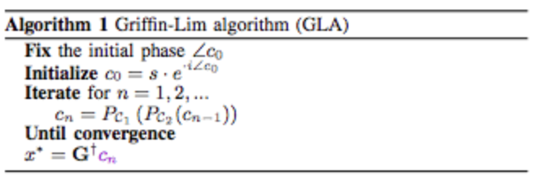

# [Griffin-Lim Algorithm](https://paperswithcode.com/method/griffin-lim-algorithm)

The **Griffin-Lim Algorithm (GLA)** is a phase reconstruction method based on the redundancy of the short-time Fourier transform. It promotes the consistency of a spectrogram by iterating two projections, where a spectrogram is said to be consistent when its inter-bin dependency owing to the redundancy of STFT is retained.  GLA is based only on the consistency and does not take any prior knowledge about the target signal into account. 

This algorithm expects to recover a complex-valued spectrogram, which is consistent and maintains the given amplitude $\mathbf{A}$, by the following alternative projection procedure:

$$ \mathbf{X}^{[m+1]} = P_{\mathcal{C}}\left(P_{\mathcal{A}}\left(\mathbf{X}^{[m]}\right)\right) $$

where $\mathbf{X}$ is a complex-valued spectrogram updated through the iteration, $P_{\mathcal{S}}$ is the metric projection onto a set $\mathcal{S}$, and $m$ is the iteration index. Here, $\mathcal{C}$ is the set of consistent spectrograms, and $\mathcal{A}$ is the set of spectrograms whose amplitude is the same as the given one. The metric projections onto these sets $\mathcal{C}$ and $\mathcal{A}$ are given by:

$$ P_{\mathcal{C}}(\mathbf{X}) = \mathcal{GG}^{†}\mathbf{X} $$
$$ P_{\mathcal{A}}(\mathbf{X}) = \mathbf{A} \odot \mathbf{X} \oslash |\mathbf{X}| $$

where $\mathcal{G}$ represents STFT, $\mathcal{G}^{†}$ is the pseudo inverse of STFT (iSTFT), $\odot$ and $\oslash$ are element-wise multiplication and division, respectively, and division by zero is replaced by zero. GLA is obtained as an algorithm for the following optimization problem:

$$ \min_{\mathbf{X}} || \mathbf{X} - P_{\mathcal{C}}\left(\mathbf{X}\right) ||^{2}_{\text{Fro}} \text{ s.t. } \mathbf{X} \in \mathcal{A} $$

where $ || · ||_{\text{Fro}}$ is the Frobenius norm. This equation minimizes the energy of the inconsistent components under the constraint on amplitude which must be equal to the given one. Although GLA has been widely utilized because of its simplicity, GLA often involves many iterations until it converges to a certain spectrogram and results in low reconstruction quality. This is because the cost function only requires the consistency, and the characteristics of the target signal are not taken into account.

