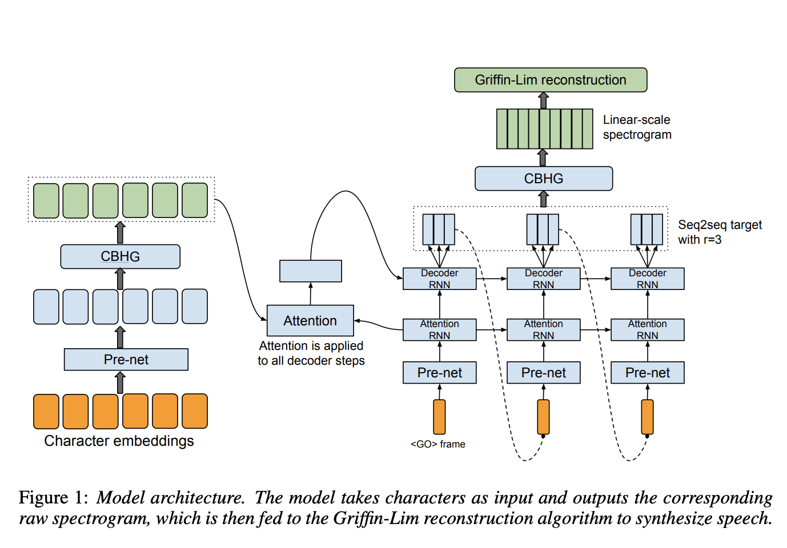
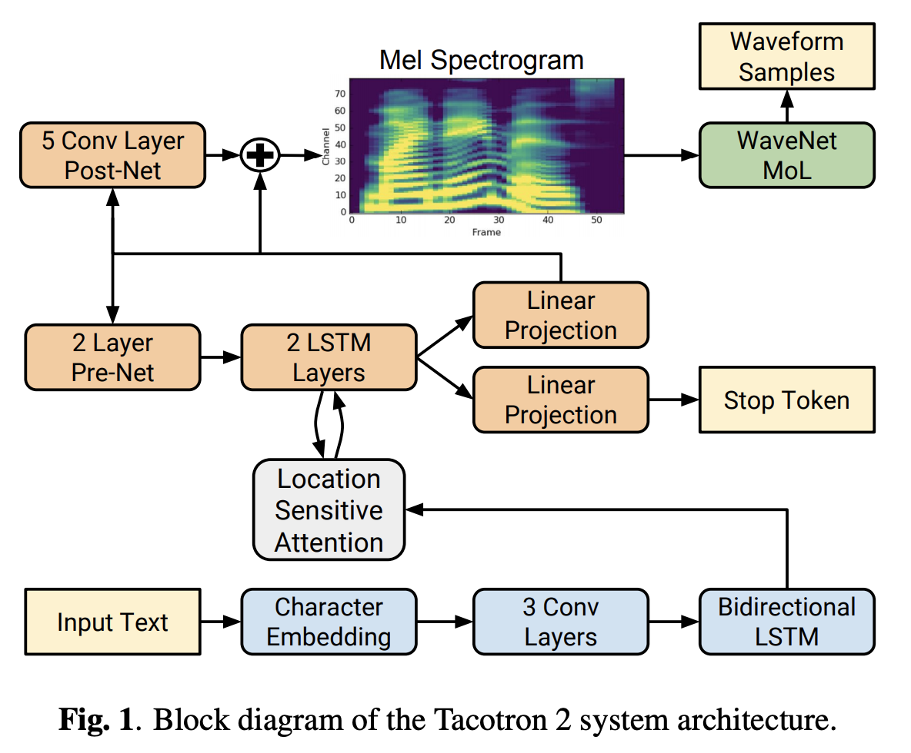
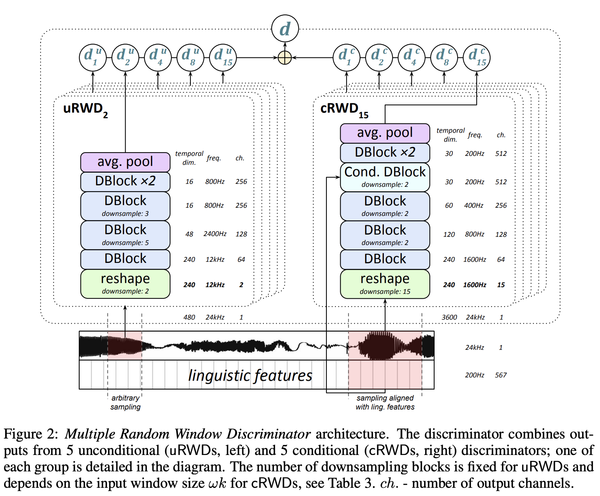

# [Tacotron](https://paperswithcode.com/method/tacotron)

**Tacotron** is an end-to-end generative text-to-speech model that takes a character sequence as input and outputs the corresponding spectrogram. The backbone of Tacotron is a seq2seq model with attention. The Figure depicts the model, which includes an encoder, an attention-based decoder, and a post-processing net. At a high-level, the model takes characters as input and produces spectrogram
frames, which are then converted to waveforms.

source: [source](http://arxiv.org/abs/1703.10135v2)
# [Tacotron 2](https://paperswithcode.com/method/tacotron-2)

**Tacotron 2** is a neural network architecture for speech synthesis directly from text. It consists of two components:

<li>a recurrent sequence-to-sequence feature prediction network with
attention which predicts a sequence of mel spectrogram frames from
an input character sequence</li>
<li>a modified version of [WaveNet](https://paperswithcode.com/method/wavenet) which generates time-domain waveform samples conditioned on the
predicted mel spectrogram frames</li>

In contrast to the original [Tacotron](https://paperswithcode.com/method/tacotron), Tacotron 2 uses simpler building blocks, using vanilla LSTM and convolutional layers in the encoder and decoder instead of [CBHG](https://paperswithcode.com/method/cbhg) stacks and [GRU](https://paperswithcode.com/method/gru) recurrent layers. Tacotron 2 does not use a “reduction factor”, i.e., each decoder step corresponds to a single spectrogram frame. Location-sensitive attention is used instead of additive attention.

source: [source](http://arxiv.org/abs/1712.05884v2)
# [GAN-TTS](https://paperswithcode.com/method/gan-tts)

**GAN-TTS** is a generative adversarial network for text-to-speech synthesis. The architecture is composed of a conditional feed-forward generator producing raw speech audio, and an ensemble of discriminators which operate on random windows of different sizes. The discriminators analyze the audio both in terms of general realism, as well as how well the audio corresponds to the utterance that should be pronounced.

The generator architecture consists of several GBlocks, which are residual based (dilated) convolution blocks. GBlocks 3–7 gradually upsample the temporal dimension of hidden representations by factors of 2, 2, 2, 3, 5, while the number of channels is reduced by GBlocks 3, 6 and 7 (by a factor of 2 each). The final convolutional layer with Tanh activation produces a single-channel audio waveform.

Instead of a single discriminator, GAN-TTS uses an ensemble of Random Window Discriminators (RWDs) which operate on randomly sub-sampled fragments of the real or generated samples. The ensemble allows for the evaluation of audio in different complementary ways.

source: [source](https://arxiv.org/abs/1909.11646v2)
