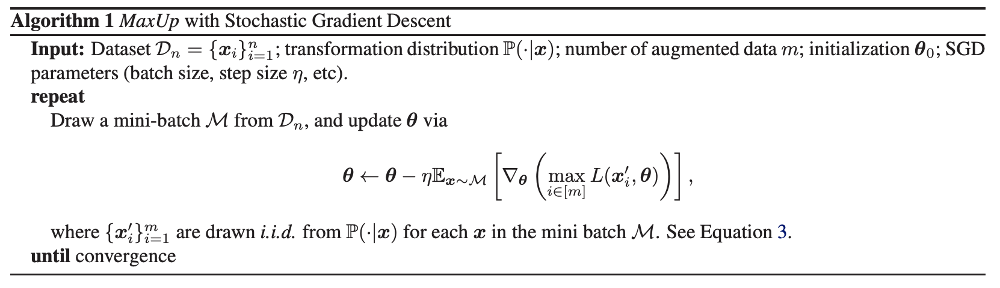
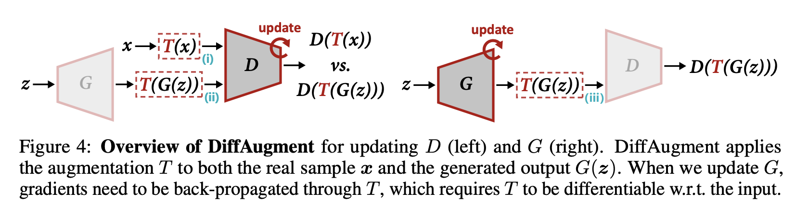

# [MaxUp](https://paperswithcode.com/method/maxup)

**MaxUp** is an adversarial data augmentation technique for improving the generalization performance of machine learning models. The idea is to generate a set of augmented data with some random perturbations or transforms, and minimize the maximum, or worst case loss over the augmented data.  By doing so, we implicitly introduce a smoothness or robustness regularization against the random perturbations, and hence improve the generation performance.  For example, in the case of Gaussian perturbation, MaxUp is asymptotically equivalent to using the gradient norm of the loss as a penalty to encourage smoothness.

source: [source](https://arxiv.org/abs/2002.09024v1)
# [DiffAugment](https://paperswithcode.com/method/diffaugment)

**Differentiable Augmentation (DiffAugment)** is a set of differentiable image transformations used to augment data during GAN training. The transformations are applied to the real and generated images.

source: [source](https://arxiv.org/abs/2006.10738v1)
