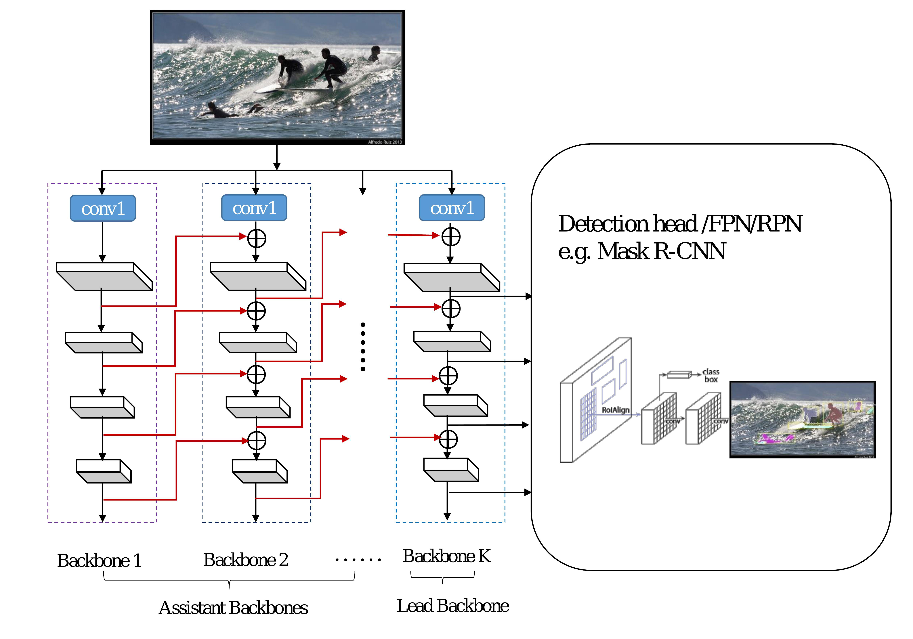

# [CBNet](https://paperswithcode.com/method/cbnet)

**CBNet** is a backbone architecture that consists of multiple identical backbones (specially called Assistant Backbones and Lead Backbone) and composite connections between neighbor backbones. From left to right, the output of each stage in an Assistant Backbone, namely higher-level
features, flows to the parallel stage of the succeeding backbone as part of inputs through composite connections. Finally, the feature maps of the last backbone named Lead
Backbone are used for object detection. The features extracted by CBNet for object detection fuse the high-level and low-level features of multiple backbones, hence improve the detection performance.

source: [source](https://arxiv.org/abs/1909.03625v1)
