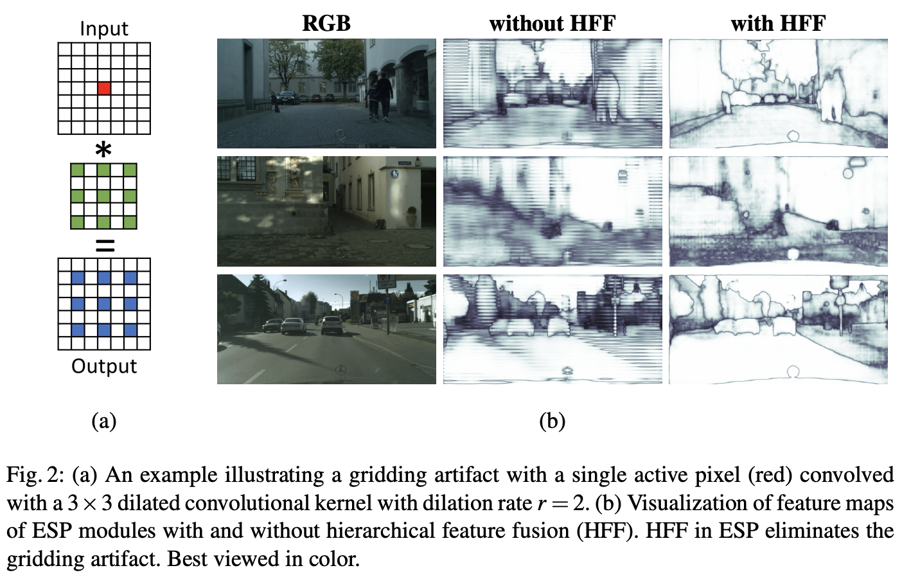

# [Hierarchical Feature Fusion](https://paperswithcode.com/method/hierarchical-feature-fusion)

**Hierarchical Feature Fusion (HFF)** is a feature fusion method employed in ESP and EESP image model blocks for degridding. In the ESP module, concatenating the outputs of dilated convolutions gives the ESP module a large effective receptive field, but it introduces unwanted checkerboard or gridding artifacts. To address the gridding artifact in ESP, the feature maps obtained using kernels of different dilation rates are hierarchically added before concatenating them (HFF). This solution is simple and effective and does not increase the complexity of the ESP module.

source: [source](http://arxiv.org/abs/1803.06815v3)
