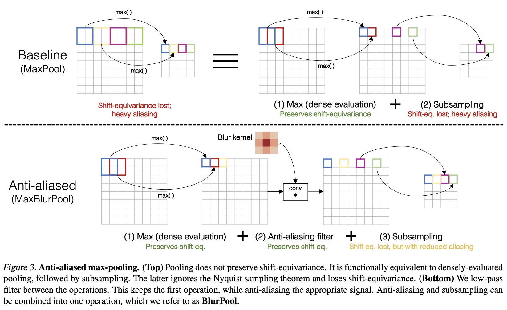

# [Anti-Alias Downsampling](https://paperswithcode.com/method/anti-alias-downsampling)

**Anti-Alias Downsampling (AA)** aims to improve the shift-equivariance of deep networks. Max-pooling is inherently composed of two operations. The first operation is to densely evaluate the max operator and second operation is naive subsampling. AA is proposed as a low-pass filter between them to achieve practical anti-aliasing in any existing strided layer such as strided convolution. The smoothing factor can be adjusted by changing the blur kernel filter size, where a larger filter size results in increased blur.

source: [source](https://arxiv.org/abs/1904.11486v2)
