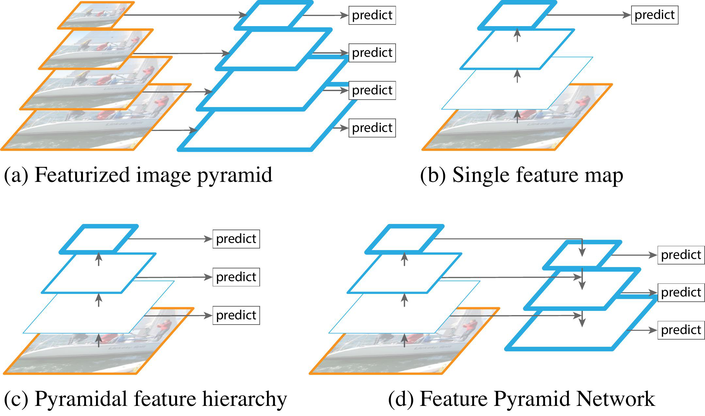
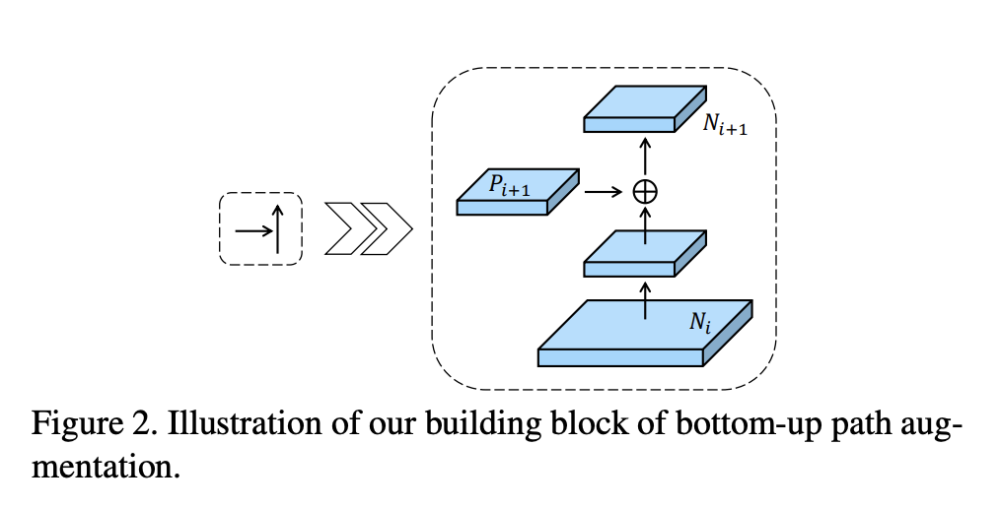
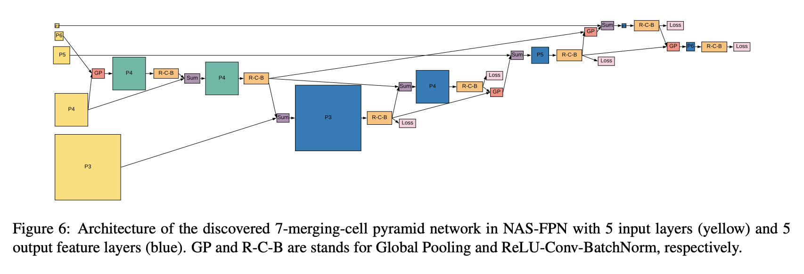
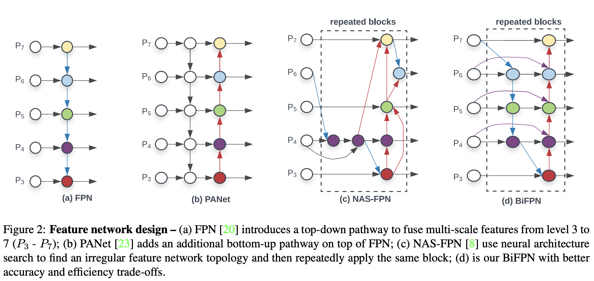
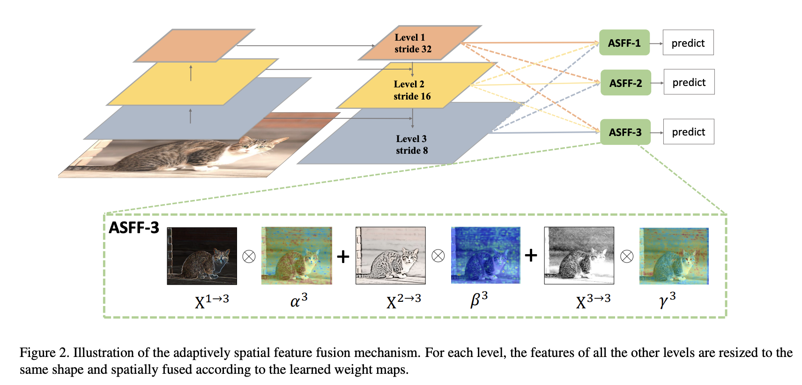
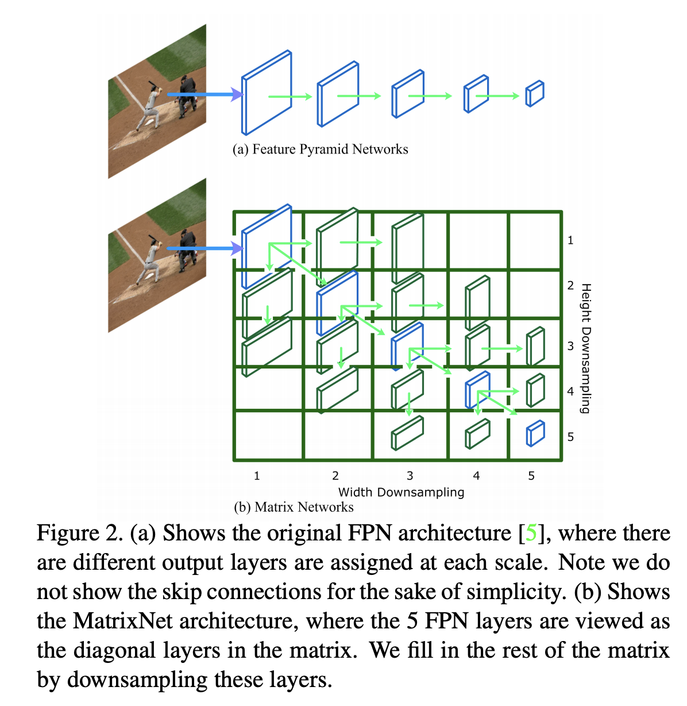
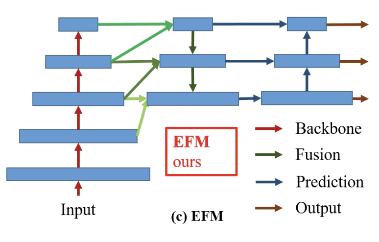
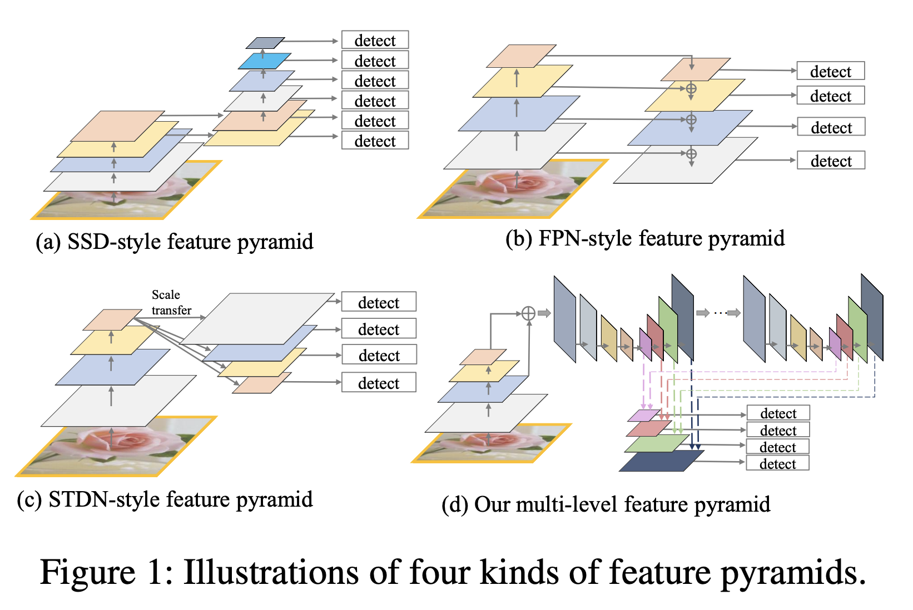

# [FPN](https://paperswithcode.com/method/fpn)

A **Feature Pyramid Network**, or **FPN**, is a feature extractor that takes a single-scale image of an arbitrary size as input, and outputs proportionally sized feature maps at multiple levels, in a fully convolutional fashion. This process is independent of the backbone convolutional architectures. It therefore acts as a generic solution for building feature pyramids inside deep convolutional networks to be used in tasks like object detection.

The construction of the pyramid involves a bottom-up pathway and a top-down pathway.

The bottom-up pathway is the feedforward computation of the backbone ConvNet, which computes a feature hierarchy consisting of feature maps at several scales with a scaling step of 2. For the feature
pyramid, one pyramid level is defined for each stage. The output of the last layer of each stage is used as a reference set of feature maps. For ResNets we use the feature activations output by each stage’s last residual block. 

The top-down pathway hallucinates higher resolution features by upsampling spatially coarser, but semantically stronger, feature maps from higher pyramid levels. These features are then enhanced with features from the bottom-up pathway via lateral connections. Each lateral connection merges feature maps of the same spatial size from the bottom-up pathway and the top-down pathway. The bottom-up feature map is of lower-level semantics, but its activations are more accurately localized as it was subsampled fewer times.

source: [source](http://arxiv.org/abs/1612.03144v2)
# [Bottom-up Path Augmentation](https://paperswithcode.com/method/bottom-up-path-augmentation)

**Bottom-up Path Augmentation** is a feature extraction technique that seeks to shorten the information path and enhance a feature pyramid with accurate localization signals existing in low-levels. This is based on the fact that high response to edges or instance parts is a strong indicator to accurately localize instances. 

Each building block takes a higher resolution feature map $N_{i}$ and a coarser map $P_{i+1}$ through lateral connection and generates the new feature map $N_{i+1}$ Each feature map $N_{i}$ first goes through a $3 \times 3$ convolutional layer with stride $2$ to reduce the spatial size. Then each element of feature map $P_{i+1}$ and the down-sampled map are added through lateral connection. The fused feature map is then processed by another $3 \times 3$ convolutional layer to generate $N_{i+1}$ for following sub-networks. This is an iterative process and terminates after approaching $P_{5}$. In these building blocks, we consistently use channel 256 of feature maps. The feature grid for each proposal is then pooled from new feature maps, i.e., {$N_{2}$, $N_{3}$, $N_{4}$, $N_{5}$}.

source: [source](http://arxiv.org/abs/1803.01534v4)
# [PAFPN](https://paperswithcode.com/method/pafpn)

**PAFPN** is a feature pyramid module used in Path Aggregation networks (PANet) that combines FPNs with bottom-up path augmentation, which shortens the information path between lower layers and topmost feature.

source: [source](http://arxiv.org/abs/1803.01534v4)
# [RFB](https://paperswithcode.com/method/rfb)

**Receptive Field Block (RFB)** is a module for strengthening the deep features learned from lightweight CNN models so that they can contribute to fast and accurate detectors. Specifically, RFB makes use of multi-branch pooling with varying kernels corresponding to RFs of different sizes, applies dilated convolution layers to control their eccentricities, and reshapes them to generate
final representation.

source: [source](http://arxiv.org/abs/1711.07767v3)
# [Context Enhancement Module](https://paperswithcode.com/method/context-enhancement-module)

**Context Enhancement Module (CEM)** is a feature extraction module used in object detection (specifically, ThunderNet) which aims to  to enlarge the receptive field. The key idea of CEM is to aggregate multi-scale local context information and global context information to generate more discriminative features. In CEM, the feature maps from three scales are merged: $C_{4}$, $C_{5}$ and $C_{glb}$. $C_{glb}$ is the global context feature vector by applying a global average pooling on $C_{5}$. We then apply a 1 × 1 convolution on each feature map to squeeze the number of channels to $\alpha \times p \times p = 245$.

Afterwards, $C_{5}$ is upsampled by 2× and $C_{glb}$ is broadcast so that the spatial dimensions of the three feature maps are
equal. At last, the three generated feature maps are aggregated. By leveraging both local and global context, CEM effectively enlarges the receptive field and refines the representation ability of the thin feature map. Compared with prior FPN structures, CEM involves only two 1×1 convolutions and a fc layer.

source: [source](https://arxiv.org/abs/1903.11752v2)
# [Panoptic FPN](https://paperswithcode.com/method/panoptic-fpn)

A **Panoptic FPN** is an extension of an [FPN](https://paperswithcode.com/method/fpn) that can generate both instance and semantic segmentations via FPN. The approach starts with an FPN backbone and adds a branch for performing semantic segmentation in parallel with the existing region-based branch for instance segmentation. No changes are made to the FPN backbone when adding the dense-prediction branch, making it compatible with existing instance segmentation methods. 

The new semantic segmentation branch achieves its goal as follows. Starting from the deepest FPN level (at 1/32 scale), we perform three upsampling stages to yield a feature map at 1/4 scale, where each upsampling stage consists of 3×3 convolution, group norm, ReLU, and 2× bilinear upsampling. This strategy is repeated for FPN scales 1/16, 1/8, and 1/4 (with progressively fewer upsampling stages). The result is a set of feature maps at the same 1/4 scale, which are then element-wise summed. A final 1×1 convolution, 4× bilinear upsampling, and softmax are used to generate the per-pixel class labels at the original image resolution. In addition to stuff classes, this branch also outputs a special ‘other’ class for all pixels belonging to objects (to avoid predicting stuff classes for such pixels).

source: [source](http://arxiv.org/abs/1901.02446v2)
# [SFAM](https://paperswithcode.com/method/sfam)

**SFAM**, or **Scale-wise Feature Aggregation Module**, is a feature extraction block from the M2Det architecture. It aims to aggregate the multi-level multi-scale features generated by Thinned U-Shaped Modules into a multi-level feature pyramid. 

The first stage of SFAM is to concatenate features of the equivalent scale together along the channel dimension. The aggregated feature pyramid can be presented as $\mathbf{X} =[\mathbf{X}_1,\mathbf{X}_2,\dots,\mathbf{X}_i]$, where $\mathbf{X}_i = \text{Concat}(\mathbf{x}_i^1,\mathbf{x}_i^2,\dots,\mathbf{x}_i^L) \in \mathbb{R}^{W_{i}\times H_{i}\times C}$ refers to the features of the $i$-th largest scale. Here, each scale in the aggregated pyramid contains features from multi-level depths. 

However, simple concatenation operations are not adaptive enough. In the second stage, we introduce a channel-wise attention module to encourage features to focus on channels that they benefit most. Following Squeeze-and-Excitation, we use global average pooling to generate channel-wise statistics $\mathbf{z} \in \mathbb{R}^C$ at the squeeze step. And to fully capture channel-wise dependencies, the following excitation step learns the attention mechanism via two fully connected layers:

$$
\mathbf{s} = \mathbf{F}_{ex}(\mathbf{z},\mathbf{W}) = \sigma(\mathbf{W}_{2} \delta(\mathbf{W}_{1}\mathbf{z})),
$$

where $\sigma$ refers to the ReLU function, $\delta$ refers to the sigmoid function, $\mathbf{W}_{1} \in \mathbb{R}^{\frac{C}{r}\times C}$ , $\mathbf{W}_{2} \in \mathbb{R}^{C\times \frac{C}{r}}$, r is the reduction ratio ($r=16$ in our experiments). The final output is obtained by reweighting the input $\mathbf{X}$ with activation $\mathbf{s}$:

$$
\tilde{\mathbf{X}}_i^c = \mathbf{F}_{scale}(\mathbf{X}_i^c,s_c) = s_c \cdot \mathbf{X}_i^c,
$$

where $\tilde{\mathbf{X}_i} = [\tilde{\mathbf{X}}_i^1,\tilde{\mathbf{X}}_i^2,...,\tilde{\mathbf{X}}_i^C]$, each of the features is enhanced or weakened by the rescaling operation.

source: [source](http://arxiv.org/abs/1811.04533v3)
# [Spatial Attention Module (ThunderNet)](https://paperswithcode.com/method/spatial-attention-module-thundernet)

**Spatial Attention Module (SAM)** is a feature extraction module for object detection used in ThunderNet.

The ThunderNet SAM explicitly re-weight the feature map before RoI warping over the spatial dimensions. The key idea of SAM is to use the knowledge from RPN to refine the feature distribution of the feature map. RPN is trained to recognize foreground regions under the supervision of ground truths. Therefore, the intermediate features in RPN can be used to distinguish foreground features from background features. SAM accepts two inputs: the intermediate feature map from RPN $\mathcal{F}^{RPN}$ and the thin feature map from the Context Enhancement Module $\mathcal{F}^{CEM}$. The output of SAM $\mathcal{F}^{SAM}$ is defined as:

$$ \mathcal{F}^{SAM} = \mathcal{F}^{CEM} * sigmoid\left(\theta\left(\mathcal{F}^{RPN}\right)\right) $$

Here $\theta\left(·\right)$ is a dimension transformation to match the number of channels in both feature maps. The sigmoid function is used to constrain the values within $\left[0, 1\right]$. At last, $\mathcal{F}^{CEM}$ is re-weighted by the generated feature map for better feature distribution. For computational efficiency, we simply apply a 1×1 convolution as $\theta\left(·\right)$, so the computational cost of CEM is negligible. The Figure to the right shows the structure of SAM. 

SAM has two functions. The first one is to refine the feature distribution by strengthening foreground features and suppressing background features. The second one is to stabilize the training of RPN as SAM enables extra gradient flow from R-CNN subnet to RPN. As a result, RPN receives additional supervision from RCNN subnet, which helps the training of RPN.

source: [source](https://arxiv.org/abs/1903.11752v2)
# [NAS-FPN](https://paperswithcode.com/method/nas-fpn)

**NAS-FPN** is a Feature Pyramid Network that is discovered via Neural Architecture Search in a novel scalable search space covering all cross-scale connections. The discovered architecture consists of a combination of top-down and bottom-up connections to fuse features across scales

source: [source](http://arxiv.org/abs/1904.07392v1)
# [BiFPN](https://paperswithcode.com/method/bifpn)

A **BiFPN**, or **Weighted Bi-directional Feature Pyramid Network**, is a type of feature pyramid network which allows easy and fast multi-scale feature fusion. It incorporates the multi-level feature fusion idea from FPN, PANet and NAS-FPN that enables information to flow in both the top-down and bottom-up directions, while using regular and efficient connections. It also utilizes a fast normalized fusion technique. Traditional approaches usually treat all features input to the FPN equally, even those with different resolutions. However, input features at different resolutions often have unequal contributions to the output features. Thus, the BiFPN adds an additional weight for each input feature allowing the network to learn the importance of each. All regular convolutions are also replaced with less expensive depthwise separable convolutions.

Comparing with PANet, PANet added an extra bottom-up path for information flow at the expense of more computational cost. Whereas BiFPN optimizes these cross-scale connections by removing nodes with a single input edge, adding an extra edge from the original input to output node if they are on the same level, and treating each bidirectional path as one feature network layer (repeating it several times for more high-level future fusion).

source: [source](https://arxiv.org/abs/1911.09070v6)
# [Balanced Feature Pyramid](https://paperswithcode.com/method/balanced-feature-pyramid)

**Balanced Feature Pyramid** is a feature pyramid module. It differs from approaches like FPNs that integrate multi-level features using lateral connections. Instead the BFP strengthens the multi-level features using the same deeply integrated balanced semantic features. The pipeline is shown in the Figure to the right. It consists of four steps, rescaling, integrating, refining and strengthening.

Features at resolution level $l$ are denoted as $C_{l}$.The number of multi-level features is denoted as $L$. The indexes of involved lowest and highest levels are denoted as $l_{min}$ and $l_{max}$. In the Figure, $C_{2}$ has the highest resolution. To integrate multi-level features and preserve their semantic hierarchy at the same time, we first resize the multi-level features {$C_{2}, C_{3}, C_{4}, C_{5}$} to an intermediate size, i.e., the same size as $C_{4}$, with interpolation and max-pooling respectively. Once the features are rescaled, the balanced semantic features are obtained by simple averaging as:

$$ C = \frac{1}{L}\sum^{l_{max}}_{l=l_{min}}C_{l} $$

The obtained features are then rescaled using the same but reverse procedure to strengthen the original features. Each resolution obtains equal information from others in this procedure. Note that this procedure does not contain any parameter. We observe improvement with this nonparametric method, proving the effectiveness of the information flow. 

The balanced semantic features can be further refined to be more discriminative. The authors found both the refinements with convolutions directly and the non-local module work well. But the
non-local module works more stable. Therefore, embedded Gaussian non-local attention is utilized as default. The refining step helps us enhance the integrated features and further improve the results.

With this method, features from low-level to high-level are aggregated at the same time. The outputs
{$P_{2}, P_{3}, P_{4}, P_{5}$} are used for object detection following the same pipeline in FPN.

source: [source](http://arxiv.org/abs/1904.02701v1)
# [TUM](https://paperswithcode.com/method/tum)

**Thinned U-shape Module**, or **TUM**, is a feature extraction block used for object detection models. Different from FPN and RetinaNet, TUM adopts a thinner U-shape structure as illustrated in the Figure to the right. The encoder is a series of 3x3 convolution layers with stride 2. And the decoder takes the outputs of these layers as its reference set of feature maps, while the original FPN chooses the output of the last layer of each stage in ResNet backbone. In addition, we add 1x1 convolution layers after upsample and element-wise sum operation at the decoder branch to enhance learning ability and keep smoothness for the features. All of the outputs in the decoder of each TUM form the multi-scale features of the current level. As a whole, the outputs of stacked TUMs form the multi-level multi-scale features, while the front TUM mainly provides shallow-level features, the middle TUM provides medium-level features, and the back TUM provides deep-level features.

source: [source](http://arxiv.org/abs/1811.04533v3)
# [ASFF](https://paperswithcode.com/method/asff)

**ASFF**, or **Adaptively Spatial Feature Fusion**, is a method for pyramidal feature fusion. It learns the way to spatially filter conflictive information to suppress inconsistency across different feature scales, thus improving the scale-invariance of features, and introduces nearly free inference overhead. 
ASFF enables the network to directly learn how to spatially filter features at other levels so that only useful information is kept for combination. For the features at a certain level, features of other levels are first integrated and resized into the same resolution and then trained to find the optimal fusion. At each spatial location, features at different levels are fused adaptively, **i.e.**, some features may be filter out as they carry contradictory information at this location and some may dominate with more discriminative clues. ASFF offers several advantages: (1) as the operation of searching the optimal fusion is differential, it can be conveniently learned in back-propagation; (2) it is agnostic to the backbone model and it is applied to single-shot detectors that have a feature pyramid structure; and (3) its implementation is simple and the increased computational cost is marginal.

Let $\mathbf{x}_{ij}^{n\rightarrow l}$ denote the feature vector at the position $(i,j)$ on the feature maps resized from level $n$ to level $l$. Following a feature resizing stage, we fuse the features at the corresponding level $l$ as follows:

$$
\mathbf{y}_{ij}^l = \alpha^l_{ij} \cdot \mathbf{x}_{ij}^{1\rightarrow l} + \beta^l_{ij} \cdot \mathbf{x}_{ij}^{2\rightarrow l} +\gamma^l_{ij} \cdot \mathbf{x}_{ij}^{3\rightarrow l},
$$

where $\mathbf{y}_{ij}^l$ implies the $(i,j)$-th vector of the output feature maps $\mathbf{y}^l$ among channels. $\alpha^l_{ij}$, $\beta^l_{ij}$ and $\gamma^l_{ij}$ refer to the spatial importance weights for the feature maps at three different levels to level $l$, which are adaptively learned by the network. Note that $\alpha^l_{ij}$, $\beta^l_{ij}$ and $\gamma^l_{ij}$ can be simple scalar variables, which are shared across all the channels. Inspired by acnet, we force $\alpha^l_{ij}+\beta^l_{ij}+\gamma^l_{ij}=1$ and $\alpha^l_{ij},\beta^l_{ij},\gamma^l_{ij} \in [0,1]$, and 

$$
    \alpha^l_{ij} = \frac{e^{\lambda^l_{\alpha_{ij}}}}{e^{\lambda^l_{\alpha_{ij}}} + e^{\lambda^l_{\beta_{ij}
        }} + e^{\lambda^l_{\gamma_{ij}}}}.
$$

Here $\alpha^l_{ij}$, $\beta^l_{ij}$ and $\gamma^l_{ij}$ are defined by using the softmax function with $\lambda^l_{\alpha_{ij}}$, $\lambda^l_{\beta_{ij}}$ and $\lambda^l_{\gamma_{ij}}$ as control parameters respectively. We use $1\times1$ convolution layers to compute the weight scalar maps $\mathbf{\lambda}^l_\alpha$, $\mathbf{\lambda}^l_\beta$ and $\mathbf{\lambda}^l_\gamma$ from $\mathbf{x}^{1\rightarrow l}$, $\mathbf{x}^{2\rightarrow l}$ and $\mathbf{x}^{3\rightarrow l}$ respectively, and they can thus be learned through standard back-propagation.

With this method, the features at all the levels are adaptively aggregated at each scale. The outputs are used for object detection following the same pipeline of YOLOv3

source: [source](https://arxiv.org/abs/1911.09516v2)
# [Feature Intertwiner](https://paperswithcode.com/method/feature-intertwiner)

**Feature Intertwiner** is an object detection module that leverages the features from a more reliable set to help guide the feature learning of another less reliable set. The mutual learning process helps two sets to have closer distance within the cluster in each class. The intertwiner is applied on the object detection task, where a historical buffer is proposed to address the sample missing problem during one mini-batch and the optimal transport (OT) theory is introduced to enforce the similarity among the two sets.

source: [source](http://arxiv.org/abs/1903.11851v1)
# [MatrixNet](https://paperswithcode.com/method/matrixnet)

**MatrixNet** is a scale and aspect ratio aware building block for object detection that seek to handle objects of different sizes and aspect ratios. They have several matrix layers, each layer handles an object of specific size and aspect ratio. They can be seen as an alternative to FPNs, which while they are capable of handling objects of different sizes, they do not have a solution for objects of different aspect ratios. Objects such as a high tower, a giraffe, or a knife introduce a design difficulty for FPNs: does one map these objects to layers according to their width or height? Assigning the object to a layer according to its larger dimension would result in loss of information along the smaller dimension due to aggressive downsampling, and vice versa. 

MatrixNets assign objects of different sizes and aspect ratios to layers such that object sizes within their assigned layers are close to uniform. This assignment allows a square output convolution kernel to equally gather information about objects of all aspect ratios and scales. MatrixNets can be applied to any backbone, similar to FPNs. We denote this by appending a "-X" to the backbone, i.e. ResNet50-X.

source: [source](https://arxiv.org/abs/2001.03194v1)
# [FFMv1](https://paperswithcode.com/method/ffmv1)

**Feature Fusion Module v1** is a feature fusion module from the M2Det object detection model, and feature fusion modules are crucial for constructing the final multi-level feature pyramid. They use 1x1 convolution layers to compress the channels of the input features and use concatenation operation to aggregate these feature map. FFMv1 takes two feature maps with different scales in backbone as input, it adopts one upsample operation to rescale the deep features to the same scale before the concatenation operation.

source: [source](http://arxiv.org/abs/1811.04533v3)
# [FSAF](https://paperswithcode.com/method/fsaf)

**FSAF**, or Feature Selective Anchor-Free, is a building block for single-shot object detectors. It can be plugged into single-shot detectors with feature pyramid structure. The FSAF module addresses two limitations brought up by the conventional anchor-based detection: 1) heuristic-guided feature selection; 2) overlap-based anchor sampling. The general concept of the FSAF module is online feature selection applied to the training of multi-level anchor-free branches. Specifically, an anchor-free branch is attached to each level of the feature pyramid, allowing box encoding and decoding in the anchor-free manner at an arbitrary level. During training, we dynamically assign each instance to the most suitable feature level. At the time of inference, the FSAF module can work jointly with anchor-based branches by outputting predictions in parallel. We instantiate this concept with simple implementations of anchor-free branches and online feature selection strategy

The general concept is presented in the Figure to the right. An anchor-free branch is built per level of feature pyramid, independent to the anchor-based branch. Similar to the anchor-based branch, it consists of a classification subnet and a regression subnet (not shown in figure). An instance can be assigned to arbitrary level of the anchor-free branch. During training, we dynamically select the most suitable level of feature for each instance based on the instance content instead of just the size of instance box. The selected level of feature then learns to detect the assigned instances. At inference, the FSAF module can run independently or jointly with anchor-based branches. The FSAF module is agnostic to the backbone network and can be applied to single-shot detectors with a structure of feature pyramid. Additionally, the instantiation of anchor-free branches and online feature selection can be various.

source: [source](http://arxiv.org/abs/1903.00621v1)
# [Exact Fusion Model](https://paperswithcode.com/method/exact-fusion-model)

**Exact Fusion Model (EFM)** is a method for aggregating a feature pyramid. The EFM is based on YOLOv3, which assigns exactly one bounding-box prior to each ground truth object. Each ground
truth bounding box corresponds to one anchor box that surpasses the threshold IoU. If the size of an anchor box is equivalent to the field-of-view of the grid cell, then for the grid cells of the $s$-th scale, the corresponding bounding box will be lower bounded by the $(s − 1)$th scale and upper bounded by the (s + 1)th scale. Therefore, the EFM assembles features from the three scales.

source: [source](https://arxiv.org/abs/1911.11929v1)
# [MLFPN](https://paperswithcode.com/method/mlfpn)

**Multi-Level Feature Pyramid Network**, or **MLFPN**, is a feature pyramid block used in object detection models, notably M2Det. We first fuse multi-level features (i.e. multiple layers) extracted by backbone as base feature, and then feed it into a block of alternating joint Thinned U-shape Modules (TUM) and Feature Fusion Modules(FFM) to extract more representative, multi-level multi-scale features. It is worth noting that, decoder layers in each U-shape Module share a similar depth. Finally, we gather up the feature maps with equivalent scales to construct the final feature pyramid for object detection. Obviously, decoder layers that form the final feature pyramid are much deeper than the layers in the backbone, namely, they are more representative. Moreover, each feature map in the final feature pyramid consists of the decoder layers from multiple levels. Hence, the feature pyramid block
is called Multi-Level Feature Pyramid Network (MLFPN).

source: [source](http://arxiv.org/abs/1811.04533v3)
# [FFMv2](https://paperswithcode.com/method/ffmv2)

**Feature Fusion Module v2** is a feature fusion module from the M2Det object detection model, and are crucial for constructing the final multi-level feature pyramid. They use 1x1 convolution layers to compress the channels of the input features and use concatenation operation to aggregate these feature map. FFMv2 takes the base feature and the largest output feature map of the previous Thinned U-Shape Module (TUM) – these two are of the same scale – as input, and produces the fused feature for the next TUM.

source: [source](http://arxiv.org/abs/1811.04533v3)
# [TridentNet Block](https://paperswithcode.com/method/tridentnet-block)

A **TridentNet Block** is a feature extractor used in object detection models. Instead of feeding in multi-scale inputs like the image pyramid, in a TridentNet block we adapt the backbone network for different scales. These blocks create multiple scale-specific feature maps. With the help of dilated convolutions, different branches of trident blocks have the same network structure and share the
same parameters yet have different receptive fields. Furthermore, to avoid training objects with extreme scales, a scale-aware training scheme is employed to make each branch specific to a given scale range matching its receptive field. Weight sharing is used to prevent overfitting.

source: [source](https://arxiv.org/abs/1901.01892v2)
