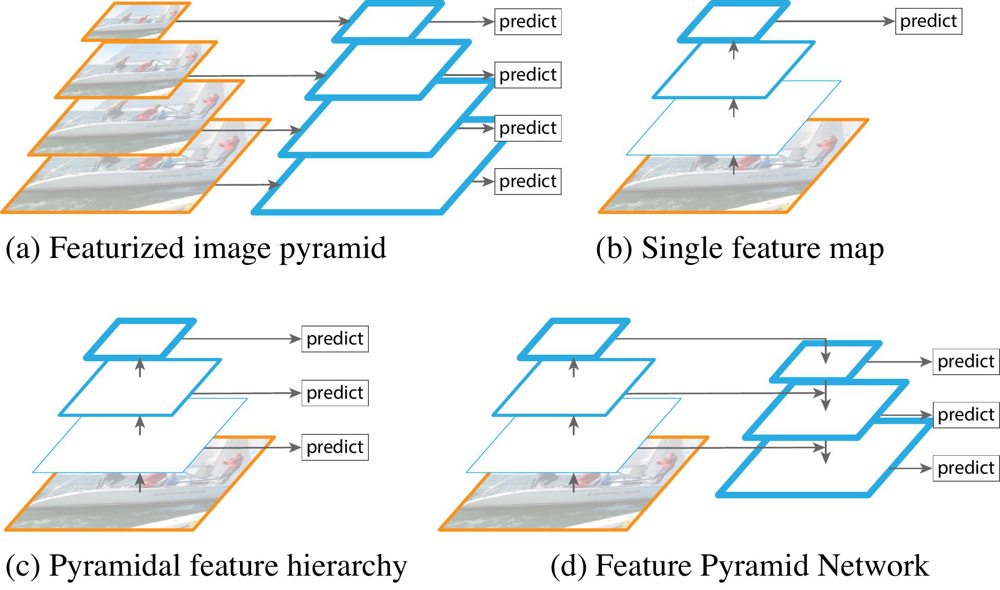
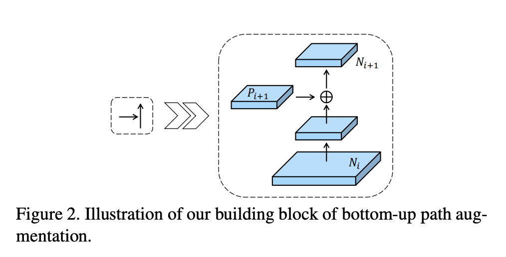
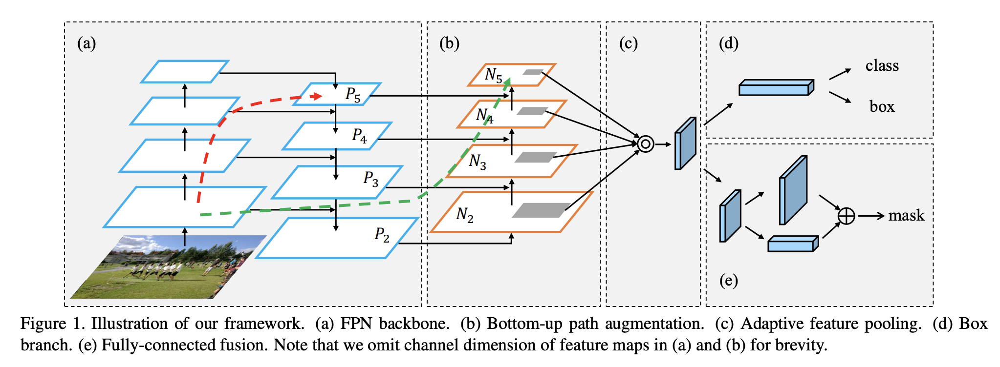
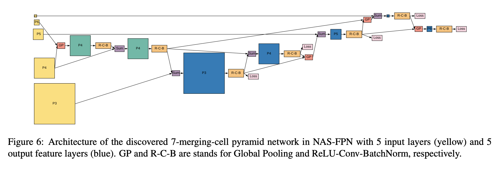
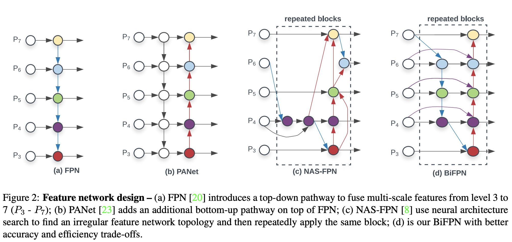
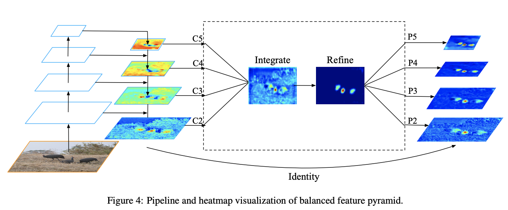
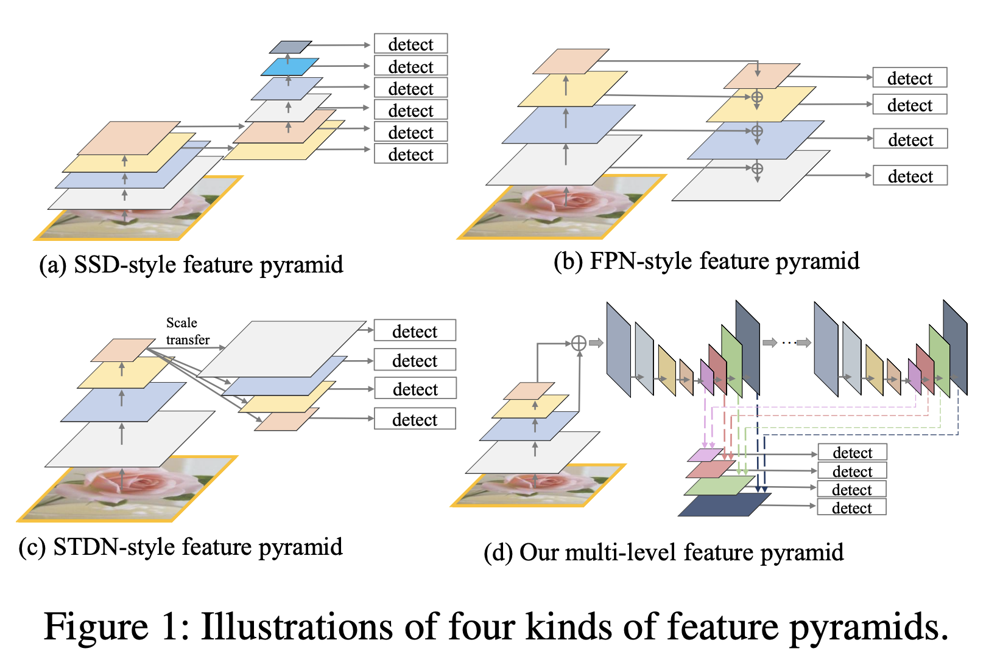
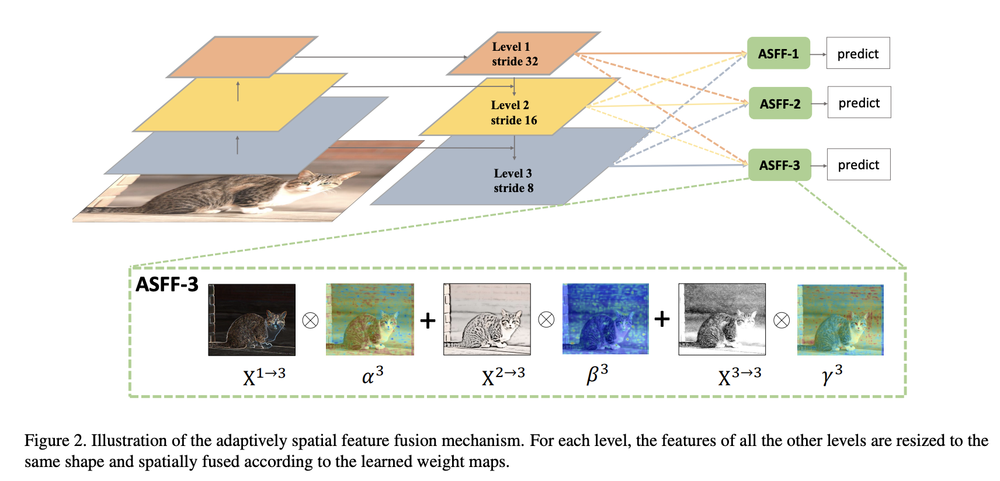
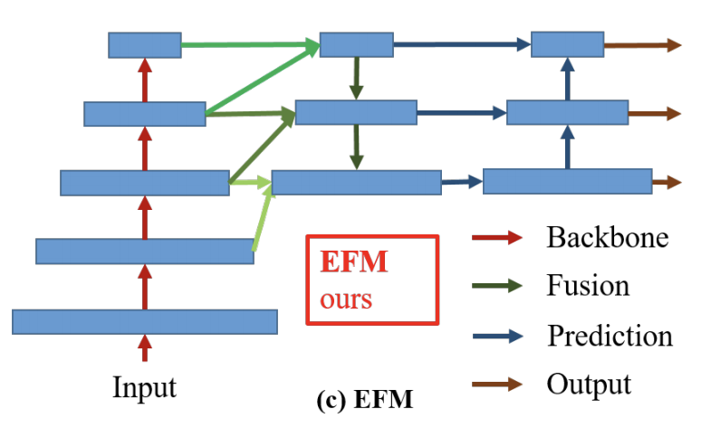

# [FPN](https://paperswithcode.com/method/fpn)

A **Feature Pyramid Network**, or **FPN**, is a feature extractor that takes a single-scale image of an arbitrary size as input, and outputs proportionally sized feature maps at multiple levels, in a fully convolutional fashion. This process is independent of the backbone convolutional architectures. It therefore acts as a generic solution for building feature pyramids inside deep convolutional networks to be used in tasks like object detection.

The construction of the pyramid involves a bottom-up pathway and a top-down pathway.

The bottom-up pathway is the feedforward computation of the backbone ConvNet, which computes a feature hierarchy consisting of feature maps at several scales with a scaling step of 2. For the feature
pyramid, one pyramid level is defined for each stage. The output of the last layer of each stage is used as a reference set of feature maps. For ResNets we use the feature activations output by each stage’s last residual block. 

The top-down pathway hallucinates higher resolution features by upsampling spatially coarser, but semantically stronger, feature maps from higher pyramid levels. These features are then enhanced with features from the bottom-up pathway via lateral connections. Each lateral connection merges feature maps of the same spatial size from the bottom-up pathway and the top-down pathway. The bottom-up feature map is of lower-level semantics, but its activations are more accurately localized as it was subsampled fewer times.

source: [source](http://arxiv.org/abs/1612.03144v2)
# [Bottom-up Path Augmentation](https://paperswithcode.com/method/bottom-up-path-augmentation)

**Bottom-up Path Augmentation** is a feature extraction technique that seeks to shorten the information path and enhance a feature pyramid with accurate localization signals existing in low-levels. This is based on the fact that high response to edges or instance parts is a strong indicator to accurately localize instances. 

Each building block takes a higher resolution feature map $N_{i}$ and a coarser map $P_{i+1}$ through lateral connection and generates the new feature map $N_{i+1}$ Each feature map $N_{i}$ first goes through a $3 \times 3$ convolutional layer with stride $2$ to reduce the spatial size. Then each element of feature map $P_{i+1}$ and the down-sampled map are added through lateral connection. The fused feature map is then processed by another $3 \times 3$ convolutional layer to generate $N_{i+1}$ for following sub-networks. This is an iterative process and terminates after approaching $P_{5}$. In these building blocks, we consistently use channel 256 of feature maps. The feature grid for each proposal is then pooled from new feature maps, i.e., {$N_{2}$, $N_{3}$, $N_{4}$, $N_{5}$}.

source: [source](http://arxiv.org/abs/1803.01534v4)
# [PAFPN](https://paperswithcode.com/method/pafpn)

**PAFPN** is a feature pyramid module used in Path Aggregation networks (PANet) that combines FPNs with bottom-up path augmentation, which shortens the information path between lower layers and topmost feature.

source: [source](http://arxiv.org/abs/1803.01534v4)
# [NAS-FPN](https://paperswithcode.com/method/nas-fpn)

**NAS-FPN** is a Feature Pyramid Network that is discovered via Neural Architecture Search in a novel scalable search space covering all cross-scale connections. The discovered architecture consists of a combination of top-down and bottom-up connections to fuse features across scales

source: [source](http://arxiv.org/abs/1904.07392v1)
# [BiFPN](https://paperswithcode.com/method/bifpn)

A **BiFPN**, or **Weighted Bi-directional Feature Pyramid Network**, is a type of feature pyramid network which allows easy and fast multi-scale feature fusion. It incorporates the multi-level feature fusion idea from FPN, PANet and NAS-FPN that enables information to flow in both the top-down and bottom-up directions, while using regular and efficient connections. It also utilizes a fast normalized fusion technique. Traditional approaches usually treat all features input to the FPN equally, even those with different resolutions. However, input features at different resolutions often have unequal contributions to the output features. Thus, the BiFPN adds an additional weight for each input feature allowing the network to learn the importance of each. All regular convolutions are also replaced with less expensive depthwise separable convolutions.

Comparing with PANet, PANet added an extra bottom-up path for information flow at the expense of more computational cost. Whereas BiFPN optimizes these cross-scale connections by removing nodes with a single input edge, adding an extra edge from the original input to output node if they are on the same level, and treating each bidirectional path as one feature network layer (repeating it several times for more high-level future fusion).

source: [source](https://arxiv.org/abs/1911.09070v6)
# [Balanced Feature Pyramid](https://paperswithcode.com/method/balanced-feature-pyramid)

**Balanced Feature Pyramid** is a feature pyramid module. It differs from approaches like FPNs that integrate multi-level features using lateral connections. Instead the BFP strengthens the multi-level features using the same deeply integrated balanced semantic features. The pipeline is shown in the Figure to the right. It consists of four steps, rescaling, integrating, refining and strengthening.

Features at resolution level $l$ are denoted as $C_{l}$.The number of multi-level features is denoted as $L$. The indexes of involved lowest and highest levels are denoted as $l_{min}$ and $l_{max}$. In the Figure, $C_{2}$ has the highest resolution. To integrate multi-level features and preserve their semantic hierarchy at the same time, we first resize the multi-level features {$C_{2}, C_{3}, C_{4}, C_{5}$} to an intermediate size, i.e., the same size as $C_{4}$, with interpolation and max-pooling respectively. Once the features are rescaled, the balanced semantic features are obtained by simple averaging as:

$$ C = \frac{1}{L}\sum^{l_{max}}_{l=l_{min}}C_{l} $$

The obtained features are then rescaled using the same but reverse procedure to strengthen the original features. Each resolution obtains equal information from others in this procedure. Note that this procedure does not contain any parameter. We observe improvement with this nonparametric method, proving the effectiveness of the information flow. 

The balanced semantic features can be further refined to be more discriminative. The authors found both the refinements with convolutions directly and the non-local module work well. But the
non-local module works more stable. Therefore, embedded Gaussian non-local attention is utilized as default. The refining step helps us enhance the integrated features and further improve the results.

With this method, features from low-level to high-level are aggregated at the same time. The outputs
{$P_{2}, P_{3}, P_{4}, P_{5}$} are used for object detection following the same pipeline in FPN.

source: [source](http://arxiv.org/abs/1904.02701v1)
# [MLFPN](https://paperswithcode.com/method/mlfpn)

**Multi-Level Feature Pyramid Network**, or **MLFPN**, is a feature pyramid block used in object detection models, notably M2Det. We first fuse multi-level features (i.e. multiple layers) extracted by backbone as base feature, and then feed it into a block of alternating joint Thinned U-shape Modules (TUM) and Feature Fusion Modules(FFM) to extract more representative, multi-level multi-scale features. It is worth noting that, decoder layers in each U-shape Module share a similar depth. Finally, we gather up the feature maps with equivalent scales to construct the final feature pyramid for object detection. Obviously, decoder layers that form the final feature pyramid are much deeper than the layers in the backbone, namely, they are more representative. Moreover, each feature map in the final feature pyramid consists of the decoder layers from multiple levels. Hence, the feature pyramid block
is called Multi-Level Feature Pyramid Network (MLFPN).

source: [source](http://arxiv.org/abs/1811.04533v3)
# [ASFF](https://paperswithcode.com/method/asff)

**ASFF**, or **Adaptively Spatial Feature Fusion**, is a method for pyramidal feature fusion. It learns the way to spatially filter conflictive information to suppress inconsistency across different feature scales, thus improving the scale-invariance of features, and introduces nearly free inference overhead. 
ASFF enables the network to directly learn how to spatially filter features at other levels so that only useful information is kept for combination. For the features at a certain level, features of other levels are first integrated and resized into the same resolution and then trained to find the optimal fusion. At each spatial location, features at different levels are fused adaptively, **i.e.**, some features may be filter out as they carry contradictory information at this location and some may dominate with more discriminative clues. ASFF offers several advantages: (1) as the operation of searching the optimal fusion is differential, it can be conveniently learned in back-propagation; (2) it is agnostic to the backbone model and it is applied to single-shot detectors that have a feature pyramid structure; and (3) its implementation is simple and the increased computational cost is marginal.

Let $\mathbf{x}_{ij}^{n\rightarrow l}$ denote the feature vector at the position $(i,j)$ on the feature maps resized from level $n$ to level $l$. Following a feature resizing stage, we fuse the features at the corresponding level $l$ as follows:

$$
\mathbf{y}_{ij}^l = \alpha^l_{ij} \cdot \mathbf{x}_{ij}^{1\rightarrow l} + \beta^l_{ij} \cdot \mathbf{x}_{ij}^{2\rightarrow l} +\gamma^l_{ij} \cdot \mathbf{x}_{ij}^{3\rightarrow l},
$$

where $\mathbf{y}_{ij}^l$ implies the $(i,j)$-th vector of the output feature maps $\mathbf{y}^l$ among channels. $\alpha^l_{ij}$, $\beta^l_{ij}$ and $\gamma^l_{ij}$ refer to the spatial importance weights for the feature maps at three different levels to level $l$, which are adaptively learned by the network. Note that $\alpha^l_{ij}$, $\beta^l_{ij}$ and $\gamma^l_{ij}$ can be simple scalar variables, which are shared across all the channels. Inspired by acnet, we force $\alpha^l_{ij}+\beta^l_{ij}+\gamma^l_{ij}=1$ and $\alpha^l_{ij},\beta^l_{ij},\gamma^l_{ij} \in [0,1]$, and 

$$
    \alpha^l_{ij} = \frac{e^{\lambda^l_{\alpha_{ij}}}}{e^{\lambda^l_{\alpha_{ij}}} + e^{\lambda^l_{\beta_{ij}
        }} + e^{\lambda^l_{\gamma_{ij}}}}.
$$

Here $\alpha^l_{ij}$, $\beta^l_{ij}$ and $\gamma^l_{ij}$ are defined by using the softmax function with $\lambda^l_{\alpha_{ij}}$, $\lambda^l_{\beta_{ij}}$ and $\lambda^l_{\gamma_{ij}}$ as control parameters respectively. We use $1\times1$ convolution layers to compute the weight scalar maps $\mathbf{\lambda}^l_\alpha$, $\mathbf{\lambda}^l_\beta$ and $\mathbf{\lambda}^l_\gamma$ from $\mathbf{x}^{1\rightarrow l}$, $\mathbf{x}^{2\rightarrow l}$ and $\mathbf{x}^{3\rightarrow l}$ respectively, and they can thus be learned through standard back-propagation.

With this method, the features at all the levels are adaptively aggregated at each scale. The outputs are used for object detection following the same pipeline of YOLOv3

source: [source](https://arxiv.org/abs/1911.09516v2)
# [Exact Fusion Model](https://paperswithcode.com/method/exact-fusion-model)

**Exact Fusion Model (EFM)** is a method for aggregating a feature pyramid. The EFM is based on YOLOv3, which assigns exactly one bounding-box prior to each ground truth object. Each ground
truth bounding box corresponds to one anchor box that surpasses the threshold IoU. If the size of an anchor box is equivalent to the field-of-view of the grid cell, then for the grid cells of the $s$-th scale, the corresponding bounding box will be lower bounded by the $(s − 1)$th scale and upper bounded by the (s + 1)th scale. Therefore, the EFM assembles features from the three scales.

source: [source](https://arxiv.org/abs/1911.11929v1)
