# [GAN](https://paperswithcode.com/method/gan)
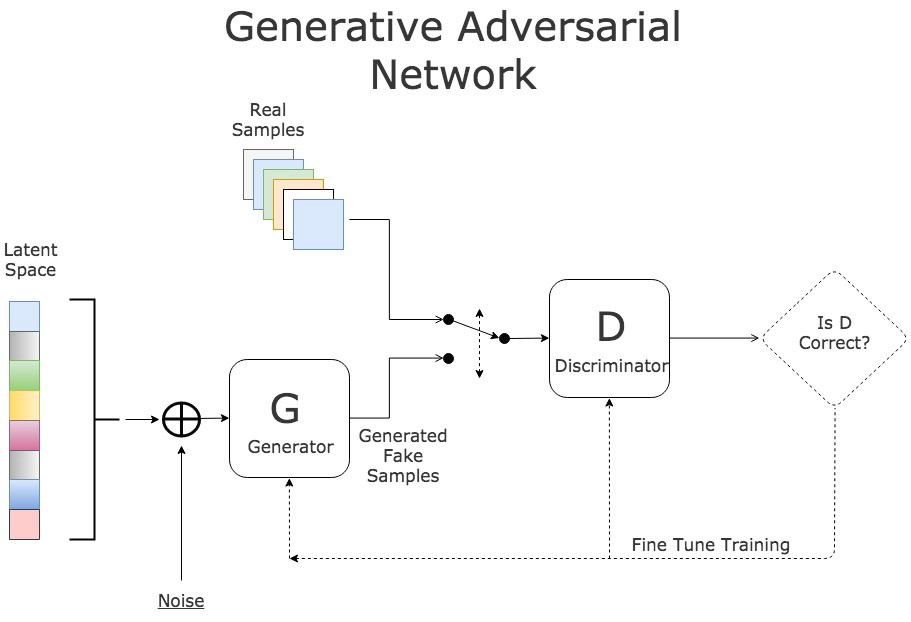

A **GAN**, or **Generative Adversarial Network**, is a generative model that simultaneously trains
two models: a generative model $G$ that captures the data distribution, and a discriminative model $D$ that estimates the
probability that a sample came from the training data rather than $G$.

The training procedure for $G$ is to maximize the probability of $D$ making
a mistake. This framework corresponds to a minimax two-player game. In the
space of arbitrary functions $G$ and $D$, a unique solution exists, with $G$
recovering the training data distribution and $D$ equal to $\frac{1}{2}$
everywhere. In the case where $G$ and $D$ are defined by multilayer perceptrons,
the entire system can be trained with backpropagation. 

(Image Source: [here](http://www.kdnuggets.com/2017/01/generative-adversarial-networks-hot-topic-machine-learning.html))

source: [source](https://arxiv.org/abs/1406.2661v1)
# [CycleGAN](https://paperswithcode.com/method/cyclegan)

**CycleGAN**, or **Cycle-Consistent GAN**, is a type of generative adversarial network for unpaired image-to-image translation. For two domains $X$ and $Y$, CycleGAN learns a mapping $G : X \rightarrow Y$ and $F: Y \rightarrow X$. The novelty lies in trying to enforce the intuition that these mappings should be reverses of each other and that both mappings should be bijections. This is achieved through a cycle consistency loss that encourages $F\left(G\left(x\right)\right) \approx x$ and $G\left(Y\left(y\right)\right) \approx y$. Combining this loss with the adversarial losses on $X$ and $Y$ yields the full objective for unpaired image-to-image translation.

For the mapping $G : X \rightarrow Y$ and its discriminator $D_{Y}$ we have the objective:

$$ \mathcal{L}_{GAN}\left(G, D_{Y}, X, Y\right) =\mathbb{E}_{y \sim p_{data}\left(y\right)}\left[\log D_{Y}\left(y\right)\right] + \mathbb{E}_{x \sim p_{data}\left(x\right)}\left[log(1 − D_{Y}\left(G\left(x\right)\right)\right] $$

where $G$ tries to generate images $G\left(x\right)$ that look similar to images from domain $Y$, while $D_{Y}$ tries to discriminate between translated samples $G\left(x\right)$ and real samples $y$. A similar loss is postulated for the mapping $F: Y \rightarrow X$ and its discriminator $D_{X}$.

The Cycle Consistency Loss reduces the space of possible mapping functions by enforcing forward and backwards consistency:

$$ \mathcal{L}_{cyc}\left(G, F\right) = \mathbb{E}_{x \sim p_{data}\left(x\right)}\left[||F\left(G\left(x\right)\right) - x||_{1}\right] + \mathbb{E}_{y \sim p_{data}\left(y\right)}\left[||G\left(F\left(y\right)\right) - y||_{1}\right] $$

The full objective is:

$$ \mathcal{L}_{GAN}\left(G, F, D_{X}, D_{Y}\right) = \mathcal{L}_{GAN}\left(G, D_{Y}, X, Y\right) + \mathcal{L}_{GAN}\left(F, D_{X}, X, Y\right) + \lambda\mathcal{L}_{cyc}\left(G, F\right) $$

Where we aim to solve:

$$ G^{*}, F^{*} = \arg \min_{G, F} \min_{D_{X}, D_{Y}} \mathcal{L}_{GAN}\left(G, F, D_{X}, D_{Y}\right) $$

For the original architecture the authors use:

- two stride-2 convolutions, several residual blocks, and two fractionally strided convolutions with stride $\frac{1}{2}$.
- instance normalization
- PatchGANs for the discriminator
- Least Square Loss for the GAN objectives.

source: [source](http://arxiv.org/abs/1703.10593v6)
# [WGAN](https://paperswithcode.com/method/wgan)
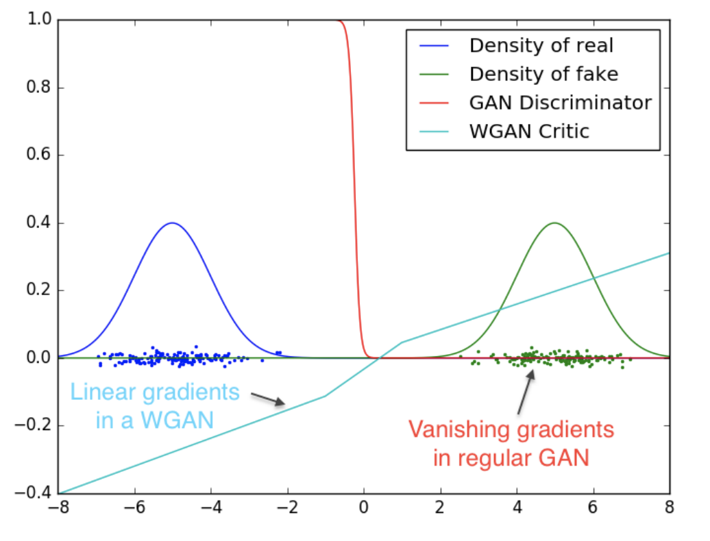

**Wasserstein GAN**, or **WGAN**, is a type of generative adversarial network that minimizes an approximation of the Earth-Mover's distance (EM) rather than the Jensen-Shannon divergence as in the original GAN formulation. It leads to more stable training than original GANs with less evidence of mode collapse, as well as meaningful curves that can be used for debugging and searching hyperparameters.

source: [source](http://arxiv.org/abs/1701.07875v3)
# [DCGAN](https://paperswithcode.com/method/dcgan)

**DCGAN**, or **Deep Convolutional GAN**, is a generative adversarial network architecture. It uses a couple of guidelines, in particular:

- Replacing any pooling layers with strided convolutions (discriminator) and fractional-strided convolutions (generator).
- Using batchnorm in both the generator and the discriminator.
- Removing fully connected hidden layers for deeper architectures.
- Using ReLU activation in generator for all layers except for the output, which uses tanh.
- Using LeakyReLU activation in the discriminator for all layer.

source: [source](http://arxiv.org/abs/1511.06434v2)
# [SAGAN](https://paperswithcode.com/method/sagan)
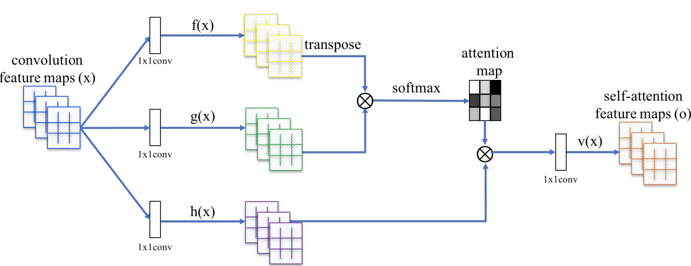

The **Self-Attention Generative Adversarial Network**, or **SAGAN**, allows for attention-driven, long-range dependency modeling for image generation tasks. Traditional convolutional GANs generate high-resolution details as a function of only spatially local points in lower-resolution feature maps. In SAGAN, details can be generated using cues from all feature locations. Moreover, the discriminator can check that highly detailed features in distant portions of the image are consistent with each other.

source: [source](https://arxiv.org/abs/1805.08318v2)
# [StyleGAN](https://paperswithcode.com/method/stylegan)

**StyleGAN** is a type of generative adversarial network. It uses an alternative generator architecture for generative adversarial networks, borrowing from style transfer literature; in particular, the use of adaptive instance normalization. Otherwise it follows Progressive GAN in using a progressively growing training regime. Other quirks include the fact it generates from a fixed value tensor not stochastically generated latent variables as in regular GANs. The stochastically generated latent variables are used as style vectors in the adaptive instance normalization at each resolution after being transformed by an 8-layer feedforward network. Lastly, it employs a form of regularization called mixing regularization, which mixes two style latent variables during training.

source: [source](http://arxiv.org/abs/1812.04948v3)
# [BigGAN](https://paperswithcode.com/method/biggan)
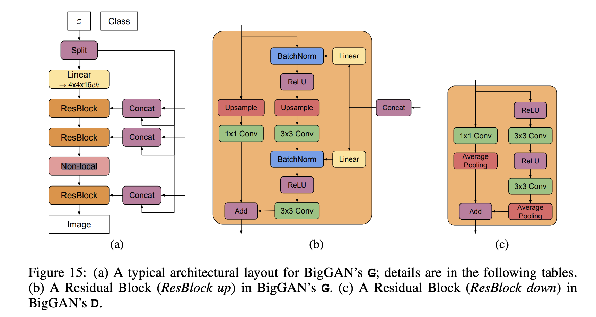

**BigGAN** is a type of generative adversarial network that was designed for scaling generation to high-resolution, high-fidelity images. It includes a number of incremental changes and innovations. The baseline and incremental changes are:

- Using SAGAN as a baseline with spectral norm. for G and D, and using TTUR.
- Using a Hinge Loss GAN objective
- Using class-conditional batch normalization to provide class information to G (but with linear projection not MLP.
- Using a projection discriminator for D to provide class information to D.
- Evaluating with EWMA of G's weights, similar to ProGANs.

The innovations are:

- Increasing batch sizes, which has a big effect on the Inception Score of the model.
- Increasing the width in each layer leads to a further Inception Score improvement.
- Adding skip connections from the latent variable $z$ to further layers helps performance.
- Truncation trick: sampling the latent from a truncated normal.
- A new variant of Orthogonal Regularization.

source: [source](http://arxiv.org/abs/1809.11096v2)
# [Pix2Pix](https://paperswithcode.com/method/pix2pix)

**Pix2Pix** is a conditional image-to-image translation architecture that uses a conditional GAN objective combined with a reconstruction loss. The conditional GAN objective for observed images $x$, output images $y$ and the random noise vector $z$ is:

$$ \mathcal{L}_{cGAN}\left(G, D\right) =\mathbb{E}_{x,y}\left[\log D\left(x, y\right)\right]+
\mathbb{E}_{x,z}\left[log(1 − D\left(x, G\left(x, z\right)\right)\right] $$

We augment this with a reconstruction term:

$$ \mathcal{L}_{L1}\left(G\right) = \mathbb{E}_{x,y,z}\left[||y - G\left(x, z\right)||_{1}\right] $$

and we get the final objective as:

$$ G^{*} = \arg\min_{G}\max_{D}\mathcal{L}_{cGAN}\left(G, D\right) + \lambda\mathcal{L}_{L1}\left(G\right) $$

The architectures employed for the generator and discriminator closely follow [DCGAN](https://paperswithcode.com/method/dcgan), with a few modifications:

- Concatenated skip connections are used to "shuttle" low-level information between the input and output, similar to a [U-Net](https://paperswithcode.com/method/u-net).
- The use of a PatchGAN discriminator that only penalizes structure at the scale of patches.

source: [source](http://arxiv.org/abs/1611.07004v3)
# [InfoGAN](https://paperswithcode.com/method/infogan)
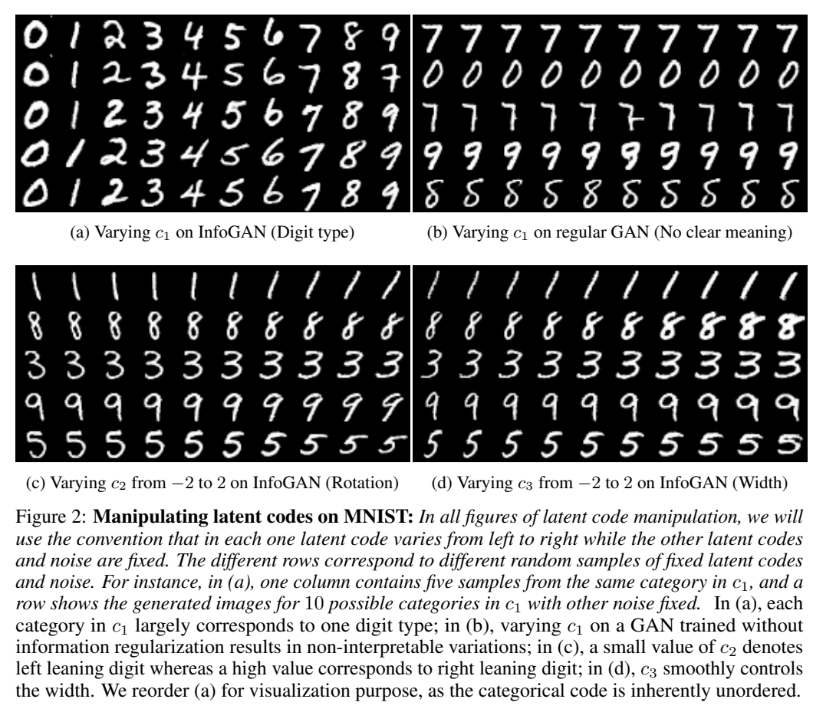

**InfoGAN** is a type of generative adversarial network that modifies the GAN objective to
encourage it to learn interpretable and meaningful representations. This is done by maximizing the
mutual information between a fixed small subset of the GAN’s noise variables and the observations.

Formally, InfoGAN is defined as a minimax game with a variational regularization of mutual information and the hyperparameter $\lambda$:

$$ \min_{G, Q}\max_{D}V_{INFOGAN}\left(D, G, Q\right) = V\left(D, G\right) - \lambda{L}_{I}\left(G, Q\right) $$

Where $Q$ is an auxiliary distribution that approximates the posterior $P\left(c\mid{x}\right)$ - the probability of the latent code $c$ given the data $x$ - and $L_{I}$ is the variational lower bound of the mutual information between the latent code and the observations.

In the practical implementation, there is another fully-connected layer to output parameters for the conditional distribution $Q$ (negligible computation ontop of regular GAN structures). Q is represented with a softmax non-linearity for a categorical latent code. For a continuous latent code, the authors assume a factored Gaussian.

source: [source](http://arxiv.org/abs/1606.03657v1)
# [LSGAN](https://paperswithcode.com/method/lsgan)

**LSGAN**, or **Least Squares GAN**, is a type of generative adversarial network that adopts the least squares loss function for the discriminator. Minimizing the objective function of LSGAN yields minimizing the Pearson $\chi^{2}$ divergence. The objective function can be defined as:

$$ \min_{D}V_{LSGAN}\left(D\right) = \frac{1}{2}\mathbb{E}_{\mathbf{x} \sim p_{data}\left(\mathbf{x}\right)}\left[\left(D\left(\mathbf{x}\right) - b\right)^{2}\right] + \frac{1}{2}\mathbb{E}_{\mathbf{z}\sim p_{data}\left(\mathbf{z}\right)}\left[\left(D\left(G\left(\mathbf{z}\right)\right) - a\right)^{2}\right] $$

$$ \min_{G}V_{LSGAN}\left(G\right) = \frac{1}{2}\mathbb{E}_{\mathbf{z} \sim p_{\mathbf{z}}\left(\mathbf{z}\right)}\left[\left(D\left(G\left(\mathbf{z}\right)\right) - c\right)^{2}\right] $$

where $a$ and $b$ are the labels for fake data and real data and $c$ denotes the value that $G$ wants $D$ to believe for fake data.

source: [source](http://arxiv.org/abs/1611.04076v3)
# [BiGAN](https://paperswithcode.com/method/bigan)
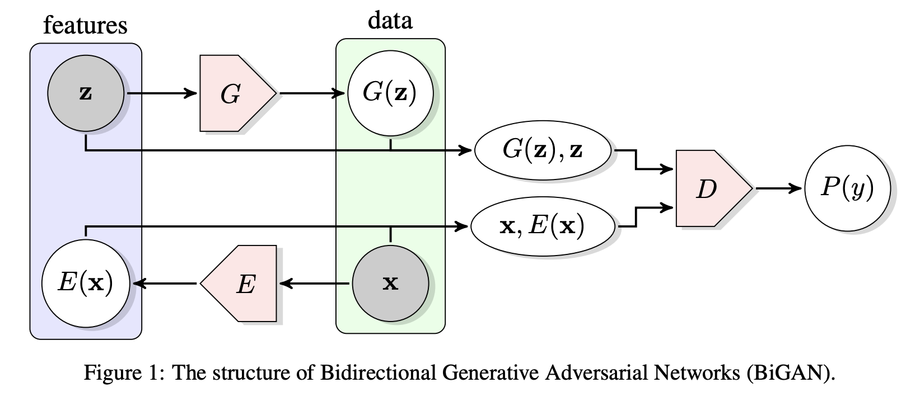

A **BiGAN**, or **Bidirectional GAN**, is a type of generative adversarial network where the generator  not only maps latent samples to generated data, but also has an inverse mapping from data to the latent representation. The motivation is to make a type of GAN that can learn rich representations for us in applications like unsupervised learning.

In addition to the generator $G$ from the standard [GAN](https://paperswithcode.com/method/gan) framework, BiGAN includes an encoder $E$ which maps data $\mathbf{x}$ to latent representations $\mathbf{z}$. The BiGAN discriminator $D$ discriminates not only in data space ($\mathbf{x}$ versus $G\left(\mathbf{z}\right)$), but jointly in data and latent space (tuples $\left(\mathbf{x}, E\left(\mathbf{x}\right)\right)$ versus $\left(G\left(z\right), z\right)$), where the latent component is either an encoder output $E\left(\mathbf{x}\right)$ or a generator input $\mathbf{z}$.

source: [source](http://arxiv.org/abs/1605.09782v7)
# [WGAN GP](https://paperswithcode.com/method/wgan-gp)
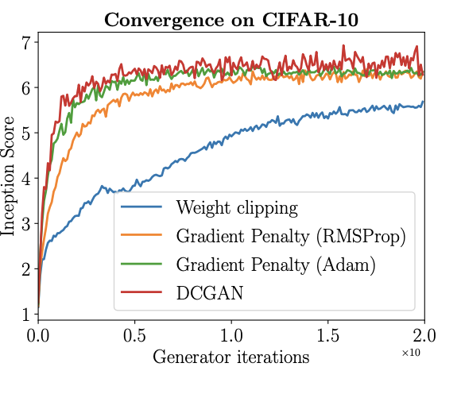

**Wasserstein GAN + Gradient Penalty**, or **WGAN-GP**, is a generative adversarial network that uses the Wasserstein loss formulation plus a gradient norm penalty to achieve Lipschitz continuity.

The original [WGAN](https://paperswithcode.com/method/wgan) uses weight clipping to achieve 1-Lipschitz functions, but this can lead to undesirable behaviour by creating pathological value surfaces and capacity underuse, as well as gradient explosion/vanishing without careful tuning of the weight clipping parameter $c$.

A Gradient Penalty is a soft version of the Lipschitz constraint, which follows from the fact that functions are 1-Lipschitz iff the gradients are of norm at most 1 everywhere. The squared difference from norm 1 is used as the gradient penalty.

source: [source](http://arxiv.org/abs/1704.00028v3)
# [StyleGAN2](https://paperswithcode.com/method/stylegan2)
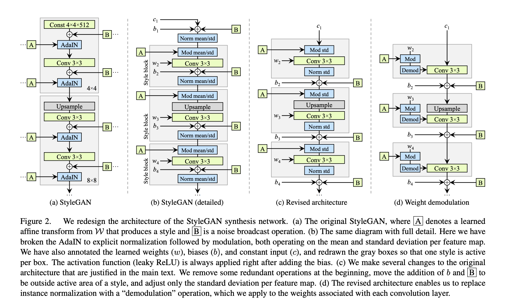

**StyleGAN2** is a generative adversarial network that builds on [StyleGAN](https://paperswithcode.com/method/stylegan) with several improvements. First, adaptive instance normalization is redesigned and replaced with a normalization technique called weight demodulation. Secondly, an improved training scheme upon progressively growing is introduced, which achieves the same goal - training starts by focusing on low-resolution images and then progressively shifts focus to higher and higher resolutions - without changing the network topology during training. Additionally, new types of regularization like lazy regularization and path length regularization are proposed.

source: [source](https://arxiv.org/abs/1912.04958v2)
# [SNGAN](https://paperswithcode.com/method/sngan)
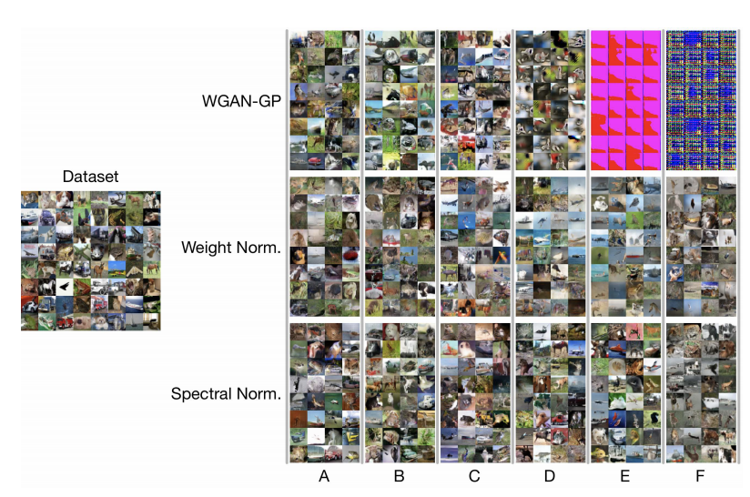

**SNGAN**, or **Spectrally Normalised GAN**, is a type of generative adversarial network that uses spectral normalization, a type of weight normalization, to stabilise the training of the discriminator.

source: [source](http://arxiv.org/abs/1802.05957v1)
# [LAPGAN](https://paperswithcode.com/method/lapgan)
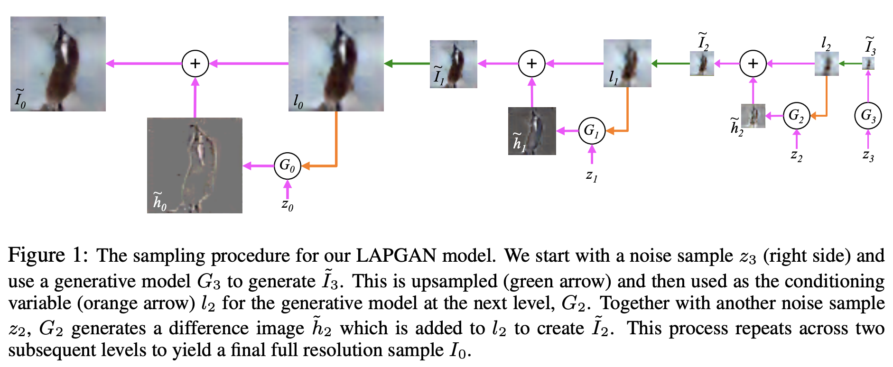

A **LAPGAN**, or **Laplacian Generative Adversarial Network**, is a type of generative adversarial network that has a Laplacian pyramid representation. In the sampling procedure following training, we have a set of generative convnet models {$G_{0}, \dots , G_{K}$}, each of which captures the distribution of coefficients $h_{k}$ for natural images at a different level of the Laplacian pyramid. Sampling an image is akin to a reconstruction procedure, except that the generative
models are used to produce the $h_{k}$’s:

$$ \tilde{I}_{k} = u\left(\tilde{I}_{k+1}\right) + \tilde{h}_{k} = u\left(\tilde{I}_{k+1}\right) + G_{k}\left(z_{k}, u\left(\tilde{I}_{k+1}\right)\right)$$

The recurrence starts by setting $\tilde{I}_{K+1} = 0$ and using the model at the final level $G_{K}$ to generate a residual image $\tilde{I}_{K}$ using noise vector $z_{K}$: $\tilde{I}_{K} = G_{K}\left(z_{K}\right)$. Models at all levels except the final are conditional generative models that take an upsampled version of the current image $\tilde{I}_{k+1}$ as a conditioning variable, in addition to the noise vector $z_{k}$.

The generative models {$G_{0}, \dots, G_{K}$} are trained using the CGAN approach at each level of the pyramid. Specifically, we construct a Laplacian pyramid from each training image $I$. At each level we make a stochastic choice (with equal probability) to either (i) construct the coefficients $h_{k}$ either using the standard Laplacian pyramid coefficient generation procedure or (ii) generate them using $G_{k}:

$$ \tilde{h}_{k} = G_{k}\left(z_{k}, u\left(I_{k+1}\right)\right) $$

Here $G_{k}$ is a convnet which uses a coarse scale version of the image $l_{k} = u\left(I_{k+1}\right)$ as an input, as well as noise vector $z_{k}$. $D_{k}$ takes as input $h_{k}$ or $\tilde{h}_{k}$, along with the low-pass image $l_{k}$ (which is explicitly added to $h_{k}$ or $\tilde{h}_{k}$ before the first convolution layer), and predicts if the image was real or
generated. At the final scale of the pyramid, the low frequency residual is sufficiently small that it
can be directly modeled with a standard GAN: $\tilde{h}_{K} = G_{K}\left(z_{K}\right)$ and $D_{K}$ only has $h_{K}$ or $\tilde{h}_{K}$ as input.

Breaking the generation into successive refinements is the key idea. We give up any “global” notion of fidelity; an attempt is never made to train a network to discriminate between the output of a cascade and a real image and instead the focus is on making each step plausible.

source: [source](http://arxiv.org/abs/1506.05751v1)
# [ProGAN](https://paperswithcode.com/method/progan)

**ProGAN**, or **Progressively Growing GAN**, is a generative adversarial network that utilises a progressively growing training approach. The idea is to grow both the generator and discriminator progressively: starting from a low resolution, we add new layers that model increasingly fine details as training progresses.

source: [source](http://arxiv.org/abs/1710.10196v3)
# [BigBiGAN](https://paperswithcode.com/method/bigbigan)

**BigBiGAN** is a type of [BiGAN](https://paperswithcode.com/method/bigan) with a [BigGAN](https://paperswithcode.com/method/biggan) image generator. The authors initially used ResNet as a baseline for the encoder $\mathcal{E}$ followed by a 4-layer MLP with skip connections, but they experimented with RevNets and found they outperformed with increased network width, so opted for this type of encoder for the final architecture.

source: [source](https://arxiv.org/abs/1907.02544v2)
# [BigGAN-deep](https://paperswithcode.com/method/biggan-deep)

**BigGAN-deep** is a deeper version (4x) of [BigGAN](https://beta.paperswithcode.com/method/biggan).  The main difference is a slightly differently designed residual block. Here the $z$ vector is concatenated with the conditional vector without splitting it into chunks.  It is also based on residual blocks with bottlenecks. BigGAN-deep uses a different strategy than BigGAN aimed at preserving identity throughout the skip connections. In G, where the number of channels needs to be reduced, BigGAN-deep simply retains the first group of channels and drop the rest to produce the required number of channels. In D, where the number of channels should be increased, BigGAN-deep passes the input channels unperturbed, and concatenates them with the remaining channels produced by a 1 × 1 convolution. As far as the
network configuration is concerned, the discriminator is an exact reflection of the generator. 

There are two blocks at each resolution (BigGAN uses one), and as a result BigGAN-deep is four times
deeper than BigGAN. Despite their increased depth, the BigGAN-deep models have significantly
fewer parameters mainly due to the bottleneck structure of their residual blocks.

source: [source](http://arxiv.org/abs/1809.11096v2)
# [CS-GAN](https://paperswithcode.com/method/cs-gan)

**CS-GAN** is a type of generative adversarial network that uses a form of deep compressed sensing, and latent optimisation, to improve the quality of generated samples.

source: [source](https://arxiv.org/abs/1905.06723v2)
# [PresGAN](https://paperswithcode.com/method/presgan)
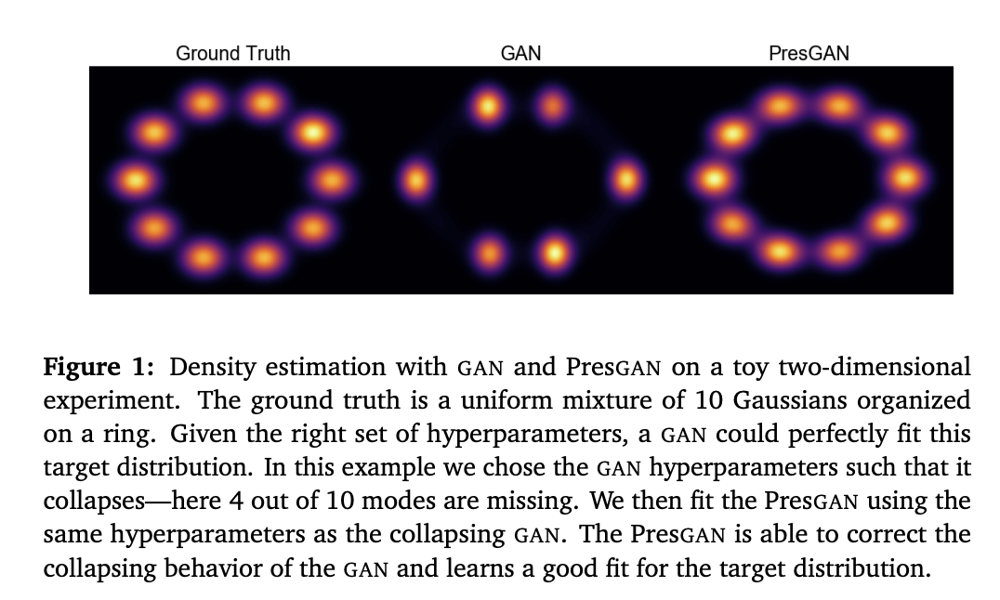

**Prescribed GANs** add noise to the output of a density network and optimize an entropy-regularized adversarial loss. The added noise renders tractable approximations of the predictive log-likelihood and stabilizes the training procedure. The entropy regularizer encourages PresGANs to capture all the modes of the data distribution. Fitting PresGANs involves computing the intractable gradients of the entropy regularization term; PresGANs sidestep this intractability using
unbiased stochastic estimates.

source: [source](https://arxiv.org/abs/1910.04302v1)
# [LOGAN](https://paperswithcode.com/method/logan)

**LOGAN** is a generative adversarial network that uses a latent optimization approach using natural gradient descent (NGD). For the Fisher matrix in NGD, the authors use the empirical Fisher $F'$ with Tikhonov damping:

$$ F' = g \cdot g^{T} + \beta{I} $$

They also use Euclidian Norm regularization for the optimization step.

For LOGAN's base architecture, BigGAN-deep is used with a few modifications: increasing the size of the latent source from $186$ to $256$, to compensate the randomness of the source lost
when optimising $z$. 2, using the uniform distribution $U\left(−1, 1\right)$ instead of the standard normal distribution $N\left(0, 1\right)$ for $p\left(z\right)$ to be consistent with the clipping operation, using  leaky ReLU (with the slope of 0.2 for the negative part) instead of ReLU as the non-linearity for smoother gradient flow for $\frac{\delta{f}\left(z\right)}{\delta{z}}$ .

source: [source](https://arxiv.org/abs/1912.00953v2)
# [TGAN](https://paperswithcode.com/method/tgan)
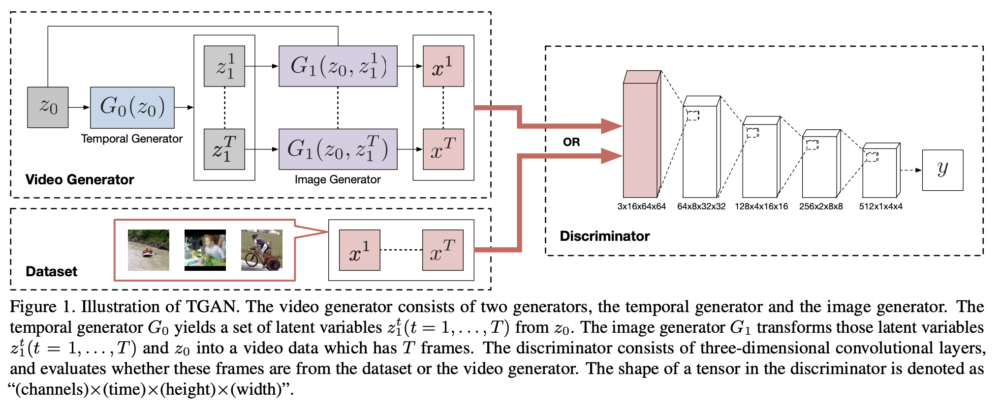

**TGAN** is a type of generative adversarial network that is capable of learning representation from an unlabeled video dataset and producing a new video. The generator consists of two sub networks
called a temporal generator and an image generator. Specifically, the temporal generator first yields a set of latent variables, each of which corresponds to a latent variable for the image generator. Then, the image generator transforms these latent variables into a video which has the same number of frames as the variables. The model comprised of the temporal and image generators can not only enable to efficiently capture the time series, but also be easily extended to frame interpolation. The authors opt for a WGAN as the basic GAN structure and objective, but use singular value clipping to enforce the Lipschitz constraint.

source: [source](http://arxiv.org/abs/1611.06624v3)
# [DVD-GAN](https://paperswithcode.com/method/dvd-gan)
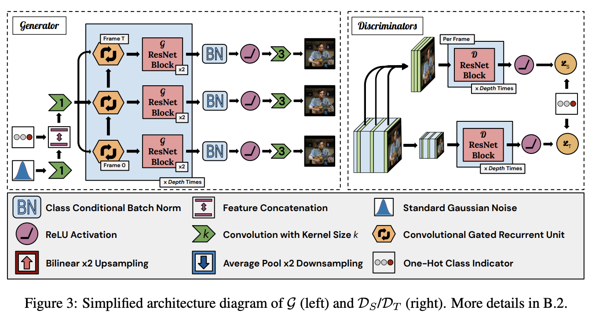

**DVD-GAN** is a generative adversarial network for video generation built upon the [BigGAN](https://paperswithcode.com/method/biggan) architecture.

DVD-GAN uses two discriminators: a Spatial Discriminator $\mathcal{D}_{S}$ and a
Temporal Discriminator $\mathcal{D}_{T}$. $\mathcal{D}_{S}$ critiques single frame content and structure by randomly sampling $k$ full-resolution frames and judging them individually.  The temporal discriminator $\mathcal{D}_{T}$ must provide $G$ with the learning signal to generate movement (not evaluated by $\mathcal{D}_{S}$).

The input to $G$ consists of a Gaussian latent noise $z \sim N\left(0, I\right)$ and a learned linear embedding $e\left(y\right)$ of the desired class $y$. Both inputs are 120-dimensional vectors. $G$ starts by computing an affine transformation of $\left[z; e\left(y\right)\right]$ to a $\left[4, 4, ch_{0}\right]$-shaped tensor. $\left[z; e\left(y\right)\right]$ is used as the input to all class-conditional Batch Normalization layers
throughout $G$. This is then treated as the input (at each frame we would like to generate) to a Convolutional GRU.

This RNN is unrolled once per frame. The output of this RNN is processed by two residual blocks. The time dimension is combined with the batch dimension here, so each frame proceeds through the blocks independently. The output of these blocks has width and height dimensions which
are doubled (we skip upsampling in the first block). This is repeated a number of times, with the
output of one RNN + residual group fed as the input to the next group, until the output tensors have
the desired spatial dimensions. 

The spatial discriminator $\mathcal{D}_{S}$ functions almost identically to BigGAN’s discriminator. A score is calculated for each of the uniformly sampled $k$ frames (default $k = 8$) and the $\mathcal{D}_{S}$ output is the sum over per-frame scores. The temporal discriminator $\mathcal{D}_{T}$ has a similar architecture, but pre-processes the real or generated video with a $2 \times 2$ average-pooling downsampling function $\phi$. Furthermore, the first two residual blocks of $\mathcal{D}_{T}$ are 3-D, where every convolution is replaced with a 3-D convolution with a kernel size of $3 \times 3 \times 3$. The rest of the architecture follows BigGAN.

source: [source](https://arxiv.org/abs/1907.06571v2)
# [TrIVD-GAN](https://paperswithcode.com/method/trivd-gan)
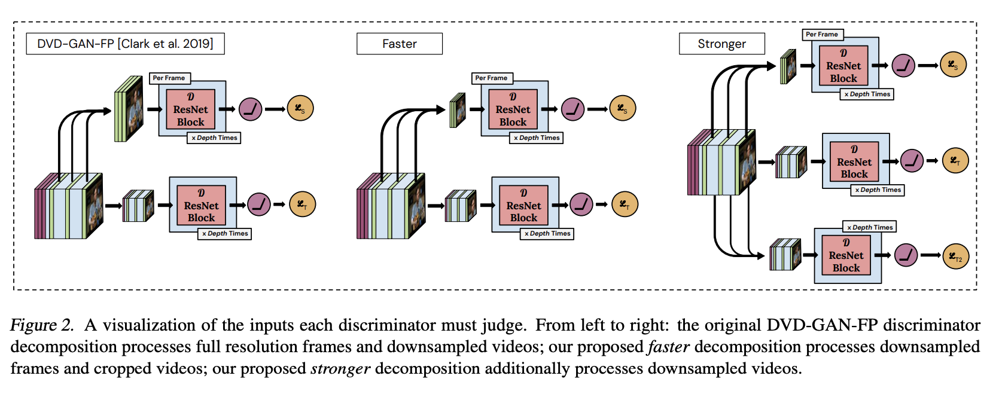

**TrIVD-GAN**, or **Transformation-based &amp; TrIple Video Discriminator GAN**, is a type of generative adversarial network for video generation that builds upon [DVD-GAN](https://paperswithcode.com/method/dvd-gan). Improvements include a novel transformation-based recurrent unit (the TSRU) that makes the generator more expressive, and an improved discriminator architecture. 

In contrast with DVD-GAN, TrIVD-GAN has an alternative split for the roles of the discriminators, with $\mathcal{D}_{S}$ judging per-frame global structure, while $\mathcal{D}_{T}$ critiques local spatiotemporal structure. This is achieved by downsampling the $k$ randomly sampled frames fed to $\mathcal{D}_{S}$ by a factor $s$, and cropping $T \times H/s \times W/s$ clips inside the high resolution video fed to $\mathcal{D}_{T}$, where $T, H, W, C$ correspond to time, height, width and channel dimension of the input. This further reduces the number of pixels to process per video,
from $k \times H \times W + T \times H/s \times W/s$ to $\left(k + T\right) \times H/s \times W/s$.

source: [source](https://arxiv.org/abs/2003.04035v1)
