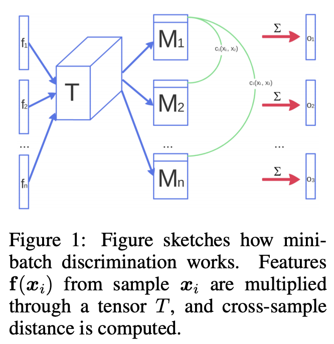

# [Minibatch Discrimination](https://paperswithcode.com/method/minibatch-discrimination)

**Minibatch Discrimination** is a discriminative technique for generative adversarial networks where we discriminate between whole minibatches of samples rather than between individual samples. This is intended to avoid collapse of the generator.

source: [source](http://arxiv.org/abs/1606.03498v1)
