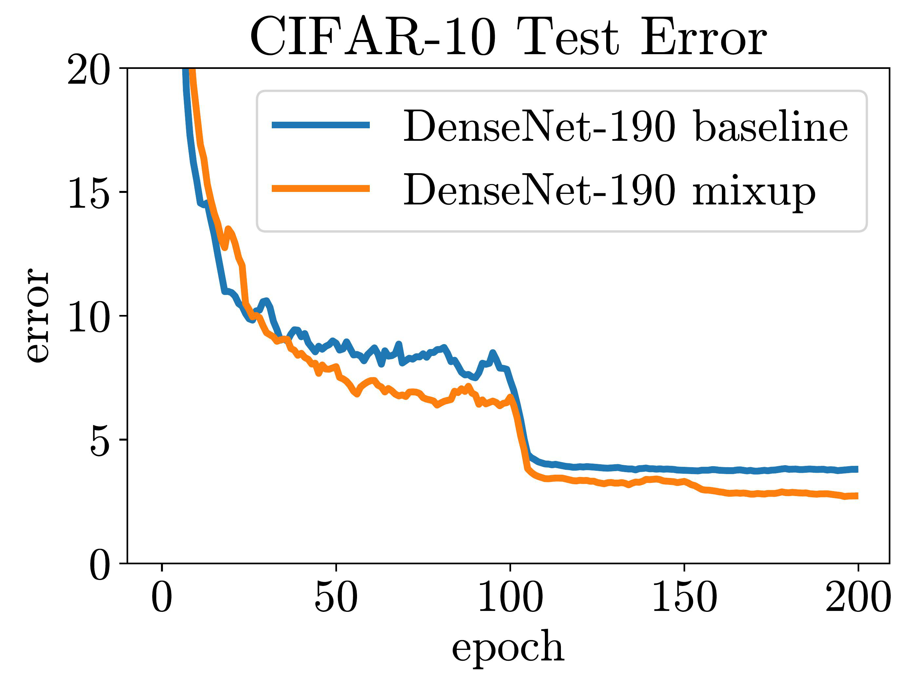
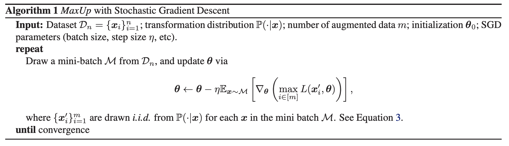

# [Random Horizontal Flip](https://paperswithcode.com/method/randomhorizontalflip)

**RandomHorizontalFlip** is a type of image data augmentation which horizontally flips a given image with a given probability.

Image Credit: [Apache MXNet](https://mxnet.apache.org/versions/1.5.0/tutorials/gluon/data_augmentation.html)

# [Mixup](https://paperswithcode.com/method/mixup)

**Mixup** is a data augmentation technique that that generates a weighted combinations of random image pairs from the training data. Given two images and their ground truth labels: $\left(x_{i}, y_{i}\right), \left(x_{j}, y_{j}\right)$, a synthetic training example $\left(\hat{x}, \hat{y}\right)$ is generated as:

$$ \hat{x} = \lambda{x_{i}} + \left(1 − \lambda\right){x_{j}} $$
$$ \hat{y} = \lambda{y_{i}} + \left(1 − \lambda\right){y_{j}} $$

where $\lambda \sim \text{Beta}\left(\alpha = 0.2\right)$ is independently sampled for each augmented example.

source: [source](http://arxiv.org/abs/1710.09412v2)
# [Random Resized Crop](https://paperswithcode.com/method/randomresizedcrop)

**RandomResizedCrop** is a type of image data augmentation where a crop of random size of the original size and a random aspect ratio of the original aspect ratio is made. This crop is finally resized to given size.

Image Credit: [Apache MXNet](https://mxnet.apache.org/versions/1.5.0/tutorials/gluon/data_augmentation.html)

# [AutoAugment](https://paperswithcode.com/method/autoaugment)

**AutoAugment** is an automated approach to find data augmentation policies from data. It formulates the problem of finding the best augmentation policy as a discrete search problem. It consists of two components: a search algorithm and a search space. 

At a high level, the search algorithm (implemented as a controller RNN) samples a data augmentation policy $S$, which has information about what image processing operation to use, the probability of using the operation in each batch, and the magnitude of the operation. The policy $S$ is used to train a neural network with a fixed architecture, whose validation accuracy $R$ is sent back to update the controller. Since $R$ is not differentiable, the controller will be updated by policy gradient methods. 

The operations used are from PIL, a popular Python image library: all functions in PIL that accept an image as input and output an image. It additionally uses two other augmentation techniques: Cutout and SamplePairing. The operations searched over are ShearX/Y, TranslateX/Y, Rotate, AutoContrast, Invert, Equalize, Solarize, Posterize, Contrast, Color, Brightness, Sharpness, Cutout and Sample Pairing.

source: [source](http://arxiv.org/abs/1805.09501v3)
# [Cutout](https://paperswithcode.com/method/cutout)

**Cutout** is an image augmentation and regularization technique that randomly masks out square regions of input during training. and can be used to improve the robustness and overall performance of convolutional neural networks. The main motivation for cutout comes from the problem of object occlusion, which is commonly encountered in many computer vision tasks, such as object recognition,
tracking, or human pose estimation. By generating new images which simulate occluded examples, we not only better prepare the model for encounters with occlusions in the real world, but the model also learns to take more of the image context into consideration when making decisions

source: [source](http://arxiv.org/abs/1708.04552v2)
# [ColorJitter](https://paperswithcode.com/method/colorjitter)

**ColorJitter** is a type of image data augmentation where we randomly change the brightness, contrast and saturation of an image.

Image Credit: [Apache MXNet](https://mxnet.apache.org/versions/1.5.0/tutorials/gluon/data_augmentation.html)

# [CutMix](https://paperswithcode.com/method/cutmix)

**CutMix** is an image data augmentation strategy. Instead of simply removing pixels as in Cutout, we replace the removed regions with a patch from another image. The ground truth labels are also mixed proportionally to the number of pixels of combined images. The added patches further enhance localization ability by requiring the model to identify the object from a partial view.

source: [source](https://arxiv.org/abs/1905.04899v2)
# [Random Scaling](https://paperswithcode.com/method/random-scaling)

**Random Scaling** is a type of image data augmentation where we randomly change the scale the image between a specified range.

# [RandAugment](https://paperswithcode.com/method/randaugment)

**RandAugment** is an automated data augmentation method. The search space for data augmentation has 2 interpretable hyperparameter $N$ and $K$.  $N$ is the number of augmentation transformations to apply sequentially, and $M$ is the magnitude for all the transformations. To reduce the parameter space but still maintain image diversity, learned policies and probabilities for applying each transformation are replaced with a parameter-free procedure of always selecting a transformation with uniform probability $\frac{1}{K}$. So given $N$ transformations for a training
image, RandAugment may thus express $KN$ potential policies.

Transformations applied include identity transformation, autoContrast, equalize, rotation, solarixation, colorjittering, posterizing, changing contrast, changing brightness, changing sharpness, shear-x, shear-y, translate-x, translate-y.

source: [source](https://arxiv.org/abs/1909.13719v2)
# [Random Gaussian Blur](https://paperswithcode.com/method/random-gaussian-blur)

**Random Gaussian Blur** is an image data augmentation technique where we randomly blur the image using a Gaussian distribution.

Image Source: [Wikipedia](https://en.wikipedia.org/wiki/Gaussian_blur)

# [Fast AutoAugment](https://paperswithcode.com/method/fast-autoaugment)

**Fast AutoAugment** is an image data augmentation algorithm that finds effective augmentation policies via a search strategy based on density matching, motivated by Bayesian DA. The strategy is to improve the generalization performance of a given network by learning the augmentation policies which treat augmented data as missing data points of training data. However, different from Bayesian DA, the proposed method recovers those missing data points by the exploitation-and-exploration of a family of inference-time augmentations via Bayesian optimization in the policy search phase. This is realized by using an efficient density matching algorithm that does not require any back-propagation for network training for each policy evaluation.

source: [source](https://arxiv.org/abs/1905.00397v2)
# [Image Scale Augmentation](https://paperswithcode.com/method/image-scale-augmentation)

Image Scale Augmentation is an augmentation technique where we randomly pick the short size of a image within a dimension range. One use case of this augmentation technique is in object detectiont asks.

# [AugMix](https://paperswithcode.com/method/augmix)

AugMix mixes augmented images through linear interpolations. Consequently it is like [Mixup](https://paperswithcode.com/method/mixup) but instead mixes augmented versions of the same image.

source: [source](https://arxiv.org/abs/1912.02781v2)
# [Population Based Augmentation](https://paperswithcode.com/method/population-based-augmentation)

**Population Based Augmentation**, or **PBA**, is a data augmentation strategy (PBA), which generates nonstationary augmentation policy schedules instead of a fixed augmentation policy. In PBA we consider the augmentation policy search problem as a special case of hyperparameter schedule learning. It leverages Population Based Training (PBT), a hyperparameter search algorithm which
optimizes the parameters of a network jointly with their hyperparameters to maximize performance. The output of PBT is not an optimal hyperparameter configuration but rather a trained model and schedule of hyperparameters. 

In PBA, we are only interested in the learned schedule and discard the child model result (similar to AutoAugment). This learned augmentation schedule can then be used to improve the training of different (i.e., larger and costlier to train) models on the same dataset.

PBT executes as follows. To start, a fixed population of models are randomly initialized and trained in parallel. At certain intervals, an “exploit-and-explore” procedure is applied to the worse performing population members, where the model clones the weights of a better performing model (i.e., exploitation) and then perturbs the hyperparameters of the cloned model to search in the hyperparameter space (i.e., exploration). Because the weights of the models are cloned and never reinitialized, the total computation required is the computation to train a single model times the population size.

source: [source](https://arxiv.org/abs/1905.05393v1)
# [Random Grayscale](https://paperswithcode.com/method/random-grayscale)

**Random Grayscale**  is an image data augmentation that converts an image to grayscale with probability $p$.

# [InstaBoost](https://paperswithcode.com/method/instaboost)

**InstaBoost** is a data augmentation technique for instance segmentation that utilises existing instance mask annotations.

Intuitively in a small neighbor area of $(x_0, y_0, 1, 0)$, the probability map $P(x, y, s, r)$ should be high-valued since images are usually continuous and redundant in pixel level. Based on this, InstaBoost is a form of augmentation where we apply object jittering that randomly samples transformation tuples from the neighboring space of identity transform $(x_0, y_0, 1, 0)$ and paste the cropped object following affine transform $\mathbf{H}$.

source: [source](https://arxiv.org/abs/1908.07801v1)
# [RandomRotate](https://paperswithcode.com/method/randomrotate)

**RandomRotate** is a type of image data augmentation where we randomly rotate the image by a degree.

# [MaxUp](https://paperswithcode.com/method/maxup)

**MaxUp** is an adversarial data augmentation technique for improving the generalization performance of machine learning models. The idea is to generate a set of augmented data with some random perturbations or transforms, and minimize the maximum, or worst case loss over the augmented data.  By doing so, we implicitly introduce a smoothness or robustness regularization against the random perturbations, and hence improve the generation performance.  For example, in the case of Gaussian perturbation, MaxUp is asymptotically equivalent to using the gradient norm of the loss as a penalty to encourage smoothness.

source: [source](https://arxiv.org/abs/2002.09024v1)
# [DiffAugment](https://paperswithcode.com/method/diffaugment)

**Differentiable Augmentation (DiffAugment)** is a set of differentiable image transformations used to augment data during GAN training. The transformations are applied to the real and generated images.

source: [source](https://arxiv.org/abs/2006.10738v1)
# [Batchboost](https://paperswithcode.com/method/batchboost)

**Batchboost** is a variation on [MixUp](https://paperswithcode.com/method/mixup) that instead of mixing just two images, mixes many images together.

source: [source](https://arxiv.org/abs/2001.07627v1)
