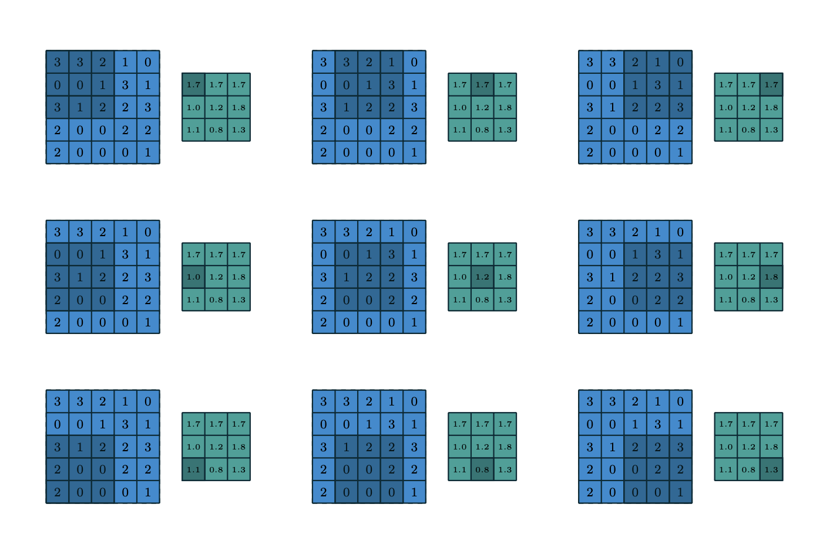
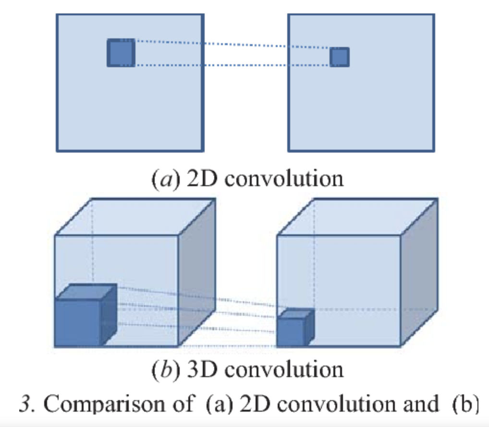

# [Convolution](https://paperswithcode.com/method/convolution)

A **convolution** is a type of matrix operation, consisting of a kernel, a small matrix of weights, that slides over input data performing element-wise multiplication with the part of the input it is on, then summing the results into an output.

Intuitively, a convolution allows for weight sharing - reducing the number of effective parameters - and image translation (allowing for the same feature to be detected in different parts of the input space).

Image Source: [https://arxiv.org/pdf/1603.07285.pdf](https://arxiv.org/pdf/1603.07285.pdf)

# [1x1 Convolution](https://paperswithcode.com/method/1x1-convolution)

A **1 x 1 Convolution** is a convolution with some special properties in that it can be used for dimensionality reduction, efficient low dimensional embeddings, and applying non-linearity after convolutions.

Image Credit: [http://deeplearning.ai](http://deeplearning.ai)

source: [source](http://arxiv.org/abs/1312.4400v3)
# [Grouped Convolution](https://paperswithcode.com/method/grouped-convolution)

A **Grouped Convolution** uses a group of convolutions - multiple kernels per layer - resulting in multiple channel outputs per layer. This leads to wider networks helping a network learn a varied set of low level and high level features.

source: [source](http://papers.nips.cc/paper/4824-imagenet-classification-with-deep-convolutional-neural-networks)
# [Pointwise Convolution](https://paperswithcode.com/method/pointwise-convolution)

**Pointwise Convolution** is a type of convolution that uses a 1x1 kernel: a kernel that iterates through every single point. This kernel has a depth of however many channels the input image has.

Image Credit: [Chi-Feng Wang](https://towardsdatascience.com/a-basic-introduction-to-separable-convolutions-b99ec3102728)

# [Depthwise Convolution](https://paperswithcode.com/method/depthwise-convolution)

**Depthwise Convolution** is a type of convolution where we apply a single convolutional filter for each input channel.

Image Credit: [Chi-Feng Wang](https://towardsdatascience.com/a-basic-introduction-to-separable-convolutions-b99ec3102728)

# [Depthwise Separable Convolution](https://paperswithcode.com/method/depthwise-separable-convolution)

While standard convolution performs the channelwise and spatial-wise computation in one step, **Depthwise Separable Convolution**  splits the computation into two steps: depthwise convolution applies a single convolutional filter per each input channel and pointwise convolution is used to create a linear combination of the output of the depthwise convolution. The comparison of standard convolution and depthwise separable convolution is shown to the right.

Credit: [Depthwise Convolution Is All You Need for Learning Multiple Visual Domains](https://paperswithcode.com/paper/depthwise-convolution-is-all-you-need-for)

source: [source](http://openaccess.thecvf.com/content_cvpr_2017/html/Chollet_Xception_Deep_Learning_CVPR_2017_paper.html)
# [Dilated Convolution](https://paperswithcode.com/method/dilated-convolution)

**Dilated Convolutions** are a type of convolution that “inflate” the kernel by inserting holes between the kernel elements. An additional parameter $l$ (dilation rate) indicates how much the kernel is widened. There are usually $l-1$ spaces inserted between kernel elements. 

Note that concept has existed in past literature under different names, for instance the **algorithme a trous**,  an algorithm for wavelet decomposition (Holschneider et al., 1987; Shensa, 1992).

source: [source](http://arxiv.org/abs/1511.07122v3)
# [3D Convolution](https://paperswithcode.com/method/3d-convolution)

A **3D Convolution** is a type of convolution where the kernel slides in 3 dimensions as opposed to 2 dimensions with 2D convolutions.

Image: Lung nodule detection based on 3D convolutional neural networks, Fan et al

# [Non-Local Operation](https://paperswithcode.com/method/non-local-operation)

A **Non-Local Operation** is a component for capturing long-range dependencies with deep neural networks. It is a generalization of the classical non-local mean operation in computer vision. Intuitively a non-local operation computes the response at a position as a weighted sum of the features at all positions in the input feature maps. The set of positions can be in space, time, or spacetime, implying that these operations are applicable for image, sequence, and video problems.

Following the non-local mean operation, a generic non-local operation for deep neural networks is defined as:

$$ \mathbb{y}_{i} = \frac{1}{\mathcal{C}\left(\mathbb{x}\right)}\sum_{\forall{j}}f\left(\mathbb{x}_{i}, \mathbb{x}_{j}\right)g\left(\mathbb{x}_{j}\right) $$

Here $i$ is the index of an output position (in space, time, or spacetime) whose response is to be computed and $j$ is the index that enumerates all possible positions. x is the input signal (image, sequence, video; often their features) and $y$ is the output signal of the same size as $x$. A pairwise function $f$ computes a scalar (representing relationship such as affinity) between $i$ and all $j$. The unary function $g$ computes a representation of the input signal at the position $j$. The
response is normalized by a factor $C\left(x\right)$.

The non-local behavior is due to the fact that all positions ($\forall{j}$) are considered in the operation. As a comparison, a convolutional operation sums up the weighted input in a local neighborhood (e.g., $i − 1 \leq j \leq i + 1$ in a 1D case with kernel size 3), and a recurrent operation at time $i$ is often based only on the current and the latest time steps (e.g., $j = i$ or $i − 1$).

The non-local operation is also different from a fully-connected (fc) layer. The equation above computes responses based on relationships between different locations, whereas fc uses learned weights. In other words, the relationship between $x_{j}$ and $x_{i}$ is not a function of the input data in fc, unlike in nonlocal layers. Furthermore, the formulation in the equation above supports inputs of variable sizes, and maintains the corresponding size in the output. On the contrary, an fc layer requires a fixed-size input/output and loses positional correspondence (e.g., that from $x_{i}$ to $y_{i}$ at the position $i$).

A non-local operation is a flexible building block and can be easily used together with convolutional/recurrent layers. It can be added into the earlier part of deep neural networks, unlike fc layers that are often used in the end. This allows us to build a richer hierarchy that combines both non-local and local information.

In terms of parameterisation, we usually parameterise $g$ as a linear embedding of the form $g\left(x_{j}\right) = W_{g}\mathbb{x}_{j}$ , where $W_{g}$ is a weight matrix to be learned. This is implemented as, e.g., 1×1 convolution in space or 1×1×1 convolution in spacetime. For $f$ we use an affinity function, a list of which can be found [here](https://paperswithcode.com/methods/category/affinity-functions).

source: [source](http://arxiv.org/abs/1711.07971v3)
# [Deformable Convolution](https://paperswithcode.com/method/deformable-convolution)

**Deformable convolutions** add 2D offsets to the regular grid sampling locations in the standard convolution. It enables free form deformation of the sampling grid. The offsets are learned from the preceding feature maps, via additional convolutional layers. Thus, the deformation is conditioned on the input features in a local, dense, and adaptive manner.

source: [source](http://arxiv.org/abs/1703.06211v3)
# [Invertible 1x1 Convolution](https://paperswithcode.com/method/invertible-1x1-convolution)

The **Invertible 1x1 Convolution** is a type of convolution used in flow-based generative models that reverses the ordering of channels. The weight matrix is initialized as a random rotation matrix. The log-determinant of an invertible 1 × 1 convolution of a $h \times w \times c$ tensor $h$ with $c \times c$ weight matrix $\mathbf{W}$ is straightforward to compute:

$$ \log | \text{det}\left(\frac{d\text{conv2D}\left(\mathbf{h};\mathbf{W}\right)}{d\mathbf{h}}\right) | = h \cdot w \cdot \log | \text{det}\left(\mathbf{W}\right) | $$

source: [source](http://arxiv.org/abs/1807.03039v2)
# [Groupwise Point Convolution](https://paperswithcode.com/method/groupwise-point-convolution)

A **Groupwise Point Convolution** is a type of convolution where we apply a point convolution groupwise (using different set of convolution filter groups).

Image Credit: [Chi-Feng Wang](https://towardsdatascience.com/a-basic-introduction-to-separable-convolutions-b99ec3102728)

source: [source](http://arxiv.org/abs/1811.11431v3)
# [Spatially Separable Convolution](https://paperswithcode.com/method/spatially-separable-convolution)

A **Spatially Separable Convolution** decomposes a convolution into two separate operations. In regular convolution, if we have a 3 x 3 kernel then we directly convolve this with the image. We can divide a 3 x 3 kernel into a 3 x 1 kernel and a 1 x 3 kernel. Then, in spatially separable convolution, we first convolve the 3 x 1 kernel then the 1 x 3 kernel. This requires 6 instead of 9 parameters compared to regular convolution, and so it is more parameter efficient (additionally less matrix multiplications are required).

Image Source: [Kunlun Bai](https://towardsdatascience.com/a-comprehensive-introduction-to-different-types-of-convolutions-in-deep-learning-669281e58215)

# [Masked Convolution](https://paperswithcode.com/method/masked-convolution)

A **Masked Convolution** is a type of convolution which masks certain pixels so that the model can only predict based on pixels already seen. This type of convolution was introduced with PixelRNN generative models, where an image is generated pixel by pixel, to ensure that the model was conditional only on pixels already visited.

source: [source](http://arxiv.org/abs/1601.06759v3)
# [CoordConv](https://paperswithcode.com/method/coordconv)

A **CoordConv** layer is a simple extension to the standard convolutional layer. It has the same functional signature as a convolutional layer, but accomplishes the mapping by first concatenating extra channels to the incoming representation. These channels contain hard-coded coordinates, the most basic version of which is one channel for the $i$ coordinate and one for the $j$ coordinate.

The CoordConv layer keeps the properties of few parameters and efficient computation from convolutions, but allows the network to learn to keep or to discard translation invariance as is needed for the task being learned. This is useful for coordinate transform based tasks where regular convolutions can fail.

source: [source](http://arxiv.org/abs/1807.03247v2)
# [Octave Convolution](https://paperswithcode.com/method/octave-convolution)

An **Octave Convolution (OctConv)** stores and process feature maps that vary spatially “slower” at a lower spatial resolution reducing both memory and computation cost. It takes in feature maps containing tensors of two frequencies one octave apart, and extracts information directly from the
low-frequency maps without the need of decoding it back to the high-frequency. The motivation is that in natural images, information is conveyed at different frequencies where higher frequencies are usually encoded with fine details and lower frequencies are usually encoded with global structures.

source: [source](https://arxiv.org/abs/1904.05049v3)
# [Submanifold Convolution](https://paperswithcode.com/method/submanifold-convolutions)

**Submanifold Convolution (SC)** is a spatially sparse convolution operation used for tasks with sparse data like semantic segmentation of 3D point clouds. An SC convolution computes the set of active sites in the same way as a regular convolution: it looks for the presence of any active sites in its receptive field of size $f^{d}$. If the input has size $l$ then the output will have size $\left(l − f + s\right)/s$. Unlike a regular convolution, an SC convolution discards the ground state for non-active sites by assuming that the input from those sites is zero. For more details see the [paper](https://paperswithcode.com/paper/3d-semantic-segmentation-with-submanifold), or the official code [here](https://github.com/facebookresearch/SparseConvNet).

source: [source](http://arxiv.org/abs/1711.10275v1)
# [Selective Kernel Convolution](https://paperswithcode.com/method/selective-kernel-convolution)

A **Selective Kernel Convolution** is a convolution that enables neurons to adaptively adjust their RF sizes among multiple kernels with different kernel sizes. Specifically, the SK convolution has three operators – Split, Fuse and Select.

source: [source](http://arxiv.org/abs/1903.06586v2)
# [MixConv](https://paperswithcode.com/method/mixconv)

**MixConv**, or **Mixed Depthwise Convolution**, is a type of depthwise convolution that naturally mixes up multiple kernel sizes in a single convolution. It is based on the insight that depthwise convolution applies a single kernel size to all channels, which MixConv overcomes by combining the benefits of multiple kernel sizes. It does this by partitioning channels into groups and applying a different kernel size to each group.

source: [source](https://arxiv.org/abs/1907.09595v3)
# [Deformable Kernel](https://paperswithcode.com/method/deformable-kernel)

A **Deformable Kernels** is a type of convolutional operator for deformation modeling. DKs learn free-form offsets on kernel coordinates to deform the original kernel space towards specific data modality, rather than recomposing data. This can directly adapt the effective receptive field (ERF) while leaving the receptive field untouched. They can be used as a drop-in replacement of rigid kernels. 

As shown in the Figure, for each input patch, a local DK first generates a group of kernel offsets ${\Delta \mathcal{k}}$ from input feature patch using the light-weight generator $\mathcal{G}$ (a 3$\times$3 convolution of rigid kernel). Given the original kernel weights $\mathcal{W}$ and the offset group ${\Delta \mathcal{k}}$, DK samples a new set of kernel $\mathcal{W}'$ using a bilinear sampler $\mathcal{B}$. Finally, DK convolves the input feature map and the sampled kernels to complete the whole computation.

source: [source](https://arxiv.org/abs/1910.02940v2)
# [Active Convolution](https://paperswithcode.com/method/active-convolution)

An **Active Convolution** is a type of convolution which does not have a fixed shape of the receptive field, and can be used to take more diverse forms of receptive fields for convolutions. Its shape can be learned through backpropagation during training. It can be seen as a generalization of convolution; it can define not only all conventional convolutions, but also convolutions with fractional pixel coordinates. We can freely change the shape of the convolution, which provides greater freedom to form CNN structures. Second, the shape of the convolution is learned while training and there is no need to tune it by hand

source: [source](http://arxiv.org/abs/1703.09076v1)
# [Depthwise Dilated Separable Convolution](https://paperswithcode.com/method/depthwise-dilated-separable-convolution)

A **Depthwise Dilated Separable Convolution** is a type of convolution that combines depthwise separability with the use of dilated convolutions.

source: [source](http://arxiv.org/abs/1811.11431v3)
# [CondConv](https://paperswithcode.com/method/condconv)

**CondConv**, or **Conditionally Parameterized Convolutions**, are a type of convolution which learn specialized convolutional kernels for each example. In particular, we parameterize the convolutional kernels in a CondConv layer as a linear combination of $n$ experts $(\alpha_1 W_1 + \ldots + \alpha_n W_n) * x$, where $\alpha_1, \ldots, \alpha_n$ are functions of the input learned through gradient descent. To efficiently increase the capacity of a CondConv layer, developers can increase the number of experts. This can be more computationally efficient than increasing the size of the convolutional kernel itself, because the convolutional kernel is applied at many different positions within the input, while the experts are combined only once per input.

source: [source](https://arxiv.org/abs/1904.04971v2)
# [Local Relation Layer](https://paperswithcode.com/method/local-relation-layer)

A **Local Relation Layer** is an image feature extractor that is an alternative to a convolution operator. The intuition is that aggregation in convolution is basically a pattern matching process that applies fixed filters, which can be inefficient at modeling visual elements with varying spatial distributions. The local relation layer adaptively determines aggregation weights based on the compositional relationship of local pixel pairs. It is argued that, with this relational approach, it can composite visual elements into higher-level entities in a more efficient manner that benefits semantic inference.

source: [source](http://arxiv.org/abs/1904.11491v1)
# [Attention-augmented Convolution](https://paperswithcode.com/method/attention-augmented-convolution)

**Attention-augmented Convolution** is a type of convolution with a two-dimensional relative self-attention mechanism that can replace convolutions as a stand-alone computational primitive for image classification. It employs scaled-dot product attention and multi-headed attention as with Transformers.

Concatenating convolutional and attentional feature maps: Formally, consider an original convolution operator with kernel size $k$, $F_{in}$ input filters and $F_{out}$ output filters. The corresponding attention augmented convolution can be written as"

$$\text{AAConv}\left(X\right) = \text{Concat}\left[\text{Conv}(X), \text{MHA}(X)\right] $$

We denote $v = \frac{d_{v}}{F_{out}}$, the ratio of attentional channels to number of original output filters and $\kappa = \frac{d_{k}}{F_{out}}$ the ratio of key depth to number of original output filters. Similarly to the convolution, the attention augmented convolution 1) is equivariant to translation and 2) can readily operate on inputs of different spatial dimensions.

source: [source](https://arxiv.org/abs/1904.09925v4)
# [DimConv](https://paperswithcode.com/method/dimconv)

A **Dimension-wise Convolution**, or **DimConv**, is a type of convolution that can encode depth-wise, width-wise, and height-wise information independently. To achieve this, DimConv extends depthwise convolutions to all dimensions of the input tensor $X \in \mathbb{R}^{D\times{H}\times{W}}$, where $W$, $H$, and $D$ corresponds to width, height, and depth of $X$. DimConv has three branches, one branch per dimension. These branches apply $D$ depth-wise convolutional kernels $k_{D} \in \mathbb{R}^{1\times{n}\times{n}}$ along depth, $W$ width-wise convolutional kernels $k_{W} \in \mathbb{R}^{n\times{1}\times{1}}$ along width, and $H$ height-wise convolutional kernels $k_{H} \in \mathbb{R}^{n\times{1}\times{n}}$ kernels along height
to produce outputs $Y_{D}$, $Y_{W}$, and $Y_{H} \in \mathbb{R}^{D\times{H}\times{W}}$ that
encode information from all dimensions of the input tensor. The outputs of these independent branches are concatenated along the depth dimension, such that the first spatial plane of $Y_{D}$, $Y_{W}$, and $Y_{H}$ are put together and so on, to produce the output $Y_{Dim} = ${$Y_{D}$, $Y_{W}$, $Y_{H}$} $\in \mathbb{R}^{3D\times{H}\times{W}}$.

source: [source](https://arxiv.org/abs/1906.03516v2)
