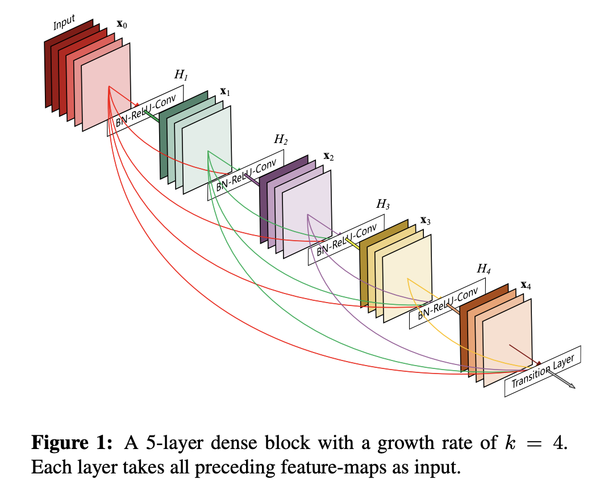
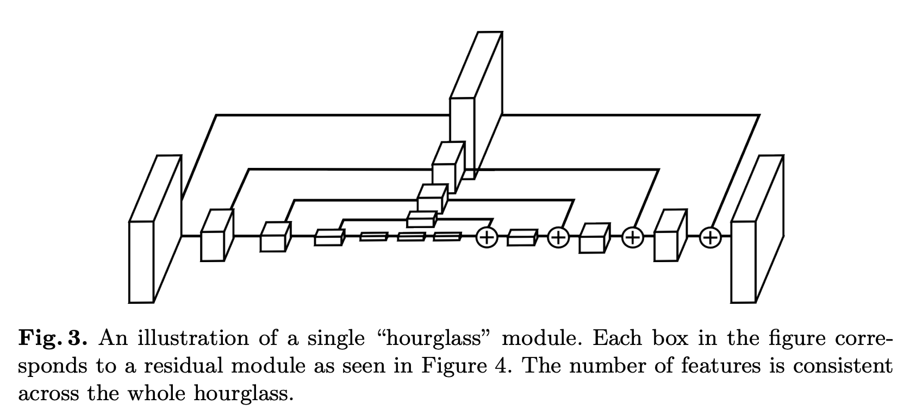
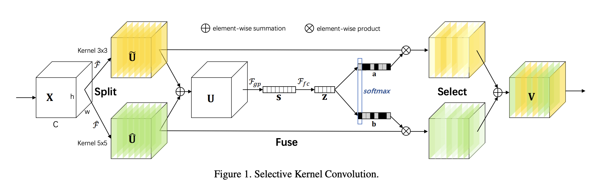
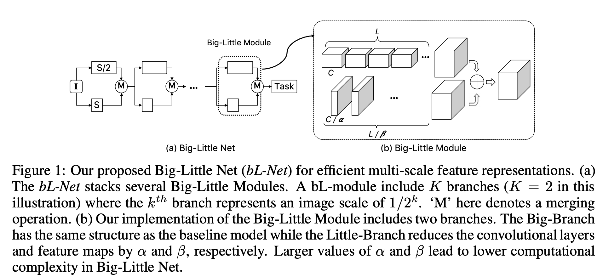
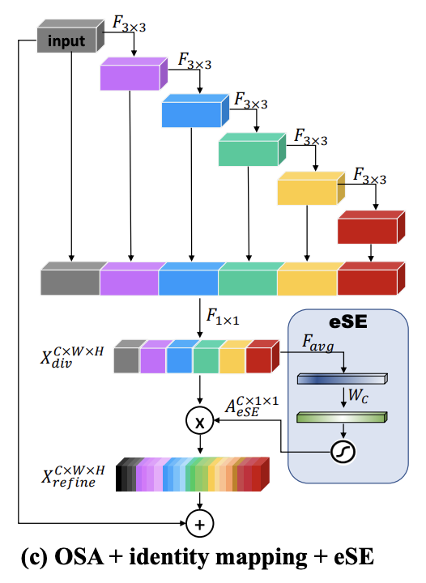
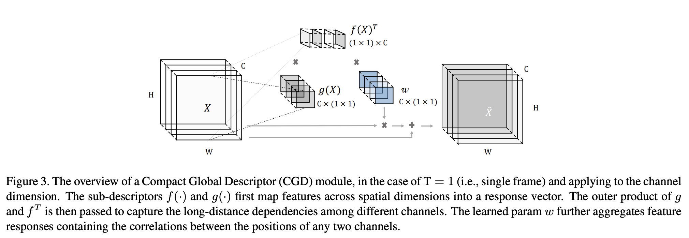

# [Residual Block](https://paperswithcode.com/method/residual-block)

**Residual Blocks** are skip-connection blocks that learn residual functions with reference to the layer inputs, instead of learning unreferenced functions. They were introduced as part of the [ResNet](https://paperswithcode.com/method/resnet) architecture.

Formally, denoting the desired underlying mapping as $\mathcal{H}({x})$, we let the stacked nonlinear layers fit another mapping of $\mathcal{F}({x}):=\mathcal{H}({x})-{x}$. The original mapping is recast into $\mathcal{F}({x})+{x}$.

The intuition is that it is easier to optimize the residual mapping than to optimize the original, unreferenced mapping. To the extreme, if an identity mapping were optimal, it would be easier to push the residual to zero than to fit an identity mapping by a stack of nonlinear layers.

source: [source](http://arxiv.org/abs/1512.03385v1)
# [Bottleneck Residual Block](https://paperswithcode.com/method/bottleneck-residual-block)

A **Bottleneck Residual Block** is a type of residual block that utilises 1x1 convolutions to create a bottleneck. The idea is to make residual blocks as thin as possible to increase depth and have less parameters. It is one of the residual blocks proposed for the [ResNet](https://paperswithcode.com/method/resnet) architecture.

source: [source](http://arxiv.org/abs/1512.03385v1)
# [Dense Block](https://paperswithcode.com/method/dense-block)

A **Dense Block** is a module used in convolutional neural networks that connects **all layers** (with matching feature-map sizes) directly with each other. It was originally proposed as part of the [DenseNet](https://paperswithcode.com/method/densenet) architecture. To preserve the feed-forward nature, each layer obtains additional inputs from all preceding layers and passes on its own feature-maps to all subsequent layers. In contrast to [ResNets](https://beta.paperswithcode.com/method/resnet), we never combine features through summation before they are passed into a layer; instead, we combine features by concatenating them. Hence, the $\ell^{th}$ layer has $\ell$ inputs, consisting of the feature-maps of all preceding convolutional blocks. Its own feature-maps are passed on to all $L-\ell$ subsequent layers. This introduces $\frac{L(L+1)}{2}$  connections in an $L$-layer network, instead of just $L$, as in traditional architectures: "dense connectivity".

source: [source](http://arxiv.org/abs/1608.06993v5)
# [Inception Module](https://paperswithcode.com/method/inception-module)

An **Inception Module** is an image model block that aims to approximate an optimal local sparse structure in a CNN. Put simply, it allows for us to use multiple types of filter size, instead of being restricted to a single filter size, in a single image block, which we then concatenate and pass onto the next layer.

source: [source](http://arxiv.org/abs/1409.4842v1)
# [ResNeXt Block](https://paperswithcode.com/method/resnext-block)

A **ResNeXt Block** aggregates a set of transformations with the same topology. Compared to a Residual Block, it exposes a new dimension,  **cardinality** (the size of the set of transformations) $C$, as an essential factor in addition to the dimensions of depth and width. It was proposed as part of the [ResNeXt](https://paperswithcode.com/method/resnext) CNN architecture.

Formally, a set of aggregated transformations can be represented as: $\mathcal{F}(x)=\sum_{i=1}^{C}\mathcal{T}_i(x)$, where $\mathcal{T}_i(x)$ can be an arbitrary function. Analogous to a simple neuron, $\mathcal{T}_i$ should project $x$ into an (optionally low-dimensional) embedding and then transform it.

source: [source](http://arxiv.org/abs/1611.05431v2)
# [Squeeze-and-Excitation Block](https://paperswithcode.com/method/squeeze-and-excitation-block)

The **Squeeze-and-Excitation Block** is an architectural unit designed to improve the representational power of a network by enabling it to perform dynamic channel-wise feature recalibration. The process is:

- The block has a convolutional block as an input.
- Each channel is "squeezed" into a single numeric value using average pooling.
- A dense layer followed by a ReLU adds non-linearity and output channel complexity is reduced by a ratio.
- Another dense layer followed by a sigmoid gives each channel a smooth gating function.
- Finally, we weight each feature map of the convolutional block based on the side network; the "excitation".

source: [source](https://arxiv.org/abs/1709.01507v4)
# [Fire Module](https://paperswithcode.com/method/fire-module)

A **Fire Module** is a building block for convolutional neural networks, notably used as part of [SqueezeNet](https://paperswithcode.com/method/squeezenet). A Fire module is comprised of: a squeeze convolution layer (which has only 1x1 filters), feeding into an expand layer that has a mix of 1x1 and 3x3 convolution filters.  We expose three tunable dimensions (hyperparameters) in a Fire module: $s_{1x1}$, $e_{1x1}$, and $e_{3x3}$. In a Fire module, $s_{1x1}$ is the number of filters in the squeeze layer (all 1x1), $e_{1x1}$ is the number of 1x1 filters in the expand layer, and $e_{3x3}$ is the number of 3x3 filters in the expand layer. When we use Fire modules we set $s_{1x1}$ to be less than ($e_{1x1}$ + $e_{3x3}$), so the squeeze layer helps to limit the number of input channels to the 3x3 filters.

source: [source](http://arxiv.org/abs/1602.07360v4)
# [Inception-v3 Module](https://paperswithcode.com/method/inception-v3-module)

**Inception-v3 Module** is an image block used in the Inception-v3 architecture. This architecture is used on the coarsest (8 × 8) grids to promote high dimensional representations.

source: [source](http://arxiv.org/abs/1512.00567v3)
# [Non-Local Block](https://paperswithcode.com/method/non-local-block)

A **Non-Local Block** is an image block module that wraps a non-local operation. We can define a non-local block as:

$$ \mathbb{z}_{i} = W_{z}\mathbb{y_{i}} + \mathbb{x}_{i} $$

where $y_{i}$ is the output from the non-local operation and $+ \mathbb{x}_{i}$ is a residual connection.

source: [source](http://arxiv.org/abs/1711.07971v3)
# [Wide Residual Block](https://paperswithcode.com/method/wide-residual-block)

A **Wide Residual Block** is a type of residual block that utilises two conv 3x3 layers (with dropout). This is wider than other variants of residual blocks (for instance [bottleneck residual blocks](https://paperswithcode.com/method/bottleneck-residual-block)). It was proposed as part of the [WideResNet](https://paperswithcode.com/method/wideresnet) CNN architecture.

source: [source](http://arxiv.org/abs/1605.07146v4)
# [ShuffleNet Block](https://paperswithcode.com/method/shufflenet-block)

A **ShuffleNet Block** is an image model block that utilises a channel shuffle operation, along with depthwise convolutions, for an efficient architectural design. It was proposed as part of the [ShuffleNet](https://paperswithcode.com/method/shufflenet) architecture. The starting point is the [Residual Block](https://paperswithcode.com/method/residual-block) unit from [ResNets](https://paperswithcode.com/method/resnet), which is then modified with a pointwise group convolution and a channel shuffle operation.

source: [source](http://arxiv.org/abs/1707.01083v2)
# [Hourglass Module](https://paperswithcode.com/method/hourglass-module)

An **Hourglass Module** is an image block module used mainly for pose estimation tasks. The design of the hourglass is motivated by the need to capture information at every scale. While local evidence is essential for identifying features like faces and hands, a final pose estimate requires a coherent understanding of the full body. The person’s orientation, the arrangement of their limbs, and the relationships of adjacent joints are among the many cues that are best recognized at different scales in the image. The hourglass is a simple, minimal design that has the capacity to capture all of these features and bring them together to output pixel-wise predictions.

The network must have some mechanism to effectively process and consolidate features across scales. The Hourglass uses a single pipeline with skip layers to preserve spatial information at each resolution. The network reaches its lowest resolution at 4x4 pixels allowing smaller spatial filters to be applied that compare features across the entire space of the image.

The hourglass is set up as follows: Convolutional and max pooling layers are used to process features down to a very low resolution. At each max pooling step, the network branches off and applies more convolutions at the original pre-pooled resolution. After reaching the lowest resolution, the network begins the top-down sequence of upsampling and combination of features across scales. To bring together information across two adjacent resolutions, we do nearest neighbor upsampling of the lower resolution followed by an elementwise addition of the two sets of features. The topology of the hourglass is symmetric, so for every layer present on the way down there is a corresponding layer going up.

After reaching the output resolution of the network, two consecutive rounds of 1x1 convolutions are applied to produce the final network predictions. The output of the network is a set of heatmaps where for a given heatmap the network predicts the probability of a joint’s presence at each and every pixel.

source: [source](http://arxiv.org/abs/1603.06937v2)
# [Spatial Attention Module](https://paperswithcode.com/method/spatial-attention-module)

A **Spatial Attention Module** is a module for spatial attention in convolutional neural networks. It generates a spatial attention map by utilizing the inter-spatial relationship of features. Different from the channel attention, the spatial attention focuses on where is an informative part, which is complementary to the channel attention. To compute the spatial attention, we first apply average-pooling and max-pooling operations along the channel axis and concatenate them to generate an efficient feature descriptor. On the concatenated feature descriptor, we apply a convolution layer to generate a spatial attention map $\textbf{M}_{s}\left(F\right) \in \mathcal{R}^{H×W}$ which encodes where to emphasize or suppress. We describe the detailed operation below.

We aggregate channel information of a feature map by using two pooling operations, generating two 2D maps: $\mathbf{F}^{s}_{avg} \in \mathbb{R}^{1\times{H}\times{W}}$ and $\mathbf{F}^{s}_{max} \in \mathbb{R}^{1\times{H}\times{W}}$. Each denotes average-pooled features and max-pooled features across the channel. Those are then concatenated and convolved by a standard convolution layer, producing the 2D spatial attention map. In short, the spatial attention is computed as:

$$ \textbf{M}_{s}\left(F\right) = \sigma\left(f^{7x7}\left(\left[\text{AvgPool}\left(F\right);\text{MaxPool}\left(F\right)\right]\right)\right) $$

$$ \textbf{M}_{s}\left(F\right) = \sigma\left(f^{7x7}\left(\left[\mathbf{F}^{s}_{avg};\mathbf{F}^{s}_{max} \right]\right)\right) $$

where $\sigma$ denotes the sigmoid function and $f^{7×7}$ represents a convolution operation with the filter size of 7 × 7.

source: [source](http://arxiv.org/abs/1807.06521v2)
# [ENet Initial Block](https://paperswithcode.com/method/enet-initial-block)

The **ENet Initial Block** is an image model block used in the ENet semantic segmentation architecture. Max Pooling is performed with non-overlapping 2 × 2 windows, and the convolution has 13 filters, which sums up to 16 feature maps after concatenation. This is heavily inspired by Inception Modules.

source: [source](http://arxiv.org/abs/1606.02147v1)
# [ENet Dilated Bottleneck](https://paperswithcode.com/method/enet-dilated-bottleneck)

**ENet Dilated Bottleneck** is an image model block used in the ENet semantic segmentation architecture. It is the same as a regular ENet Bottleneck but employs dilated convolutions intead.

source: [source](http://arxiv.org/abs/1606.02147v1)
# [ENet Bottleneck](https://paperswithcode.com/method/enet-bottleneck)

**ENet Bottleneck** is an image model block used in the ENet semantic segmentation architecture. Each block consists of three convolutional layers: a 1 × 1 projection that reduces the dimensionality, a main convolutional layer, and a 1 × 1 expansion. We place Batch Normalization and PReLU between all convolutions. If the bottleneck is downsampling, a max pooling layer is added to the main branch.
Also, the first 1 × 1 projection is replaced with a 2 × 2 convolution with stride 2 in both dimensions. We zero pad the activations, to match the number of feature maps.

source: [source](http://arxiv.org/abs/1606.02147v1)
# [ShuffleNet V2 Block](https://paperswithcode.com/method/shufflenet-v2-block)

**ShuffleNet V2 Block** is an image model block used in the ShuffleNet V2 architecture, where speed is the metric optimized for (instead of indirect ones like FLOPs). It utilizes a simple operator called channel split. At the beginning of each unit, the input of $c$ feature channels are split into two branches with $c - c'$ and $c'$ channels, respectively. Following **G3**, one branch remains as identity. The other branch consists of three convolutions with the same input and output channels to satisfy **G1**. The two $1\times1$ convolutions are no longer group-wise, unlike the original ShuffleNet. This is partially to follow **G2**, and partially because the split operation already produces two groups. After convolution, the two branches are concatenated. So, the number of channels keeps the same (G1). The same “channel shuffle” operation as in ShuffleNet is then used to enable information communication between the two branches.

source: [source](http://arxiv.org/abs/1807.11164v1)
# [Reduction-A](https://paperswithcode.com/method/reduction-a)

**Reduction-A** is an image model block used in the Inception-v4 architecture.

source: [source](http://arxiv.org/abs/1602.07261v2)
# [ShuffleNet V2 Downsampling Block](https://paperswithcode.com/method/shufflenet-v2-downsampling-block)

**ShuffleNet V2 Downsampling Block** is a block for spatial downsampling used in the ShuffleNet V2 architecture. Unlike the regular ShuffleNet V2 block, the channel split operator is removed so the number of output channels is doubled.

source: [source](http://arxiv.org/abs/1807.11164v1)
# [ESP](https://paperswithcode.com/method/esp)

An **Efficient Spatial Pyramid (ESP)** is an image model block based on a factorization principle that decomposes a standard convolution into two steps: (1) point-wise convolutions and (2) spatial pyramid of dilated convolutions. The point-wise convolutions help in reducing the computation, while the spatial pyramid of dilated convolutions re-samples the feature maps to learn the representations from large effective receptive field. This allows for increased efficiency compared to another image blocks like ResNeXt blocks and Inception modules.

source: [source](http://arxiv.org/abs/1803.06815v3)
# [Inception-ResNet-v2 Reduction-B](https://paperswithcode.com/method/inception-resnet-v2-reduction-b)

**Inception-ResNet-v2 Reduction-B** is an image model block used in the Inception-ResNet-v2 architecture.

source: [source](http://arxiv.org/abs/1602.07261v2)
# [Inception-ResNet-v2-C](https://paperswithcode.com/method/inception-resnet-v2-c)

**Inception-ResNet-v2-C** is an image model block used in the [Inception-ResNet-v2](https://paperswithcode.com/method/inception-resnet-v2) architecture. It largely follows the idea of Inception modules - and grouped convolutions - but also includes residual connections.

source: [source](http://arxiv.org/abs/1602.07261v2)
# [Inception-ResNet-v2-B](https://paperswithcode.com/method/inception-resnet-v2-b)

**Inception-ResNet-v2-B** is an image model block used in the  [Inception-ResNet-v2](https://paperswithcode.com/method/inception-resnet-v2) architecture. It largely follows the idea of Inception modules - and grouped convolutions - but also includes residual connections.

source: [source](http://arxiv.org/abs/1602.07261v2)
# [Inception-ResNet-v2-A](https://paperswithcode.com/method/inception-resnet-v2-a)

**Inception-ResNet-v2-A** is an image model block used in the Inception-ResNet-v2 architecture.

source: [source](http://arxiv.org/abs/1602.07261v2)
# [Pyramidal Residual Unit](https://paperswithcode.com/method/pyramidal-residual-unit)

A **Pyramidal Residual Unit** is a type of residual unit where the number of channels gradually increases as a function of the depth at which the layer occurs, which is similar to a pyramid structure of which the shape gradually widens from the top downwards. It was introduced as part of the [PyramidNet](https://paperswithcode.com/method/pyramidnet) architecture.

source: [source](http://arxiv.org/abs/1610.02915v4)
# [Channel Attention Module](https://paperswithcode.com/method/channel-attention-module)

A **Channel Attention Module** is a module for channel-based attention in convolutional neural networks. We produce a channel attention map by exploiting the inter-channel relationship of features. As each channel of a feature map is considered as a feature detector, channel attention focuses on ‘what’ is meaningful given an input image. To compute the channel attention efficiently, we squeeze the spatial dimension of the input feature map. 

We first aggregate spatial information of a feature map by using both average-pooling and max-pooling operations, generating two different spatial context descriptors: $\mathbf{F}^{c}_{avg}$ and $\mathbf{F}^{c}_{max}$, which denote average-pooled features and max-pooled features respectively. 

Both descriptors are then forwarded to a shared network to produce our channel attention map $\mathbf{M}_{c} \in \mathbb{R}^{C\times{1}\times{1}}$. The shared network is composed of multi-layer perceptron (MLP) with one hidden layer. To reduce parameter overhead, the hidden activation size is set to $\mathbb{R}^{C/r×1×1}$, where $r$ is the reduction ratio. After the shared network is applied to each descriptor, we merge the output feature vectors using element-wise summation. In short, the channel attention is computed as:

$$  \mathbf{M_{c}}\left(\mathbf{F}\right) = \sigma\left(\text{MLP}\left(\text{AvgPool}\left(\mathbf{F}\right)\right)+\text{MLP}\left(\text{MaxPool}\left(\mathbf{F}\right)\right)\right) $$

$$  \mathbf{M_{c}}\left(\mathbf{F}\right) = \sigma\left(\mathbf{W_{1}}\left(\mathbf{W_{0}}\left(\mathbf{F}^{c}_{avg}\right)\right) +\mathbf{W_{1}}\left(\mathbf{W_{0}}\left(\mathbf{F}^{c}_{max}\right)\right)\right) $$

where $\sigma$ denotes the sigmoid function, $\mathbf{W}_{0} \in \mathbb{R}^{C/r\times{C}}$, and $\mathbf{W}_{1} \in \mathbb{R}^{C\times{C/r}}$. Note that the MLP weights, $\mathbf{W}_{0}$ and $\mathbf{W}_{1}$, are shared for both inputs and the ReLU activation function is followed by $\mathbf{W}_{0}$.

Note that the channel attention module with just average pooling is the same as the SE module.

source: [source](http://arxiv.org/abs/1807.06521v2)
# [Inception-A](https://paperswithcode.com/method/inception-a)

**Inception-A** is an image model block used in the Inception-v4 architecture.

source: [source](http://arxiv.org/abs/1602.07261v2)
# [Reduction-B](https://paperswithcode.com/method/reduction-b)

**Reduction-B** is an image model block used in the Inception-v4 architecture.

source: [source](http://arxiv.org/abs/1602.07261v2)
# [Inception-C](https://paperswithcode.com/method/inception-c)

**Inception-C** is an image model block used in the Inception-v4 architecture.

source: [source](http://arxiv.org/abs/1602.07261v2)
# [DPN Block](https://paperswithcode.com/method/dpn-block)

A **Dual Path Network** block shares common features while maintaining the flexibility to explore new features through dual path architectures. In this sense it combines the benefits of [ResNets](https://paperswithcode.com/method/resnet) and [DenseNets](https://paperswithcode.com/method/densenet). It was proposed as part of the [DPN](https://paperswithcode.com/method/dpn) CNN architecture.

We formulate such a dual path architecture as follows:

$$x^{k} = \sum\limits_{t=1}^{k-1} f_t^{k}(h^t) \text{,}  $$

$$
y^{k} = \sum\limits_{t=1}^{k-1} v_t(h^t) = y^{k-1} + \phi^{k-1}(y^{k-1}) \text{,} \\
$$

$$
r^{k} = x^{k} + y^{k} \text{,} \\
$$

$$
h^k = g^k \left( r^{k} \right) \text{,}
$$

where $x^{k}$ and $y^{k}$ denote the extracted information at $k$-th step from individual path, $v_t(\cdot)$ is a feature learning function as $f_t^k(\cdot)$. The first equation refers to the densely connected path that enables exploring new features. The second equation refers to the residual path that enables common features re-usage. The third equation defines the dual path that integrates them and feeds them to the last transformation function in the last equation.

source: [source](http://arxiv.org/abs/1707.01629v2)
# [Pyramidal Bottleneck Residual Unit](https://paperswithcode.com/method/pyramidal-bottleneck-residual-unit)

A **Pyramidal Bottleneck Residual Unit** is a type of residual unit where the number of channels gradually increases as a function of the depth at which the layer occurs, which is similar to a pyramid structure of which the shape gradually widens from the top downwards. It also consists of a bottleneck using 1x1 convolutions. It was introduced as part of the [PyramidNet](https://paperswithcode.com/method/pyramidnet) architecture.

source: [source](http://openaccess.thecvf.com/content_cvpr_2017/html/Han_Deep_Pyramidal_Residual_CVPR_2017_paper.html)
# [Fractal Block](https://paperswithcode.com/method/fractal-block)

A **Fractal Block** is an image model block that utilizes an expansion rule that yields a structural layout of truncated fractals. For the base case where $f_{1}\left(z\right) = \text{conv}\left(z\right)$ is a convolutional layer, we then have recursive fractals of the form:

$$ f_{C+1}\left(z\right) = \left[\left(f_{C}\circ{f_{C}}\right)\left(z\right)\right] \oplus \left[\text{conv}\left(z\right)\right]$$

Where $C$ is the number of columns. For the join layer (green in Figure), we use the element-wise mean rather than concatenation or addition.

source: [source](http://arxiv.org/abs/1605.07648v4)
# [Inception-B](https://paperswithcode.com/method/inception-b)

**Inception-B** is an image model block used in the Inception-v4 architecture.

source: [source](http://arxiv.org/abs/1602.07261v2)
# [Dilated Bottleneck Block](https://paperswithcode.com/method/dilated-bottleneck-block)

**Dilated Bottleneck Block** is an image model block used in the [DetNet](https://paperswithcode.com/method/detnet) convolutional neural network architecture. It employs a bottleneck structure with dilated convolutions to efficiently enlarge the receptive field.

source: [source](http://arxiv.org/abs/1804.06215v2)
# [Dilated Bottleneck with Projection Block](https://paperswithcode.com/method/dilated-bottleneck-with-projection-block)

**Dilated Bottleneck with Projection Block** is an image model block used in the [DetNet](https://paperswithcode.com/method/detnet) convolutional neural network architecture. It employs a bottleneck structure with dilated convolutions to efficiently enlarge the receptive field. It uses a 1x1 convolution to ensure the spatial size stays fixed.

source: [source](http://arxiv.org/abs/1804.06215v2)
# [SqueezeNeXt Block](https://paperswithcode.com/method/squeezenext-block)

A **SqueezeNeXt Block** is a two-stage bottleneck module used in the [SqueezeNeXt](http://www.paperswithcode.com/squeezenext-block) to reduce the number of input channels to the 3 × 3 convolution. The
latter is further decomposed into separable convolutions to further reduce the number of parameters (orange parts), followed
by a 1 × 1 expansion module.

source: [source](http://arxiv.org/abs/1803.10615v2)
# [One-Shot Aggregation](https://paperswithcode.com/method/one-shot-aggregation)

**One-Shot Aggregation** is an image model block that is an alternative to [Dense Blocks](https://paperswithcode.com/method/dense-block), by aggregating intermediate features. It is proposed as part of the [VoVNet](https://paperswithcode.com/method/vovnet) architecture. Each convolution layer is connected by two-way connection. One way is connected to the subsequent layer to produce the feature with a larger receptive field while the other way is aggregated only once into the final output feature map. The difference with DenseNet is that the output of each layer is not routed to all subsequent intermediate layers which makes the input size of intermediate layers constant.

source: [source](http://arxiv.org/abs/1904.09730v1)
# [Two-Way Dense Layer](https://paperswithcode.com/method/two-way-dense-layer)

**Two-Way Dense Layer** is an image model block used in the [PeleeNet](https://paperswithcode.com/method/peleenet) architectures. Motivated by [GoogLeNet](https://paperswithcode.com/method/googlenet), the 2-way dense layer is used to get different scales of receptive fields. One way of the layer uses a 3x3 kernel size. The other way of the layer uses two stacked 3x3 convolution to learn visual patterns for large objects.

source: [source](http://papers.nips.cc/paper/7466-pelee-a-real-time-object-detection-system-on-mobile-devices)
# [FBNet Block](https://paperswithcode.com/method/fbnet-block)

**FBNet Block** is an image model block used in the [FBNet](https://paperswithcode.com/method/fbnet) architectures discovered through [DNAS](https://paperswithcode.com/method/dnas) neural architecture search.

source: [source](https://arxiv.org/abs/1812.03443v3)
# [Selective Kernel](https://paperswithcode.com/method/selective-kernel)

A **Selective Kernel** unit is a bottleneck block consisting of a sequence of 1×1 convolution, SK convolution and 1×1 convolution. It was proposed as part of the [SKNet](https://paperswithcode.com/method/sknet) CNN architecture. In general, all the large kernel convolutions in the original bottleneck blocks in [ResNeXt](https://paperswithcode.com/method/resnext) are replaced by the proposed SK convolutions, enabling the network to choose appropriate receptive field sizes in an adaptive manner. 

In SK units, there are three important hyper-parameters which determine the final settings of SK convolutions: the number of paths $M$ that determines the number of choices of different kernels to be aggregated, the group number $G$ that controls the cardinality of each path, and the reduction ratio $r$ that controls the number of parameters in the fuse operator. One typical setting of SK convolutions is $\text{SK}\left[M, G, r\right]$ to be $\text{SK}\left[2, 32, 16\right]$.

source: [source](http://arxiv.org/abs/1903.06586v2)
# [DVD-GAN DBlock](https://paperswithcode.com/method/dvd-gan-dblock)

**DVD-GAN DBlock** is a residual block for the discriminator used in the [DVD-GAN](https://paperswithcode.com/method/dvd-gan) architecture for video generation.

source: [source](https://arxiv.org/abs/1907.06571v2)
# [CSPResNeXt Block](https://paperswithcode.com/method/cspresnext-block)

**CSPResNeXt Block** is an extended [ResNext Block](https://paperswithcode.com/method/resnext-block) where we partition the feature map of the base layer into two parts and then merges them through a cross-stage hierarchy. The use of a split and merge strategy allows for more gradient flow through the network.

source: [source](https://arxiv.org/abs/1911.11929v1)
# [Effective Squeeze-and-Excitation Block](https://paperswithcode.com/method/effective-squeeze-and-excitation-block)

**Effective Squeeze-and-Excitation Block** is an image model block based on squeeze-and-excitation, the difference being that one less FC layer is used. The authors note the SE module has a limitation: channel information loss due to dimension reduction. For avoiding high model complexity burden, two FC layers of the SE module need to reduce channel dimension. Specifically, while the first FC layer reduces input feature channels $C$ to $C/r$ using reduction ratio $r$, the second FC layer expands the reduced channels to original channel size $C$. As a result, this channel dimension reduction causes channel information loss. Therefore, effective SE (eSE) uses only one FC layer with $C$ channels instead of two FCs without channel dimension reduction, which maintains channel information.

source: [source](https://arxiv.org/abs/1911.06667v6)
# [DVD-GAN GBlock](https://paperswithcode.com/method/dvd-gan-gblock)

**DVD-GAN GBlock** is a residual block for the generator used in the [DVD-GAN](https://paperswithcode.com/method/dvd-gan) architecture for video generation.

source: [source](https://arxiv.org/abs/1907.06571v2)
# [Big-Little Module](https://paperswithcode.com/method/big-little-module)

**Big-Little Modules** are blocks for image models that have two branches: each of which represents a separate block from a deep model and a less deep counterpart. They were proposed as part of the [BigLittle-Net](https://paperswithcode.com/method/big-little-net) architecture. The two branches are fused with a linear combination and unit weights. These two branches are known as Big-Branch (more layers and channels at low resolutions) and Little-Branch (fewer layers and channels at high resolution).

source: [source](https://arxiv.org/abs/1807.03848v3)
# [Res2Net Block](https://paperswithcode.com/method/res2net-block)

A **Res2Net Block** is an image model block that constructs hierarchical residual-like connections
within one single residual block. It was proposed as part of the [Res2Net](https://paperswithcode.com/method/res2net) CNN architecture.

The block represents multi-scale features at a granular level and increases the range of receptive fields for each network layer. The $3 \times 3$ filters of $n$ channels is replaced with a set of smaller filter groups, each with $w$ channels. These smaller filter groups are connected in a hierarchical residual-like style to increase the number of scales that the output features can represent. Specifically, we divide input feature maps into several groups. A group of filters first extracts features from a group of input feature maps. Output features of the previous group are then sent to the next group of filters along with another group of input feature maps. 

This process repeats several times until all input feature maps are processed. Finally, feature maps from all groups are concatenated and sent to another group of $1 \times 1$ filters to fuse information altogether. Along with any possible path in which input features are transformed to output features, the equivalent receptive field increases whenever it passes a $3 \times 3$ filter, resulting in many equivalent feature scales due to combination effects.

One way of thinking of these blocks is that they expose new dimension, **scale**,  alongside the existing dimensions of depth, width, and cardinality.

source: [source](https://arxiv.org/abs/1904.01169v2)
# [OSA (identity mapping + eSE)](https://paperswithcode.com/method/osa-identity-mapping-ese)

**One-Shot Aggregation with an Identity Mapping and eSE** is an image model block that extends [one-shot aggregation](https://paperswithcode.com/method/one-shot-aggregation) with a residual connection and effective squeeze-and-excitation block. It is proposed as part of the [VoVNetV2](https://paperswithcode.com/method/vovnetv2) CNN architecture.

The module adds an identity mapping to the OSA module - the input path is connected to the end of an OSA module that is able to backpropagate the gradients of every OSA module in an end-to-end manner on each stage like a [ResNet](https://paperswithcode.com/method/resnet). Additionally, a channel attention module - effective Squeeze-Excitation - is used which is like regular squeeze-and-excitation but uses only one FC layer with $C$ channels instead of two FCs without a channel dimension reduction, which maintains channel information.

source: [source](https://arxiv.org/abs/1911.06667v6)
# [Style-based Recalibration Module](https://paperswithcode.com/method/style-based-recalibration-module)

A **Style-based Recalibration Module (SRM)** is a module for convolutional neural networks that adaptively recalibrates intermediate feature maps by exploiting their styles. SRM first extracts the style information from each channel of the feature maps by style pooling, then estimates per-channel recalibration weight via channel-independent style integration. By incorporating the relative importance of individual styles into feature maps, SRM is aimed at enhancing the representational ability of a CNN.

The overall structure of SRM is illustrated in the Figure to the right. It consists of two main components: style pooling and style integration. The style pooling operator extracts style features
from each channel by summarizing feature responses across spatial dimensions. It is followed by the style integration operator, which produces example-specific style weights by utilizing the style features via channel-wise operation. The style weights finally recalibrate the feature maps to either
emphasize or suppress their information.

source: [source](http://arxiv.org/abs/1903.10829v1)
# [Elastic Dense Block](https://paperswithcode.com/method/elastic-dense-block)

**Elastic Dense Block** is a skip connection block that modifies the [Dense Block](https://paperswithcode.com/method/dense-block) with downsamplings and upsamplings in parallel branches at each layer to let the network learn from a data scaling policy in which inputs being processed at different resolutions in each layer. It is called "elastic" because each layer in the network is flexible in terms of choosing the best scale by a soft policy.

source: [source](http://arxiv.org/abs/1812.05262v2)
# [Spatial Group-wise Enhance](https://paperswithcode.com/method/spatial-group-wise-enhance)

**Spatial Group-wise Enhance** is a module for convolutional neural networks that can adjust the
importance of each sub-feature by generating an attention factor for each spatial location in each semantic group, so that every individual group can autonomously enhance its learnt expression and suppress possible noise

Inside each feature group, we model a spatial enhance mechanism inside each feature group, by scaling the feature vectors over all the locations with an attention mask. This attention mask is designed to suppress the possible noise and highlight the correct semantic feature regions. Different from other popular attention methods, it utilises the similarity between the global statistical feature and the local ones of each location as the source of generation for the attention masks.

source: [source](https://arxiv.org/abs/1905.09646v2)
# [NVAE Generative Residual Cell](https://paperswithcode.com/method/nvae-generative-residual-cell)

The **NVAE Generative Residual Cell** is a skip connection block used as part of the [NVAE](https://paperswithcode.com/method/nvae) architecture for the generator. The residual cell expands the number of channels $E$ times before applying the depthwise separable convolution, and then maps it back to $C$ channels. The design motivation was to help model long-range correlations in the data by increasing the receptive field of the network, which explains the expanding path but also the use of depthwise convolutions to keep a handle on parameter count.

source: [source](https://arxiv.org/abs/2007.03898v1)
# [NVAE Encoder Residual Cell](https://paperswithcode.com/method/nvae-encoder-residual-cell)

The **NVAE Encoder Residual Cell** is a residual connection block used in the [NVAE](https://paperswithcode.com/method/nvae) architecture for the encoder. It applies two series of BN-Swish-Conv layers without changing the number of channels.

source: [source](https://arxiv.org/abs/2007.03898v1)
# [CornerNet-Squeeze Hourglass Module](https://paperswithcode.com/method/cornernet-squeeze-hourglass-module)

**CornerNet-Squeeze Hourglass Module** is an image model block used in CornerNet-Lite that is based on an hourglass module, but uses modified fire modules instead of residual blocks. Other than replacing the residual blocks, further modifications include: reducing the maximum feature map resolution of the hourglass modules by adding one more downsampling layer before the hourglass modules, removing one downsampling layer in each hourglass module, replacing the 3 × 3 filters with 1 x 1 filters in the prediction modules of CornerNet, and finally replacing the nearest neighbor upsampling in the hourglass network with transpose convolution with a 4 × 4 kernel.

source: [source](http://arxiv.org/abs/1904.08900v1)
# [Split Attention](https://paperswithcode.com/method/split-attention)

A **Split Attention** block enables attention across feature-map groups. As in ResNeXt blocks, the feature can be divided into several groups, and the number of feature-map groups is given by a cardinality hyperparameter $K$. The resulting feature-map groups are called cardinal groups. Split Attention blocks introduce a new radix hyperparameter $R$ that indicates the number of splits within a cardinal group, so the total number of feature groups is $G = KR$. We may apply a series of transformations {$\mathcal{F}_1, \mathcal{F}_2, \cdots\mathcal{F}_G$} to each individual group, then the intermediate representation of each group is $U_i = \mathcal{F}_i\left(X\right)$, for $i \in$ {$1, 2, \cdots{G}$}.

A combined representation for each cardinal group can be obtained by fusing via an element-wise summation across multiple splits. The representation for $k$-th cardinal group is 
$\hat{U}^k = \sum_{j=R(k-1)+1}^{R k} U_j $, where $\hat{U}^k \in \mathbb{R}^{H\times W\times C/K}$ for $k\in{1,2,...K}$, and $H$, $W$ and $C$ are the block output feature-map sizes. 
Global contextual information with embedded channel-wise statistics can be gathered with global average pooling across spatial dimensions  $s^k\in\mathbb{R}^{C/K}$. Here the $c$-th component is calculated as:

$$
    s^k_c = \frac{1}{H\times W} \sum_{i=1}^H\sum_{j=1}^W \hat{U}^k_c(i, j).
$$

A weighted fusion of the cardinal group representation $V^k\in\mathbb{R}^{H\times W\times C/K}$ is aggregated using channel-wise soft attention, where each feature-map channel is produced using a weighted combination over splits. The $c$-th channel is calculated as:

$$
    V^k_c=\sum_{i=1}^R a^k_i(c) U_{R(k-1)+i} ,
$$

where $a_i^k(c)$ denotes a (soft) assignment weight given by:

$$
a_i^k(c) =
\begin{cases}
  \frac{exp(\mathcal{G}^c_i(s^k))}{\sum_{j=0}^R exp(\mathcal{G}^c_j(s^k))} &amp; \quad\textrm{if } R&gt;1, \
   \frac{1}{1+exp(-\mathcal{G}^c_i(s^k))} &amp; \quad\textrm{if } R=1,\
\end{cases}
$$

and mapping $\mathcal{G}_i^c$ determines the weight of each split for the $c$-th channel based on the global context representation $s^k$.

source: [source](https://arxiv.org/abs/2004.08955v1)
# [Efficient Channel Attention](https://paperswithcode.com/method/efficient-channel-attention)

**Efficient Channel Attention** is an architectural unit based on squeeze-and-excitation blocks that reduces model complexity without dimensionality reduction. It is proposed as part of the [ECA-Net](https://paperswithcode.com/method/eca-net) CNN architecture. After channel-wise global average pooling without dimensionality reduction, the ECA captures local cross-channel interaction by considering every channel and its $k$ neighbors. The ECA can be efficiently implemented by fast $1D$ convolution of size $k$, where kernel size $k$ represents the coverage of local cross-channel interaction, i.e., how many neighbors participate in attention prediction of one channel.

source: [source](https://arxiv.org/abs/1910.03151v4)
# [Harmonic Block](https://paperswithcode.com/method/harmonic-block)

A **Harmonic Block** is an image model component that utilizes Discrete Cosine Transform (DCT) filters. Convolutional neural networks (CNNs) learn filters in order to capture local correlation patterns in feature space. In contrast, DCT has preset spectral filters, which can be better for compressing information (due to the presence of redundancy in the spectral domain).

DCT has been successfully used for JPEG encoding to transform image blocks into spectral representations to capture the most information with a small number of coefficients. Harmonic blocks learn how to optimally combine spectral coefficients at every layer to produce a fixed size representation defined as a weighted sum of responses to DCT filters. The use of DCT filters allows to address the task of model compression.

source: [source](https://arxiv.org/abs/2001.06570v1)
# [Scale Aggregation Block](https://paperswithcode.com/method/scale-aggregation-block)

A **Scale Aggregation Block** concatenates feature maps at a wide range of scales. Feature maps for each scale are generated by a stack of downsampling, convolution and upsampling operations. The proposed scale aggregation block is a standard computational module which readily replaces any given transformation $\mathbf{Y}=\mathbf{T}(\mathbf{X})$, where $\mathbf{X}\in \mathbb{R}^{H\times W\times C}$, $\mathbf{Y}\in \mathbb{R}^{H\times W\times C_o}$ with $C$ and $C_o$ being the input and output channel number respectively. $\mathbf{T}$ is any operator such as a convolution layer or a series of convolution layers. Assume we have $L$ scales. Each scale $l$ is generated by sequentially conducting a downsampling $\mathbf{D}_l$, a transformation $\mathbf{T}_l$ and an unsampling operator $\mathbf{U}_l$:

$$
\mathbf{X}^{'}_l=\mathbf{D}_l(\mathbf{X}),
\label{eq:eq_d}
$$

$$
\mathbf{Y}^{'}_l=\mathbf{T}_l(\mathbf{X}^{'}_l),
\label{eq:eq_tl}
$$

$$
\mathbf{Y}_l=\mathbf{U}_l(\mathbf{Y}^{'}_l),
\label{eq:eq_u}
$$

where $\mathbf{X}^{'}_l\in \mathbb{R}^{H_l\times W_l\times C}$,
$\mathbf{Y}^{'}_l\in \mathbb{R}^{H_l\times W_l\times C_l}$, and
$\mathbf{Y}_l\in \mathbb{R}^{H\times W\times C_l}$.
Notably, $\mathbf{T}_l$ has the similar structure as $\mathbf{T}$.
We can concatenate all $L$ scales together, getting

$$
\mathbf{Y}^{'}=\Vert^L_1\mathbf{U}_l(\mathbf{T}_l(\mathbf{D}_l(\mathbf{X}))),
\label{eq:eq_all}
$$

where $\Vert$ indicates concatenating feature maps along the channel dimension, and $\mathbf{Y}^{'} \in \mathbb{R}^{H\times W\times \sum^L_1 C_l}$ is the final output feature maps of the scale aggregation block.

In the reference implementation, the downsampling $\mathbf{D}_l$ with factor $s$ is implemented by a max pool layer with $s\times s$ kernel size and  $s$ stride. The upsampling $\mathbf{U}_l$ is implemented by resizing with the nearest neighbor  interpolation.

source: [source](http://arxiv.org/abs/1904.09460v1)
# [DiCE Unit](https://paperswithcode.com/method/dice-unit)

A **DiCE Unit** is an image model block that is built using dimension-wise convolutions and dimension-wise fusion.  The dimension-wise convolutions apply light-weight convolutional filtering across each dimension of the input tensor while dimension-wise fusion efficiently combines these dimension-wise representations; allowing the DiCE unit to efficiently encode spatial and channel-wise information contained in the input tensor. 

Standard convolutions encode spatial and channel-wise information simultaneously, but they are computationally expensive. To improve the efficiency of standard convolutions, separable convolution are introduced, where spatial and channelwise information are encoded separately using depth-wise and point-wise convolutions, respectively. Though this factorization is effective, it puts a significant computational load on point-wise convolutions and makes them a computational bottleneck.

DiCE Units utilize a dimension-wise convolution to encode depth-wise, width-wise, and height-wise information independently. The dimension-wise convolutions encode local information from different dimensions of the input tensor, but do not capture global information. One approach is a pointwise convolution, but it is computationally expensive, so instead dimension-wise fusion factorizes the point-wise convolution in two steps: (1) local fusion and (2) global fusion.

source: [source](https://arxiv.org/abs/1906.03516v2)
# [Residual SRM](https://paperswithcode.com/method/residual-srm)

A **Residual SRM** is a module for convolutional neural networks that uses a Style-based Recalibration Module within a [residual block](https://paperswithcode.com/method/residual-block) like structure.

source: [source](http://arxiv.org/abs/1903.10829v1)
# [Ghost Module](https://paperswithcode.com/method/ghost-module)

A **Ghost Module** is an image block for convolutional neural network that aims to generate more features by using fewer parameters. Specifically, an ordinary convolutional layer in deep neural networks is split into two parts. The first part involves ordinary convolutions but their total number is controlled. Given the intrinsic feature maps from the first part, a series of simple linear operations are applied for generating more feature maps. 

Given the widely existing redundancy in intermediate feature maps calculated by mainstream CNNs, ghost modules aim to reduce them. In practice, given the input data $X\in\mathbb{R}^{c\times h\times w}$, where $c$ is the number of input channels and $h$ and $w$ are the height and width of the input data, respectively,  the operation of an arbitrary convolutional layer for producing $n$ feature maps can be formulated as

$$
Y = X*f+b,
$$

where $*$ is the convolution operation, $b$ is the bias term, $Y\in\mathbb{R}^{h'\times w'\times n}$ is the output feature map with $n$ channels, and $f\in\mathbb{R}^{c\times k\times k \times n}$ is the convolution filters in this layer. In addition, $h'$ and $w'$ are the height and width of the output data, and $k\times k$ is the kernel size of convolution filters $f$, respectively. During this convolution procedure, the required number of FLOPs can be calculated as $n\cdot h'\cdot w'\cdot c\cdot k\cdot k$, which is often as large as hundreds of thousands since the number of filters $n$ and the channel number $c$ are generally very large (e.g. 256 or 512).

Here, the number of parameters (in $f$ and $b$) to be optimized is explicitly determined by the dimensions of input and output feature maps. The output feature maps of convolutional layers often contain much redundancy, and some of them could be similar with each other. We point out that it is unnecessary to generate these redundant feature maps one by one with large number of FLOPs and parameters. Suppose that the output feature maps are **ghosts** of a handful of intrinsic feature maps with some cheap transformations. These intrinsic feature maps are often of smaller size and produced by ordinary convolution filters. Specifically, $m$ intrinsic feature maps $Y'\in\mathbb{R}^{h'\times w'\times m}$ are generated using a primary convolution:

$$
Y' = X*f',
$$

where $f'\in\mathbb{R}^{c\times k\times k \times m}$ is the utilized filters, $m\leq n$ and the bias term is omitted for simplicity. The hyper-parameters such as filter size, stride, padding, are the same as those in the ordinary convolution to keep the spatial size (ie $h'$ and $w'$) of the output feature maps consistent. To further obtain the desired $n$ feature maps, we apply a series of cheap linear operations on each intrinsic feature in $Y'$ to generate $s$ ghost features according to the following function:

$$
y_{ij} = \Phi_{i,j}(y'_i),\quad \forall\; i = 1,...,m,\;\; j = 1,...,s,
$$

where $y'_i$ is the $i$-th intrinsic feature map in $Y'$, $\Phi_{i,j}$ in the above function is the $j$-th (except the last one) linear operation for generating the $j$-th ghost feature map $y_{ij}$, that is to say, $y'_i$ can have one or more ghost feature maps ${y_{ij}}_{j=1}^{s}$. The last $\Phi_{i,s}$ is the identity mapping for preserving the intrinsic feature maps. we can obtain $n=m\cdot s$ feature maps $Y=[y_{11},y_{12},\cdots,y_{ms}]$ as the output data of a Ghost module. Note that the linear operations $\Phi$ operate on each channel whose computational cost is much less than the ordinary convolution. In practice, there could be several different linear operations in a Ghost module, eg $3\times 3$ and $5\times5$ linear kernels, which will be analyzed in the experiment part.

source: [source](https://arxiv.org/abs/1911.11907v2)
# [Depthwise Fire Module](https://paperswithcode.com/method/depthwise-fire-module)

A **Depthwise Fire Module** is a modification of a Fire Module with depthwise separable convolutions to improve the inference time performance. It is used in the CornerNet-Lite architecture for object detection.

source: [source](http://arxiv.org/abs/1904.08900v1)
# [Strided EESP](https://paperswithcode.com/method/strided-eesp)

A **Strided EESP** unit is based on the [EESP Unit](https://paperswithcode.com/method/eesp) but is modified to learn representations more efficiently at multiple scales. Depth-wise dilated convolutions are given strides, an average pooling operation is added instead of an identity connection, and the element-wise addition operation is replaced with a concatenation operation, which helps in expanding the dimensions of feature maps efficiently.

source: [source](http://arxiv.org/abs/1811.11431v3)
# [Global Context Block](https://paperswithcode.com/method/global-context-block)

A **Global Context Block** is an image model block for global context modeling; this has the benefits of the simplified non-local (SNL) block with effective modeling on long-range dependency, and the squeeze-excitation (SE) block with lightweight computation. In this framework, we have (a) global attention pooling, which adopts a 1x1 convolution $W_{k}$ and softmax function to obtain the attention weights, and then performs the attention pooling to obtain the global context features, (b) feature transform via a 1x1 convolution $W_{v}$; (c) feature aggregation, which employs addition to aggregate the global context features to the features of each position. The GC block is proposed as a lightweight way to achieve global context modeling.

source: [source](http://arxiv.org/abs/1904.11492v1)
# [DimFuse](https://paperswithcode.com/method/dimfuse)

**Dimension-wise Fusion** is an image model block that attempts to capture global information by combining features globally. It is an alternative to point-wise convolution. A point-wise convolutional layer applies $D$ point-wise kernels $\mathbf{k}_p \in \mathbb{R}^{3D \times 1 \times 1}$ and performs $3D^2HW$ operations to combine dimension-wise representations of $\mathbf{Y_{Dim}} \in \mathbb{R}^{3D \times H \times W}$ and produce an output $\mathbf{Y} \in \mathbb{R}^{D \times H \times W}$. This is computationally expensive. Dimension-wise fusion is an alternative that can allow us to combine representations of $\mathbf{Y_{Dim}}$ efficiently. As illustrated in the Figure to the right, it factorizes the point-wise convolution in two steps: (1) local fusion and (2) global fusion.

source: [source](https://arxiv.org/abs/1906.03516v2)
# [Compact Global Descriptor](https://paperswithcode.com/method/compact-global-descriptor)

A **Compact Global Descriptor** is an image model block for modelling interactions between positions across different dimensions (e.g., channels, frames). This descriptor enables subsequent convolutions to access the informative global features.
performance and reducing computation overhead.

source: [source](https://arxiv.org/abs/1907.09665v3)
# [EESP](https://paperswithcode.com/method/eesp)

An **EESP Unit**, or  Extremely Efficient Spatial Pyramid of Depth-wise Dilated Separable Convolutions, is an image model block designed for edge devices. It was proposed as part of the [ESPNetv2](https://paperswithcode.com/method/espnetv2) CNN architecture. 

This building block is based on a reduce-split-transform-merge strategy. The EESP unit first projects the high-dimensional input feature maps into low-dimensional space using groupwise pointwise convolutions and then learn the representations in parallel using depthwise dilated separable convolutions with different dilation rates. Different dilation rates in each branch allow the EESP unit to learn the representations from a large effective receptive field. To remove the gridding artifacts caused by dilated convolutions, the EESP fuses the feature maps using hierarchical feature fusion (HFF).

source: [source](http://arxiv.org/abs/1811.11431v3)
# [Ghost Bottleneck](https://paperswithcode.com/method/ghost-bottleneck)

A **Ghost BottleNeck** is a skip connection block, similar to the basic residual block in ResNet in which several convolutional layers and shortcuts are integrated, but stacks Ghost Modules instead. The proposed ghost bottleneck mainly consists of two stacked Ghost modules. It was proposed as part of the [GhostNet](https://paperswithcode.com/method/ghostnet) CNN architecture.

The first Ghost module acts as an expansion layer increasing the number of channels. The ratio between the number of the output channels and that of the input is referred to as the **expansion ratio**. The second Ghost module reduces the number of channels to match the shortcut path. Then the shortcut is connected between the inputs and the outputs of these two Ghost modules. The batch normalization (BN) and ReLU nonlinearity are applied after each layer, except that ReLU is not used after the second Ghost module as suggested by [MobileNetV2](https://paperswithcode.com/method/mobilenetv2). The Ghost bottleneck described above is for stride=1. As for the case where stride=2, the shortcut path is implemented by a downsampling layer and a depthwise convolution with stride=2 is inserted between the two Ghost modules. In practice, the primary convolution in Ghost module here is pointwise convolution for its efficiency.

source: [source](https://arxiv.org/abs/1911.11907v2)
# [Elastic ResNeXt Block](https://paperswithcode.com/method/elastic-resnext-block)

An **Elastic ResNeXt Block** is a modification of the [ResNeXt Block](https://paperswithcode.com/method/resnext-block) that adds downsamplings and upsamplings in parallel branches at each layer and let the network learn from a data scaling policy in which inputs being processed at different resolutions in each layer. It is called "elastic" because each layer in the network is flexible in terms of choosing the best scale by a soft policy.

source: [source](http://arxiv.org/abs/1812.05262v2)
# [Multiscale Dilated Convolution Block](https://paperswithcode.com/method/multiscale-dilated-convolution-block)

A **Multiscale Dilated Convolution Block** is an Inception-style convolutional block motivated by the ideas that image features naturally occur at multiple scales, that a network’s expressivity is proportional to the range of functions it can represent divided by its total number of parameters, and by the desire to efficiently expand a network’s receptive field. The Multiscale Dilated Convolution (MDC) block applies a single $F\times{F}$ filter at multiple dilation factors, then performs a weighted elementwise sum of each dilated filter’s output, allowing the network to simultaneously learn a set of features and the relevant scales at which those features occur with a minimal increase in parameters. This also rapidly expands the network’s receptive field without requiring an increase in depth or the number of parameters.

source: [source](http://arxiv.org/abs/1609.07093v3)
# [CBAM](https://paperswithcode.com/method/cbam)

**Convolutional Block Attention Module (CBAM)** is an attention module for convolutional neural networks. Given an intermediate feature map, the module sequentially infers attention maps along two separate dimensions, channel and spatial, then the attention maps are multiplied to the input feature map for adaptive feature refinement.

Given an intermediate feature map $\mathbf{F} \in \mathbb{R}^{C×H×W}$ as input, CBAM sequentially infers a 1D channel attention map $\mathbf{M}_{c} \in \mathbb{R}^{C×1×1}$ and a 2D spatial attention map $\mathbf{M}_{s} \in \mathbb{R}^{1×H×W}$. The overall attention process can be summarized as:

$$ \mathbf{F}' = \mathbf{M}_{c}\left(\mathbf{F}\right) \otimes \mathbf{F} $$

$$ \mathbf{F}'' = \mathbf{M}_{s}\left(\mathbf{F'}\right) \otimes \mathbf{F'} $$

During multiplication, the attention values are broadcasted (copied) accordingly: channel attention values are broadcasted along the spatial dimension, and vice versa. $\mathbf{F}''$ is the final refined
output.

source: [source](http://arxiv.org/abs/1807.06521v2)
