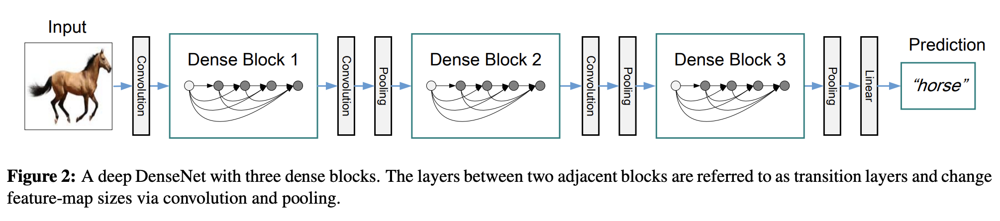
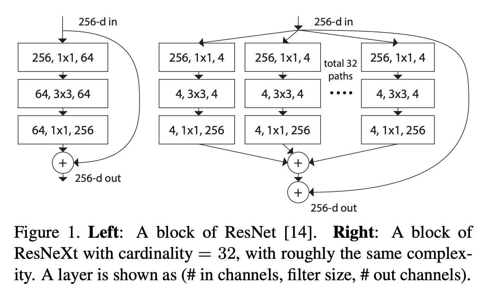
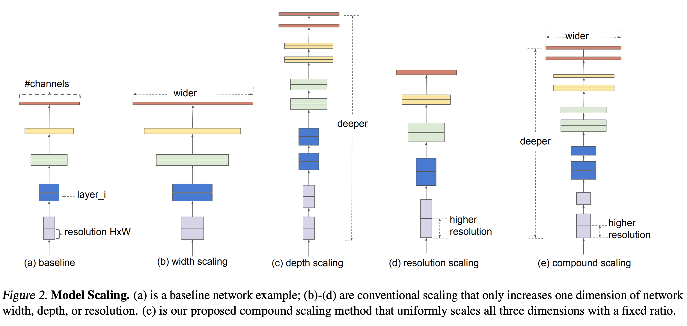
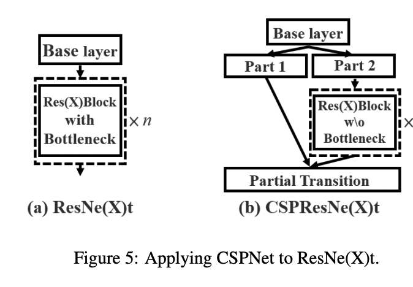
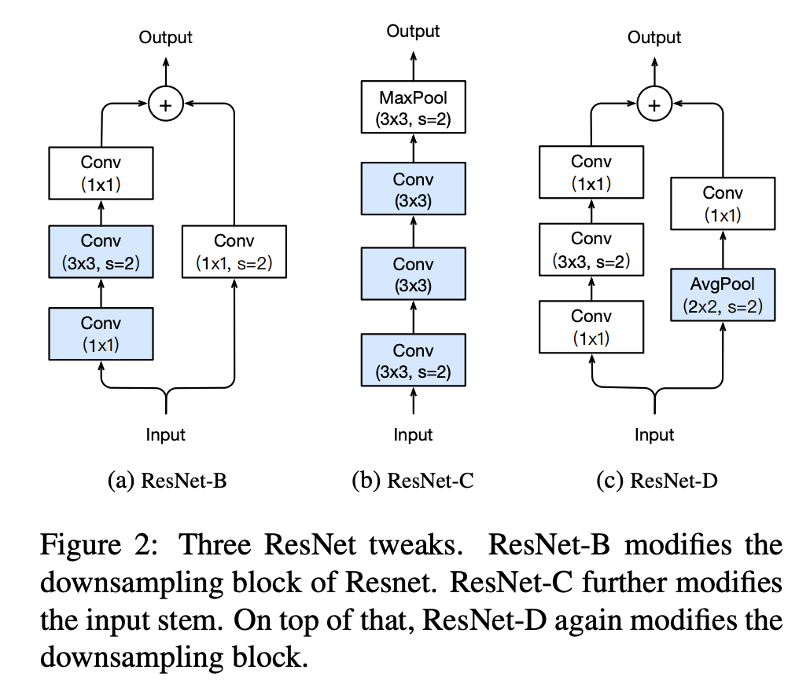
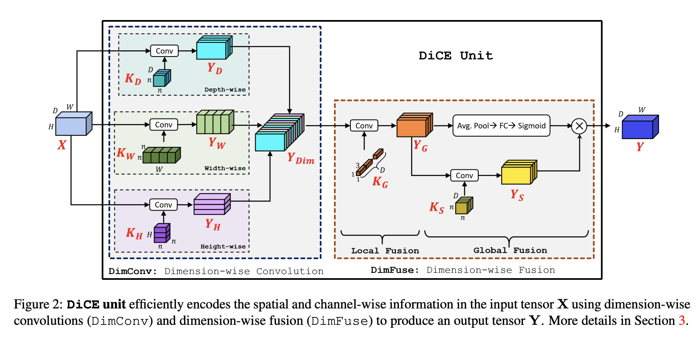
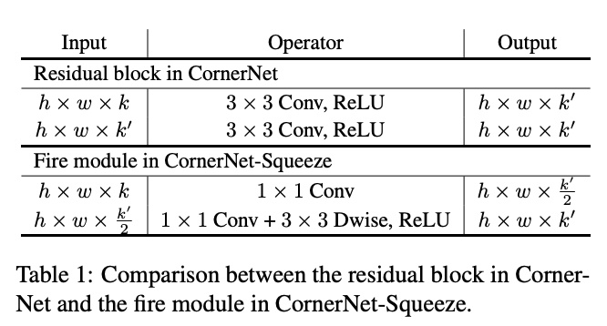
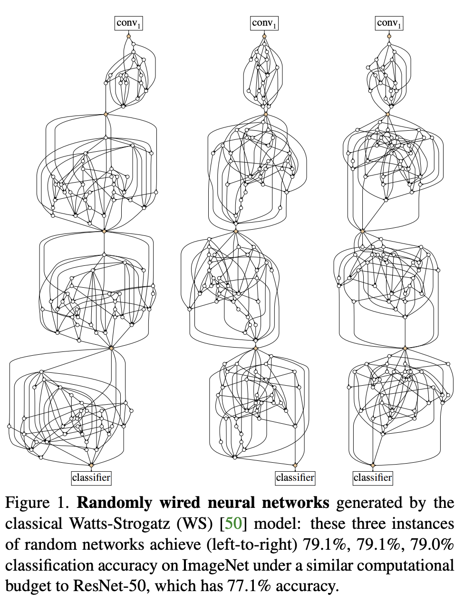

# [ResNet](https://paperswithcode.com/method/resnet)

**Residual Networks**, or **ResNets**, learn residual functions with reference to the layer inputs, instead of learning unreferenced functions. Instead of hoping each few stacked layers directly fit a desired underlying mapping, residual nets let these layers fit a residual mapping. They stack [residual blocks](https://paperswithcode.com/method/residual-block) ontop of each other to form network: e.g. a ResNet-50 has fifty layers using these blocks. 

Formally, denoting the desired underlying mapping as $\mathcal{H}(x)$, we let the stacked nonlinear layers fit another mapping of $\mathcal{F}(x):=\mathcal{H}(x)-x$. The original mapping is recast into $\mathcal{F}(x)+x$.

There is empirical evidence that these types of network are easier to optimize, and can gain accuracy from considerably increased depth.

source: [source](http://arxiv.org/abs/1512.03385v1)
# [AlexNet](https://paperswithcode.com/method/alexnet)

**AlexNet** is a classic convolutional neural network architecture. It consists of convolutions, max pooling and dense layers as the basic building blocks. Grouped convolutions are used in order to fit the model across two GPUs.

source: [source](http://papers.nips.cc/paper/4824-imagenet-classification-with-deep-convolutional-neural-networks)
# [VGG](https://paperswithcode.com/method/vgg)

**VGG** is a classical convolutional neural network architecture. It was based on an analysis of how to increase the depth of such networks. The network utilises small 3 x 3 filters. Otherwise the network is characterized by its simplicity: the only other components being pooling layers and a fully connected layer.

Image: [Davi Frossard](https://www.cs.toronto.edu/frossard/post/vgg16/)

source: [source](http://arxiv.org/abs/1409.1556v6)
# [DenseNet](https://paperswithcode.com/method/densenet)

A **DenseNet** is a type of convolutional neural network that utilises dense connections between layers, through [Dense Blocks](http://www.paperswithcode.com/method/dense-block), where we connect **all layers** (with matching feature-map sizes) directly with each other. To preserve the feed-forward nature, each layer obtains additional inputs from all preceding layers and passes on its own feature-maps to all subsequent layers.

source: [source](http://arxiv.org/abs/1608.06993v5)
# [GoogLeNet](https://paperswithcode.com/method/googlenet)

**GoogLeNet** is a type of convolutional neural network based on the [Inception](https://paperswithcode.com/method/inception-module) architecture. It utilises Inception modules, which allow the network to choose between multiple convolutional filter sizes in each block. An Inception network stacks these modules on top of each other, with occasional max-pooling layers with stride 2 to halve the resolution of the grid.

source: [source](http://arxiv.org/abs/1409.4842v1)
# [MobileNetV2](https://paperswithcode.com/method/mobilenetv2)

**MobileNetV2** is a convolutional neural network architecture that seeks to perform well on mobile devices. It is based on an inverted residual structure where the residual connections are between the bottleneck layers.  The intermediate expansion layer uses lightweight depthwise convolutions to filter features as a source of non-linearity. As a whole, the architecture of MobileNetV2 contains the initial fully convolution layer with 32 filters, followed by 19 residual bottleneck layers.

source: [source](http://arxiv.org/abs/1801.04381v4)
# [ResNeXt](https://paperswithcode.com/method/resnext)

A **ResNeXt** repeats a building block that aggregates a set of transformations with the same topology. Compared to a [ResNet](https://paperswithcode.com/method/resnet), it exposes a new dimension,  **cardinality** (the size of the set of transformations) $C$, as an essential factor in addition to the dimensions of depth and width. 

Formally, a set of aggregated transformations can be represented as: $\mathcal{F}(x)=\sum_{i=1}^{C}\mathcal{T}_i(x)$, where $\mathcal{T}_i(x)$ can be an arbitrary function. Analogous to a simple neuron, $\mathcal{T}_i$ should project $x$ into an (optionally low-dimensional) embedding and then transform it.

source: [source](http://arxiv.org/abs/1611.05431v2)
# [Xception](https://paperswithcode.com/method/xception)

**Xception** is a convolutional neural network architecture that relies solely on depthwise separable convolution layers. 

source: [source](http://openaccess.thecvf.com/content_cvpr_2017/html/Chollet_Xception_Deep_Learning_CVPR_2017_paper.html)
# [SqueezeNet](https://paperswithcode.com/method/squeezenet)

**SqueezeNet** is a convolutional neural network that employs design strategies to reduce the number of parameters, notably with the use of fire modules that "squeeze" parameters using 1x1 convolutions.

source: [source](http://arxiv.org/abs/1602.07360v4)
# [Inception-v3](https://paperswithcode.com/method/inception-v3)

**Inception-v3** is a convolutional neural network architecture from the Inception family that makes several improvements including using Label Smoothing, Factorized 7 x 7 convolutions, and the use of an auxiliary classifer to propagate label information lower down the network (along with the use of batch normalization for layers in the sidehead).

source: [source](http://arxiv.org/abs/1512.00567v3)
# [Darknet-53](https://paperswithcode.com/method/darknet-53)

**Darknet-53** is a convolutional neural network that acts as a backbone for the [YOLOv3](https://paperswithcode.com/method/yolov3) object detection approach. The improvements upon its predecessor include the use of residual connections, as well as more layers.

source: [source](http://arxiv.org/abs/1804.02767v1)
# [LeNet](https://paperswithcode.com/method/lenet)

**LeNet** is a classic convolutional neural network employing the use of convolutions.

# [Darknet-19](https://paperswithcode.com/method/darknet-19)

**Darknet-19** is a convolutional neural network that is used as the backbone of [YOLOv2](https://paperswithcode.com/method/yolov2).  Similar to the [VGG](https://paperswithcode.com/method/vgg) models it mostly uses $3 \times 3$ filters and doubles the number of channels after every pooling step. Following the work on Network in Network (NIN) it uses global average pooling to make predictions as well as $1 \times 1$ filters to compress the feature representation between $3 \times 3$ convolutions. Batch Normalization is used to stabilize training, speed up convergence, and regularize the model batch.

source: [source](http://arxiv.org/abs/1612.08242v1)
# [EfficientNet](https://paperswithcode.com/method/efficientnet)

**EfficientNet** is a convolutional neural network architecture and scaling method that uniformly scales all dimensions of depth/width/resolution using a **compound coefficient**. Unlike conventional practice that arbitrary scales  these factors, the EfficientNet scaling method uniformly scales network width, depth, and resolution with a set of fixed scaling coefficients. For example, if we want to use $2^N$ times more computational resources, then we can simply increase the network depth by $\alpha ^ N$,  width by $\beta ^ N$, and image size by $\gamma ^ N$, where $\alpha, \beta, \gamma$ are constant coefficients determined by a small grid search on the original small model. EfficientNet uses a compound coefficient $\phi$ to uniformly scales network width, depth, and resolution in a  principled way.

The compound scaling method is justified by the intuition that if the input image is bigger, then the network needs more layers to increase the receptive field and more channels to capture more fine-grained patterns on the bigger image.

The base EfficientNet-B0 network is based on the inverted bottleneck residual blocks of [MobileNetV2](https://paperswithcode.com/method/mobilenetv2), in addition to squeeze-and-excitation optimization.

source: [source](https://arxiv.org/abs/1905.11946v3)
# [MobileNetV1](https://paperswithcode.com/method/mobilenetv1)

**MobileNet** is a type of convolutional neural network designed for mobile and embedded vision applications. They are based on a streamlined architecture that uses depthwise separable convolutions to build light weight deep neural networks.

source: [source](http://arxiv.org/abs/1704.04861v1)
# [ShuffleNet](https://paperswithcode.com/method/shufflenet)

**ShuffleNet** is a convolutional neural network designed specially for mobile devices with very limited computing power. The architecture utilizes two new operations, pointwise group convolution and channel shuffle, to reduce computation cost while maintaining accuracy.

source: [source](http://arxiv.org/abs/1707.01083v2)
# [WideResNet](https://paperswithcode.com/method/wideresnet)

**Wide Residual Networks** are a variant on [ResNets](https://paperswithcode.com/method/resnet) where we decrease depth and increase the width of residual networks. This is achieved through the use of wide residual blocks.

source: [source](http://arxiv.org/abs/1605.07146v4)
# [SENet](https://paperswithcode.com/method/senet)

A **SENet** is a convolutional neural network architecture that employs squeeze-and-excitation blocks to enable the network to perform dynamic channel-wise feature recalibration.

source: [source](https://arxiv.org/abs/1709.01507v4)
# [ShuffleNet v2](https://paperswithcode.com/method/shufflenet-v2)

**ShuffleNet v2** is a convolutional neural network optimized for a direct metric (speed) rather than indirect metrics like FLOPs. It builds upon [ShuffleNet v1](https://paperswithcode.com/method/shufflenet), which utilised pointwise group convolutions, bottleneck-like structures, and a channel shuffle operation. Differences are shown in the Figure to the right.

source: [source](http://arxiv.org/abs/1807.11164v1)
# [Inception-ResNet-v2](https://paperswithcode.com/method/inception-resnet-v2)

**Inception-ResNet-v2** is a convolutional neural architecture that builds on the Inception family of architectures but incorporates [residual connections](https://paperswithcode.com/method/residual-connection) (replacing the filter concatenation stage of the Inception architecture).

source: [source](http://arxiv.org/abs/1602.07261v2)
# [MnasNet](https://paperswithcode.com/method/mnasnet)

**MnasNet** is a type of convolutional neural network optimized for mobile advices that is discovered through mobile neural architecture search, which explicitly incorporates model latency into the main objective so that the search can identify a model that achieves a good trade-off between accuracy and latency. The main building block is a inverted residual block (from [MobileNetV2](https://paperswithcode.com/method/mobilenetv2)).

source: [source](https://arxiv.org/abs/1807.11626v3)
# [MobileNetV3](https://paperswithcode.com/method/mobilenetv3)

**MobileNetV3** is a convolutional neural network that is tuned to mobile phone CPUs through a combination of hardware-aware network architecture search (NAS) complemented by the [NetAdapt](https://paperswithcode.com/method/netadapt) algorithm, and then subsequently improved through novel architecture advances. Advances include (1) complementary search techniques, (2) new efficient versions of nonlinearities practical for the mobile setting, (3) new efficient network design.

source: [source](https://arxiv.org/abs/1905.02244v5)
# [HRNet](https://paperswithcode.com/method/hrnet)

**HRNet**, or **High-Resolution Net**, is a general purpose convolutional neural network for tasks like semantic segmentation, object detection and image classification. It is able to maintain high resolution representations through the whole process. We start from a high-resolution convolution stream, gradually add high-to-low resolution convolution streams one by one, and connect the multi-resolution streams in parallel. The resulting network consists of several ($4$ in this paper) stages and
the $n$th stage contains $n$ streams corresponding to $n$ resolutions. We conduct repeated multi-resolution fusions by exchanging the information across the parallel streams over and over.

source: [source](https://arxiv.org/abs/1908.07919v2)
# [Inception v2](https://paperswithcode.com/method/inception-v2)

**Inception v2** is the second generation of Inception convolutional neural network architectures which notably uses batch normalization. Other changes include dropping dropout and removing local response normalization, due to the benefits of batch normalization.

source: [source](http://arxiv.org/abs/1502.03167v3)
# [OverFeat](https://paperswithcode.com/method/overfeat)

**OverFeat** is a classic type of convolutional neural network architecture.

source: [source](http://arxiv.org/abs/1312.6229v4)
# [PyramidNet](https://paperswithcode.com/method/pyramidnet)

A **PyramidNet** is a type of convolutional network where the key idea is to concentrate on the feature map dimension by increasing it gradually instead of by increasing it sharply at each residual unit with downsampling. In addition, the network architecture works as a mixture of both plain and residual networks by using zero-padded identity-mapping shortcut connections when increasing the feature map dimension.

source: [source](http://arxiv.org/abs/1610.02915v4)
# [FractalNet](https://paperswithcode.com/method/fractalnet)

**FractalNet** is a type of convolutional neural network that eschews [residual connections](https://paperswithcode.com/method/residual-connection) in favour of a "fractal" design. They involve repeated application of a simple expansion rule to generate deep networks whose structural layouts are precisely truncated fractals. These networks contain interacting subpaths of different lengths, but do not include any pass-through or residual connections; every internal signal is transformed by a filter and nonlinearity before being seen by subsequent layers.

source: [source](http://arxiv.org/abs/1605.07648v4)
# [DPN](https://paperswithcode.com/method/dpn)

A **Dual Path Network (DPN)** is a convolutional neural network which presents a new topology of connection paths internally. The intuition is that [ResNets](https://paperswithcode.com/method/resnet) enables feature re-usage while DenseNet enables new feature exploration, and both are important for learning good representations. To enjoy the benefits from both path topologies, Dual Path Networks share common features while maintaining the flexibility to explore new features through dual path architectures. 

We formulate such a dual path architecture as follows:

$$x^{k} = \sum\limits_{t=1}^{k-1} f_t^{k}(h^t) \text{,}  $$

$$
y^{k} = \sum\limits_{t=1}^{k-1} v_t(h^t) = y^{k-1} + \phi^{k-1}(y^{k-1}) \text{,} \\
$$

$$
r^{k} = x^{k} + y^{k} \text{,} \\
$$

$$
h^k = g^k \left( r^{k} \right) \text{,}
$$

where $x^{k}$ and $y^{k}$ denote the extracted information at $k$-th step from individual path, $v_t(\cdot)$ is a feature learning function as $f_t^k(\cdot)$. The first equation refers to the densely connected path that enables exploring new features. The second equation refers to the residual path that enables common features re-usage. The third equation defines the dual path that integrates them and feeds them to the last transformation function in the last equation.

source: [source](http://arxiv.org/abs/1707.01629v2)
# [Inception-v4](https://paperswithcode.com/method/inception-v4)

**Inception-v4** is a convolutional neural network architecture that builds on previous iterations of the Inception family by simplifying the architecture and using more inception modules than [Inception-v3](https://paperswithcode.com/method/inception-v3).

source: [source](http://arxiv.org/abs/1602.07261v2)
# [AmoebaNet](https://paperswithcode.com/method/amoebanet)

**AmoebaNet** is a convolutional neural network found through regularized evolution architecture search. The search space is NASNet, which specifies a space of image classifiers with a fixed outer structure: a feed-forward stack of [Inception-like modules](https://paperswithcode.com/method/inception-module) called cells. The discovered architecture is shown to the right.

source: [source](http://arxiv.org/abs/1802.01548v7)
# [RevNet](https://paperswithcode.com/method/revnet)

A **Reversible Residual Network**, or **RevNet**, is a variant of a [ResNet](https://paperswithcode.com/method/resnet) where each layer’s activations can be reconstructed exactly from the next layer’s. Therefore, the activations for most layers need not be stored in memory during backpropagation. The result is a network architecture whose activation storage requirements are independent of depth, and typically at least an order of magnitude smaller compared with equally sized ResNets.

RevNets are composed of a series of reversible blocks. Units in each layer are partitioned into two groups, denoted $x_{1}$ and $x_{2}$; the authors find what works best is partitioning the channels. Each reversible block takes inputs $\left(x_{1}, x_{2}\right)$ and produces outputs $\left(y_{1}, y_{2}\right)$ according to the following additive coupling rules – inspired the transformation in NICE (nonlinear independent components estimation) – and residual functions $F$ and $G$ analogous to those in standard ResNets:

$$y_{1} = x_{1} + F\left(x_{2}\right)$$
$$y_{2} = x_{2} + G\left(y_{1}\right)$$

Each layer’s activations can be reconstructed from the next layer’s activations as follows:

$$ x_{2} = y_{2} − G\left(y_{1}\right)$$
$$ x_{1} = y_{1} − F\left(x_{2}\right)$$

Note that unlike residual blocks, reversible blocks must have a stride of 1 because otherwise the layer
discards information, and therefore cannot be reversible. Standard ResNet architectures typically
have a handful of layers with a larger stride. If we define a RevNet architecture analogously, the
activations must be stored explicitly for all non-reversible layers.

source: [source](http://arxiv.org/abs/1707.04585v1)
# [DetNet](https://paperswithcode.com/method/detnet)

**DetNet** is a backbone convolutional neural network for object detection. Different from traditional pre-trained models for ImageNet classification, DetNet maintains the spatial resolution of the features even though extra stages are included. DetNet attempts to stay efficient by employing a low complexity dilated bottleneck structure.

source: [source](http://arxiv.org/abs/1804.06215v2)
# [MixNet](https://paperswithcode.com/method/mixnet)

**MixNet** is a type of convolutional neural network discovered via AutoML that utilises MixConvs instead of regular depthwise convolutions.

source: [source](https://arxiv.org/abs/1907.09595v3)
# [ZFNet](https://paperswithcode.com/method/zfnet)

**ZFNet** is a classic convolutional neural network. The design was motivated by visualizing intermediate feature layers and the operation of the classifier. Compared to [AlexNet](https://beta.paperswithcode.com/method/alexnet), the filter sizes are reduced and the stride of the convolutions are reduced.

source: [source](http://arxiv.org/abs/1311.2901v3)
# [PeleeNet](https://paperswithcode.com/method/peleenet)

**PeleeNet** is a convolutional neural network  and object detection backbone that is a variation of [DenseNet](https://paperswithcode.com/method/densenet) with optimizations to meet a memory and computational budget. Unlike competing networks, it does not use depthwise convolutions and instead relies on regular convolutions.

source: [source](http://papers.nips.cc/paper/7466-pelee-a-real-time-object-detection-system-on-mobile-devices)
# [SNet](https://paperswithcode.com/method/snet)

**SNet** is a convolutional neural network architecture and object detection backbone used for the [ThunderNet](https://paperswithcode.com/method/thundernet) two-stage object detector. SNet uses ShuffleNetV2 basic blocks but replaces all 3×3 depthwise convolutions with 5×5 depthwise convolutions.

source: [source](https://arxiv.org/abs/1903.11752v2)
# [SimpleNet](https://paperswithcode.com/method/simplenet)

**SimpleNet** is a convolutional neural network with 13 layers. The network employs a homogeneous design utilizing 3 × 3 kernels for convolutional layer and 2 × 2 kernels for pooling operations. The only layers which do not use 3 × 3 kernels are 11th and 12th layers, these layers, utilize 1 × 1 convolutional kernels. Feature-map down-sampling is carried out using nonoverlaping 2 × 2 max-pooling. In order to cope with the problem of vanishing gradient and also over-fitting, SimpleNet also uses batch-normalization with moving average fraction of 0.95 before any ReLU non-linearity.

source: [source](http://arxiv.org/abs/1608.06037v7)
# [SqueezeNeXt](https://paperswithcode.com/method/squeezenext)

**SqueezeNeXt** is a type of convolutional neural network that uses the [SqueezeNet](http://www.paperswithcode.com/squeezenet) architecture as a baseline, but makes a number of changes. First, a more aggressive channel reduction is used by incorporating a two-stage squeeze module. This significantly reduces the total number of parameters used with the 3×3 convolutions. Secondly, it uses separable 3 × 3 convolutions to further reduce the model size, and removes the additional 1×1 branch after the squeeze module. Thirdly, the network use an element-wise addition skip connection similar to that of [ResNet](http://www.paperswithcode.com/resnet) architecture.

source: [source](http://arxiv.org/abs/1803.10615v2)
# [FBNet](https://paperswithcode.com/method/fbnet)

**FBNet** is a type of convolutional neural architectures discovered through [DNAS](https://paperswithcode.com/method/dnas) neural architecture search.

source: [source](https://arxiv.org/abs/1812.03443v3)
# [Single-path NAS](https://paperswithcode.com/method/single-path-nas)

**Single-Path NAS** is a convolutional neural network architecture discovered through the Single-Path neural architecture search approach. The NAS utilises a single-path search space. Specifically, compared to previous differentiable  NAS methods, Single-Path NAS uses one single-path over-parameterized  ConvNet to encode all architectural decisions with shared convolutional kernel parameters. The approach is built upon the  observation that different candidate convolutional operations in NAS  can be viewed as subsets of a single superkernel. Without having to  choose among different paths/operations as in multi-path methods, we instead  solve the NAS problem as finding which subset of kernel weights to use in each ConvNet layer. By sharing the convolutional kernel weights,  we encode all candidate NAS operations into a single superkernel.

source: [source](http://arxiv.org/abs/1904.02877v1)
# [SpineNet](https://paperswithcode.com/method/spinenet)

**SpineNet** is a convolutional neural network backbone with scale-permuted intermediate features and cross-scale connections that is learned on an object detection task by Neural Architecture Search.

source: [source](https://arxiv.org/abs/1912.05027v3)
# [CSPDarknet53](https://paperswithcode.com/method/cspdarknet53)

**CSPDarknet53** is a convolutional neural network and backbone for object detection that uses [DarkNet-53](https://paperswithcode.com/method/darknet-53), and employs a CSPNet strategy to partition the feature map of the base layer into two parts and then merges them through a cross-stage hierarchy. The use of a split and merge strategy allows for more gradient flow through the network. It is used as the backbone for [YOLOv4](https://paperswithcode.com/method/yolov4).

source: [source](https://arxiv.org/abs/2004.10934v1)
# [ProxylessNet-CPU](https://paperswithcode.com/method/proxylessnet-cpu)

**ProxylessNet-CPU** is an image model learnt with the [ProxylessNAS](https://paperswithcode.com/method/proxylessnas) neural architecture search algorithm that is optimized for CPU devices.

source: [source](http://arxiv.org/abs/1812.00332v2)
# [Res2Net](https://paperswithcode.com/method/res2net)

**Res2Net** is an image model that employs a variation on bottleneck residual blocks. The motivation is to be able to represent features at multiple scales. This is achieved through a novel building block for CNNs that constructs hierarchical residual-like connections within one single residual block.
This represents multi-scale features at a granular level and increases the range of receptive fields for each network layer.

source: [source](https://arxiv.org/abs/1904.01169v2)
# [DenseNet-Elastic](https://paperswithcode.com/method/densenet-elastic)

**DenseNet-Elastic** is a convolutional neural network that is a modification of a [DenseNet](https://paperswithcode.com/method/densenet) with elastic blocks (extra upsampling and downsampling).

source: [source](http://arxiv.org/abs/1812.05262v2)
# [CSPResNeXt](https://paperswithcode.com/method/cspresnext)

**CSPResNeXt** is a convolutional neural network where we apply the Cross Stage Partial Network (CSPNet) approach to [ResNeXt](https://paperswithcode.com/method/resnext). The CSPNet partitions the feature map of the base layer into two parts and then merges them through a cross-stage hierarchy. The use of a split and merge strategy allows for more gradient flow through the network.

source: [source](https://arxiv.org/abs/1911.11929v1)
# [ProxylessNet-GPU](https://paperswithcode.com/method/proxylessnet-gpu)

**ProxylessNet-GPU** is a convolutional neural network architecture learnt with the [ProxylessNAS](https://paperswithcode.com/method/proxylessnas) neural architecture search algorithm that is optimized for GPU devices.

source: [source](http://arxiv.org/abs/1812.00332v2)
# [ResNet-D](https://paperswithcode.com/method/resnet-d)

**ResNet-D** is a modification on the [ResNet](https://paperswithcode.com/method/resnet) architecture that utilises an average pooling tweak for downsampling. The motivation is that in the unmodified ResNet, the 1 × 1 convolution for the downsampling block ignores 3/4 of input feature maps, so this is modified so no information will be ignored

source: [source](http://arxiv.org/abs/1812.01187v2)
# [VoVNetV2](https://paperswithcode.com/method/vovnetv2)

**VoVNetV2** is a convolutional neural network that improves upon [VoVNet](https://paperswithcode.com/method/vovnet) with two effective strategies: (1) residual connection for alleviating the optimization problem of larger VoVNets and (2) effective Squeeze-Excitation (eSE) dealing with the channel information loss problem of the original squeeze-and-excitation module.

source: [source](https://arxiv.org/abs/1911.06667v6)
# [VoVNet](https://paperswithcode.com/method/vovnet)

**VoVNet** is a convolutional neural network that seeks to make [DenseNet](https://paperswithcode.com/method/densenet) more efficient by concatenating all features only once in the last feature map, which makes input size constant and enables enlarging new output channel. In the Figure to the right, $F$ represents a convolution layer and $\otimes$ indicates concatenation.

source: [source](http://arxiv.org/abs/1904.09730v1)
# [McKernel](https://paperswithcode.com/method/mckernel)

McKernel introduces a framework to use kernel approximates in the mini-batch setting with Stochastic Gradient Descent (SGD) as an alternative to Deep Learning.

More information can be found [here](https://www.decurto.tw/c/iclr2020_DeCurto.pdf).

source: [source](http://arxiv.org/abs/1702.08159v9)
# [ProxylessNet-Mobile](https://paperswithcode.com/method/proxylessnet-mobile)

**ProxylessNet-Mobile** is a convolutional neural architecture learnt with the [ProxylessNAS](https://paperswithcode.com/method/proxylessnas) neural architecture search algorithm that is optimized for mobile devices.

source: [source](http://arxiv.org/abs/1812.00332v2)
# [CSPPeleeNet](https://paperswithcode.com/method/csppeleenet)

**CSPPeleeNet** is a convolutional neural network and object detection backbone  where we apply the Cross Stage Partial Network (CSPNet) approach to [PeleeNet](https://paperswithcode.com/method/peleenet). The CSPNet partitions the feature map of the base layer into two parts and then merges them through a cross-stage hierarchy. The use of a split and merge strategy allows for more gradient flow through the network.

source: [source](https://arxiv.org/abs/1911.11929v1)
# [MoGA-A](https://paperswithcode.com/method/moga-a)

**MoGA-A** is a convolutional neural network optimized for mobile latency and discovered via Mobile GPU-Aware (MoGA) neural architecture search.

source: [source](https://arxiv.org/abs/1908.01314v4)
# [MultiGrain](https://paperswithcode.com/method/multigrain)

**MultiGrain** is a type of image model that learns a single embedding for classes, instances and copies.  In other words, it is a convolutional neural network that is suitable for both image classification and instance retrieval. We learn MultiGrain by jointly training an image embedding for multiple tasks. The resulting representation is compact and can outperform narrowly-trained embeddings. The learned embedding output incorporates different levels of granularity.

source: [source](http://arxiv.org/abs/1902.05509v2)
# [RegNetX](https://paperswithcode.com/method/regnetx)

**RegNetX** is a convolutional network design space with simple, regular models with parameters: depth $d$, initial width $w_{0} &gt; 0$, and slope $w_{a} &gt; 0$, and generates a different block width $u_{j}$ for each block $j &lt; d$. The key restriction for the RegNet types of model is that there is a linear parameterisation of block widths (the design space only contains models with this linear structure):

$$ u_{j} = w_{0} + w_{a}\cdot{j} $$

For **RegNetX** we have additional restrictions: we set $b = 1$ (the bottleneck ratio), $12 \leq d \leq 28$, and $w_{m} \geq 2$ (the width multiplier).

source: [source](https://arxiv.org/abs/2003.13678v1)
# [GreedyNAS-B](https://paperswithcode.com/method/greedynas-b)

**GreedyNAS-B** is a convolutional neural network discovered using the [GreedyNAS](https://paperswithcode.com/method/greedynas) neural architecture search method. The basic building blocks used are inverted residual blocks (from [MobileNetV2](https://paperswithcode.com/method/mobilenetv2)) and squeeze-and-excitation blocks.

source: [source](https://arxiv.org/abs/2003.11236v1)
# [CSPDenseNet-Elastic](https://paperswithcode.com/method/cspdensenet-elastic)

**CSPDenseNet-Elastic** is a convolutional neural network and object detection backbone where we apply the Cross Stage Partial Network (CSPNet) approach to DenseNet-Elastic. The CSPNet partitions the feature map of the base layer into two parts and then merges them through a cross-stage hierarchy. The use of a split and merge strategy allows for more gradient flow through the network.

source: [source](https://arxiv.org/abs/1911.11929v1)
# [ECA-Net](https://paperswithcode.com/method/eca-net)

An **ECA-Net** is a type of convolutional neural network that utilises an Efficient Channel Attention module.

source: [source](https://arxiv.org/abs/1910.03151v4)
# [ResNeXt-Elastic](https://paperswithcode.com/method/resnext-elastic)

**ResNeXt-Elastic** is a convolutional neural network that is a modification of a [ResNeXt](https://paperswithcode.com/method/resnext) with elastic blocks (extra upsampling and downsampling).

source: [source](http://arxiv.org/abs/1812.05262v2)
# [SKNet](https://paperswithcode.com/method/sknet)

**SKNet** is a type of convolutional neural network that employs selective kernel units, with selective kernel convolutions, in its architecture. This allows for a type of attention where the network can learn to attend to different receptive fields.

source: [source](http://openaccess.thecvf.com/content_CVPR_2019/html/Li_Selective_Kernel_Networks_CVPR_2019_paper.html)
# [DenseNAS-B](https://paperswithcode.com/method/densenas-b)

**DenseNAS-B** is a mobile convolutional neural network discovered through the [DenseNAS](https://paperswithcode.com/method/densenas) neural architecture search method. The basic building block is MBConvs, or inverted bottleneck residuals, from the [MobileNet](https://paperswithcode.com/method/mobilenetv2) architectures.

source: [source](https://arxiv.org/abs/1906.09607v3)
# [Big-Little Net](https://paperswithcode.com/method/big-little-net)

**Big-Little Net** is a convolutional neural network architecture for learning multi-scale feature representations. This is achieved by using a multi-branch network, which has different computational complexity at different branches with different resolutions. Through frequent merging of features from branches at distinct scales, the model obtains multi-scale features while using less computation.

It consists of Big-Little Modules, which have two branches: each of which represents a separate block from a deep model and a less deep counterpart. The two branches are fused with linear combination + unit weights. These two branches are known as Big-Branch (more layers and channels at low resolutions) and Little-Branch (fewer layers and channels at high resolution).

source: [source](https://arxiv.org/abs/1807.03848v3)
# [CSPDenseNet](https://paperswithcode.com/method/cspdensenet)

**CSPDenseNet** is a convolutional neural network and object detection backbone where we apply the Cross Stage Partial Network (CSPNet) approach to [DenseNet](https://paperswithcode.com/method/densenet). The CSPNet partitions the feature map of the base layer into two parts and then merges them through a cross-stage hierarchy. The use of a split and merge strategy allows for more gradient flow through the network.

source: [source](https://arxiv.org/abs/1911.11929v1)
# [Assemble-ResNet](https://paperswithcode.com/method/assemble-resnet)

**Assemble-ResNet** is a modification to the [ResNet](https://paperswithcode.com/method/resnet) architecture with several tweaks including using ResNet-D, channel attention, anti-alias downsampling, and Big Little Networks.

source: [source](https://arxiv.org/abs/2001.06268v2)
# [GreedyNAS-C](https://paperswithcode.com/method/greedynas-c)

**GreedyNAS-C** is a convolutional neural network discovered using the [GreedyNAS](https://paperswithcode.com/method/greedynas) neural architecture search method. The basic building blocks used are inverted residual blocks (from [MobileNetV2](https://paperswithcode.com/method/mobilenetv2)) and squeeze-and-excitation blocks.

source: [source](https://arxiv.org/abs/2003.11236v1)
# [DetNASNet](https://paperswithcode.com/method/detnasnet)

**DetNASNet** is a convolutional neural network designed to be an object detection backbone and discovered through [DetNAS](https://paperswithcode.com/method/detnas) architecture search.

source: [source](https://arxiv.org/abs/1903.10979v4)
# [GreedyNAS-A](https://paperswithcode.com/method/greedynas-a)

**GreedyNAS-A** is a convolutional neural network discovered using the [GreedyNAS](https://paperswithcode.com/method/greedynas) neural architecture search method. The basic building blocks used are inverted residual blocks (from [MobileNetV2](https://paperswithcode.com/method/mobilenetv2)) and squeeze-and-excitation blocks.

source: [source](https://arxiv.org/abs/2003.11236v1)
# [GhostNet](https://paperswithcode.com/method/ghostnet)

A **GhostNet** is a type of convolutional neural network that is built using Ghost modules, which aim to generate more features by using fewer parameters (allowing for greater efficiency). 

GhostNet mainly consists of a stack of Ghost bottlenecks with the Ghost modules as the building block. The first layer is a standard convolutional layer with 16 filters, then a series of Ghost bottlenecks with gradually increased channels are followed. These Ghost bottlenecks are grouped into different stages according to the sizes of their input feature maps. All the Ghost bottlenecks are applied with stride=1 except that the last one in each stage is with stride=2. At last a global average pooling and a convolutional layer are utilized to transform the feature maps to a 1280-dimensional feature vector for final classification. The squeeze and excite (SE) module is also applied to the residual layer in some ghost bottlenecks. 

In contrast to MobileNetV3, GhostNet does not use hard-swish nonlinearity function due to its large latency.

source: [source](https://arxiv.org/abs/1911.11907v2)
# [ResNeSt](https://paperswithcode.com/method/resnest)

A **ResNest** is a variant on a [ResNet](https://paperswithcode.com/method/resnet), which instead stacks Split-Attention blocks. The cardinal group representations are then concatenated along the channel dimension: $V = \text{Concat}${$V^{1},V^{2},\cdots{V}^{K}$}. As in standard residual blocks, the final output $Y$ of otheur Split-Attention block is produced using a shortcut connection: $Y=V+X$, if the input and output feature-map share the same shape.  For blocks with a stride, an appropriate transformation $\mathcal{T}$ is applied to the shortcut connection to align the output shapes:  $Y=V+\mathcal{T}(X)$. For example, $\mathcal{T}$ can be strided convolution or combined convolution-with-pooling.

source: [source](https://arxiv.org/abs/2004.08955v1)
# [MoGA-B](https://paperswithcode.com/method/moga-b)

**MoGA-B** is a convolutional neural network optimized for mobile latency and discovered via Mobile GPU-Aware (MoGA) neural architecture search.

source: [source](https://arxiv.org/abs/1908.01314v4)
# [RegNetY](https://paperswithcode.com/method/regnety)

**RegNetY** is a convolutional network design space with simple, regular models with parameters: depth $d$, initial width $w_{0} &gt; 0$, and slope $w_{a} &gt; 0$, and generates a different block width $u_{j}$ for each block $j &lt; d$. The key restriction for the RegNet types of model is that there is a linear parameterisation of block widths (the design space only contains models with this linear structure):

$$ u_{j} = w_{0} + w_{a}\cdot{j} $$

For **RegNetX** we have additional restrictions: we set $b = 1$ (the bottleneck ratio), $12 \leq d \leq 28$, and $w_{m} \geq 2$ (the width multiplier).

For **RegNetY** we make one change, which is to include Squeeze-and-Excitation blocks.

source: [source](https://arxiv.org/abs/2003.13678v1)
# [PReLU-Net](https://paperswithcode.com/method/prelu-net)

**PReLU-Net** is a type of convolutional neural network that utilises parameterized ReLUs for its activation function. It also uses a robust initialization scheme - afterwards known as Kaiming or He initialization - that accounts for non-linear activation functions.

source: [source](http://arxiv.org/abs/1502.01852v1)
# [DiCENet](https://paperswithcode.com/method/dicenet)

**DiCENet** is a convolutional neural network architecture that utilizes dimensional convolutions (and dimension-wise fusion). The dimension-wise convolutions apply light-weight convolutional filtering across each dimension of the input tensor while dimension-wise fusion efficiently combines these dimension-wise representations; allowing the DiCE Unit in the network to efficiently encode spatial and channel-wise information contained in the input tensor.

source: [source](https://arxiv.org/abs/1906.03516v2)
# [ScaleNet](https://paperswithcode.com/method/scalenet)

**ScaleNet**, or a **Scale Aggregation Network**, is a type of convolutional neural network which learns a neuron allocation for aggregating multi-scale information in different building blocks of a deep network. The most informative output neurons in each block are preserved while others are discarded, and thus neurons for multiple scales are competitively and adaptively allocated. The scale aggregation (SA) block concatenates feature maps at a wide range of scales. Feature maps for each scale are generated by a stack of downsampling, convolution and upsampling operations.

source: [source](http://arxiv.org/abs/1904.09460v1)
# [DenseNAS-C](https://paperswithcode.com/method/densenas-c)

**DenseNAS-C** is a mobile convolutional neural network discovered through the [DenseNAS](https://beta.paperswithcode.com/method/densenas) neural architecture search method. The basic building block is MBConvs, or inverted bottleneck residuals, from the [MobileNet](https://beta.paperswithcode.com/method/mobilenetv2) architectures.

source: [source](https://arxiv.org/abs/1906.09607v3)
# [CornerNet-Squeeze Hourglass](https://paperswithcode.com/method/cornernet-squeeze-hourglass)

**CornerNet-Squeeze Hourglass** is a convolutional neural network and object detection backbone used in the [CornerNet-Squeeze](https://paperswithcode.com/method/cornernet-squeeze) object detector. It uses a modified hourglass module that makes use of a fire module: containing 1x1 convolutions and depthwise convolutions.

source: [source](http://arxiv.org/abs/1904.08900v1)
# [DenseNAS-A](https://paperswithcode.com/method/densenas-a)

**DenseNAS-A** is a mobile convolutional neural network discovered through the [DenseNAS](https://paperswithcode.com/method/densenas) neural architecture search method. The basic building block is MBConvs, or inverted bottleneck residuals, from the MobileNet architectures.

source: [source](https://arxiv.org/abs/1906.09607v3)
# [SPP-Net](https://paperswithcode.com/method/spp-net)

**SPP-Net** is a convolutional neural architecture that employs spatial pyramid pooling to remove the fixed-size constraint of the network. Specifically, we add an SPP layer on top of the last convolutional layer. The SPP layer pools the features and generates fixed-length outputs, which are then fed into the fully-connected layers (or other classifiers). In other words, we perform some information aggregation at a deeper stage of the network hierarchy (between convolutional layers and fully-connected layers) to avoid the need for cropping or warping at the beginning.

source: [source](http://arxiv.org/abs/1406.4729v4)
# [Harm-Net](https://paperswithcode.com/method/harm-net)

A **Harmonic Network**, or **Harm-Net**, is a type of convolutional neural network that replaces convolutional layers with "harmonic blocks" that use Discrete Cosine Transform (DCT) filters. These blocks can be useful in  truncating high-frequency information (possible due to the redundancies in the spectral domain).

source: [source](https://arxiv.org/abs/2001.06570v1)
# [MoGA-C](https://paperswithcode.com/method/moga-c)

**MoGA-C** is a convolutional neural network optimized for mobile latency and discovered via Mobile GPU-Aware (MoGA) neural architecture search.

source: [source](https://arxiv.org/abs/1908.01314v4)
# [SCARLET](https://paperswithcode.com/method/scarlet)

**SCARLET** is a type of convolutional neural architecture learnt by the [SCARLET-NAS](https://paperswithcode.com/method/scarlet-nas) neural architecture search method. The three variants are SCARLET-A, SCARLET-B and SCARLET-C.

source: [source](https://arxiv.org/abs/1908.06022v5)
# [RandWire](https://paperswithcode.com/method/randwire)

**RandWire** is a type of convolutional neural network that arise from randomly
wired neural networks that are sampled from stochastic network generators, in which a human-designed random
process defines generation. 

source: [source](http://arxiv.org/abs/1904.01569v2)
# [TResNet](https://paperswithcode.com/method/tresnet)

A **TResNet** is a variant on a [ResNet](https://paperswithcode.com/method/resnet) that aim to boost accuracy while maintaining GPU training and inference efficiency.  They contain several design tricks including a SpaceToDepth stem, Anti-Alias downsampling, In-Place Activated BatchNorm, Blocks selection and squeeze-and-excitation layers.

source: [source](https://arxiv.org/abs/2003.13630v2)
# [ESPNetv2](https://paperswithcode.com/method/espnetv2)

**ESPNetv2** is a convolutional neural network that utilises group point-wise and depth-wise dilated separable convolutions to learn representations from a large effective receptive field with fewer FLOPs and parameters.

source: [source](http://arxiv.org/abs/1811.11431v3)
# [LR-Net](https://paperswithcode.com/method/lr-net)

An **LR-Net** is a type of non-convolutional neural network that utilises local relation layers instead of convolutions for image feature extraction. Otherwise, the architecture follows the same design as a [ResNet](https://paperswithcode.com/method/resnet).

source: [source](https://arxiv.org/abs/1904.11491)
