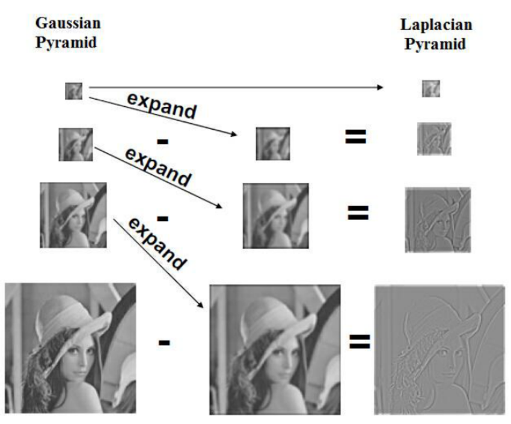

# [Laplacian Pyramid](https://paperswithcode.com/method/laplacian-pyramid)

A **Laplacian Pyramid** is a linear invertible image representation consisting of a set of band-pass
images, spaced an octave apart, plus a low-frequency residual. Formally, let $d\left(.\right)$ be a downsampling operation which blurs and decimates a $j \times j$ image $I$, so that $d\left(I\right)$ is a new image of size $j/2 \times j/2$. Also, let $u\left(.\right)$ be an upsampling operator which smooths and expands $I$ to be twice the size, so $u\left(I\right)$ is a new image of size $2j \times 2j$. We first build a Gaussian pyramid $G\left(I\right) = \left[I_{0}, I_{1}, \dots, I_{K}\right]$, where
$I_{0} = I$ and $I_{k}$ is $k$ repeated applications∗ of $d\left(.\right)$ to $I$. $K$ is the number of levels in the pyramid, selected so that the final level has very small spatial extent ($\leq 8 \times 8$ pixels).

The coefficients $h_{k}$ at each level $k$ of the Laplacian pyramid $L\left(I\right)$ are constructed by taking the difference between adjacent levels in the Gaussian pyramid, upsampling the smaller one with $u\left(.\right)$ so that the sizes are compatible:

$$ h_{k} = \mathcal{L}_{k}\left(I\right) = G_{k}\left(I\right) − u\left(G_{k+1}\left(I\right)\right) = I_{k} − u\left(I_{k+1}\right) $$

Intuitively, each level captures image structure present at a particular scale. The final level of the
Laplacian pyramid $h_{K}$ is not a difference image, but a low-frequency residual equal to the final
Gaussian pyramid level, i.e. $h_{K} = I{K}$. Reconstruction from a Laplacian pyramid coefficients
$\left[h_{1}, \dots, h_{K}\right]$ is performed using the backward recurrence:

$$ I_{k} = u\left(I_{k+1}\right) + h_{k} $$

which is started with $I_{K} = h_{K}$ and the reconstructed image being $I = I_{o}$. In other words, starting at the coarsest level, we repeatedly upsample and add the difference image h at the next finer level until we get back to the full resolution image.

Source: [LAPGAN](https://arxiv.org/pdf/1506.05751v1.pdf)

Image : [Design of FIR Filters for Fast Multiscale Directional Filter Banks](https://www.researchgate.net/figure/Relationship-between-Gaussian-and-Laplacian-Pyramids_fig2_275038450)

