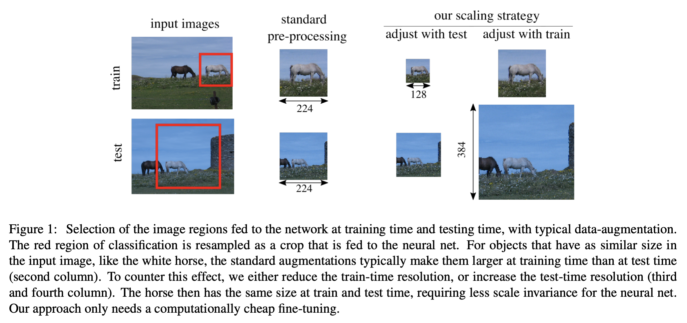

# [FixRes](https://paperswithcode.com/method/fixres)

**FixRes** is an image scaling strategy that seeks to optimize classifier performance. It is motivated by the observation that data augmentations induce a significant discrepancy between the size of the objects seen by the classifier at train and test time: in fact, a lower train resolution improves the classification at test time! FixRes is a simple strategy to optimize the classifier performance, that employs different train and test resolutions. The calibrations are: (a) calibrating the object sizes by adjusting the crop size and (b) adjusting statistics before spatial pooling.

source: [source](https://arxiv.org/abs/1906.06423v3)
