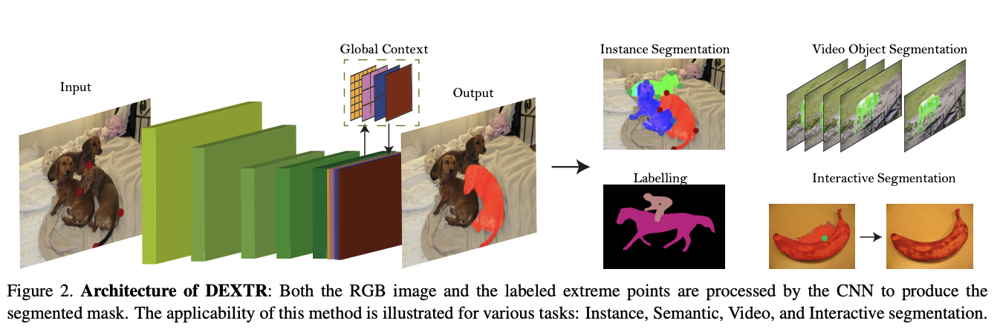

# [DEXTR](https://paperswithcode.com/method/dextr)

**DEXTR**, or **Deep Extreme Cut**, obtains an object segmentation from its four extreme points: the left-most, right-most, top, and bottom pixels. The annotated extreme points are given as a guiding signal to the input of the network. To this end, we create a heatmap with activations in the regions of extreme points. We center a 2D Gaussian around each of the points, in order to create a single heatmap. The heatmap is concatenated with the RGB channels of the input image, to form a 4-channel input for the CNN. In order to focus on the object of interest, the input is cropped by the bounding box, formed from the extreme point annotations. To include context on the resulting
crop, we relax the tight bounding box by several pixels. After the pre-processing step that comes exclusively from the extreme clicks, the input consists of an RGB crop including an object, plus its extreme points. 

ResNet-101 is chosen as backbone of the architecture. We remove the fully connected layers as well as the max pooling layers in the last two stages to preserve acceptable output resolution for dense prediction, and we introduce atrous convolutions in the last two stages to maintain the same receptive field. After the last ResNet-101 stage, we introduce a pyramid scene parsing module to aggregate global context to the final feature map. The output of the CNN is a probability map representing whether a pixel belongs to the object that we want to segment or not. The CNN is trained to minimize the standard cross entropy loss, which takes into account that different classes occur with different frequency in a dataset.

source: [source](http://arxiv.org/abs/1711.09081v2)
