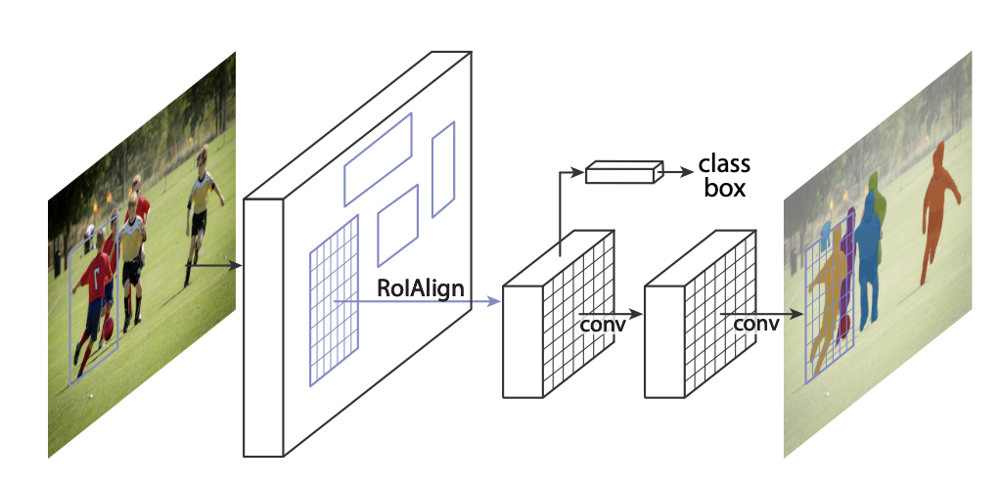
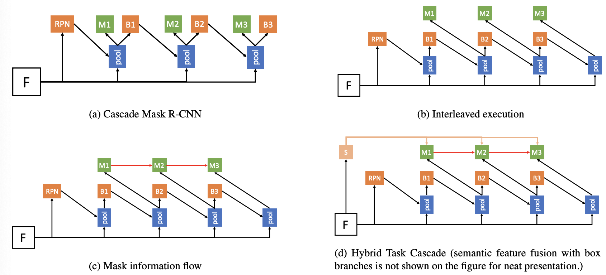

# [Mask R-CNN](https://paperswithcode.com/method/mask-r-cnn)

**Mask R-CNN** extends [Faster R-CNN](http://paperswithcode.com/method/faster-r-cnn) to solve instance segmentation tasks. It achieves this by adding a branch for predicting an object mask in parallel with the existing branch for bounding box recognition. In principle, Mask R-CNN is an intuitive extension of Faster R-CNN, but constructing the mask branch properly is critical for good results. 

Most importantly, Faster R-CNN was not designed for pixel-to-pixel alignment between network inputs and outputs. This is evident in how [RoIPool](http://paperswithcode.com/method/roi-pooling), the **de facto** core operation for attending to instances, performs coarse spatial quantization for feature extraction. To fix the misalignment, Mask R-CNN utilises a simple, quantization-free layer, called [RoIAlign](http://paperswithcode.com/method/roi-align), that faithfully preserves exact spatial locations. 

Secondly, Mask R-CNN **decouples** mask and class prediction: it predicts a binary mask for each class independently, without competition among classes, and relies on the network's RoI classification branch to predict the category. In contrast, an [FCN](http://paperswithcode.com/method/fcn) usually perform per-pixel multi-class categorization, which couples segmentation and classification.

source: [source](http://arxiv.org/abs/1703.06870v3)
# [Cascade Mask R-CNN](https://paperswithcode.com/method/cascade-mask-r-cnn)

**Cascade Mask R-CNN** extends Cascade R-CNN to instance segmentation, by adding a
mask head to the cascade.

In the Mask R-CNN, the segmentation branch is inserted in parallel to the detection branch. However, the Cascade R-CNN has multiple detection branches. This raises the questions of 1) where to add the segmentation branch and 2) how many segmentation branches to add. The authors consider three strategies for mask prediction in the Cascade R-CNN. The first two strategies address the first question, adding a single mask prediction head at either the first or last stage of the Cascade R-CNN. Since the instances used to train the segmentation branch are the positives of the detection branch, their number varies in these two strategies. Placing the segmentation head later on the cascade leads to more examples. However, because segmentation is a pixel-wise operation, a large number of highly overlapping instances is not necessarily as helpful as for object detection, which is a patch-based operation. The third strategy addresses the second question, adding a segmentation branch to each
cascade stage. This maximizes the diversity of samples used to learn the mask prediction task. 

At inference time, all three strategies predict the segmentation masks on the patches produced by the final object detection stage, irrespective of the cascade stage on which the segmentation mask is implemented and how many segmentation branches there are.

source: [source](http://arxiv.org/abs/1712.00726v1)
# [PANet](https://paperswithcode.com/method/panet)

**Path Aggregation Network**, or **PANet**, aims to boost information flow in a proposal-based instance segmentation framework. Specifically, the feature hierarchy is enhanced with accurate localization signals in lower layers by bottom-up path augmentation, which shortens the information path between lower layers and topmost feature. Additionally, adaptive feature pooling is employed, which links feature grid and all feature levels to make useful information in each feature level propagate directly to following proposal subnetworks. A complementary branch capturing different views for each proposal is created to further improve mask prediction.

source: [source](http://arxiv.org/abs/1803.01534v4)
# [HTC](https://paperswithcode.com/method/htc)

**Hybrid Task Cascade**, or **HTC**, is a framework for cascading in instance segmentation. It differs from Cascade Mask R-CNN in two important aspects:  (1) instead of performing cascaded refinement on the two tasks of detection and segmentation separately, it interweaves them for a joint multi-stage processing; (2) it adopts a fully convolutional branch to provide spatial context, which can help distinguishing hard
foreground from cluttered background.

source: [source](http://arxiv.org/abs/1901.07518v2)
# [CenterMask](https://paperswithcode.com/method/centermask)

**CenterMask** is an anchor-free instance segmentation method that adds a novel spatial attention-guided mask (SAG-Mask) branch to anchor-free one stage object detector (FCOS) in the same vein with Mask R-CNN. Plugged into the FCOS object detector, the SAG-Mask branch predicts a segmentation mask on each detected box with the spatial attention map that helps to focus on informative pixels and suppress noise.

source: [source](https://arxiv.org/abs/1911.06667v6)
# [GCNet](https://paperswithcode.com/method/gcnet)

A **Global Context Network**, or **GCNet**, utilises global context blocks to model long-range dependencies in images. It is based on the [Non-Local Network](https://paperswithcode.com/method/non-local-block), but it modifies the architecture so less computation is required. Global context blocks are applied to multiple layers in a backbone network to construct the GCNet.

source: [source](http://arxiv.org/abs/1904.11492v1)
