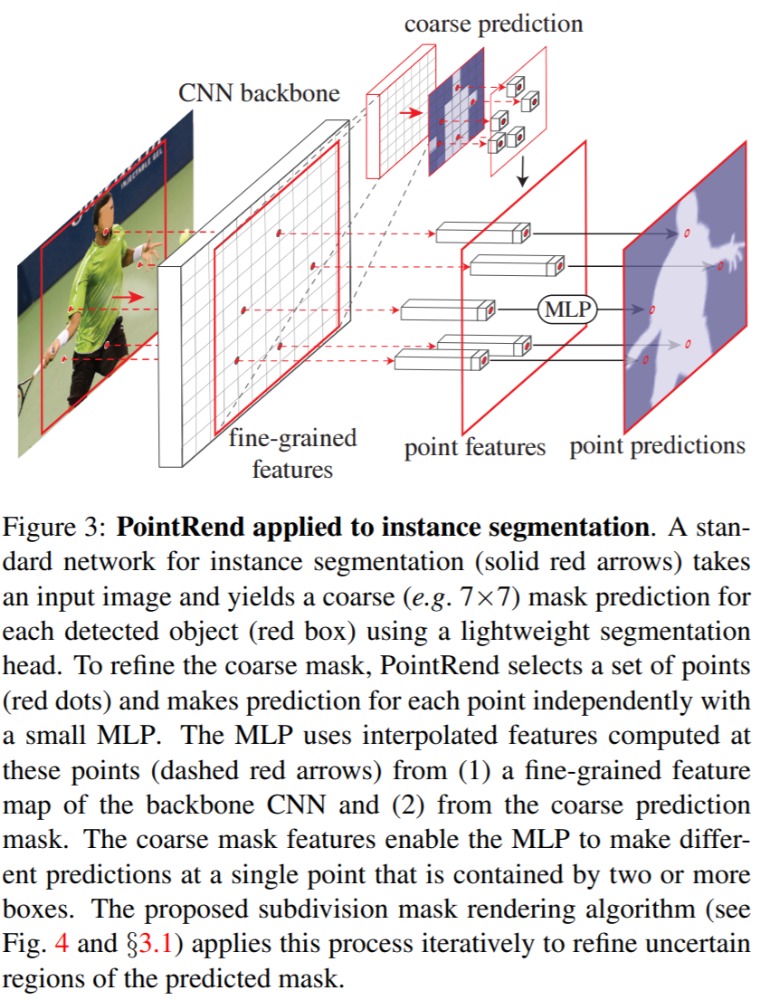

# [PointRend](https://paperswithcode.com/method/pointrend)

**PointRend** is a module for image segmentation tasks, such as instance and semantic segmentation, that attempts to treat segmentation as image rending problem to efficiently "render" high-quality label maps. It uses a subdivision strategy to adaptively select a non-uniform set of points at which to compute labels. PointRend can be incorporated into popular meta-architectures for both instance segmentation (e.g. [Mask R-CNN](https://paperswithcode.com/method/mask-r-cnn)) and semantic segmentation (e.g. [FCN](https://paperswithcode.com/method/fcn)). Its subdivision strategy efficiently computes high-resolution segmentation maps using an order of magnitude fewer floating-point operations than direct, dense computation.

PointRend is a general module that admits many possible implementations. Viewed abstractly, a PointRend module accepts one or more typical CNN feature maps $f\left(x_{i}, y_{i}\right)$ that are defined over regular grids, and outputs high-resolution predictions $p\left(x^{'}_{i}, y^{'}_{i}\right)$ over a finer grid. Instead of making excessive predictions over all points on the output grid, PointRend makes predictions only on carefully selected points. To make these predictions, it extracts a point-wise feature representation for the selected points by interpolating $f$, and uses a small point head subnetwork to predict output labels from the point-wise features.

source: [source](https://arxiv.org/abs/1912.08193v2)
