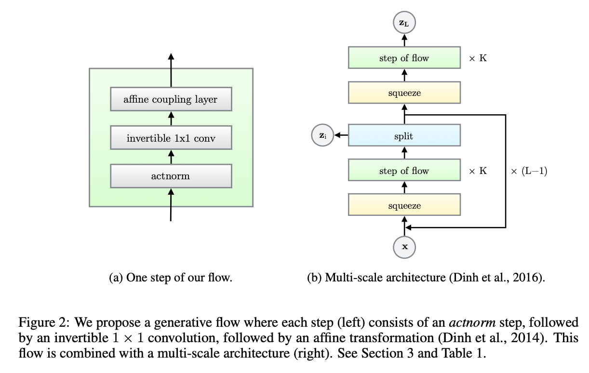
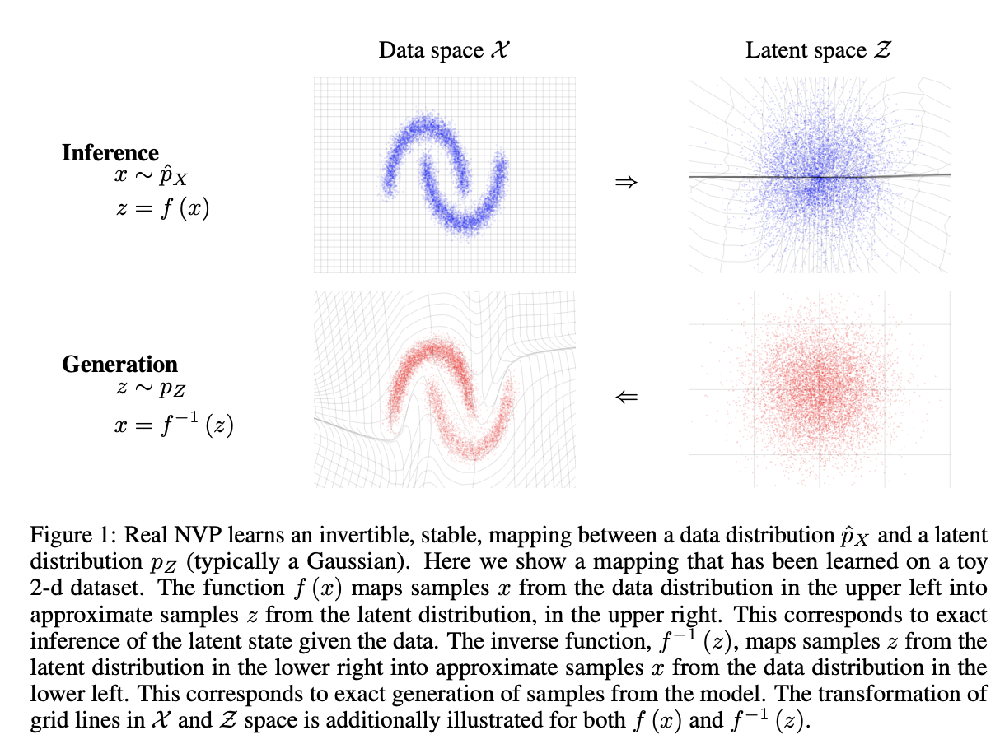
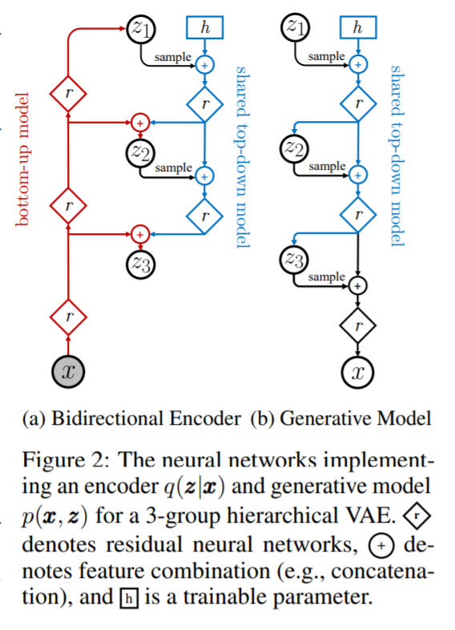

# [VAE](https://paperswithcode.com/method/vae)

A **Variational Autoencoder** is a type of likelihood-based generative model. It consists of an encoder, that takes in data $x$ as input and transforms this into a latent representation $z$,  and a decoder, that takes a latent representation $z$ and returns a reconstruction $\hat{x}$. Inference is performed via variational inference to approximate the posterior of the model.

source: [source](http://arxiv.org/abs/1312.6114v10)
# [PixelCNN](https://paperswithcode.com/method/pixelcnn)

A **PixelCNN** is a generative model that uses autoregressive connections to model images pixel by pixel, decomposing the joint image distribution as a product of conditionals. PixelCNNs are much faster to train than [PixelRNNs](https://paperswithcode.com/method/pixelrnn) because convolutions are inherently easier to parallelize; given the vast number of pixels present in large image datasets this is an important advantage.

source: [source](http://arxiv.org/abs/1606.05328v2)
# [VQ-VAE](https://paperswithcode.com/method/vq-vae)

**VQ-VAE** is a type of variational autoencoder that uses vector quantisation to obtain a discrete latent representation. It differs from [VAEs](https://paperswithcode.com/method/vae) in two key ways: the encoder network outputs discrete, rather than continuous, codes; and the prior is learnt rather than static. In order to learn a discrete latent representation, ideas from vector quantisation (VQ) are incorporated. Using the VQ method allows the model to circumvent issues of posterior collapse - where the latents are ignored when they are paired with a powerful autoregressive decoder - typically observed in the VAE framework. Pairing these representations with an autoregressive prior, the model can generate high quality images, videos, and speech as well as doing high quality speaker conversion and unsupervised learning of phonemes.

source: [source](http://arxiv.org/abs/1711.00937v2)
# [GLOW](https://paperswithcode.com/method/glow)

**GLOW** is a type of flow-based generative model that is based on an invertible $1 \times 1$ convolution. This builds on the flows introduced by [NICE](https://paperswithcode.com/method/nice) and [RealNVP](https://paperswithcode.com/method/realnvp). It consists of a series of steps of flow, combined in a multi-scale architecture; see the Figure to the right. Each step of flow consists of Act Normalization followed by an **invertible $1 \times 1$ convolution** followed by an affine coupling layer.

source: [source](http://arxiv.org/abs/1807.03039v2)
# [Beta-VAE](https://paperswithcode.com/method/beta-vae)

**Beta-VAE** is a type of variational autoencoder that seeks to discovered disentangled latent factors. It modifies [VAEs](https://paperswithcode.com/method/vae) with an adjustable hyperparameter $\beta$ that balances latent channel capacity and independence constraints with reconstruction accuracy. The idea is to maximize the probability of generating the real data while keeping the distance between the real and estimated distributions small, under a threshold $\epsilon$. We can use the Kuhn-Tucker conditions to write this as a single equation:

$$ \mathcal{F}\left(\theta, \phi, \beta; \mathbf{x}, \mathbf{z}\right) = \mathbb{E}_{q_{\phi}\left(\mathbf{z}|\mathbf{x}\right)}\left[\log{p}_{\theta}\left(\mathbf{x}\mid\mathbf{z}\right)\right] - \beta\left[D_{KL}\left(\log{q}_{\theta}\left(\mathbf{z}\mid\mathbf{x}\right)||p\left(\mathbf{z}\right)\right) - \epsilon\right]$$

where the KKT multiplier $\beta$ is the regularization coefficient that constrains the capacity of the latent channel $\mathbf{z}$ and puts implicit independence pressure on the learnt posterior due to the isotropic nature of the Gaussian prior $p\left(\mathbf{z}\right)$.

We write this again using the complementary slackness assumption to get the Beta-VAE formulation:

$$ \mathcal{F}\left(\theta, \phi, \beta; \mathbf{x}, \mathbf{z}\right) \geq  \mathcal{L}\left(\theta, \phi, \beta; \mathbf{x}, \mathbf{z}\right) = \mathbb{E}_{q_{\phi}\left(\mathbf{z}|\mathbf{x}\right)}\left[\log{p}_{\theta}\left(\mathbf{x}\mid\mathbf{z}\right)\right] - \beta{D}_{KL}\left(\log{q}_{\theta}\left(\mathbf{z}\mid\mathbf{x}\right)||p\left(\mathbf{z}\right)\right)$$

source: [source](https://openreview.net/forum?id=Sy2fzU9gl)
# [RealNVP](https://paperswithcode.com/method/realnvp)

**RealNVP** is a generative model that utilises real-valued non-volume preserving (real NVP) transformations for density estimation. The model can perform efficient and exact inference, sampling and log-density estimation of data points.

source: [source](http://arxiv.org/abs/1605.08803v3)
# [PixelRNN](https://paperswithcode.com/method/pixelrnn)

**PixelRNNs** are generative neural networks that sequentially predicts the pixels in an image along the two spatial dimensions. They model the discrete probability of the raw pixel values and encode the complete set of dependencies in the image. Variants include the Row LSTM and the Diagonal BiLSTM, that scale more easily to larger datasets. Pixel values are treated as discrete random variables by using a softmax layer in the conditional distributions. Masked convolutions are employed to allow PixelRNNs to model full dependencies between the color channels.

source: [source](http://arxiv.org/abs/1601.06759v3)
# [VQ-VAE-2](https://paperswithcode.com/method/vq-vae-2)

**VQ-VAE-2** is a type of variational autoencoder that combines a a two-level hierarchical VQ-VAE with a self-attention autoregressive model ([PixelCNN](https://paperswithcode.com/method/pixelcnn)) as a prior. The encoder and decoder architectures are kept simple and light-weight as in the original [VQ-VAE](https://paperswithcode.com/method/vq-vae), with the only difference that hierarchical multi-scale latent maps are used for increased resolution.

source: [source](https://arxiv.org/abs/1906.00446v1)
# [NICE](https://paperswithcode.com/method/nice)

**NICE**, or **Non-Linear Independent Components Estimation** is a framework for modeling complex high-dimensional densities. It is based on the idea that a good representation is one in which the data has a distribution that is easy to model. For this purpose, a non-linear deterministic transformation of the data is learned that maps it to a latent space so as to make the transformed data conform to a factorized distribution, i.e., resulting in independent latent variables.  The transformation is parameterised so that computing the determinant of the Jacobian and inverse Jacobian is trivial, yet it maintains the ability to learn complex non-linear transformations, via a composition of simple building blocks, each based on a deep neural network. The training criterion is simply the exact log-likelihood. The transformation used in NICE is the affine coupling layer without the scale term, known as additive coupling layer:

$$ y_{I_{2}} = x_{I_{2}} + m\left(x_{I_{1}}\right) $$

$$ x_{I_{2}} = y_{I_{2}} + m\left(y_{I_{1}}\right) $$

source: [source](http://arxiv.org/abs/1410.8516v6)
# [NVAE](https://paperswithcode.com/method/nvae)

**NVAE**, or **Nouveau VAE**, is deep, hierarchical variational autoencoder. It can be trained with the original [VAE](https://paperswithcode.com/method/vae) objective, unlike alternatives such as [VQ-VAE-2](https://paperswithcode.com/method/vq-vae-2). NVAE’s design focuses on tackling two main challenges: (i) designing expressive neural
networks specifically for VAEs, and (ii) scaling up the training to a large number of hierarchical
groups and image sizes while maintaining training stability.

To tackle long-range correlations in the data, the model employs hierarchical multi-scale modelling. The generative model starts from a small spatially arranged latent variables as $\mathbf{z}_{1}$ and samples from the hierarchy group-by-group while gradually doubling the spatial dimensions. This multi-scale approach enables NVAE to capture global long-range correlations at the top of the hierarchy and local fine-grained dependencies at the lower groups.

Additional design choices include the use of residual cells for the generative models and the encoder, which employ a number of tricks and modules to achieve good performance, and the use of residual normal distributions to smooth optimization. See the components section for more details.

source: [source](https://arxiv.org/abs/2007.03898v1)
