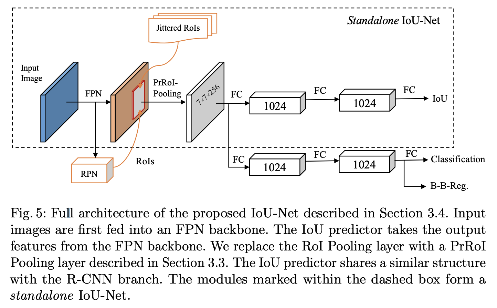

# [IoU-Net](https://paperswithcode.com/method/iou-net)

**IoU-Net** is an object detection architecture that introduces localization confidence. IoU-Net learns to predict the IoU between each detected bounding box and the matched ground-truth. The network acquires this confidence of localization, which improves the NMS procedure by preserving accurately localized bounding boxes. Furthermore, an optimization-based bounding box refinement method is proposed, where the predicted IoU is formulated as the objective.

source: [source](http://arxiv.org/abs/1807.11590v1)
