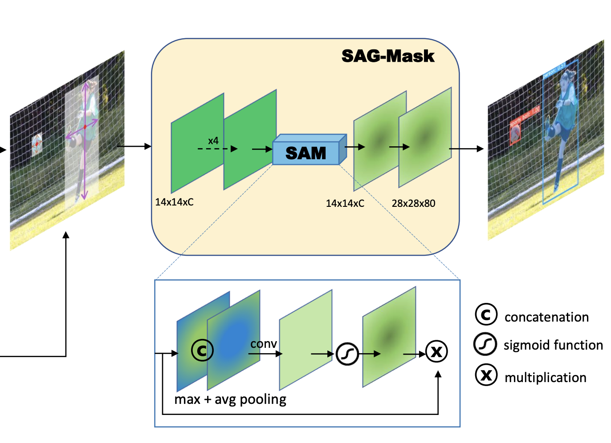

# [Spatial Attention-Guided Mask](https://paperswithcode.com/method/spatial-attention-guided-mask)

**A Spatial Attention-Guided Mask** predicts a segmentation mask on each detected box with a spatial attention map that helps to focus on informative pixels and suppress noise. The goal is to guide the mask head for spotlighting meaningful pixels and repressing uninformative ones. 

Once features inside the predicted RoIs are extracted by RoI Align with 14×14 resolution, those features are fed into four conv layers and the spatial attention module (SAM) sequentially. To exploit the spatial attention map $A_{sag}\left(X_{i}\right) \in \mathcal{R}^{1\times{W}\times{H}}$ as a feature descriptor given input feature map $X_{i} \in \mathcal{R}^{C×W×H}$, the SAM first generates pooled features $P_{avg}, P_{max} \in \mathcal{R}^{1\times{W}\times{H}}$ by both average and max pooling operations respectively along the channel axis and aggregates them via concatenation. Then it is followed by a 3 × 3 conv layer and normalized by the sigmoid function. The computation process
is summarized as follow:

$$
A_{sag}\left(X_{i}\right) = \sigma\left(F_{3\times{3}}(P_{max} \cdot P_{avg})\right)
$$

where $\sigma$ denotes the sigmoid function, $F_{3\times{3}}$ is 3 × 3 conv layer and $\cdot$ represents concatenate operation. Finally, the attention guided feature map $X_{sag} ∈ \mathcal{R}^{C\times{W}\times{H}}$ is computed as:

$$
X_{sag} = A_{sag}\left(X_{i}\right) \otimes X_{i}
$$

where ⊗ denotes element-wise multiplication. After then, a 2 × 2 deconv upsamples the spatially attended feature map to 28 × 28 resolution. Lastly, a 1 × 1 conv is applied for predicting class-specific masks.

source: [source](https://arxiv.org/abs/1911.06667v6)
