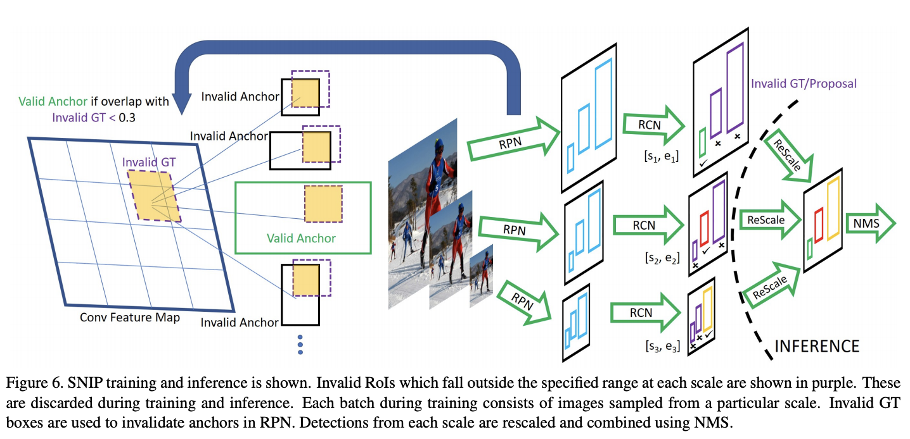
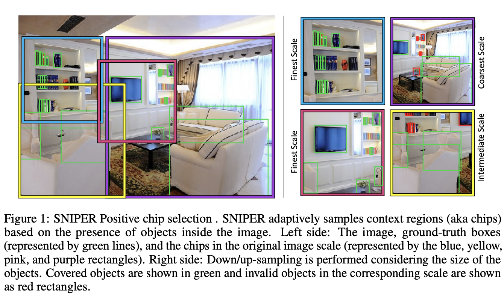

# [SNIP](https://paperswithcode.com/method/snip)

**SNIP**, or **Scale Normalization for Image Pyramids**, is a multi-scale training scheme that selectively back-propagates the gradients of object instances of different sizes as a function of the image scale. SNIP is a modified version of MST where only the object instances that have a resolution close to the pre-training dataset, which is typically 224x224, are used for training the detector. In multi-scale training (MST), each image is observed at different resolutions therefore, at a high resolution (like 1400x2000) large objects are hard to classify and at a low resolution (like 480x800) small objects are hard to classify. Fortunately, each object instance appears at several different scales and some of those appearances fall in the desired scale range. In order to eliminate extreme scale objects, either too large or too small, training is only performed on objects that fall in the desired scale range and the remainder are simply ignored during back-propagation. Effectively, SNIP uses all the object instances during training, which helps capture all the variations in appearance and
pose, while reducing the domain-shift in the scale-space for the pre-trained network.

source: [source](http://arxiv.org/abs/1711.08189v2)
# [SNIPER](https://paperswithcode.com/method/sniper)

**SNIPER** is a multi-scale training approach for instance-level recognition tasks like object detection and instance-level segmentation. Instead of processing all pixels in an image pyramid, SNIPER selectively processes context regions around the ground-truth objects (a.k.a chips). This can help to speed up multi-scale training as it operates on low-resolution chips. Due to its memory-efficient design, SNIPER can benefit from Batch Normalization during training and it makes larger batch-sizes possible for instance-level recognition tasks on a single GPU.

source: [source](http://arxiv.org/abs/1805.09300v3)
