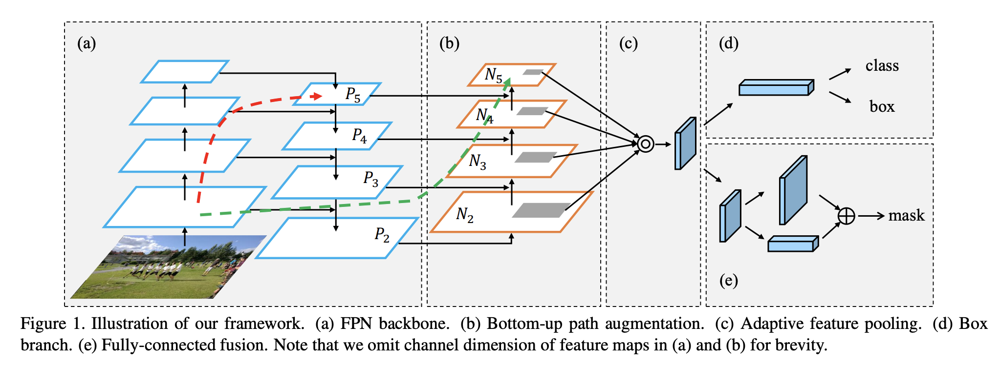
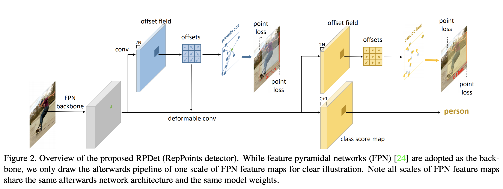
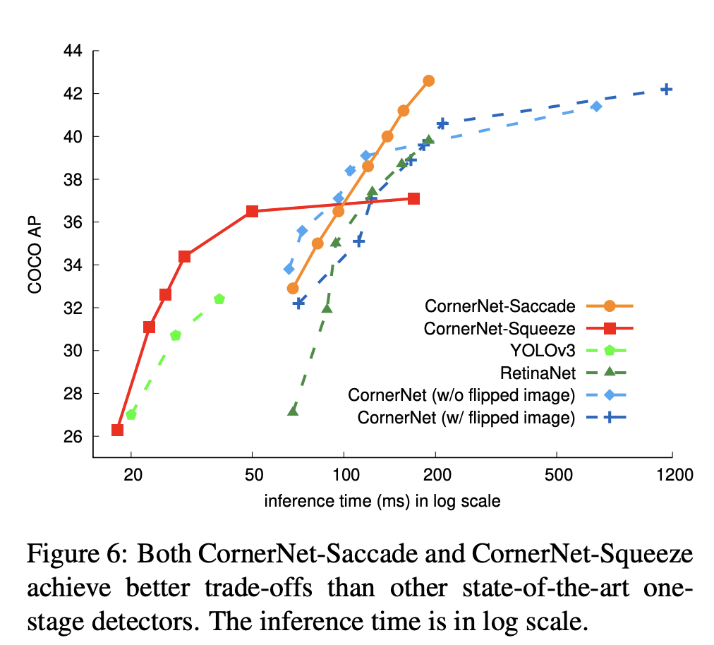

# [Faster R-CNN](https://paperswithcode.com/method/faster-r-cnn)

**Faster R-CNN** is an object detection model that improves on [Fast R-CNN](https://paperswithcode.com/method/fast-r-cnn) by utilising a region proposal network ([RPN](https://paperswithcode.com/method/rpn)) into the CNN model. The Region Proposal Network (RPN) shares full-image convolutional features with the detection network, enabling nearly cost-free region proposals. 

An RPN is a fully convolutional network that simultaneously predicts object bounds and objectness scores at each position. The RPN is trained end-to-end to generate high-quality region proposals, which are used by [Fast R-CNN](https://paperswithcode.com/method/fast-r-cnn) for detection. RPN and Fast R-CNN are merged into a single network by sharing their convolutional features: the RPN component tells the unified network where to look.

As a whole, Faster R-CNN consists of two modules. The first module is a deep fully convolutional network that proposes regions, and the second module is the Fast R-CNN detector that uses the proposed regions.

source: [source](http://arxiv.org/abs/1506.01497v3)
# [Mask R-CNN](https://paperswithcode.com/method/mask-r-cnn)

**Mask R-CNN** extends [Faster R-CNN](http://paperswithcode.com/method/faster-r-cnn) to solve instance segmentation tasks. It achieves this by adding a branch for predicting an object mask in parallel with the existing branch for bounding box recognition. In principle, Mask R-CNN is an intuitive extension of Faster R-CNN, but constructing the mask branch properly is critical for good results. 

Most importantly, Faster R-CNN was not designed for pixel-to-pixel alignment between network inputs and outputs. This is evident in how [RoIPool](http://paperswithcode.com/method/roi-pooling), the **de facto** core operation for attending to instances, performs coarse spatial quantization for feature extraction. To fix the misalignment, Mask R-CNN utilises a simple, quantization-free layer, called [RoIAlign](http://paperswithcode.com/method/roi-align), that faithfully preserves exact spatial locations. 

Secondly, Mask R-CNN **decouples** mask and class prediction: it predicts a binary mask for each class independently, without competition among classes, and relies on the network's RoI classification branch to predict the category. In contrast, an [FCN](http://paperswithcode.com/method/fcn) usually perform per-pixel multi-class categorization, which couples segmentation and classification.

source: [source](http://arxiv.org/abs/1703.06870v3)
# [SSD](https://paperswithcode.com/method/ssd)

**SSD** is a single-stage object detection method that discretizes the output space of bounding boxes into a set of default boxes over different aspect ratios and scales per feature map location. At prediction time, the network generates scores for the presence of each object category in each default box and produces adjustments to the box to better match the object shape. Additionally, the network combines predictions from multiple feature maps with different resolutions to naturally handle objects of various sizes. The fundamental improvement in speed comes from eliminating bounding box proposals and the subsequent pixel or feature resampling stage. Improvements over competing single-stage methods include using a small convolutional filter to predict object categories and offsets in bounding box locations, using separate predictors (filters) for different aspect ratio detections, and applying these filters to multiple feature maps from the later stages of a network in order to perform detection at multiple scales.

source: [source](http://arxiv.org/abs/1512.02325v5)
# [RetinaNet](https://paperswithcode.com/method/retinanet)

**RetinaNet** is a one-stage object detection model that utilizes a focal loss function to address class imbalance during training. Focal loss applies a modulating term to the cross entropy loss in order to focus learning on hard negative examples. RetinaNet is a single, unified network composed of a **backbone** network and two task-specific **subnetworks**. The backbone is responsible for computing a convolutional feature map over an entire input image and is an off-the-self convolutional network. The first subnet performs convolutional object classification on the backbone's output; the second subnet performs convolutional bounding box regression. The two subnetworks feature a simple design that the authors propose specifically for one-stage, dense detection. 

We can see the motivation for focal loss by comparing with two-stage object detectors. Here class imbalance is addressed by a two-stage cascade and sampling heuristics. The proposal stage (e.g., [Selective Search](https://paperswithcode.com/method/selective-search), [EdgeBoxes](https://paperswithcode.com/method/edgeboxes), [DeepMask](https://paperswithcode.com/method/deepmask), [RPN](https://paperswithcode.com/method/rpn)) rapidly narrows down the number of candidate object locations to a small number (e.g., 1-2k), filtering out most background samples. In the second classification stage, sampling heuristics, such as a fixed foreground-to-background ratio, or online hard example mining (OHEM), are performed to maintain a
manageable balance between foreground and background.

In contrast, a one-stage detector must process a much larger set of candidate object locations regularly sampled across an image. To tackle this, RetinaNet uses a focal loss function, a dynamically scaled cross entropy loss, where the scaling factor decays to zero as confidence in the correct class increases. Intuitively, this scaling factor can automatically down-weight the contribution of easy examples during training and rapidly focus the model on hard examples. 

Formally, the Focal Loss adds a factor $(1 - p_{t})^\gamma$ to the standard cross entropy criterion. Setting $\gamma&gt;0$ reduces the relative loss for well-classified examples ($p_{t}&gt;.5$), putting more focus on hard, misclassified examples. Here there is tunable **focusing** parameter $\gamma \ge 0$. 

$$ {\text{FL}(p_{t}) = - (1 - p_{t})^\gamma \log\left(p_{t}\right)} $$

source: [source](http://arxiv.org/abs/1708.02002v2)
# [YOLOv3](https://paperswithcode.com/method/yolov3)

**YOLOv3** is a real-time, single-stage object detection model that builds on [YOLOv2](https://paperswithcode.com/method/yolov2) with several improvements. Improvements include the use of a new backbone network, Darknet-53 that utilises residual connections, or in the words of the author, "those newfangled residual network stuff", as well as some improvements to the bounding box prediction step, and use of three different scales from which to extract features (similar to an FPN).

source: [source](http://arxiv.org/abs/1804.02767v1)
# [YOLOv2](https://paperswithcode.com/method/yolov2)

**YOLOv2**, or [**YOLO9000**](https://www.youtube.com/watch?v=QsDDXSmGJZA), is a single-stage real-time object detection model. It improves upon YOLOv1 in several ways, including the use of Darknet-19 as a backbone, batch normalization, use of a high-resolution classifier, and the use of anchor boxes to predict bounding boxes, and more.

source: [source](http://arxiv.org/abs/1612.08242v1)
# [R-FCN](https://paperswithcode.com/method/r-fcn)

**Region-based Fully Convolutional Networks**, or **R-FCNs**, are a type of region-based object detector. In contrast to previous region-based object detectors such as Fast/Faster R-CNN that apply a costly per-region subnetwork hundreds of times, R-FCN is fully convolutional with almost all computation shared on the entire image.

To achieve this, R-FCN utilises position-sensitive score maps to address a dilemma between translation-invariance in image classification and translation-variance in object detection.

source: [source](http://arxiv.org/abs/1605.06409v2)
# [R-CNN](https://paperswithcode.com/method/r-cnn)

**R-CNN**, or **Regions with CNN Features**, is an object detection model that uses high-capacity CNNs to bottom-up region proposals in order to localize and segment objects. It uses selective search to identify a number of bounding-box object region candidates (“regions of interest”), and then extracts features from each region independently for classification.

source: [source](http://arxiv.org/abs/1311.2524v5)
# [Fast R-CNN](https://paperswithcode.com/method/fast-r-cnn)

**Fast R-CNN** is an object detection model that improves in its predecessor R-CNN in a number of ways. Instead of extracting CNN features independently for each region of interest, Fast R-CNN aggregates them into a single forward pass over the image; i.e. regions of interest from the same image share computation and memory in the forward and backward passes.

source: [source](http://arxiv.org/abs/1504.08083v2)
# [Cascade R-CNN](https://paperswithcode.com/method/cascade-r-cnn)

**Cascade R-CNN** is an object detection architecture that seeks to address problems with degrading performance with increased IoU thresholds (due to overfitting during training and inference-time mismatch between IoUs for which detector is optimal and the inputs). It is a multi-stage extension of the [R-CNN](https://paperswithcode.com/method/r-cnn), where detector stages deeper into the cascade are sequentially more selective against close false positives. The cascade of R-CNN stages are trained sequentially, using the output of one stage to train the next. This is motivated by the observation that the output IoU of a regressor is almost invariably better than the input IoU. 

Cascade R-CNN does not aim to mine hard negatives. Instead, by adjusting bounding boxes, each stage aims to find a good set of close false positives for training the next stage. When operating in this manner, a sequence of detectors adapted to increasingly higher IoUs can beat the overfitting problem, and thus be effectively trained. At inference, the same cascade procedure is applied. The progressively improved hypotheses are better matched to the increasing detector quality at each stage.

source: [source](http://arxiv.org/abs/1712.00726v1)
# [FCOS](https://paperswithcode.com/method/fcos)

**FCOS** is an anchor-box free, proposal free, single-stage object detection model. By eliminating the predefined set of anchor boxes, FCOS avoids computation related to anchor boxes such as calculating overlapping during training. It also avoids all hyper-parameters related to anchor boxes, which are often very sensitive to the final detection performance.

source: [source](https://arxiv.org/abs/1904.01355v5)
# [CenterNet](https://paperswithcode.com/method/centernet)

**CenterNet** is a one-stage object detector that detects each object as a triplet, rather than a pair, of keypoints. It utilizes two customized modules named cascade corner pooling and center pooling, which play the roles of enriching information collected by both top-left and bottom-right corners and providing more recognizable information at the central regions, respectively. The intuition is that, if a predicted bounding box has a high IoU with the ground-truth box, then the probability that the center keypoint in its central region is predicted as the same class is high, and vice versa. Thus, during inference, after a proposal is generated as a pair of corner keypoints, we determine if the proposal is indeed an object by checking if there is a center keypoint of the same class falling within its central region.

source: [source](http://arxiv.org/abs/1904.08189v3)
# [PANet](https://paperswithcode.com/method/panet)

**Path Aggregation Network**, or **PANet**, aims to boost information flow in a proposal-based instance segmentation framework. Specifically, the feature hierarchy is enhanced with accurate localization signals in lower layers by bottom-up path augmentation, which shortens the information path between lower layers and topmost feature. Additionally, adaptive feature pooling is employed, which links feature grid and all feature levels to make useful information in each feature level propagate directly to following proposal subnetworks. A complementary branch capturing different views for each proposal is created to further improve mask prediction.

source: [source](http://arxiv.org/abs/1803.01534v4)
# [CornerNet](https://paperswithcode.com/method/cornernet)

**CornerNet** is an object detection model that detects an object bounding box as a pair of keypoints, the top-left corner and the bottom-right corner, using a single convolution neural network. By detecting objects as paired keypoints, we eliminate the need for designing a set of anchor boxes commonly used in prior single-stage detectors. It also utilises corner pooling, a new type of pooling layer than helps the network better localize corners.

source: [source](http://arxiv.org/abs/1808.01244v2)
# [ThunderNet](https://paperswithcode.com/method/thundernet)

**ThunderNet** is a two-stage object detection model. The design of ThunderNet aims at the computationally expensive structures in state-of-the-art two-stage detectors. The backbone utilises a [ShuffleNetV2](https://paperswithcode.com/method/shufflenet-v2) inspired network called SNet designed for object detection. In the detection part, ThunderNet follows the detection head design in Light-Head R-CNN, and further compresses the RPN and R-CNN subnet. To eliminate the performance degradation induced by small backbones and small feature maps, ThunderNet uses two new efficient architecture blocks, Context Enhancement Module (CEM) and Spatial Attention Module (SAM). CEM combines the feature maps from multiple scales to leverage local and global context information, while SAM uses the information learned in RPN to refine the feature distribution in RoI warping.

source: [source](https://arxiv.org/abs/1903.11752v2)
# [HTC](https://paperswithcode.com/method/htc)

**Hybrid Task Cascade**, or **HTC**, is a framework for cascading in instance segmentation. It differs from Cascade Mask R-CNN in two important aspects:  (1) instead of performing cascaded refinement on the two tasks of detection and segmentation separately, it interweaves them for a joint multi-stage processing; (2) it adopts a fully convolutional branch to provide spatial context, which can help distinguishing hard
foreground from cluttered background.

source: [source](http://arxiv.org/abs/1901.07518v2)
# [Grid R-CNN](https://paperswithcode.com/method/grid-r-cnn)

**Grid R-CNN** is an object detection framework, where the traditional regression
formulation is replaced by a grid point guided localization mechanism.

Grid R-CNN divides the object bounding box region into grids and employs a fully convolutional network (FCN) to predict the locations of grid points. Owing to the position sensitive property of fully convolutional architecture, Grid R-CNN maintains the explicit spatial information and grid points locations can be obtained in pixel level. When a certain number of grid points at specified location are known, the corresponding bounding box is definitely determined. Guided by the grid points, Grid R-CNN can determine more accurate object bounding box than regression method which lacks the guidance of explicit spatial information.

source: [source](http://arxiv.org/abs/1811.12030v1)
# [Libra R-CNN](https://paperswithcode.com/method/libra-r-cnn)

**Libra R-CNN** is an object detection model that seeks to achieve a balanced training procedure. The authors motivation is that training in past detectors has suffered from imbalance during the training process, which generally consists in three levels – sample level, feature level, and objective level. To mitigate the adverse effects, Libra R-CNN integrates three novel components: IoU-balanced
sampling, balanced feature pyramid, and balanced L1 loss, respectively for reducing the imbalance at sample, feature, and objective level.

source: [source](http://arxiv.org/abs/1904.02701v1)
# [FoveaBox](https://paperswithcode.com/method/foveabox)

**FoveaBox** is anchor-free framework for object detection. Instead of using predefined anchors to enumerate possible locations, scales and aspect ratios for the search of the objects, FoveaBox directly learns the object existing possibility and the bounding box coordinates without anchor reference. This is achieved by: (a) predicting category-sensitive semantic maps for the object existing possibility, and (b) producing category-agnostic bounding box for each position that potentially contains an object. The scales of target boxes are naturally associated with feature pyramid representations for each input image

It is a single, unified network composed of a backbone network and two task-specific subnetworks. The backbone is responsible for computing a convolutional feature map over an entire input image and is an off-the-shelf convolutional network. The first subnet performs per pixel classification on the backbone’s output; the second subnet performs bounding box prediction for the corresponding
position.

source: [source](http://arxiv.org/abs/1904.03797v1)
# [Detr](https://paperswithcode.com/method/detr)

Set-based object detector using a transformer on top of a convolutional backbone.

source: [source](https://arxiv.org/abs/2005.12872v3)
# [ExtremeNet](https://paperswithcode.com/method/extremenet)

**ExtremeNet** is a a bottom-up object detection framework that detects four extreme points (top-most, left-most, bottom-most, right-most) of an object. It uses a keypoint estimation framework to find extreme points, by predicting four multi-peak heatmaps for each object category. In addition, it uses one heatmap per category predicting the object center, as the average of two bounding box edges in both the x and y dimension. We group extreme points into objects with a purely geometry-based approach. We group four extreme points, one from each map, if and only if their
geometric center is predicted in the center heatmap with a score higher than a pre-defined threshold, We enumerate all $O\left(n^{4}\right)$ combinations of extreme point prediction, and select the valid ones.

source: [source](http://arxiv.org/abs/1901.08043v3)
# [YOLOv1](https://paperswithcode.com/method/yolov1)

**YOLOv1** is a single-stage object detection model. Object detection is framed as a regression problem to spatially separated bounding boxes and associated class probabilities. A single neural network predicts bounding boxes and class probabilities directly from full images in one evaluation. Since the whole detection pipeline is a single network, it can be optimized end-to-end directly on detection performance. 

The network uses features from the entire image to predict each bounding box. It also predicts all bounding boxes across all classes for an image simultaneously. This means the network reasons globally about the full image and all the objects in the image.

source: [source](http://arxiv.org/abs/1506.02640v5)
# [RPDet](https://paperswithcode.com/method/rpdet)

**RPDet**, or **RepPoints Detector**, is a anchor-free, two-stage object detection model based on deformable convolutions.  RepPoints serve as the basic object representation throughout the detection system. Starting from the center points, the first set of RepPoints is obtained via regressing offsets over the center points. The learning of these RepPoints is driven by two objectives: 1) the top-left and bottom-right points distance loss between the induced pseudo box and the ground-truth bounding box; 2) the object recognition loss of the subsequent stage.

source: [source](https://arxiv.org/abs/1904.11490v2)
# [YOLOv4](https://paperswithcode.com/method/yolov4)

**YOLOv4** is a one-stage object detection module that improves on [YOLOv3](https://paperswithcode.com/method/yolov3) with several bags of tricks and modules introduced in the literature. The components section below details the tricks and modules used.

source: [source](https://arxiv.org/abs/2004.10934v1)
# [Dynamic R-CNN](https://paperswithcode.com/method/dynamic-r-cnn)

**Dynamic R-CNN** is an object detection method that adjusts the label assignment criteria (IoU threshold) and the shape of regression loss function (parameters of Smooth L1 Loss) automatically based on the statistics of proposals during training. The motivation is that in previous two-stage object detectors, there is an inconsistency problem between the fixed network settings and the dynamic training procedure. For example, the fixed label assignment strategy and regression loss function cannot fit the distribution change of proposals and thus are harmful to training high quality detectors.

It consists of two components: Dynamic Label Assignment and Dynamic Smooth L1 Loss, which are designed for the classification and regression branches, respectively. 

For Dynamic Label Assignment, we want our model to be discriminative for high IoU proposals, so we gradually adjust the IoU threshold for positive/negative samples based on the proposals distribution in the training procedure. Specifically, we set the threshold as the IoU of the proposal at a certain percentage since it can reflect the quality of the overall distribution. 

For Dynamic Smooth L1 Loss, we want to change the shape of the regression loss function to adaptively fit the distribution change of error and ensure the contribution of high quality samples to training. This is achieved by adjusting the $\beta$ in Smooth L1 Loss based on the error distribution of the regression loss function, in which $\beta$ actually controls the magnitude of the gradient of small errors.

source: [source](https://arxiv.org/abs/2004.06002v1)
# [EfficientDet](https://paperswithcode.com/method/efficientdet)

**EfficientDet** is a type of object detection model, which utilizes several optimization and backbone tweaks, such as the use of a BiFPN, and a compound scaling method that uniformly scales the resolution,depth and width for all backbones, feature networks and box/class prediction networks at the same time.

source: [source](https://arxiv.org/abs/1911.09070v6)
# [GCNet](https://paperswithcode.com/method/gcnet)

A **Global Context Network**, or **GCNet**, utilises global context blocks to model long-range dependencies in images. It is based on the [Non-Local Network](https://paperswithcode.com/method/non-local-block), but it modifies the architecture so less computation is required. Global context blocks are applied to multiple layers in a backbone network to construct the GCNet.

source: [source](http://arxiv.org/abs/1904.11492v1)
# [CornerNet-Saccade](https://paperswithcode.com/method/cornernet-saccade)

**CornerNet-Saccade** is an extension of [CornerNet](https://paperswithcode.com/method/cornernet) with an attention mechanism similar to saccades in human vision. It starts with a downsized full image and generates an attention map, which is then zoomed in on and processed further by the model. This differs from the original CornerNet in that it is applied fully convolutionally across multiple scales.

source: [source](http://arxiv.org/abs/1904.08900v1)
# [M2Det](https://paperswithcode.com/method/m2det)

**M2Det** is a one-stage object detection model that utilises a Multi-Level Feature Pyramid Network (MLFPN) to extract features from the input image, and then similar to SSD, produces dense bounding boxes and category scores based on the learned features, followed by the non-maximum suppression (NMS) operation to produce the final results.

source: [source](http://arxiv.org/abs/1811.04533v3)
# [RetinaMask](https://paperswithcode.com/method/retinamask)

**RetinaMask** is a one-stage object detection method that improves upon [RetinaNet](https://paperswithcode.com/method/retinanet) by adding the task of instance mask prediction during training, as well as an adaptive loss that improves robustness to parameter choice during training, and including more difficult examples in training.

source: [source](http://arxiv.org/abs/1901.03353v1)
# [CornerNet-Squeeze](https://paperswithcode.com/method/cornernet-squeeze)

**CornerNet-Squeeze** is an object detector that extends [CornerNet](https://paperswithcode.com/method/cornernet) with a new compact hourglass architecture that makes use of fire modules with depthwise separable convolutions.

source: [source](http://arxiv.org/abs/1904.08900v1)
# [RFB Net](https://paperswithcode.com/method/rfb-net)

**RFB Net** is a one-stage object detector that utilises a receptive field block module. It utilises a VGG16 backbone, and is otherwise quite similar to the SSD architecture.

source: [source](http://arxiv.org/abs/1711.07767v3)
# [TridentNet](https://paperswithcode.com/method/tridentnet)

**TridentNet** is an object detection architecture that aims to generate scale-specific feature
maps with a uniform representational power.  A parallel multi-branch architecture is constructed in which each branch shares the same transformation parameters but with different receptive fields. A scale-aware training scheme is used to specialize each branch by sampling object instances of proper scales for training.

source: [source](https://arxiv.org/abs/1901.01892v2)
