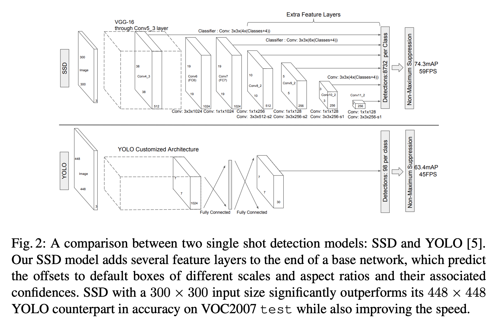
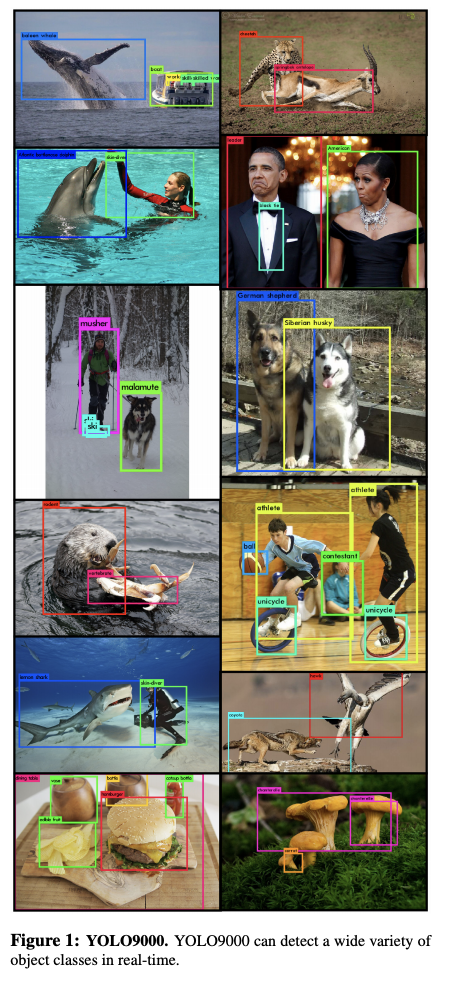
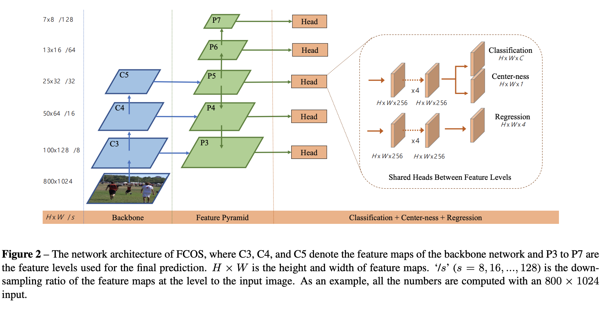
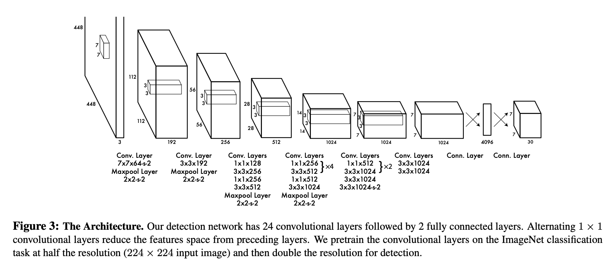
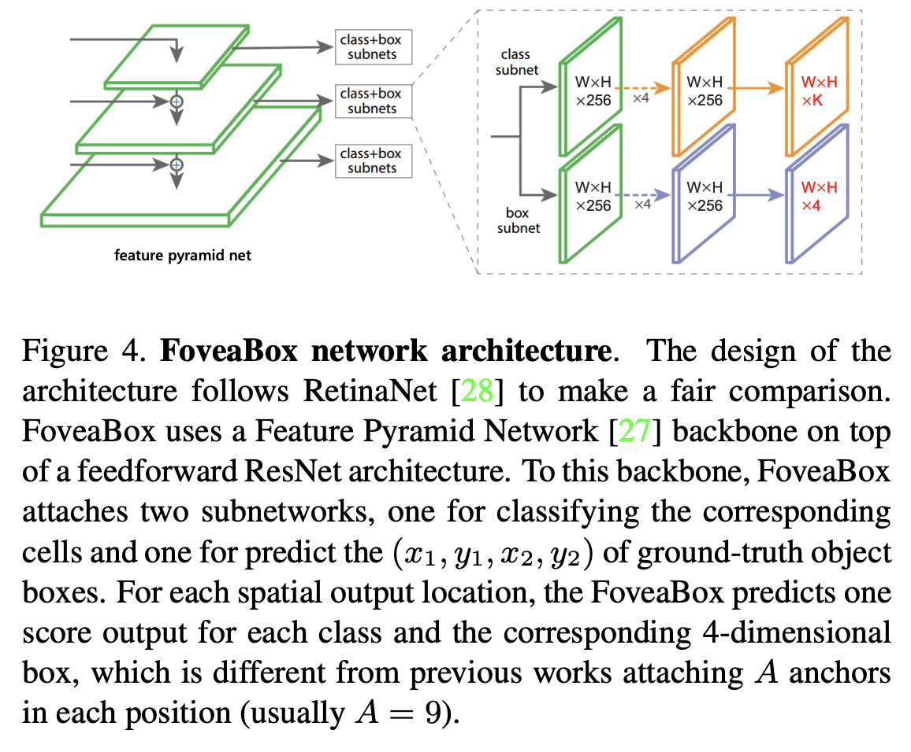
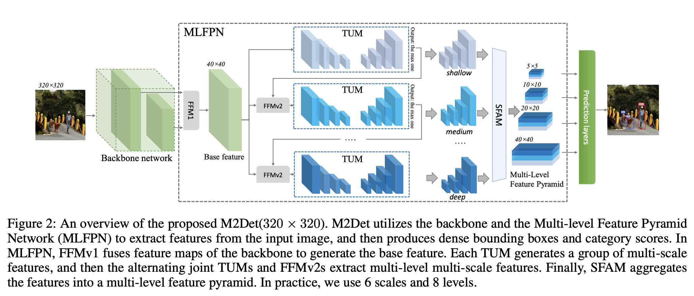
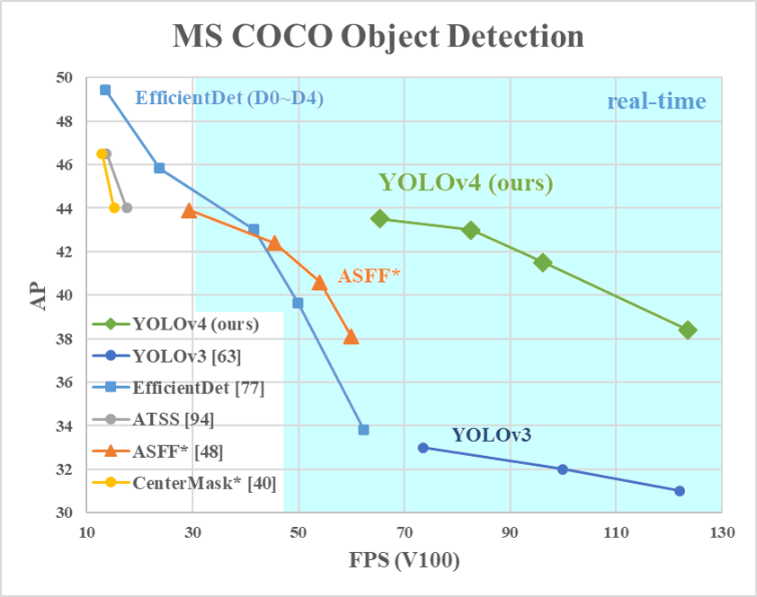
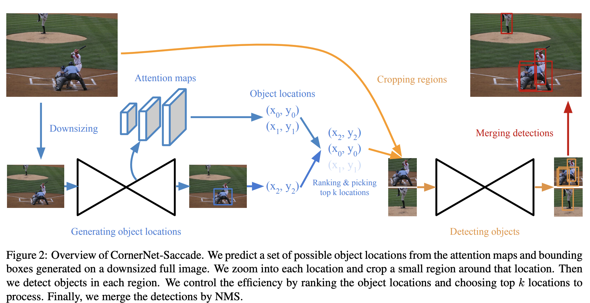

# [SSD](https://paperswithcode.com/method/ssd)

**SSD** is a single-stage object detection method that discretizes the output space of bounding boxes into a set of default boxes over different aspect ratios and scales per feature map location. At prediction time, the network generates scores for the presence of each object category in each default box and produces adjustments to the box to better match the object shape. Additionally, the network combines predictions from multiple feature maps with different resolutions to naturally handle objects of various sizes. The fundamental improvement in speed comes from eliminating bounding box proposals and the subsequent pixel or feature resampling stage. Improvements over competing single-stage methods include using a small convolutional filter to predict object categories and offsets in bounding box locations, using separate predictors (filters) for different aspect ratio detections, and applying these filters to multiple feature maps from the later stages of a network in order to perform detection at multiple scales.

source: [source](http://arxiv.org/abs/1512.02325v5)
# [RetinaNet](https://paperswithcode.com/method/retinanet)

**RetinaNet** is a one-stage object detection model that utilizes a focal loss function to address class imbalance during training. Focal loss applies a modulating term to the cross entropy loss in order to focus learning on hard negative examples. RetinaNet is a single, unified network composed of a **backbone** network and two task-specific **subnetworks**. The backbone is responsible for computing a convolutional feature map over an entire input image and is an off-the-self convolutional network. The first subnet performs convolutional object classification on the backbone's output; the second subnet performs convolutional bounding box regression. The two subnetworks feature a simple design that the authors propose specifically for one-stage, dense detection. 

We can see the motivation for focal loss by comparing with two-stage object detectors. Here class imbalance is addressed by a two-stage cascade and sampling heuristics. The proposal stage (e.g., [Selective Search](https://paperswithcode.com/method/selective-search), [EdgeBoxes](https://paperswithcode.com/method/edgeboxes), [DeepMask](https://paperswithcode.com/method/deepmask), [RPN](https://paperswithcode.com/method/rpn)) rapidly narrows down the number of candidate object locations to a small number (e.g., 1-2k), filtering out most background samples. In the second classification stage, sampling heuristics, such as a fixed foreground-to-background ratio, or online hard example mining (OHEM), are performed to maintain a
manageable balance between foreground and background.

In contrast, a one-stage detector must process a much larger set of candidate object locations regularly sampled across an image. To tackle this, RetinaNet uses a focal loss function, a dynamically scaled cross entropy loss, where the scaling factor decays to zero as confidence in the correct class increases. Intuitively, this scaling factor can automatically down-weight the contribution of easy examples during training and rapidly focus the model on hard examples. 

Formally, the Focal Loss adds a factor $(1 - p_{t})^\gamma$ to the standard cross entropy criterion. Setting $\gamma>0$ reduces the relative loss for well-classified examples ($p_{t}>.5$), putting more focus on hard, misclassified examples. Here there is tunable **focusing** parameter $\gamma \ge 0$. 

$$ {\text{FL}(p_{t}) = - (1 - p_{t})^\gamma \log\left(p_{t}\right)} $$

source: [source](http://arxiv.org/abs/1708.02002v2)
# [YOLOv3](https://paperswithcode.com/method/yolov3)

**YOLOv3** is a real-time, single-stage object detection model that builds on [YOLOv2](https://paperswithcode.com/method/yolov2) with several improvements. Improvements include the use of a new backbone network, Darknet-53 that utilises residual connections, or in the words of the author, "those newfangled residual network stuff", as well as some improvements to the bounding box prediction step, and use of three different scales from which to extract features (similar to an FPN).

source: [source](http://arxiv.org/abs/1804.02767v1)
# [YOLOv2](https://paperswithcode.com/method/yolov2)

**YOLOv2**, or [**YOLO9000**](https://www.youtube.com/watch?v=QsDDXSmGJZA), is a single-stage real-time object detection model. It improves upon YOLOv1 in several ways, including the use of Darknet-19 as a backbone, batch normalization, use of a high-resolution classifier, and the use of anchor boxes to predict bounding boxes, and more.

source: [source](http://arxiv.org/abs/1612.08242v1)
# [FCOS](https://paperswithcode.com/method/fcos)

**FCOS** is an anchor-box free, proposal free, single-stage object detection model. By eliminating the predefined set of anchor boxes, FCOS avoids computation related to anchor boxes such as calculating overlapping during training. It also avoids all hyper-parameters related to anchor boxes, which are often very sensitive to the final detection performance.

source: [source](https://arxiv.org/abs/1904.01355v5)
# [CenterNet](https://paperswithcode.com/method/centernet)

**CenterNet** is a one-stage object detector that detects each object as a triplet, rather than a pair, of keypoints. It utilizes two customized modules named cascade corner pooling and center pooling, which play the roles of enriching information collected by both top-left and bottom-right corners and providing more recognizable information at the central regions, respectively. The intuition is that, if a predicted bounding box has a high IoU with the ground-truth box, then the probability that the center keypoint in its central region is predicted as the same class is high, and vice versa. Thus, during inference, after a proposal is generated as a pair of corner keypoints, we determine if the proposal is indeed an object by checking if there is a center keypoint of the same class falling within its central region.

source: [source](http://arxiv.org/abs/1904.08189v3)
# [CornerNet](https://paperswithcode.com/method/cornernet)

**CornerNet** is an object detection model that detects an object bounding box as a pair of keypoints, the top-left corner and the bottom-right corner, using a single convolution neural network. By detecting objects as paired keypoints, we eliminate the need for designing a set of anchor boxes commonly used in prior single-stage detectors. It also utilises corner pooling, a new type of pooling layer than helps the network better localize corners.

source: [source](http://arxiv.org/abs/1808.01244v2)
# [YOLOv1](https://paperswithcode.com/method/yolov1)

**YOLOv1** is a single-stage object detection model. Object detection is framed as a regression problem to spatially separated bounding boxes and associated class probabilities. A single neural network predicts bounding boxes and class probabilities directly from full images in one evaluation. Since the whole detection pipeline is a single network, it can be optimized end-to-end directly on detection performance. 

The network uses features from the entire image to predict each bounding box. It also predicts all bounding boxes across all classes for an image simultaneously. This means the network reasons globally about the full image and all the objects in the image.

source: [source](http://arxiv.org/abs/1506.02640v5)
# [ExtremeNet](https://paperswithcode.com/method/extremenet)

**ExtremeNet** is a a bottom-up object detection framework that detects four extreme points (top-most, left-most, bottom-most, right-most) of an object. It uses a keypoint estimation framework to find extreme points, by predicting four multi-peak heatmaps for each object category. In addition, it uses one heatmap per category predicting the object center, as the average of two bounding box edges in both the x and y dimension. We group extreme points into objects with a purely geometry-based approach. We group four extreme points, one from each map, if and only if their
geometric center is predicted in the center heatmap with a score higher than a pre-defined threshold, We enumerate all $O\left(n^{4}\right)$ combinations of extreme point prediction, and select the valid ones.

source: [source](http://arxiv.org/abs/1901.08043v3)
# [FoveaBox](https://paperswithcode.com/method/foveabox)

**FoveaBox** is anchor-free framework for object detection. Instead of using predefined anchors to enumerate possible locations, scales and aspect ratios for the search of the objects, FoveaBox directly learns the object existing possibility and the bounding box coordinates without anchor reference. This is achieved by: (a) predicting category-sensitive semantic maps for the object existing possibility, and (b) producing category-agnostic bounding box for each position that potentially contains an object. The scales of target boxes are naturally associated with feature pyramid representations for each input image

It is a single, unified network composed of a backbone network and two task-specific subnetworks. The backbone is responsible for computing a convolutional feature map over an entire input image and is an off-the-shelf convolutional network. The first subnet performs per pixel classification on the backbone’s output; the second subnet performs bounding box prediction for the corresponding
position.

source: [source](http://arxiv.org/abs/1904.03797v1)
# [EfficientDet](https://paperswithcode.com/method/efficientdet)

**EfficientDet** is a type of object detection model, which utilizes several optimization and backbone tweaks, such as the use of a BiFPN, and a compound scaling method that uniformly scales the resolution,depth and width for all backbones, feature networks and box/class prediction networks at the same time.

source: [source](https://arxiv.org/abs/1911.09070v6)
# [M2Det](https://paperswithcode.com/method/m2det)

**M2Det** is a one-stage object detection model that utilises a Multi-Level Feature Pyramid Network (MLFPN) to extract features from the input image, and then similar to SSD, produces dense bounding boxes and category scores based on the learned features, followed by the non-maximum suppression (NMS) operation to produce the final results.

source: [source](http://arxiv.org/abs/1811.04533v3)
# [RFB Net](https://paperswithcode.com/method/rfb-net)

**RFB Net** is a one-stage object detector that utilises a receptive field block module. It utilises a VGG16 backbone, and is otherwise quite similar to the SSD architecture.

source: [source](http://arxiv.org/abs/1711.07767v3)
# [YOLOv4](https://paperswithcode.com/method/yolov4)

**YOLOv4** is a one-stage object detection module that improves on [YOLOv3](https://paperswithcode.com/method/yolov3) with several bags of tricks and modules introduced in the literature. The components section below details the tricks and modules used.

source: [source](https://arxiv.org/abs/2004.10934v1)
# [CornerNet-Squeeze](https://paperswithcode.com/method/cornernet-squeeze)

**CornerNet-Squeeze** is an object detector that extends [CornerNet](https://paperswithcode.com/method/cornernet) with a new compact hourglass architecture that makes use of fire modules with depthwise separable convolutions.

source: [source](http://arxiv.org/abs/1904.08900v1)
# [CornerNet-Saccade](https://paperswithcode.com/method/cornernet-saccade)

**CornerNet-Saccade** is an extension of [CornerNet](https://paperswithcode.com/method/cornernet) with an attention mechanism similar to saccades in human vision. It starts with a downsized full image and generates an attention map, which is then zoomed in on and processed further by the model. This differs from the original CornerNet in that it is applied fully convolutionally across multiple scales.

source: [source](http://arxiv.org/abs/1904.08900v1)
# [RetinaMask](https://paperswithcode.com/method/retinamask)

**RetinaMask** is a one-stage object detection method that improves upon [RetinaNet](https://paperswithcode.com/method/retinanet) by adding the task of instance mask prediction during training, as well as an adaptive loss that improves robustness to parameter choice during training, and including more difficult examples in training.

source: [source](http://arxiv.org/abs/1901.03353v1)
