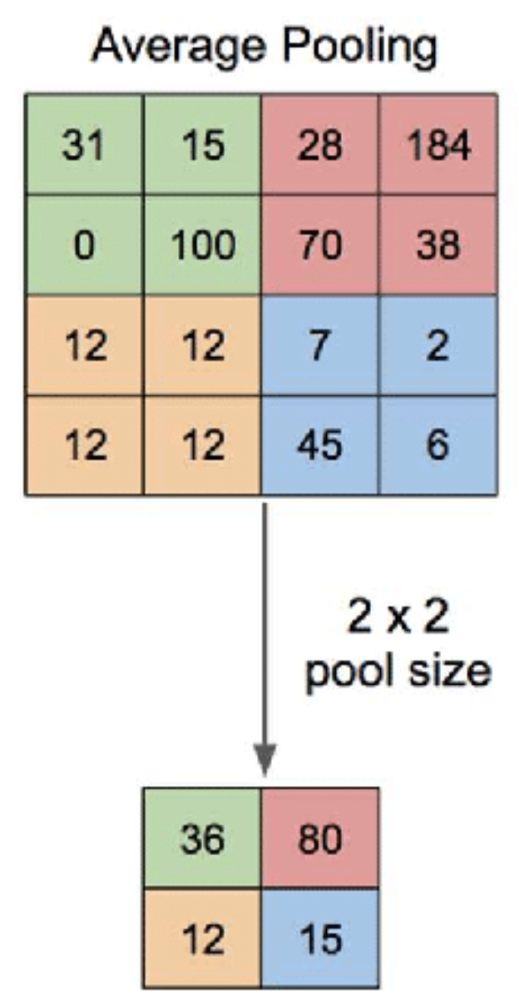
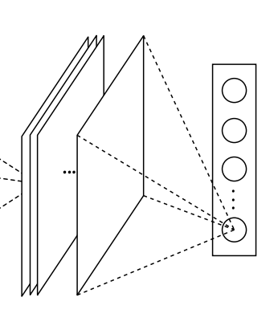
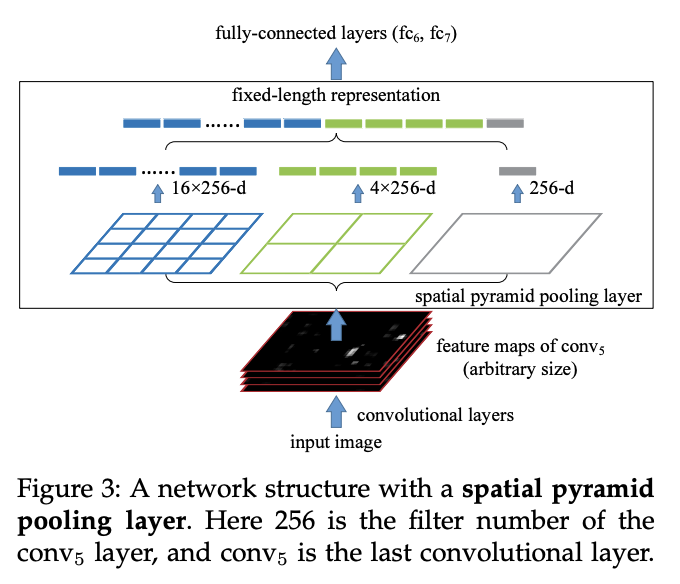
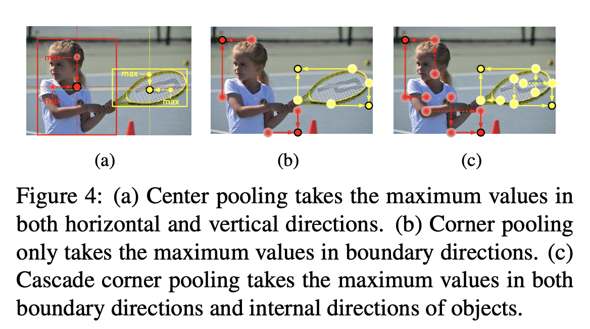
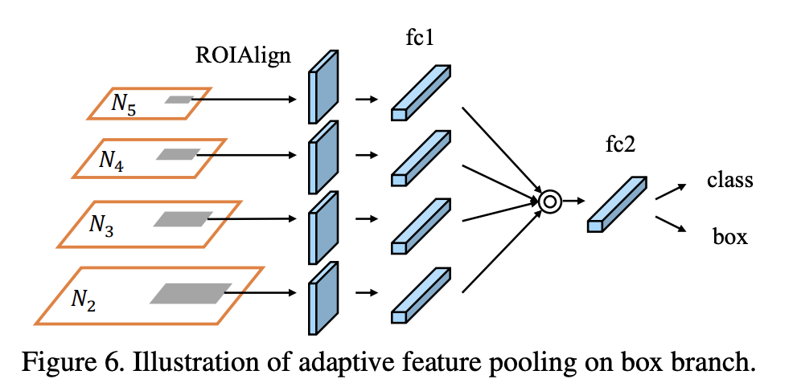
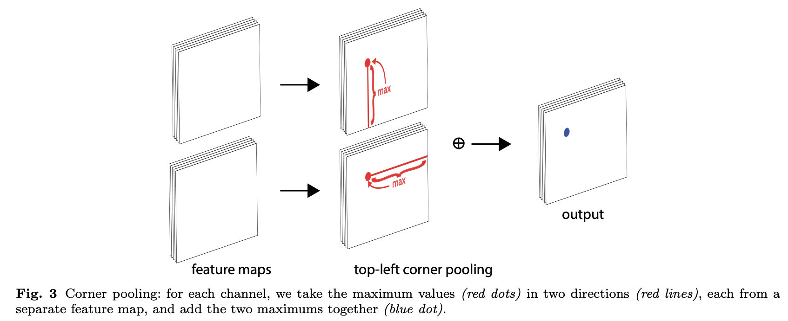
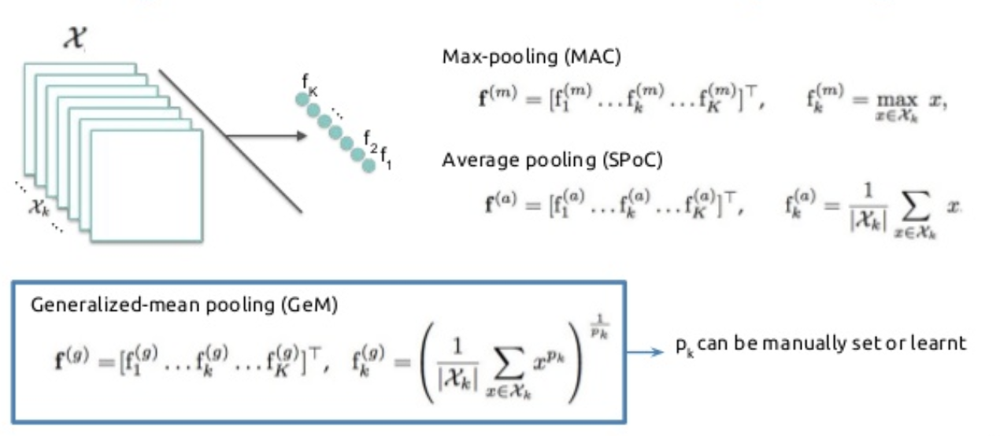
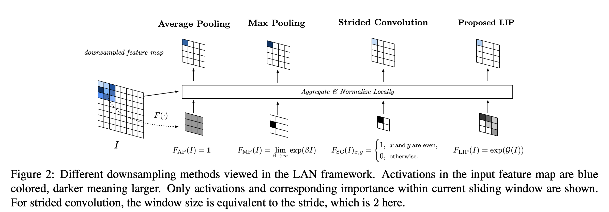
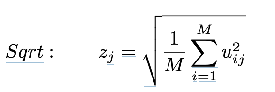

# [Max Pooling](https://paperswithcode.com/method/max-pooling)

**Max Pooling** is a pooling operation that calculates the maximum value for patches of a feature map, and uses it to create a downsampled (pooled) feature map.  It is usually used after a convolutional layer. It adds a small amount of translation invariance - meaning translating the image by a small amount does not significantly affect the values of most pooled outputs.

Image Source: [here](https://computersciencewiki.org/index.php/File:MaxpoolSample2.png)

# [Average Pooling](https://paperswithcode.com/method/average-pooling)

**Average Pooling** is a pooling operation that calculates the average value for patches of a feature map, and uses it to create a downsampled (pooled) feature map. It is usually used after a convolutional layer. It adds a small amount of translation invariance - meaning translating the image by a small amount does not significantly affect the values of most pooled outputs.

Image Source: [here](https://www.researchgate.net/figure/Illustration-of-Max-Pooling-and-Average-Pooling-Figure-2-above-shows-an-example-of-max_fig2_333593451)

# [Global Average Pooling](https://paperswithcode.com/method/global-average-pooling)

**Global Average Pooling** is a pooling operation designed to replace fully connected layers in classical CNNs. The idea is to generate one feature map for each corresponding category of the classification task in the last mlpconv layer. Instead of adding fully connected layers on top of the feature maps, we take the average of each feature map, and the resulting vector is fed directly into the softmax layer. 

One advantage of global average pooling over the fully connected layers is that it is more native to the convolution structure by enforcing correspondences between feature maps and categories. Thus the feature maps can be easily interpreted as categories confidence maps. Another advantage is that there is no parameter to optimize in the global average pooling thus overfitting is avoided at this layer. Futhermore, global average pooling sums out the spatial information, thus it is more robust to spatial translations of the input.

source: [source](http://arxiv.org/abs/1312.4400v3)
# [Spatial Pyramid Pooling](https://paperswithcode.com/method/spatial-pyramid-pooling)

** Spatial Pyramid Pooling (SPP)** is a pooling layer that removes the fixed-size constraint of the network, i.e. a CNN does not require a fixed-size input image. Specifically, we add an SPP layer on top of the last convolutional layer. The SPP layer pools the features and generates fixed-length outputs, which are then fed into the fully-connected layers (or other classifiers). In other words, we perform some information aggregation at a deeper stage of the network hierarchy (between convolutional layers and fully-connected layers) to avoid the need for cropping or warping at the beginning.

source: [source](http://arxiv.org/abs/1406.4729v4)
# [Center Pooling](https://paperswithcode.com/method/center-pooling)

**Center Pooling** is a pooling technique for object detection that aims to capture richer and more recognizable visual patterns. The geometric centers of objects do not necessarily convey very recognizable visual patterns (e.g., the human head contains strong visual patterns, but the center keypoint is often in the middle of the human body). 

The detailed process of center pooling is as follows: the backbone outputs a feature map, and to determine if a pixel in the feature map is a center keypoint, we need to find the maximum value in its both horizontal and vertical directions and add them together. By doing this, center pooling helps the better detection of center keypoints.

source: [source](http://arxiv.org/abs/1904.08189v3)
# [Cascade Corner Pooling](https://paperswithcode.com/method/cascade-corner-pooling)

**Cascade Corner Pooling** is a pooling detection for object detection that builds upon the corner pooling operation. Corners are often outside the objects, which lacks local appearance features. CornerNet uses corner pooling to address this issue, where we find the maximum values on the boundary directions so as to determine corners. However, it makes corners sensitive to the edges. To address this problem, we need to let corners see the visual patterns of objects. Cascade corner pooling first looks along a boundary to find a boundary maximum value, then looks inside along the location of the boundary maximum value to find an internal maximum value, and finally, add the two maximum values together. By doing this, the corners obtain both the the boundary information and the visual patterns of objects.

source: [source](http://arxiv.org/abs/1904.08189v3)
# [Adaptive Feature Pooling](https://paperswithcode.com/method/adaptive-feature-pooling)

**Adaptive Feature Pooling** pools features from all levels for each proposal in object detection and fuses them for the following prediction. For each proposal, we map them to different feature levels. Following Mask R-CNN, ROIAlign is
used to pool feature grids from each level. Then a fusion operation (element-wise max or sum) is utilized to fuse feature grids from different levels.

The motivation for this technique is that in FPN we assign proposals to different feature levels based on the size of proposals, which could be suboptimal if images with small differences are assigned to different levels, or if the importance of features is not strongly correlated to their level which they belong.

source: [source](http://arxiv.org/abs/1803.01534v4)
# [Corner Pooling](https://paperswithcode.com/method/corner-pooling)

**Corner Pooling** is a pooling technique for object detection that seeks to better localize corners by encoding explicit prior knowledge. Suppose we want to determine if a pixel at location $\left(i, j\right)$ is a top-left corner. Let $f_{t}$ and $f_{l}$ be the feature maps that are the inputs to the top-left corner pooling layer, and let $f_{t_{ij}}$ and $f_{l_{ij}}$ be the vectors at location $\left(i, j\right)$ in $f_{t}$ and $f_{l}$ respectively. With $H \times W$ feature maps, the corner pooling layer first max-pools all feature vectors between $\left(i, j\right)$ and $\left(i, H\right)$ in $f_{t}$ to a feature vector $t_{ij}$ , and max-pools all feature vectors between $\left(i, j\right)$ and $\left(W, j\right)$ in $f_{l}$ to a feature vector $l_{ij}$. Finally, it adds $t_{ij}$ and $l_{ij}$ together.

source: [source](http://arxiv.org/abs/1808.01244v2)
# [Generalized Mean Pooling](https://paperswithcode.com/method/generalized-mean-pooling)

**Generalized Mean Pooling (GeM)** computes the generalized mean of each channel in a tensor. Formally:

$$ \textbf{e} = \left[\left(\frac{1}{|\Omega|}\sum_{u\in{\Omega}}x^{p}_{cu}\right)^{\frac{1}{p}}\right]_{c=1,\cdots,C} $$

where $p &gt; 0$ is a parameter. Setting this exponent as $p &gt; 1$ increases the contrast of the pooled feature map and focuses on the salient features of the image. GeM is a generalization of the average pooling commonly used in classification networks ($p = 1$) and of spatial max-pooling layer ($p = \infty$).

Source: [MultiGrain](https://arxiv.org/pdf/1902.05509v2.pdf)

Image Source: [Eva Mohedano](https://www.google.com/url?sa=i&amp;url=https%3A%2F%2Fwww.slideshare.net%2Fxavigiro%2Fd1l5-contentbased-image-retrieval-upc-2018-deep-learning-for-computer-vision&amp;psig=AOvVaw2-9Hx23FNGFDe4GHU22Oo5&amp;ust=1591798200590000&amp;source=images&amp;cd=vfe&amp;ved=0CA0QjhxqFwoTCOiP-9P09OkCFQAAAAAdAAAAABAD)

# [Local Importance-based Pooling](https://paperswithcode.com/method/local-importance-based-pooling)

**Local Importance-based Pooling (LIP)** is a pooling layer that can enhance discriminative features during the downsampling procedure by learning adaptive importance weights based on inputs. By using a learnable network $G$ in $F$, the importance function now is not limited in hand-crafted forms and able to learn the criterion for the discriminativeness of features. Also, the window size of LIP is restricted to be not less than stride to fully utilize the feature map and avoid the issue of fixed interval sampling scheme. More specifically, the importance function in LIP is implemented by a tiny fully convolutional network, which learns to produce the importance map based on inputs in an end-to-end manner.

source: [source](https://arxiv.org/abs/1908.04156v3)
# [RMS Pooling](https://paperswithcode.com/method/rms-pooling)

**RMS Pooling** is a pooling operation that calculates the square mean root for patches of a feature map, and uses it to create a downsampled (pooled) feature map.  It is usually used after a convolutional layer.

$$ z_{j} = \sqrt{\frac{1}{M}\sum^{M}_{i=1}u{ij}^{2}} $$

