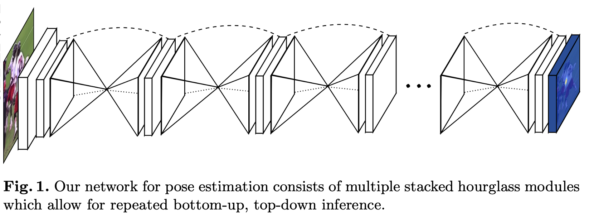

# [Stacked Hourglass Network](https://paperswithcode.com/method/stacked-hourglass-network)

**Stacked Hourglass Networks** are a type of convolutional neural network for pose estimation. They are based on the successive steps of pooling and upsampling that are done to produce a final set of predictions.

source: [source](http://arxiv.org/abs/1603.06937v2)
