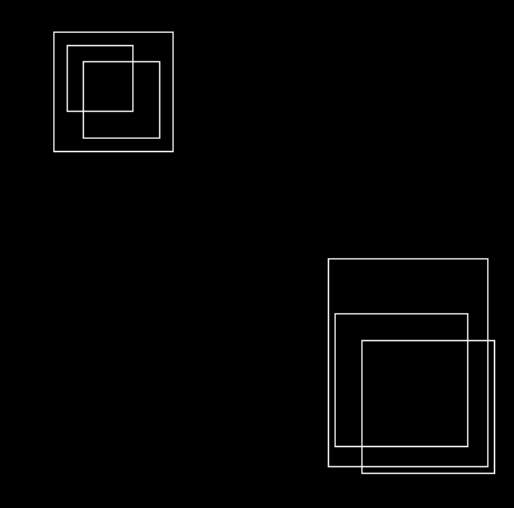
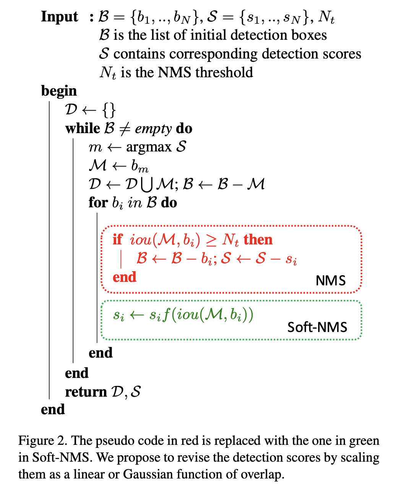
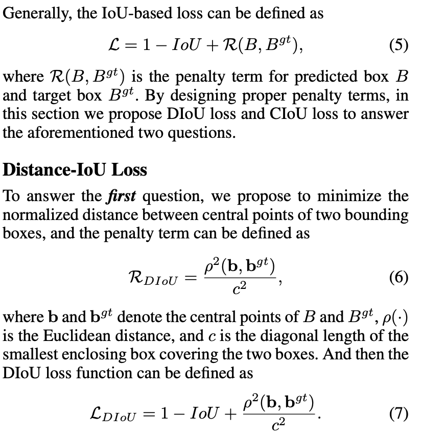
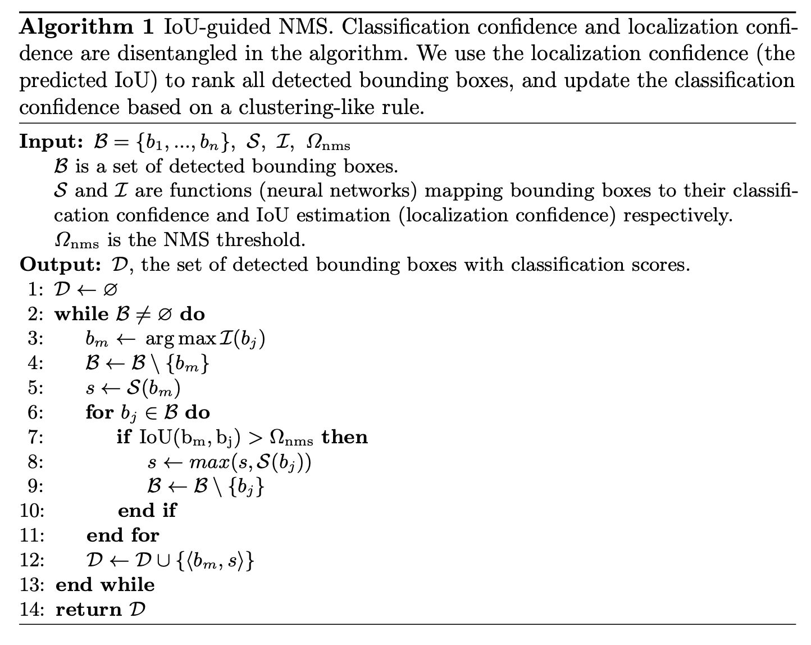
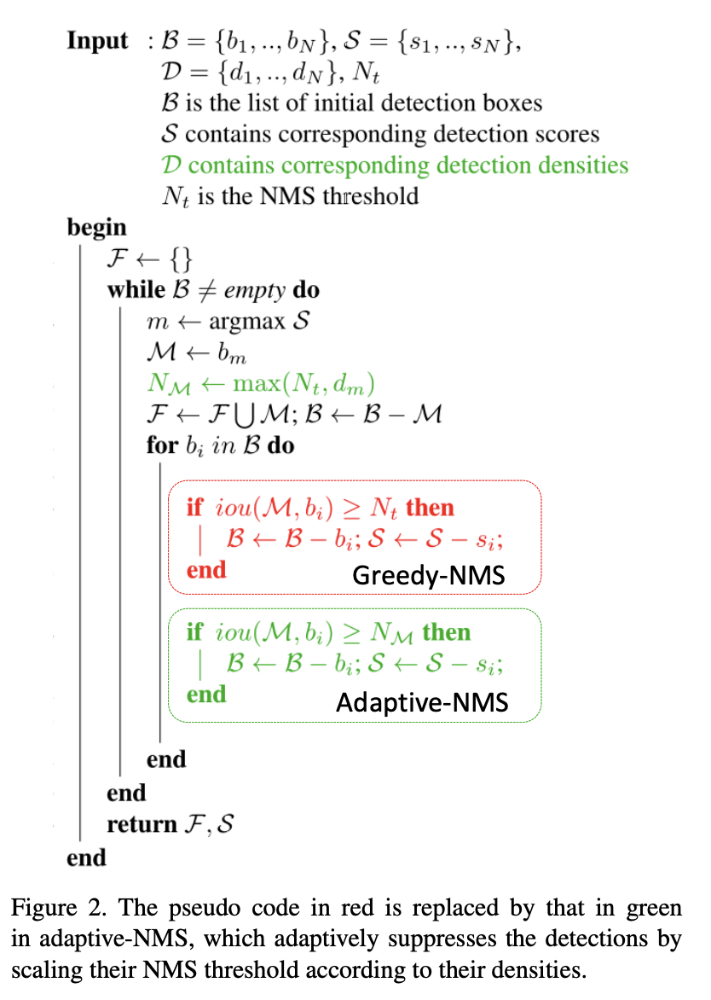

# [Non Maximum Suppression](https://paperswithcode.com/method/non-maximum-suppression)

**Non Maximum Suppression** is a computer vision method that selects a single entity out of many overlapping entities (for example bounding boxes in object detection). The criteria is usually discarding entities that are below a given probability bound. With remaining entities we repeatedly pick the entity with the highest probability, output that as the prediction, and discard any remaining box where a $\text{IoU} \geq 0.5$ with the box output in the previous step.

Image Credit: [Martin Kersner](https://github.com/martinkersner/non-maximum-suppression-cpp)

# [Soft-NMS](https://paperswithcode.com/method/soft-nms)

Non-maximum suppression is an integral part of the object detection pipeline. First, it sorts all detection boxes on the basis of their scores. The detection box $M$ with the maximum score is selected and all other detection boxes with a significant overlap (using a pre-defined threshold)
with $M$ are suppressed. This process is recursively applied on the remaining boxes. As per the design of the algorithm, if an object lies within the predefined overlap threshold, it leads to a miss. 

**Soft-NMS** solves this problem by decaying the detection scores of all other objects as a continuous function of their overlap with M. Hence, no object is eliminated in this process.

source: [source](http://arxiv.org/abs/1704.04503v2)
# [DIoU-NMS](https://paperswithcode.com/method/diou-nms)

**DIoU-NMS** is a type of non-maximum suppression where we use Distance IoU rather than regular DIoU, in which the overlap area and the distance between two central points of bounding boxes are simultaneously considered when suppressing redundant boxes.

In original NMS, the IoU metric is used to suppress the redundant detection boxes, where the overlap area is the unique factor, often yielding false suppression for the cases with occlusion. With DIoU-NMS, we not only consider the overlap area but also central point distance between two boxes.

source: [source](https://arxiv.org/abs/1911.08287v1)
# [IoU-guided NMS](https://paperswithcode.com/method/iou-guided-nms)

**IoU-guided NMS** is a type of non-maximum suppression that help to eliminate the suppression failure caused by the misleading classification confidences. This is achieved through using the predicted IoU instead of the classification confidence as the ranking keyword for bounding boxes. 

source: [source](http://arxiv.org/abs/1807.11590v1)
# [Adaptive NMS](https://paperswithcode.com/method/adaptive-nms)

**Adaptive Non-Maximum Suppression** is a non-maximum suppression algorithm that applies a dynamic suppression threshold to an instance according to the target density. The motivation is to find an NMS algorithm that works well for pedestrian detection in a crowd. Intuitively, a high NMS threshold keeps more crowded instances while a low NMS threshold wipes out more false positives. The adaptive-NMS thus applies a dynamic suppression strategy, where the threshold rises as instances gather and occlude each other and decays when instances appear separately. To this end, an auxiliary and learnable sub-network is designed to predict the adaptive NMS threshold for each instance.

source: [source](http://arxiv.org/abs/1904.03629v1)
