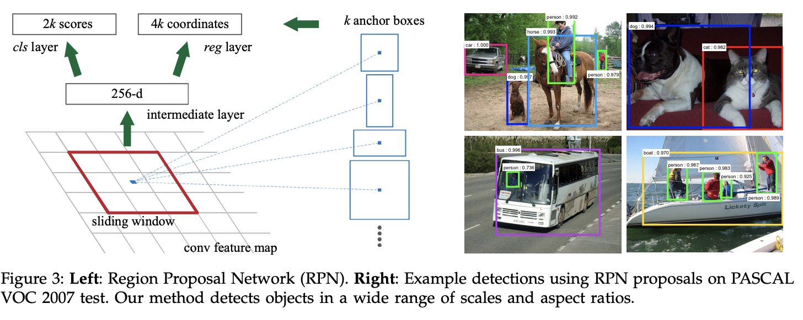
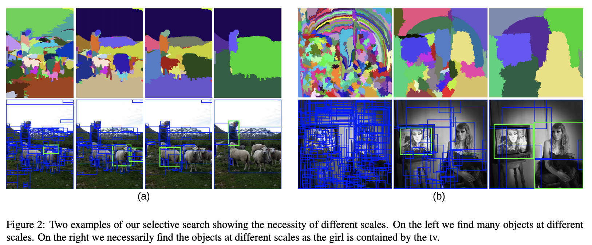
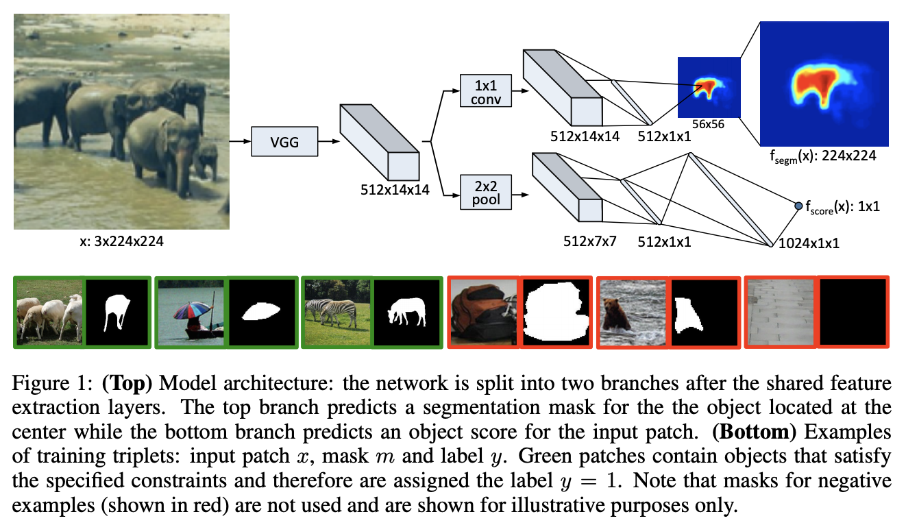
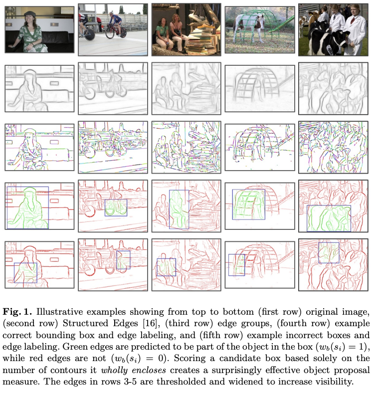

# [RPN](https://paperswithcode.com/method/rpn)

A **Region Proposal Network**, or **RPN**, is a fully convolutional network that simultaneously predicts object bounds and objectness scores at each position. The RPN is trained end-to-end to generate high-quality region proposals. RPN and algorithms like Fast R-CNN can be merged into a single network by sharing their convolutional features - using the recently popular terminology of neural networks with attention mechanisms, the RPN component tells the unified network where to look.

RPNs are designed to efficiently predict region proposals with a wide range of scales and aspect ratios. RPNs use anchor boxes that serve as references at multiple scales and aspect ratios. The scheme can be thought of as a pyramid of regression references, which avoids enumerating images or filters of multiple scales or aspect ratios.

source: [source](http://arxiv.org/abs/1506.01497v3)
# [Selective Search](https://paperswithcode.com/method/selective-search)

**Selective Search** is a region proposal algorithm for object detection tasks. It starts by over-segmenting the image based on intensity of the pixels using a graph-based segmentation method by Felzenszwalb and Huttenlocher. Selective Search then takes these oversegments as initial input and performs the following steps

1. Add all bounding boxes corresponding to segmented parts to the list of regional proposals
1. Group adjacent segments based on similarity
1. Go to step 1

At each iteration, larger segments are formed and added to the list of region proposals. Hence we create region proposals from smaller segments to larger segments in a bottom-up approach. This is what we mean by computing “hierarchical” segmentations using Felzenszwalb and Huttenlocher’s oversegments.

# [DeepMask](https://paperswithcode.com/method/deepmask)

**DeepMask** is an object proposal algorithm based on a convolutional neural network. Given an input image patch, DeepMask generates a class-agnostic mask and an associated score which estimates the likelihood of the patch fully containing a centered object (without any notion of an object category). The core of the model is a ConvNet which jointly predicts the mask and the object score. A large part of the network is shared between those two tasks: only the last few network
layers are specialized for separately outputting a mask and score prediction.

source: [source](http://arxiv.org/abs/1612.01057v4)
# [EdgeBoxes](https://paperswithcode.com/method/edgeboxes)

**EdgeBoxes** is an approach for generating object bounding box proposals directly from edges. Similar to segments, edges provide a simplified but informative representation of an image. In fact, line drawings of an image can accurately convey the high-level information contained in an image
using only a small fraction of the information. 

The main insight behind the method is the observation: the number of contours wholly enclosed by a bounding box is indicative of the likelihood of the box containing an object. We say a contour is wholly enclosed by a box if all edge pixels belonging to the contour lie within the interior of the box. Edges tend to correspond to object boundaries, and as such boxes that tightly enclose a set of edges are likely to contain an object. However, some edges that lie within an object’s bounding box may not be part of the contained object. Specifically, edge pixels that belong to contours straddling the box’s boundaries are likely to correspond to objects or structures that lie outside the box.

Source: [Zitnick and Dollar](https://pdollar.github.io/files/papers/ZitnickDollarECCV14edgeBoxes.pdf)

