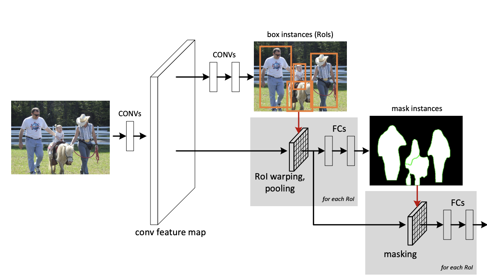

# [RoIPool](https://paperswithcode.com/method/roi-pooling)

**Region of Interest Pooling**, or **RoIPool**, is an operation for extracting a small feature map (e.g., $7×7$) from each RoI in detection and segmentation based tasks. Features are extracted from each candidate box, and thereafter in models like Fast R-CNN, are then classified and bounding box regression performed.

The actual scaling to, e.g., $7×7$, occurs by dividing the region proposal into equally sized sections, finding the largest value in each section, and then copying these max values to the output buffer. In essence, **RoIPool** is max pooling on a discrete grid based on a box.

Image Source: [Joyce Xu](https://towardsdatascience.com/deep-learning-for-object-detection-a-comprehensive-review-73930816d8d9)

source: [source](http://arxiv.org/abs/1311.2524v5)
# [RoIAlign](https://paperswithcode.com/method/roi-align)

**Region of Interest Align**, or **RoIAlign**, is an operation for extracting a small feature map from each RoI in detection and segmentation based tasks. It removes the harsh quantization of RoIPool, properly **aligning** the extracted features with the input. To avoid any quantization of the RoI boundaries or bins (using $x/16$ instead of $[x/16]$), RoIAlign uses bilinear interpolation to compute the exact values of the input features at four regularly sampled locations in each RoI bin, and the result is then aggregated (using max or average).

source: [source](http://arxiv.org/abs/1703.06870v3)
# [Position-Sensitive RoI Pooling](https://paperswithcode.com/method/position-sensitive-roi-pooling)

**Position-Sensitive RoI Pooling layer** aggregates the outputs of the
last convolutional layer and generates scores for each RoI. Unlike RoI Pooling, PS RoI Pooling conducts selective pooling, and each of the $k$ × $k$ bin aggregates responses from only one score map out of the bank of $k$ × $k$ score maps. With end-to-end training, this RoI layer shepherds the last convolutional layer to learn specialized position-sensitive score maps.

source: [source](http://arxiv.org/abs/1605.06409v2)
# [Precise RoI Pooling](https://paperswithcode.com/method/precise-roi-pooling)

**Precise RoI Pooling**, or **PrRoI Pooling**, is a region of interest feature extractor that avoids any quantization of coordinates and has a continuous gradient on bounding box coordinates. Given the feature map $\mathcal{F}$ before RoI/PrRoI Pooling (eg from Conv4 in ResNet-50), let $w_{i,j}$ be the feature at one discrete location $(i,j)$ on the feature map. Using bilinear interpolation, the discrete feature map can be considered continuous at any continuous coordinates $(x,y)$:

$$
f(x,y) = \sum_{i,j}IC(x,y,i,j) \times w_{i,j},
$$

where $IC(x,y,i,j) = max(0,1-|x-i|)\times max(0,1-|y-j|)$ is the interpolation coefficient. Then denote a bin of a RoI as $bin={(x_1,y_1),(x_2,y_2)}$, where $(x_1,y_1)$ and $(x_2,y_2)$ are the continuous coordinates of the top-left and bottom-right points, respectively. We perform pooling (e.g. average pooling) given $bin$ and feature map $\mathcal{F}$ by computing a two-order integral:

source: [source](http://arxiv.org/abs/1807.11590v1)
# [Position-Sensitive RoIAlign](https://paperswithcode.com/method/position-sensitive-roialign)

**Position-Sensitive RoIAlign** is a positive sensitive version of RoIAlign - i.e. it performs selective alignment, allowing for the learning of position-sensitive region of interest aligning.

# [Deformable RoI Pooling](https://paperswithcode.com/method/deformable-roi-pooling)

**Deformable RoI Pooling** adds an offset to each bin position in the regular bin partition of the RoI Pooling. Similarly, the offsets are learned from the preceding feature maps and the RoIs, enabling adaptive part localization for objects with different shapes.

source: [source](http://arxiv.org/abs/1703.06211v3)
# [RoIWarp](https://paperswithcode.com/method/roiwarp)

**Region of Interest Warping**, or **RoIWarp**, is a form of **RoIPool** that is differentiable with respect to the box position. In practice, this takes the form of a RoIWarp layer followed by a standard Max Pooling layer. The RoIWarp layer crops a feature map region and warps it into a target size by interpolation.

source: [source](http://arxiv.org/abs/1512.04412v1)
# [Deformable Position-Sensitive RoI Pooling](https://paperswithcode.com/method/deformable-position-sensitive-roi-pooling)

**Deformable Position-Sensitive RoI Pooling** is similar to PS RoI Pooling but it adds an offset to each bin position in the regular bin partition. Offset learning follows the “fully convolutional” spirit. In the top branch, a convolutional layer generates the full spatial resolution offset fields. For each RoI (also for each class), PS RoI pooling is applied on such fields to obtain normalized offsets, which are then transformed to the real offsets, in the same way as in deformable RoI pooling.

source: [source](http://arxiv.org/abs/1703.06211v3)
