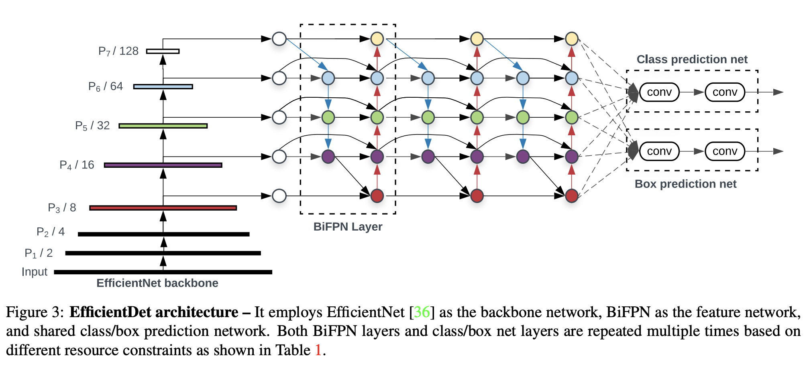

# [U-Net](https://paperswithcode.com/method/u-net)

**U-Net** is an architecture for semantic segmentation. It consists of a contracting path and an expansive path. The contracting path follows the typical architecture of a convolutional network. It consists of the repeated application of two 3x3 convolutions (unpadded convolutions), each followed by a rectified linear unit (ReLU) and a 2x2 max pooling operation with stride 2 for downsampling. At each downsampling step we double the number of feature channels. Every step in the expansive path consists of an upsampling of the feature map followed by a 2x2 convolution (“up-convolution”) that halves the number of feature channels, a concatenation with the correspondingly cropped feature map from the contracting path, and two 3x3 convolutions, each followed by a ReLU. The cropping is necessary due to the loss of border pixels in every convolution. At the final layer a 1x1 convolution is used to map each 64-component feature vector to the desired number of classes. In total the network has 23 convolutional layers.

source: [source](http://arxiv.org/abs/1505.04597v1)
# [FCN](https://paperswithcode.com/method/fcn)

**Fully Convolutional Networks**, or **FCNs**, are an architecture used mainly for semantic segmentation. They employ solely locally connected layers, such as convolution, pooling and upsampling. Avoiding the use of dense layers means less parameters (making the networks faster to train). It also means an FCN can work for variable image sizes given all connections are local.

The network consists of a downsampling path, used to extract and interpret the context, and an upsampling path, which allows for localization. 

FCNs also employ skip connections to recover the fine-grained spatial information lost in the downsampling path.

source: [source](http://arxiv.org/abs/1605.06211v1)
# [SegNet](https://paperswithcode.com/method/segnet)

**SegNet** is a semantic segmentation model. This core trainable segmentation architecture consists of an encoder network, a corresponding decoder network followed by a pixel-wise classification layer. The architecture of the encoder network is topologically identical to the 13 convolutional layers in the
VGG16 network. The role of the decoder network is to map the low resolution encoder feature maps to full input resolution feature maps for pixel-wise classification. The novelty of SegNet lies is in the manner in which the decoder upsamples its lower resolution input feature maps. Specifically, the decoder uses pooling indices computed in the max-pooling step of the corresponding encoder to
perform non-linear upsampling.

source: [source](http://arxiv.org/abs/1511.00561v3)
# [DeepLab](https://paperswithcode.com/method/deeplab)

**DeepLab** is a semantic segmentation architecture. First, the input image goes through the network with the use of dilated convolutions. Then the output from the network is bilinearly interpolated and goes through the fully connected CRF to fine tune the result we obtain the final predictions.

source: [source](http://arxiv.org/abs/1412.7062v4)
# [ENet](https://paperswithcode.com/method/enet)

**ENet** is a semantic segmentation architecture which utilises a compact encoder-decoder architecture. Some design choices include:

<li>Using the SegNet approach to downsampling y saving indices of elements chosen in max
pooling layers, and using them to produce sparse upsampled maps in the decoder.</li>
1. Early downsampling to optimize the early stages of the network and reduce the cost of processing large input frames. The first two blocks of ENet heavily reduce the input size, and use only a small set of feature maps. 
1. Using PReLUs as an activation function
1. Using dilated convolutions 
1. Using Spatial Dropout

source: [source](http://arxiv.org/abs/1606.02147v1)
# [PSPNet](https://paperswithcode.com/method/pspnet)

**PSPNet**, or **Pyramid Scene Parsing Network**, is a semantic segmentation model that utilises a pyramid parsing module that exploits global context information by different-region based context aggregation. The local and global clues together make the final prediction more reliable. We also propose an optimization

Given an input image, PSPNet use a pretrained CNN with the dilated network strategy to extract the feature map. The final feature map size is $1/8$ of the input image. On top of the map, we use the pyramid pooling module to gather context information. Using our 4-level pyramid, the pooling kernels cover the whole, half of, and small portions of the image. They are fused as the global prior.
Then we concatenate the prior with the original feature map in the final part of. It is followed by a convolution layer to generate the final prediction map.

source: [source](http://arxiv.org/abs/1612.01105v2)
# [DeepLabv3](https://paperswithcode.com/method/deeplabv3)

**DeepLabv3** is a semantic segmentation architecture that improves upon DeepLabv2 with several modifications.To handle the problem of segmenting objects at multiple scales, modules are designed which employ atrous convolution in cascade or in parallel to capture multi-scale context by adopting multiple atrous rates. Furthermore, the Atrous Spatial Pyramid Pooling module from DeepLabv2 augmented with image-level features encoding global context and further boost performance. 

The changes to the ASSP module are that the authors apply global average pooling on the last feature map of the model, feed the resulting image-level features to a 1 × 1 convolution with 256 filters (and batch normalization), and then bilinearly upsample the feature to the desired spatial dimension. In the
end, the improved ASPP consists of (a) one 1×1 convolution and three 3 × 3 convolutions with rates = (6, 12, 18) when output stride = 16 (all with 256 filters and batch normalization), and (b) the image-level features.

Another interesting difference is that DenseCRF post-processing from DeepLabv2 is no longer needed.

source: [source](http://arxiv.org/abs/1706.05587v3)
# [ESPNet](https://paperswithcode.com/method/espnet)

**ESPNet** is a convolutional neural network for semantic segmentation of high resolution images under resource constraints. ESPNet is based on a convolutional module, efficient spatial pyramid (ESP), which is efficient in terms of computation, memory, and power.

source: [source](http://arxiv.org/abs/1803.06815v3)
# [EfficientDet](https://paperswithcode.com/method/efficientdet)

**EfficientDet** is a type of object detection model, which utilizes several optimization and backbone tweaks, such as the use of a BiFPN, and a compound scaling method that uniformly scales the resolution,depth and width for all backbones, feature networks and box/class prediction networks at the same time.

source: [source](https://arxiv.org/abs/1911.09070v6)
# [LiteSeg](https://paperswithcode.com/method/liteseg)

**LiteSeg** is a lightweight architecture for semantic segmentation that uses a deeper version of Atrous Spatial Pyramid Pooling module (ASPP) and applies short and long residual connections, and depthwise separable convolution, resulting in a faster, more efficient model.

source: [source](https://arxiv.org/abs/1912.06683v1)
# [DeepLabv2](https://paperswithcode.com/method/deeplabv2)

**DeepLabv2** is an architecture for semantic segmentation that build on DeepLab with an atrous spatial pyramid pooling scheme. Here we have parallel dilated convolutions with different rates applied in the input feature map, which are then fused together. As objects of the same class can have different sizes in the image, ASPP helps to account for different object sizes.

source: [source](http://arxiv.org/abs/1606.00915v2)
# [PSANet](https://paperswithcode.com/method/psanet)

**PSANet** is a semantic segmentation architecture that utilizes a Point-wise Spatial Attention (PSA) module to aggregate long-range contextual information in a flexible and adaptive manner. Each position in the feature map is connected with all other ones through self-adaptively predicted attention maps, thus harvesting various information nearby and far away. Furthermore, the authors design the bi-directional information propagation path for a comprehensive understanding of complex scenes. Each position collects information from all others to help the prediction of itself and vice versa, the information at each position can be distributed globally, assisting the prediction of all other positions. Finally, the bi-directionally aggregated contextual information is fused with local features to form the final representation of complex scenes.

The authors use ResNet as an FCN backbone for PSANet, as the Figure to the right illustrates. The proposed PSA module is then used to aggregate long-range contextual information from the local representation. It follows stage-5 in ResNet, which is the final stage of the FCN backbone. Features in stage-5 are semantically stronger. Aggregating them together leads to a more comprehensive representation of long-range context. Moreover, the spatial size of the feature map at stage-5 is smaller and can reduce computation overhead and memory consumption. An auxiliary loss branch is applied apart from the main loss.

source: [source](http://openaccess.thecvf.com/content_ECCV_2018/html/Hengshuang_Zhao_PSANet_Point-wise_Spatial_ECCV_2018_paper.html)
