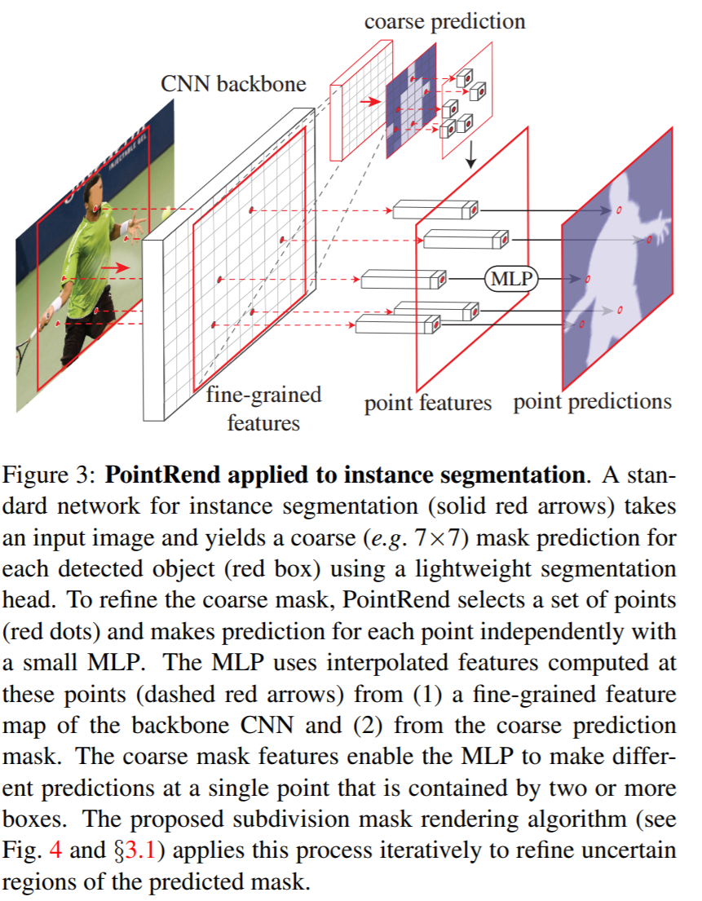

# [Pyramid Pooling Module](https://paperswithcode.com/method/pyramid-pooling-module)

A **Pyramid Pooling Module** is a module for semantic segmentation which acts as an effective global contextual prior. The motivation is that the problem of using a convolutional network like a ResNet is that, while the receptive field is already larger than the input image, the empirical receptive field is much smaller than the theoretical one especially on high-level layers. This makes many networks not sufficiently incorporate the momentous global scenery prior. 

The PPM is an effective global prior representation that addresses this problem. It contains information with different scales and varying among different sub-regions. Using our 4-level pyramid, the pooling kernels cover the whole, half of, and small portions of the image. They are fused as the global prior. Then we concatenate the prior with the original feature map in the final part.

source: [source](http://arxiv.org/abs/1612.01105v2)
# [ASPP](https://paperswithcode.com/method/aspp)

**Atrous Spatial Pyramid Pooling (ASSP)** is a semantic segmentation module for resampling a given feature layer at multiple rates prior to convolution. This amounts to probing the original image with multiple filters that have complementary effective fields of view, thus capturing objects as well as useful image context at multiple scales. Rather than actually resampling features, the mapping is implemented using multiple parallel atrous convolutional layers with different sampling rates.

source: [source](http://arxiv.org/abs/1606.00915v2)
# [Global Convolutional Network](https://paperswithcode.com/method/global-convolutional-network)

A **Global Convolutional Network**, or **GCN**, is a semantic segmentation building block that utilizes a large kernel to help perform classification and localization tasks simultaneously. It can be used in a FCN-like structure, where the GCN is used to generate semantic score maps. Instead of directly using larger kernels or global convolution, the GCN module employs a combination of $1 \times k + k \times 1$ and $k \times 1 + 1 \times k$ convolutions, which enables dense connections within a large
$k\times{k}$ region in the feature map

source: [source](http://arxiv.org/abs/1703.02719v1)
# [Point-wise Spatial Attention](https://paperswithcode.com/method/point-wise-spatial-attention)

**Point-wise Spatial Attention (PSA)** is a semantic segmentation module. The goal is capture contextual information, especially in the long range, and to achieve this for semantic segmentation, information aggregation is of great importance for scene parsing. Through the PSA module, information aggregation is performed as a kind of information flow where we adaptively learn a pixel-wise global attention map for each position from two perspectives to aggregate contextual information over the entire feature map.

The PSA module takes a spatial feature map $\mathbf{X}$ as input. We denote the spatial size of $\mathbf{X}$ as $H \times W$. Through the two branches as illustrated, we generate pixel-wise global attention maps for each position in feature map $\mathbf{X}$ through several convolutional layers.

We aggregate input feature map based on attention maps to generate new feature representations with the long-range contextual information incorporated, i.e., $\mathbf{Z}_{c}$ from the ‘collect’ branch and $\mathbf{Z}_{d}$ from the ‘distribute’ branch.

We concatenate the new representations $\mathbf{Z}_{c}$ and $\mathbf{Z}_{d}$ and apply a convolutional layer with batch normalization and activation layers for dimension reduction and feature fusion. Then we concatenate the new global contextual feature with the local representation feature $\mathbf{X}$. It is followed by one or several convolutional layers with batch normalization and activation layers to generate the final feature map for following subnetworks.

source: [source](http://openaccess.thecvf.com/content_ECCV_2018/html/Hengshuang_Zhao_PSANet_Point-wise_Spatial_ECCV_2018_paper.html)
# [DASPP](https://paperswithcode.com/method/daspp)

DASPP is a deeper version of the ASPP module (the latter from DeepLabv3) that adds standard 3 × 3 convolution after 3 × 3 dilated convolutions to refine the features and also fusing the input and the output of the DASPP module via short residual connection. Also, the number of convolution filters of ASPP is reduced from 255 to 96 to gain computational performance.

source: [source](https://arxiv.org/abs/1912.06683v1)
# [PointRend](https://paperswithcode.com/method/pointrend)

**PointRend** is a module for image segmentation tasks, such as instance and semantic segmentation, that attempts to treat segmentation as image rending problem to efficiently "render" high-quality label maps. It uses a subdivision strategy to adaptively select a non-uniform set of points at which to compute labels. PointRend can be incorporated into popular meta-architectures for both instance segmentation (e.g. [Mask R-CNN](https://paperswithcode.com/method/mask-r-cnn)) and semantic segmentation (e.g. [FCN](https://paperswithcode.com/method/fcn)). Its subdivision strategy efficiently computes high-resolution segmentation maps using an order of magnitude fewer floating-point operations than direct, dense computation.

PointRend is a general module that admits many possible implementations. Viewed abstractly, a PointRend module accepts one or more typical CNN feature maps $f\left(x_{i}, y_{i}\right)$ that are defined over regular grids, and outputs high-resolution predictions $p\left(x^{'}_{i}, y^{'}_{i}\right)$ over a finer grid. Instead of making excessive predictions over all points on the output grid, PointRend makes predictions only on carefully selected points. To make these predictions, it extracts a point-wise feature representation for the selected points by interpolating $f$, and uses a small point head subnetwork to predict output labels from the point-wise features.

source: [source](https://arxiv.org/abs/1912.08193v2)
