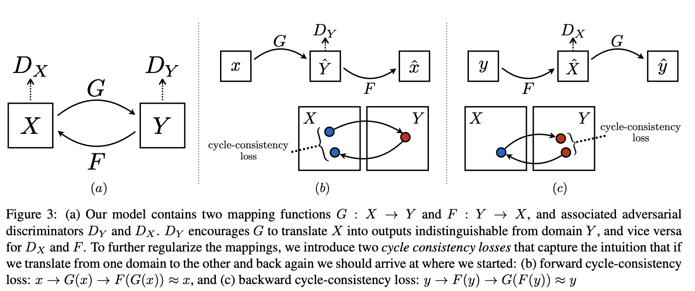

# [CycleGAN](https://paperswithcode.com/method/cyclegan)

**CycleGAN**, or **Cycle-Consistent GAN**, is a type of generative adversarial network for unpaired image-to-image translation. For two domains $X$ and $Y$, CycleGAN learns a mapping $G : X \rightarrow Y$ and $F: Y \rightarrow X$. The novelty lies in trying to enforce the intuition that these mappings should be reverses of each other and that both mappings should be bijections. This is achieved through a cycle consistency loss that encourages $F\left(G\left(x\right)\right) \approx x$ and $G\left(Y\left(y\right)\right) \approx y$. Combining this loss with the adversarial losses on $X$ and $Y$ yields the full objective for unpaired image-to-image translation.

For the mapping $G : X \rightarrow Y$ and its discriminator $D_{Y}$ we have the objective:

$$ \mathcal{L}_{GAN}\left(G, D_{Y}, X, Y\right) =\mathbb{E}_{y \sim p_{data}\left(y\right)}\left[\log D_{Y}\left(y\right)\right] + \mathbb{E}_{x \sim p_{data}\left(x\right)}\left[log(1 − D_{Y}\left(G\left(x\right)\right)\right] $$

where $G$ tries to generate images $G\left(x\right)$ that look similar to images from domain $Y$, while $D_{Y}$ tries to discriminate between translated samples $G\left(x\right)$ and real samples $y$. A similar loss is postulated for the mapping $F: Y \rightarrow X$ and its discriminator $D_{X}$.

The Cycle Consistency Loss reduces the space of possible mapping functions by enforcing forward and backwards consistency:

$$ \mathcal{L}_{cyc}\left(G, F\right) = \mathbb{E}_{x \sim p_{data}\left(x\right)}\left[||F\left(G\left(x\right)\right) - x||_{1}\right] + \mathbb{E}_{y \sim p_{data}\left(y\right)}\left[||G\left(F\left(y\right)\right) - y||_{1}\right] $$

The full objective is:

$$ \mathcal{L}_{GAN}\left(G, F, D_{X}, D_{Y}\right) = \mathcal{L}_{GAN}\left(G, D_{Y}, X, Y\right) + \mathcal{L}_{GAN}\left(F, D_{X}, X, Y\right) + \lambda\mathcal{L}_{cyc}\left(G, F\right) $$

Where we aim to solve:

$$ G^{*}, F^{*} = \arg \min_{G, F} \min_{D_{X}, D_{Y}} \mathcal{L}_{GAN}\left(G, F, D_{X}, D_{Y}\right) $$

For the original architecture the authors use:

- two stride-2 convolutions, several residual blocks, and two fractionally strided convolutions with stride $\frac{1}{2}$.
- instance normalization
- PatchGANs for the discriminator
- Least Square Loss for the GAN objectives.

source: [source](http://arxiv.org/abs/1703.10593v6)
