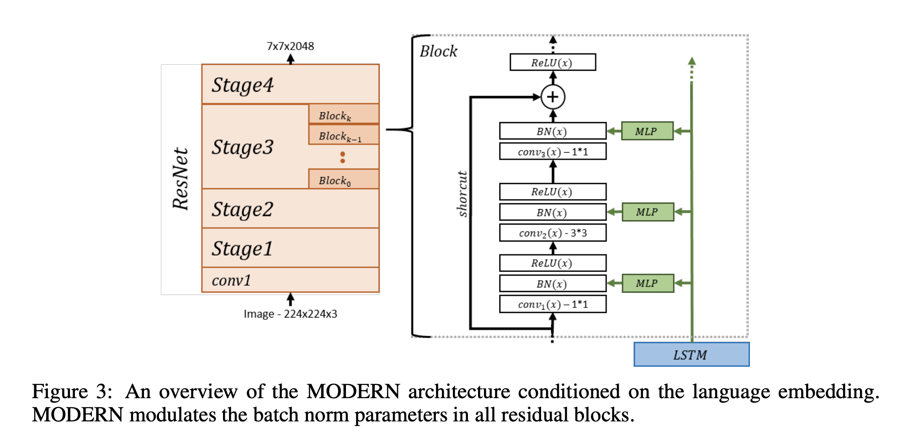

# [MODERN](https://paperswithcode.com/method/modern)

**MODERN**, or **Modulated Residual Network**, is an architecture for [visual question answering](https://paperswithcode.com/task/visual-question-answering) (VQA). It employs conditional batch normalization to allow a linguistic embedding from an LSTM to modulate the batch normalization parameters of a ResNet. This enables the linguistic embedding to manipulate entire feature maps by scaling them up or down, negating them, or shutting them off, etc.

source: [source](http://arxiv.org/abs/1707.00683v3)
