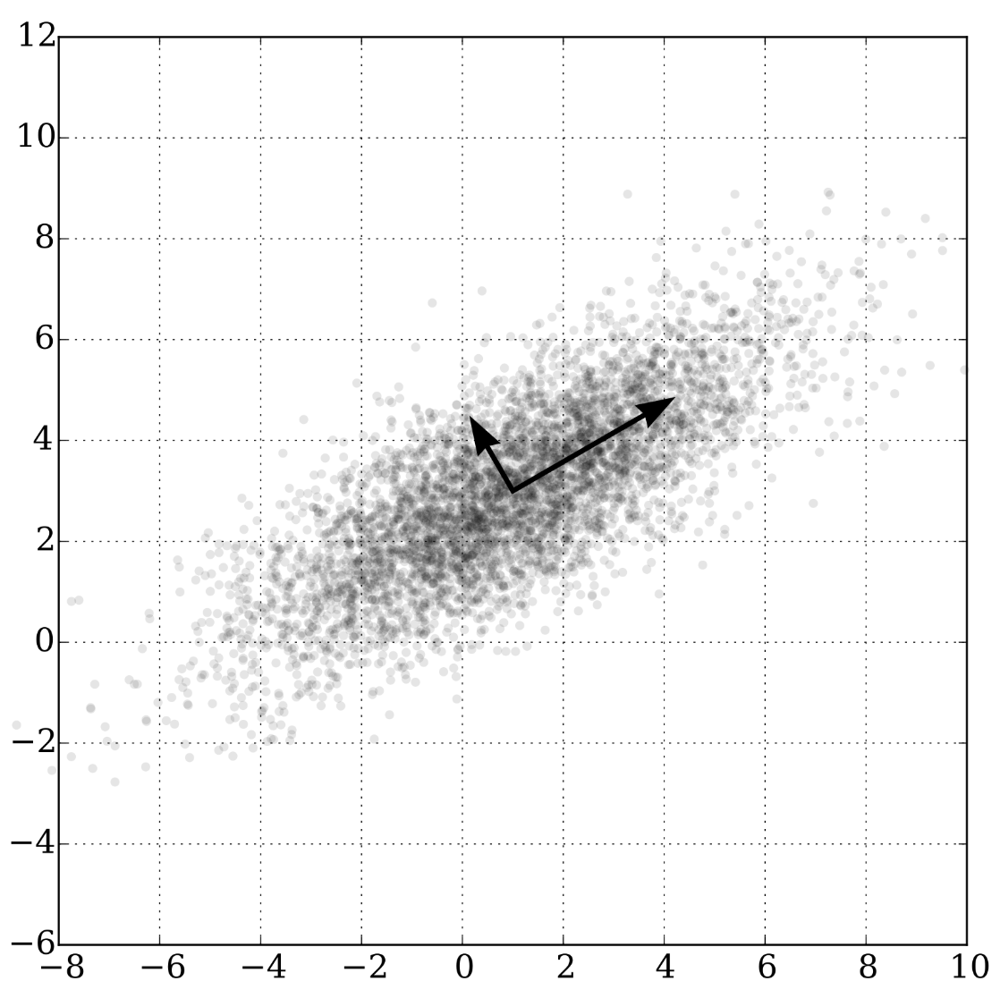
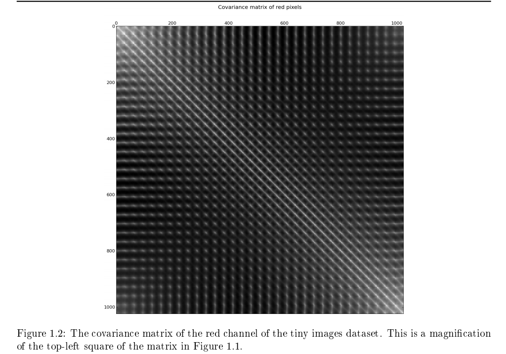

# [PCA Whitening](https://paperswithcode.com/method/pca-whitening)

**PCA Whitening** is a processing step for image based data that makes input less redundant. Adjacent pixel or feature values can be highly correlated, and whitening through the use of PCA reduces this degree of correlation.

Image Source: [Wikipedia](https://en.wikipedia.org/wiki/Principal_component_analysis#/media/File:GaussianScatterPCA.svg)

# [ZCA Whitening](https://paperswithcode.com/method/zca-whitening)

**ZCA Whitening** is an image preprocessing method that leads to a transformation of data such that the covariance matrix $\Sigma$ is the identity matrix, leading to decorrelated features.

Image Source: [Alex Krizhevsky](http://www.cs.toronto.edu/~kriz/learning-features-2009-TR.pdf)

