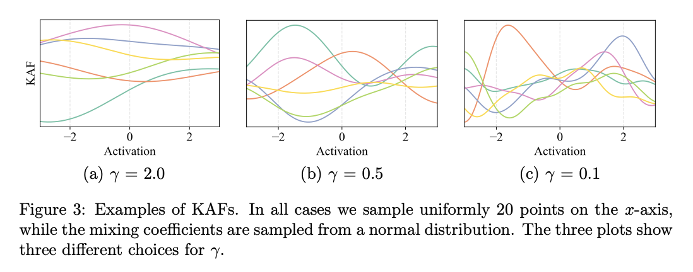

# ReLU

**Rectified Linear Units**, or **ReLUs**, are a type of activation function that are linear in the positive dimension, but zero in the negative dimension. The kink in the function is the source of the non-linearity. Linearity in the positive dimension has the attractive property that it prevents non-saturation of gradients (contrast with [sigmoid activations](https://paperswithcode.com/method/sigmoid-activation)), though for half of the real line its gradient is zero.

$$ f\left(x\right) = \max\left(0, x\right) $$

# Sigmoid Activation

**Sigmoid Activations** are a type of activation function for neural networks:

$$f\left(x\right) = \frac{1}{\left(1+\exp\left(-x\right)\right)}$$

Some drawbacks of this activation that have been noted in the literature are: sharp damp gradients during backpropagation from deeper hidden layers to inputs, gradient saturation, and slow convergence.

# Tanh Activation

**Tanh Activation** is an activation function used for neural networks:

$$f\left(x\right) = \frac{e^{x} - e^{-x}}{e^{x} + e^{-x}}$$

Historically, the tanh function became preferred over the [sigmoid function](https://paperswithcode.com/method/sigmoid-activation) as it gave better performance for multi-layer neural networks. But it did not solve the vanishing gradient problem that sigmoids suffered.

Image Source: [Junxi Feng](https://www.researchgate.net/profile/Junxi_Feng)

# GELU

The **Gaussian Error Linear Unit**, or **GELU**,  is an activation function. The GELU activation function is $x\Phi(x)$, where $\Phi(x)$ the standard Gaussian cumulative distribution function. The GELU nonlinearity weights inputs by their value, rather than gates inputs by their sign as in [ReLUs](https://paperswithcode.com/method/relu) ($x\mathbf{1}_{x&gt;0}$). Consequently the GELU can be thought of as a smoother ReLU.

$$\text{GELU}\left(x\right) = x{P}\left(X\leq{x}\right) = x\Phi\left(x\right) = x \cdot \frac{1}{2}\left[1 + \text{erf}(x/\sqrt{2})\right],$$
if $X\sim \mathcal{N}(0,1)$.

One can approximate the GELU with
$0.5x\left(1+\tanh\left[\sqrt{2/\pi}\left(x + 0.044715x^{3}\right)\right]\right)$ or $x\sigma\left(1.702x\right),$
but PyTorch's exact implementation is sufficiently fast such that these approximations may be unnecessary. (See also the [SiLU](https://paperswithcode.com/method/silu) $x\sigma(x)$ which was also coined in the paper that introduced the GELU.)

# Leaky ReLU

**Leaky Rectified Linear Unit**, or **Leaky ReLU**, is a type of activation function based on a [ReLU](https://paperswithcode.com/method/relu), but it has a small slope for negative values instead of a flat slope. The slope coefficient is decided **a priori**, i.e. it is not learnt during training.

# Swish

**Swish** (originally introduced the [SiLU](https://paperswithcode.com/method/silu)) is an activation function, $f(x) = x \cdot \text{sigmoid}(\beta x)$, $\beta$ a learnable parameter.
Nearly all implementations do not use the learnable parameter $\beta$, in which case the activation function is $x\sigma(x)$ ("Swish-1").

The function $x\sigma(x)$ is exactly the [SiLU](https://paperswithcode.com/method/silu), which was introduced by other authors before the swish.
See [Gaussian Error Linear Units](https://arxiv.org/abs/1606.08415) ([GELUs](https://paperswithcode.com/method/gelu)) where the SiLU (Sigmoid Linear Unit) was originally coined, and see [Sigmoid-Weighted Linear Units for Neural Network Function Approximation in Reinforcement Learning](https://arxiv.org/abs/1702.03118) and [Swish: a Self-Gated Activation Function](https://arxiv.org/abs/1710.05941v1) where the SiLU was experimented with later.

# Maxout

The **Maxout Unit** is a generalization of the [ReLU](https://paperswithcode.com/method/relu) and the [leaky ReLU](https://paperswithcode.com/method/leaky-relu) functions. It is a piecewise linear function that returns the maximum of the inputs, designed to be used in conjunction with dropout. Both ReLU and leaky ReLU are special cases of Maxout. 

$$f\left(x\right) = \max\left(w^{T}_{1}x + b_{1}, w^{T}_{2}x + b_{2}\right)$$

The main drawback of Maxout is that it is computationally expensive as it doubles the number of parameters for each neuron.

# PReLU

A **Parametric Rectified Linear Unit**, or **PReLU**, is an activation function that generalizes the traditional rectified unit with a slope for negative values. Formally:

$$f\left(y_{i}\right) = y_{i} \text{ if } y_{i} \ge 0$$
$$f\left(y_{i}\right) = a_{i}y_{i} \text{ if } y_{i} \leq 0$$

# Hermite Activations

Relevant Paper:
Lokhande, Vishnu Suresh, et al. "Generating Accurate Pseudo-Labels in Semi-Supervised Learning and Avoiding Overconfident Predictions via Hermite Polynomial Activations." Proceedings of the IEEE/CVF Conference on Computer Vision and Pattern Recognition. 2020.

Summary: We demonstrate the benefits of a "smooth" finite Hermite polynomial base as a substitute for "non-smooth" ReLUs.

Keywords:  Hermite Polynomials, activation functions, ReLU, pseudo-labels, semi-supervised learning, Faster Convergence, noise tolerance, Smoothness, Polynomial Networks, ResNet.

# ELU

The **Exponential Linear Unit** (ELU) is an activation function for neural networks. In contrast to [ReLUs](https://paperswithcode.com/method/relu), ELUs have negative values which allows them to push mean unit activations closer to zero like
batch normalization but with lower computational complexity. Mean shifts toward zero speed up learning by bringing the normal gradient closer to the unit natural gradient because of a reduced bias shift effect. While [LReLUs](https://paperswithcode.com/method/leaky-relu) and [PReLUs](https://paperswithcode.com/method/prelu) have negative values, too, they do not ensure a noise-robust deactivation state. ELUs saturate to a negative value with smaller inputs and thereby decrease the forward propagated variation and information.

The exponential linear unit (ELU) with $0 &lt; \alpha$ is:

$$f\left(x\right) = x \text{ if } x &gt; 0$$
$$\alpha\left(\exp\left(x\right) − 1\right) \text{ if } x \leq 0$$

# Softplus

**Softplus** is an activation function $f\left(x\right) = \log\left(1+\exp\left(x\right)\right)$. It can be viewed as a smooth version of [ReLU](https://paperswithcode.com/method/relu).

# SELU

**Scaled Exponential Linear Units**, or **SELUs**, are activation functions that induce self-normalizing properties.

The SELU activation function is given by 

$$f\left(x\right) = \lambda{x} \text{ if } x \geq{0}$$
$$f\left(x\right) = \lambda{\alpha\left(\exp\left(x\right) -1 \right)} \text{ if } x &lt; 0 $$

with $\alpha \approx 1.6733$ and $\lambda \approx 1.0507$.

# ReLU6

**ReLU6** is a modification of the [rectified linear unit](https://paperswithcode.com/method/relu) where we limit the activation to a maximum size of $6$. This is due to increased robustness when used with low-precision computation.

Image Credit: [PyTorch](https://pytorch.org/docs/master/generated/torch.nn.ReLU6.html)

# Hard Swish

**Hard Swish** is a type of activation function based on [Swish](https://paperswithcode.com/method/swish), but replaces the computationally expensive sigmoid with a piecewise linear analogue:

$$\text{h-swish}\left(x\right) = x\frac{\text{ReLU6}\left(x+3\right)}{6} $$

# GLU

A **Gated Linear Unit**, or **GLU** computes:

$$ \text{GLU}\left(a, b\right) = a\otimes \sigma\left(b\right) $$

It is used in natural language processing architectures, for example the [Gated CNN](https://paperswithcode.com/method/gated-convolution-network), because here $b$ is the gate that control what information from $a$ is passed up to the following layer. Intuitively, for a language modeling task, the gating mechanism allows selection of words or features that are important for predicting the next word. The GLU also has non-linear capabilities, but has a linear path for the gradient so diminishes the vanishing gradient problem.

# Mish

**Mish** is an activation function for neural networks which can be defined as:

$$ f\left(x\right) = x\cdot\tanh{\text{softplus}\left(x\right)}$$

where

$$\text{softplus}\left(x\right) = \ln\left(1+e^{x}\right)$$

# CReLU

**CReLU**, or **Concatenated Rectified Linear Units**, is a type of activation function which preserves both positive and negative phase information while enforcing non-saturated non-linearity. We compute by concatenating the layer output $h$ as:

$$ \left[\text{ReLU}\left(h\right), \text{ReLU}\left(-h\right)\right] $$

# RReLU

**Randomized Leaky Rectified Linear Units**, or **RReLU**, are an activation function that randomly samples the negative slope for activation values. It was first proposed and used in the Kaggle NDSB Competition. The highlight of RReLU is that in training process, $a_{ji}$ is a random number sampled from a uniform distribution $U\left(l, u\right)$. Formally:

$$ y_{ji} = x_{ji} \text{   if } x_{ji} \geq{0} $$
$$ y_{ji} = a_{ji}x_{ji} \text{   if } x_{ji} &lt; 0 $$

where

$$\alpha_{ji} \sim U\left(l, u\right), l &lt; u \text{ and } l, u \in \left[0,1\right)$$

In the test phase, we take average of all the $a_{ji}$ in training as in the method of dropout, and thus set $a_{ji}$ to $\frac{l+u}{2}$ to get a deterministic result. Suggested by the NDSB competition winner, $a_{ji}$ is sampled from $U\left(3, 8\right)$. We use the same configuration in this paper.

At test time, we use:

$$ y_{ji} = \frac{x_{ji}}{\frac{l+u}{2}} $$

# Hard Sigmoid

The **Hard Sigmoid** is an activation function used for neural networks of the form:

$$f\left(x\right) = \max\left(0, \min\left(1,\frac{\left(x+1\right)}{2}\right)\right)$$

Image Source: [Rinat Maksutov](https://towardsdatascience.com/deep-study-of-a-not-very-deep-neural-network-part-2-activation-functions-fd9bd8d406fc)

# KAF

A **Kernel Activation Function** is a non-parametric activation function defined as a one-dimensional kernel approximator:

$$ f(s) = \sum_{i=1}^D \alpha_i \kappa( s, d_i) $$

where:

1. The dictionary of the kernel elements $d_0, \ldots, d_D$ is fixed by sampling the $x$-axis with a uniform step around 0.
1. The user selects the kernel function (e.g., Gaussian, ReLU, Softplus) and the number of kernel elements $D$ as a hyper-parameter. A larger dictionary leads to more expressive activation functions and a larger number of trainable parameters.
1. The linear coefficients are adapted independently at every neuron via standard back-propagation.

In addition, the linear coefficients can be initialized using kernel ridge regression to behave similarly to a known function in the beginning of the optimization process.

# SReLU

The **S-shaped Rectified Linear Unit**, or **SReLU**, is an activation function for neural networks. It learns both convex and non-convex functions, imitating the multiple function forms given by the two fundamental laws, namely  the Webner-Fechner law and the Stevens law, in psychophysics and neural sciences. Specifically, SReLU consists of three piecewise linear functions, which are formulated by four learnable parameters. 

The SReLU is defined as a mapping:

$$ f\left(x\right) = t_{i}^{r}  + a^{r}_{i}\left(x_{i}-t^{r}_{i}\right) \text{ if } x_{i} \geq t^{r}_{i} $$
$$ f\left(x\right) = x_{i} \text{ if } t^{r}_{i} &gt; x &gt; t_{i}^{l}$$
$$ f\left(x\right) = t_{i}^{r}  + a^{l}_{i}\left(x_{i}-t^{l}_{i}\right) \text{ if } x_{i} \leq t^{l}_{i} $$

where $t^{l}_{i}$, $t^{r}_{i}$ and $a^{l}_{i}$ are learnable parameters of the network $i$ and indicates that the SReLU can differ in different channels. The parameter $a^{r}_{i}$ represents the slope of the right line with input above a set threshold. $t^{r}_{i}$ and $t^{l}_{i}$ are thresholds in positive and negative directions respectively.

Source: [Activation Functions](https://arxiv.org/pdf/1811.03378.pdf)

# modReLU

**modReLU** is an activation that is a modification of a [ReLU](https://paperswithcode.com/method/relu). It is a pointwise nonlinearity, $\sigma_{modReLU}\left(z\right) : C \rightarrow C$, which affects only the absolute value of a complex number, defined as:

$$ \sigma_{modReLU}\left(z\right) = \left(|z| + b\right)\frac{z}{|z|} \text{ if } |z| + b \geq 0 $$
$$ \sigma_{modReLU}\left(z\right) = 0 \text{ if } |z| + b \leq 0 $$

where $b \in \mathbb{R}$ is a bias parameter of the nonlinearity. For a $n_{h}$ dimensional hidden space we learn $n_{h}$ nonlinearity bias parameters, one per dimension.

# SiLU

** Sigmoid Linear Units**, or **SiLUs**, are activation functions for
neural networks. The activation of the SiLU is computed by the sigmoid function multiplied by its input, or $$ x\sigma(x).$$

See [Gaussian Error Linear Units](https://arxiv.org/abs/1606.08415) ([GELUs](https://paperswithcode.com/method/gelu)) where the SiLU was originally coined, and see [Sigmoid-Weighted Linear Units for Neural Network Function Approximation in Reinforcement Learning](https://arxiv.org/abs/1702.03118) and [Swish: a Self-Gated Activation Function](https://arxiv.org/abs/1710.05941v1) where the SiLU was experimented with later.

# PELU

**Parameterized Exponential Linear Units**, or **PELU**, is an activation function for neural networks. It involves learning a parameterization of [ELU](https://paperswithcode.com/method/elu) in order to learn the proper activation shape at each layer in a CNN. 

The PELU has two additional parameters over the ELU:

$$ f\left(x\right) = cx \text{ if } x &gt; 0 $$
$$ f\left(x\right) = \alpha\exp^{\frac{x}{b}} - 1 \text{ if } x \leq 0 $$

Where $a$, $b$, and $c &gt; 0$. Here $c$ causes a change in the slope in the positive quadrant, $b$ controls the scale of the exponential decay, and $\alpha$ controls the saturation in the negative quadrant.

Source: [Activation Functions](https://arxiv.org/pdf/1811.03378.pdf)

# ELiSH

The **Exponential Linear Squashing Activation Function**, or **ELiSH**, is an activation function used for neural networks. It shares common properties with [Swish](https://paperswithcode.com/method/swish), being made up of an [ELU](https://paperswithcode.com/method/elu) and a [Sigmoid](https://paperswithcode.com/method/sigmoid-activation):

$$f\left(x\right) = \frac{x}{1+e^{-x}} \text{ if } x \geq 0 $$
$$f\left(x\right) = \frac{e^{x} - 1}{1+e^{-x}} \text{ if } x &lt; 0 $$

The Sigmoid part of **ELiSH** improves information flow, while the linear parts solve issues of vanishing gradients.

# HardELiSH

**HardELiSH** is an activation function for neural networks.  The HardELiSH is a multiplication of the [HardSigmoid](https://paperswithcode.com/method/hard-sigmoid) and [ELU](https://paperswithcode.com/method/elu) in the negative part and a multiplication of the Linear and the HardSigmoid in the positive
part:

$$f\left(x\right) = x\max\left(0, \min\left(1, \left(\frac{x+1}{2}\right)\right) \right) \text{ if } x \geq 1$$
$$f\left(x\right) = \left(e^{x}-1\right)\max\left(0, \min\left(1, \left(\frac{x+1}{2}\right)\right)\right) \text{ if } x &lt; 0 $$

Source: [Activation Functions](https://arxiv.org/pdf/1811.03378.pdf)

# SERLU

**SERLU**, or **Scaled Exponentially-Regularized Linear Unit**, is a type of activation function. The new function introduces a bump-shaped function in the region of negative input. The bump-shaped function has approximately zero response to large negative input while being able to push the output of SERLU towards zero mean statistically.

$$ \text{SERLU}\left(x\right)) = \lambda_{serlu}x \text{ if } x \geq 0 $$
$$ \text{SERLU}\left(x\right)) = \lambda_{serlu}\alpha_{serlu}xe^{x} \text{ if } x &lt; 0 $$

where the two parameters $\lambda_{serlu} &gt; 0$ and $\alpha_{serlu} &gt; 0$ remain to be specified.

# Lecun's Tanh

**LeCun's tanh** is an activation function of the form $f\left(x\right) = 1.7159\tanh\left(\frac{2}{3}x\right)$. The constants were chosen to keep the variance of the output close to 1.

# Hardtanh Activation

**Hardtanh** is an activation function used for neural networks:

$$ f\left(x\right) = -1 \text{ if } x &lt; - 1 $$
$$ f\left(x\right) = x \text{ if } -1 \leq x \leq 1 $$
$$ f\left(x\right) = 1 \text{ if } x &gt; 1 $$

It is a cheaper and more computationally efficient version of the [tanh activation](https://paperswithcode.com/method/tanh-activation).

Image Source: [Zhuan Lan](https://zhuanlan.zhihu.com/p/30385380)

# Softsign Activation

**Softsign** is an activation function for neural networks:

$$ f\left(x\right) = \left(\frac{x}{|x|+1}\right)$$

Image Source: [Sefik Ilkin Serengil](https://sefiks.com/2017/11/10/softsign-as-a-neural-networks-activation-function/)

