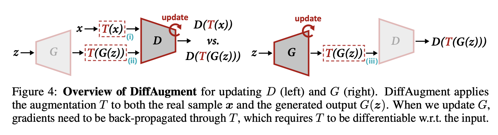

# [AdvProp](https://paperswithcode.com/method/advprop)

**AdvProp** is an adversarial training scheme which treats adversarial examples as additional examples, to prevent overfitting. Key to the method is the usage of a separate auxiliary batch norm for adversarial examples, as they have different underlying distributions to normal examples.

source: [source]https://arxiv.org/abs/1911.09665v2
# [Singular Value Clipping](https://paperswithcode.com/method/singular-value-clipping)

**Singular Value Clipping (SVC)** is an adversarial training technique used by [TGAN](https://paperswithcode.com/method/tgan) to enforce the 1-Lipschitz constraint of the WGAN objective. It is a constraint to all linear layers in the discriminator that satisfies the spectral norm of weight parameter $W$ is equal or less than one. This
means that the singular values of weight matrix are all one or less. Therefore singular value decomposition (SVD) is performed after a parameter update, replacing all the singular values larger than one with one, and the parameters are reconstructed with them. The same operation is applied to convolutional layers by interpreting a higher order tensor in weight parameter as a matrix $\hat{W}$.

source: [source]http://arxiv.org/abs/1611.06624v3
# [DiffAugment](https://paperswithcode.com/method/diffaugment)

**Differentiable Augmentation (DiffAugment)** is a set of differentiable image transformations used to augment data during GAN training. The transformations are applied to the real and generated images.

source: [source]https://arxiv.org/abs/2006.10738v1
