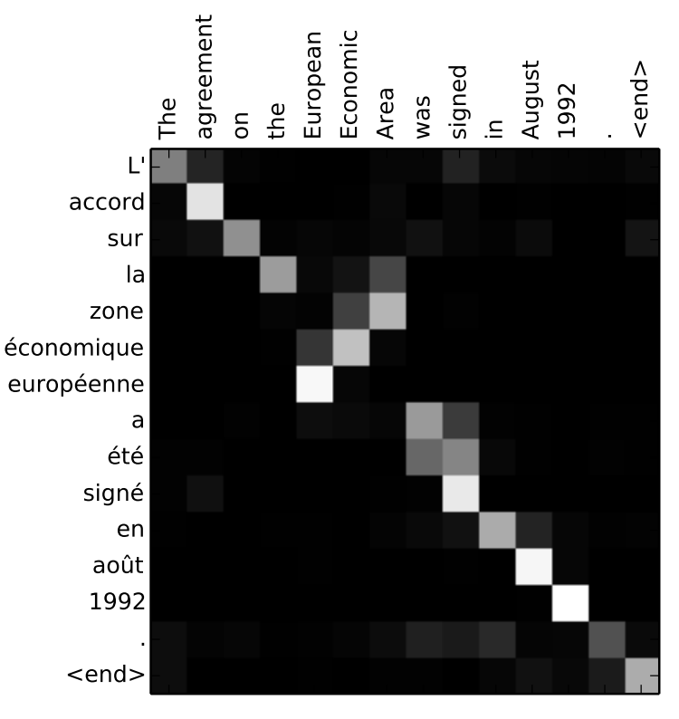
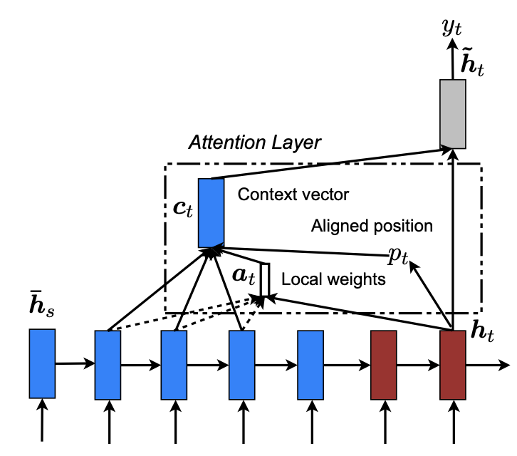
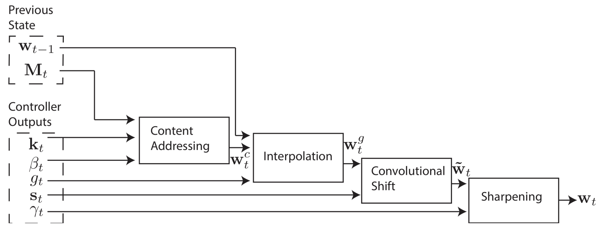
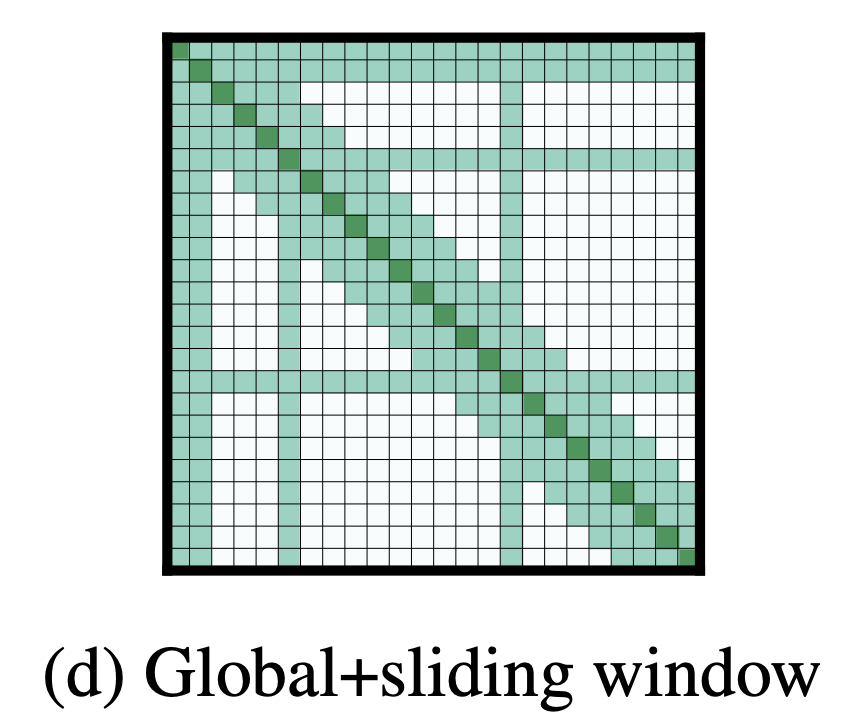
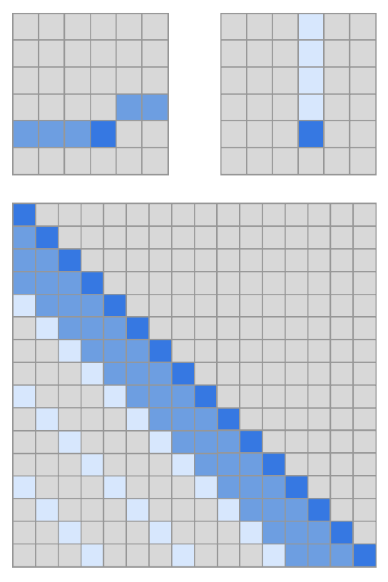
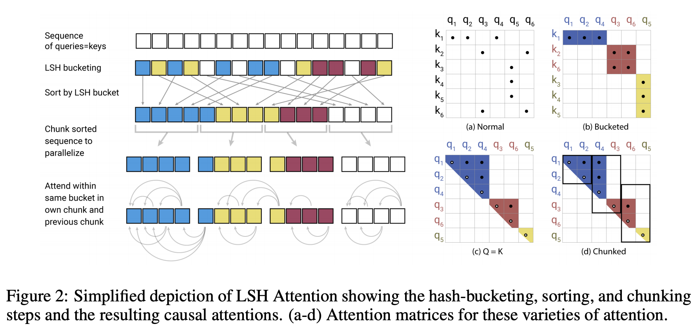
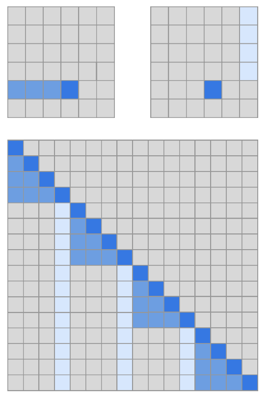
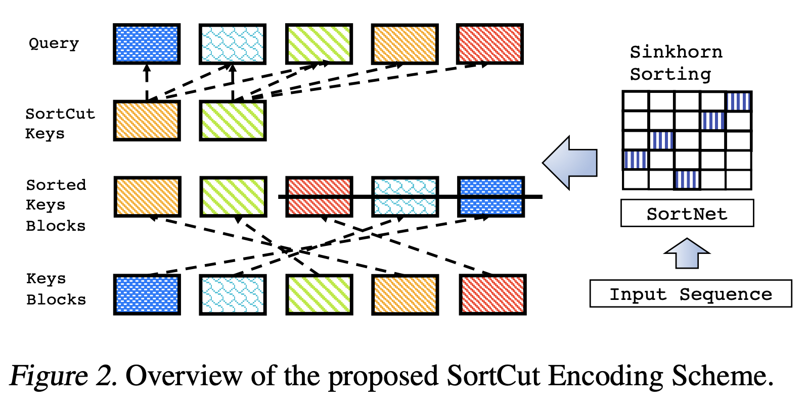
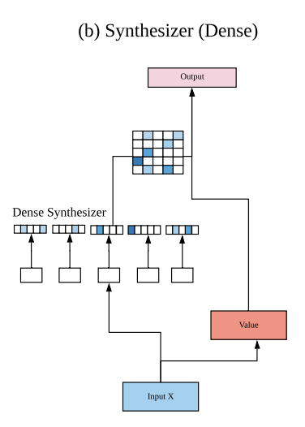
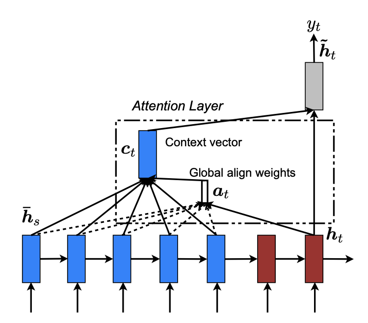

# Scaled Dot-Product Attention

**Scaled dot-product attention** is an attention mechanism where the dot products are scaled down by $\sqrt{d_k}$. Formally:

$$ {\text{Attention}}(Q, K, V) = \text{softmax}(\frac{QK^{T}}{\sqrt{d_k}})V $$

If we assume that $q$ and $k$ are $d_k$-dimensional vectors whose components are independent random variables with mean $0$ and variance $1$, then their dot product, $q \cdot k = \sum_{i=1}^{d_k} u_iv_i$, has mean $0$ and variance $d_k$.  Since we would prefer these values to have variance $1$, we divide by $\sqrt{d_k}$.

# Additive Attention

**Additive Attention** uses a one-hidden layer feed-forward network to calculate the attention alignment:

$$f_{att}\left(\textbf{h}_{i}, \textbf{s}_{j}\right) = v_{a}^{T}\tanh\left(\textbf{W}_{a}\left[\textbf{h}_{i};\textbf{s}_{j}\right]\right)$$

where $\textbf{v}_{a}$ and $\textbf{W}_{a}$ are learned attention parameters.

# Dot-Product Attention

**Dot-Product Attention** is an attention mechanism where the alignment score function is calculated as: 

$$f_{att}\left(\textbf{h}_{i}, \textbf{s}_{j}\right) = h_{i}^{T}s_{j}$$

It is equivalent to [multiplicative attention](https://paperswithcode.com/method/multiplicative-attention) (without a trainable weight matrix, assuming this is instead an identity matrix).

# Location-based Attention

**Location-based Attention** is an attention mechanism in which the alignment scores are computed from solely the target hidden state $s_{t}$ as follows:

$$ a_{t, i} = \text{softmax}(W_{a}s_{t}) $$

# Content-based Attention

**Content-based attention** is an attention mechanism based on cosine similarity:

$$f_{att}\left(\textbf{h}_{i}, \textbf{s}_{j}\right) = \cos\left[\textbf{h}_{i};\textbf{s}_{j}\right] $$

It was utilised in [Neural Turing Machines](https://paperswithcode.com/method/neural-turing-machine) as part of the Addressing Mechanism.

# Location Sensitive Attention

**Location Sensitive Attention** is an attention mechanism that extends the [additive attention mechanism](https://paperswithcode.com/method/additive-attention) to use cumulative attention weights from previous decoder time steps as an additional feature. This encourages the model to move forward consistently through the input, mitigating potential failure modes where some subsequences are repeated or ignored by the decoder.

Starting with additive attention where:

$$ e_{i, j} = w^{T}\tanh\left(W{s}_{i-1} + Vh_{j} + b\right) $$

where $w$ and $b$ are vectors, $W$ and $V$ are matrices. We extend this to be location-aware by making it take into account the alignment produced at the previous step. First, we extract $k$ vectors
$f_{i,j} \in \mathbb{R}^{k}$ for every position $j$ of the previous alignment $\alpha_{i−1}$ by convolving it with a matrix $F \in R^{k\times{r}}$:

$$ f_{i} = F ∗ \alpha_{i−1} $$

These additional vectors $f_{i,j}$ are then used by the scoring mechanism $e_{i,j}$:

$$ e_{i,j} = w^{T}\tanh\left(Ws_{i−1} + Vh_{j} + Uf_{i,j} + b\right) $$

# LAMA

Please enter a description about the method here

# Channel-wise Soft Attention

**Chanel-wise Soft Attention** is an attention mechanism in computer vision where alignment weights are learned each feature-map channel is produced using a weighted combination over splits in the input. For example the he $c$-th channel is calculated as:
$$
    V^k_c=\sum_{i=1}^R a^k_i(c) U_{R(k-1)+i} ,
$$
where $U$ is the representation input, and where $a_i^k(c)$ denotes a (soft) assignment weight given by:

$$
a_i^k(c) =
\begin{cases}
  \frac{exp(\mathcal{G}^c_i(s^k))}{\sum_{j=0}^R exp(\mathcal{G}^c_j(s^k))} &amp; \quad\textrm{if } R&gt;1, \
   \frac{1}{1+exp(-\mathcal{G}^c_i(s^k))} &amp; \quad\textrm{if } R=1,\
\end{cases}
$$

and mapping $\mathcal{G}_i^c$ determines the weight of each split for the $c$-th channel based on the global context representation $s^k$.

# Global and Sliding Window Attention

**Global and Sliding Window Attention** is an attention pattern for attention-based models. It is motivated by the fact that non-sparse attention in the original [Transformer](https://paperswithcode.com/method/transformer) formulation has a self-attention component with $O\left(n^{2}\right)$ time and memory complexity where $n$ is the input sequence length and thus, is not efficient to scale to long inputs. 

Since windowed and dilated attention patterns are not flexible enough to learn task-specific representations, the authors of the [Longformer](https://paperswithcode.com/method/longformer) add “global attention” on few pre-selected input locations. This attention is operation symmetric: that is, a token with a global attention attends to all tokens across the sequence, and all tokens in the sequence attend to it. The Figure to the right shows an example of a sliding window attention with global attention at a few tokens at custom locations. For example for classification, global attention is used for the [CLS] token while in QA global attention is provided on all question tokens.

# Strided Attention

**Strided Attention** is a factorized attention pattern that has one head attend to the previous
$l$ locations, and the other head attend to every $l$th location, where $l$ is the stride and chosen to be close to $\sqrt{n}$. It was proposed as part of the [Sparse Transformer](https://paperswithcode.com/method/sparse-transformer) architecture.

Formally, $A^{(1)}_{i} = ${$t, t + 1, ..., i$} for $t = \max\left(0, i − l\right)$, and $A^{(2)}_{i} = ${$j : (i − j) \mod l = 0$}. The $i$-th output vector of the attention head attends to all input vectors either from $A^{(1)}_{i}$ or $A^{(2)}_{i}$. This pattern can be visualized in the figure to the right.

This formulation is convenient if the data naturally has a structure that aligns with the stride, like images or some types of music. For data without a periodic structure, like text, however, we find that the network can fail to properly route information with the strided pattern, as spatial coordinates for an element do not necessarily correlate with the positions where the element may be most relevant in the future.

# Sliding Window Attention

**Sliding Window Attention** is an attention pattern for attention-based models. It was proposed as part of the [Longformer](https://paperswithcode.com/method/longformer) architecture. It is motivated by the fact that non-sparse attention in the original [Transformer](https://paperswithcode.com/method/transformer) formulation has a self-attention component with $O\left(n^{2}\right)$ time and memory complexity where $n$ is the input sequence length and thus, is not efficient to scale to long inputs. Given the importance of local context, this attention pattern employs a fixed-size window attention surrounding each token. Using multiple stacked layers of such windowed attention results in a large receptive field, where top layers have access to all input locations and have the capacity to build representations that incorporate information across the entire input. 

More formally, in this attention pattern, given a fixed window size $w$, each token attends to $\frac{1}{2}w$ tokens on each side. The computation complexity of this pattern is $O\left(n×w\right)$,
which scales linearly with input sequence length $n$. To make this attention pattern efficient, $w$ should be small compared with $n$. But a model with typical multiple stacked transformers will have a large receptive field. This is analogous to CNNs where stacking layers of small kernels leads to high level features that are built from a large portion of the input (receptive field)

In this case, with a transformer of $l$ layers, the receptive field size is $l × w$ (assuming
$w$ is fixed for all layers). Depending on the application, it might be helpful to use different values of $w$ for each layer to balance between efficiency and model representation capacity.

# LSH Attention

**LSH Attention**, or **Locality Sensitive Hashing Attention** is a replacement for dot-product attention with one that uses locality-sensitive hashing, changing its complexity from O($L^2$) to O($L\log L$), where $L$ is the length of the sequence. LSH refers to a family of functions (known as LSH families) to hash data points into buckets so that data points near each other are located in the same buckets with high probability, while data points far from each other are likely to be in different buckets. It was proposed as part of the [Reformer](https://paperswithcode.com/method/reformer) architecture.

# Fixed Factorized Attention

**Fixed Factorized Attention** is a factorized attention pattern where specific cells summarize previous locations and propagate that information to all future cells. It was proposed as part of the [Sparse Transformer](https://paperswithcode.com/method/sparse-transformer) architecture.

Formally, $A^{(1)}_{i} = ${$j : \left(\lfloor{j/l\rfloor}=\lfloor{i/l\rfloor}\right)$}, where the brackets denote the floor operation, and $A^{(2)}_{i} = ${$j : j \mod l \in ${$t, t+1, \ldots, l$}}, where $t=l-c$ and $c$ is a hyperparameter. The $i$-th output vector of the attention head attends to all input vectors either from $A^{(1)}_{i}$ or $A^{(2)}_{i}$. This pattern can be visualized in the figure to the right.

If the stride is 128 and $c = 8$, then all future positions greater than 128 can attend to positions 120-128, all positions greater than 256 can attend to 248-256, and so forth. 

A fixed-attention pattern with $c = 1$ limits the expressivity of the network significantly, as many representations in the network are only used for one block whereas a small number of locations are used by all blocks. The authors found choosing $c \in ${$8, 16, 32$} for typical values of $l \in
{128, 256}$ performs well, although this increases the computational cost of this method by $c$ in comparison to the strided attention.

Additionally, the authors found that when using multiple heads, having them attend to distinct subblocks of length $c$ within the block of size $l$ was preferable to having them attend to the same subblock.

# Dilated Sliding Window Attention

**Dilated Sliding Window Attention** is an attention pattern for attention-based models. It was proposed as part of the [Longformer](https://paperswithcode.com/method/longformer) architecture. It is motivated by the fact that non-sparse attention in the original [Transformer](https://paperswithcode.com/method/transformer) formulation has a self-attention component with $O\left(n^{2}\right)$ time and memory complexity where $n$ is the input sequence length and thus, is not efficient to scale to long inputs. 

Compared to a Sliding Window Attention pattern, we can further increase the receptive field without increasing computation by making the sliding window "dilated". This is analogous to [dilated CNNs](https://paperswithcode.com/method/dilated-convolution) where the window has gaps of size dilation $d$. Assuming a fixed $d$ and $w$ for all layers, the receptive field is $l × d × w$, which can reach tens of thousands of tokens even for small values of $d$. In multi-headed attention, each attention head computes a different attention score.

# SortCut Sinkhorn Attention

**SortCut Sinkhorn Attention** is a variant of [Sparse Sinkhorn Attention](https://paperswithcode.com/method/sparse-sinkhorn-attention) where a post-sorting truncation of the input sequence is performed, essentially performing a hard top-k operation on the input sequence blocks within the computational graph. While most attention models mainly re-weight or assign near-zero weights during training, this allows for explicitly and dynamically truncate the input sequence. Specifically:

$$ Y = \text{Softmax}\left(Q{\psi_{S}}\left(K\right)^{T}_{\left[:n\right]}\right)\psi_{S}\left(V\right)_{\left[:n\right]} $$

where $n$ is the Sortfut budget hyperparameter.

# Factorized Dense Synthesized Attention

**Factorized Dense Synthesized Attention** is a synthesized attention mechanism, similar to dense synthesized attention, but we factorize the outputs to reduce parameters and prevent overfitting. It was proposed as part of the [Synthesizer](https://paperswithcode.com/method/synthesizer) architecture. The factorized variant of the dense synthesizer can be expressed as follows:

$$A, B = F_{A}\left(X_{i}\right), F_{B}\left(X_{i}\right)$$

where $F_{A}\left(.\right)$ projects input $X_{i}$ into $a$ dimensions, $F_B\left(.\right)$ projects $X_{i}$ to $b$ dimensions, and $a \text{ x } b = l$. The output of the factorized module is now written as:

$$ Y = \text{Softmax}\left(C\right)G\left(X\right) $$

where $C = H_{A}\left(A\right) * H_{B}\left(B\right)$, where $H_{A}$, $H_{B}$ are tiling functions and $C \in \mathbb{R}^{l \text{ x } l}$. The tiling function simply duplicates the vector $k$ times, i.e., $\mathbb{R}^{l} \rightarrow \mathbb{R}^{lk}$. In this case, $H_{A}\left(\right)$ is a projection of $\mathbb{R}^{a} \rightarrow \mathbb{R}^{ab}$ and $H_{B}\left(\right)$ is a projection of $\mathbb{R}^{b} \rightarrow \mathbb{R}^{ba}$. To avoid having similar values within the same block, we compose the outputs of $H_{A}$ and $H_{B}$.

# Dense Synthesized Attention

**Dense Synthesized Attention**, introduced with the [Synthesizer](https://paperswithcode.com/method/synthesizer) architecture, is a type of synthetic attention mechanism that replaces the notion of query-key-values in the self-attention module and directly synthesizes the alignment matrix instead. Dense attention is conditioned on each input token. The method accepts an input $X \in \mathbb{R}^{l\text{ x }d}$ and produces an output of $Y \in \mathbb{R}^{l\text{ x }d}$. Here $l$ refers to the sequence length and $d$ refers to the dimensionality of the model. We first adopt $F\left(.\right)$, a parameterized function, for projecting input $X_{i}$ from $d$ dimensions to $l$ dimensions.

$$B_{i} = F\left(X_{i}\right)$$

where $F\left(.\right)$ is a parameterized function that maps $\mathbb{R}^{d}$ to $\mathbb{R}^{l}$ and $i$ is the $i$-th token of $X$. Intuitively, this can be interpreted as learning a token-wise projection to the sequence length $l$. Essentially, with this model, each token predicts weights for each token in the input sequence. In practice, a simple two layered feed-forward layer with ReLU activations for $F\left(.\right)$ is adopted:

$$ F\left(X\right) = W\left(\sigma_{R}\left(W(X) + b\right)\right) + b$$

where $\sigma_{R}$ is the ReLU activation function. Hence, $B$ is now of $\mathbb{R}^{l\text{ x }d}$. Given $B$, we now compute:

$$ Y = \text{Softmax}\left(B\right)G\left(X\right) $$

where $G\left(.\right)$ is another parameterized function of $X$ that is analogous to $V$ (value) in the standard Transformer model. This approach eliminates the dot product altogether by replacing $QK^{T}$ in standard Transformers with the synthesizing function $F\left(.\right)$.

# Routing Attention

**Routed Attention** is an attention pattern proposed as part of the [Routing Transformer](https://paperswithcode.com/method/routing-transformer) architecture.  Each attention module
considers a clustering of the space: the current timestep only attends to context belonging to the same cluster. In other word, the current time-step query is routed to a limited number of context through its cluster assignment. This can be contrasted with [strided](https://paperswithcode.com/method/strided-attention) attention patterns and those proposed with the [Sparse Transformer](https://paperswithcode.com/method/sparse-transformer).

In the image to the right, the rows represent the outputs while the columns represent the inputs. The different colors represent cluster memberships for the output token.

# Adaptive Masking

**Adaptive Masking** is a type of attention mechanism that allows a model to learn its own context size to attend over. For each head in [Multi-Head Attention](https://paperswithcode.com/method/multi-head-attention), we add a masking function to control for the span of the attention. A masking function is a non-increasing function that maps a
distance to a value in $\left[0, 1\right]$. We take the following soft masking function $m_{z}$ parametrized by a real value $z$ in $\left[0, S\right]$:

$$ m_{z}\left(x\right) = \min\left[\max\left[\frac{1}{R}\left(R+z-x\right), 0\right], 1\right] $$

where $R$ is a hyper-parameter that controls its softness. The shape of this piecewise function as a function of the distance. This soft masking function is inspired by [Jernite et al. (2017)](https://arxiv.org/abs/1611.06188). The attention weights from are then computed on the masked span:

$$ a_{tr} = \frac{m_{z}\left(t-r\right)\exp\left(s_{tr}\right)}{\sum^{t-1}_{q=t-S}m_{z}\left(t-q\right)\exp\left(s_{tq}\right)}$$

We add a $\mathcal{l}_{1}$ penalization on the parameters $z_{i}$ for each attention head $i$ of the model to the loss function:

$$ L = - \log{P}\left(w_{1}, \dots, w_{T}\right) + \frac{\lambda}{M}\sum_{i}z_{i} $$

where $\lambda &gt; 0$ is the regularization hyperparameter, and $M$ is the number of heads in each
layer. This formulation is differentiable in the parameters $z_{i}$, and learnt jointly with the rest of the model.

# Sparse Sinkhorn Attention

**Sparse Sinkhorn Attention** is an attention mechanism that reduces the memory complexity of the dot-product attention mechanism and is capable of learning sparse attention outputs. It is based on the idea of differentiable sorting of internal representations within the self-attention module. SSA incorporates a meta sorting network that learns to rearrange and sort input sequences. Sinkhorn normalization is used to normalize the rows and columns of the sorting matrix. The actual SSA attention mechanism then acts on the block sorted sequences.

# Factorized Random Synthesized Attention

**Factorized Random Synthesized Attention**, introduced with the [Synthesizer](https://paperswithcode.com/method/synthesizer) architecture, is similar to factorized dense synthesized attention but for random synthesizers. We factorize $R$ into low rank matrices $R_{1}, R_{2} \in \mathbb{R}^{l\text{ x}k}$:

$$ Y = \text{Softmax}\left(R_{1}R_{2}^{T}\right)G\left(X\right) . $$

Therefore for each head, this reduces the parameter costs from $l^{2}$ to $2\left(lk\right)$ where
$k &lt;&lt; l$ and hence helps prevent overfitting. In practice, we use a small value of $k = 8$.

# Random Synthesized Attention

Dense Synthesized Attention, introduced with the [Synthesizer](https://paperswithcode.com/method/synthesizer) architecture, learns synthetic attention by conditioning on each input of $X$ and projecting to $l$ dimensions. Hence, the Dense Synthesizer conditions on each token independently, as opposed to pairwise token interactions in the vanilla Transformer model. In contrast, **Random Synthesized Attention** is where the attention weights are not conditioned on any input tokens. Instead, the attention weights are initialized to random values. These values can then either be trainable or kept fixed. Let $R$ be a randomly initialized matrix. Random Synthesized Attention is defined as:

$$Y = \text{Softmax}\left(R\right)G\left(X\right) $$

where $R \in \mathbb{R}^{l \text{ x } l}$. Notably, each head adds 2 parameters to the overall network. The basic idea of the Random Synthesizer is to not rely on pairwise token interactions or any information from individual token but rather to learn a task-specific alignment that works well globally across many samples. This is a direct generalization of the recently proposed fixed self-attention patterns of Raganato et al (2020).

# Multiplicative Attention

**Multiplicative Attention** is an attention mechanism where the alignment score function is calculated as:

$$f_{att}\left(\textbf{h}_{i}, \textbf{s}_{j}\right) = h_{i}^{T}\textbf{W}_{a}s_{j}$$

Additive and multiplicative attention are similar in complexity, although multiplicative attention is faster and more space-efficient in practice as it can be implemented more efficiently using matrix multiplication. Both variants perform similar for small dimensionality $d_{h}$ of the decoder states, but additive attention performs better for larger dimensions. One way to mitigate this is to scale $f_{att}\left(\textbf{h}_{i}, \textbf{s}_{j}\right)$ by $1/\sqrt{d_{h}}$ as with [scaled dot-product atttention](https://paperswithcode.com/method/scaled).

