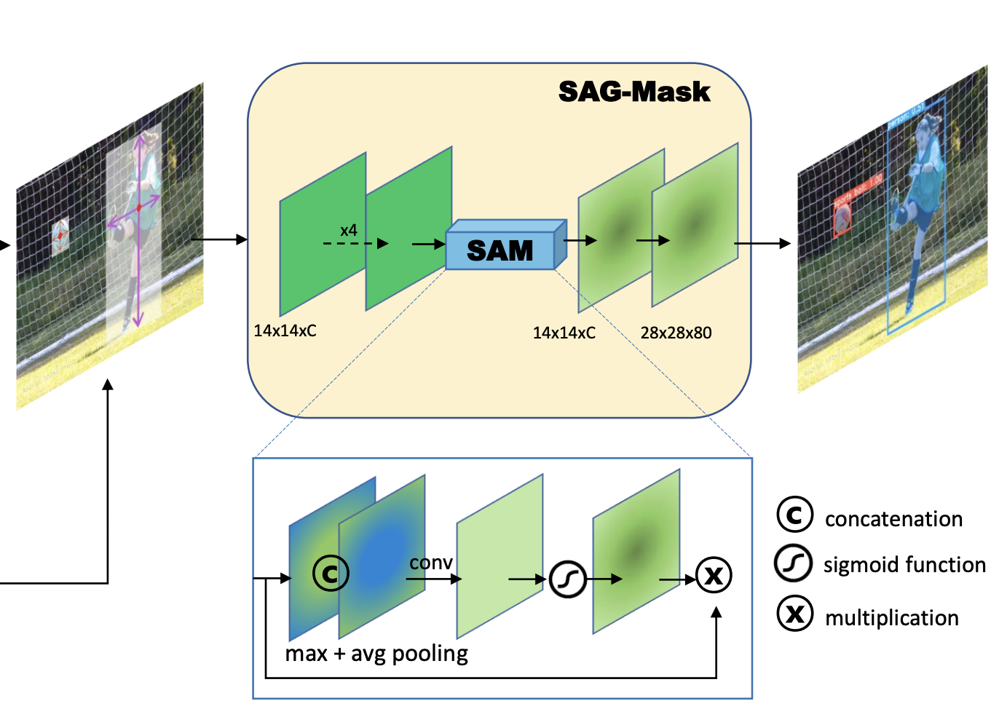
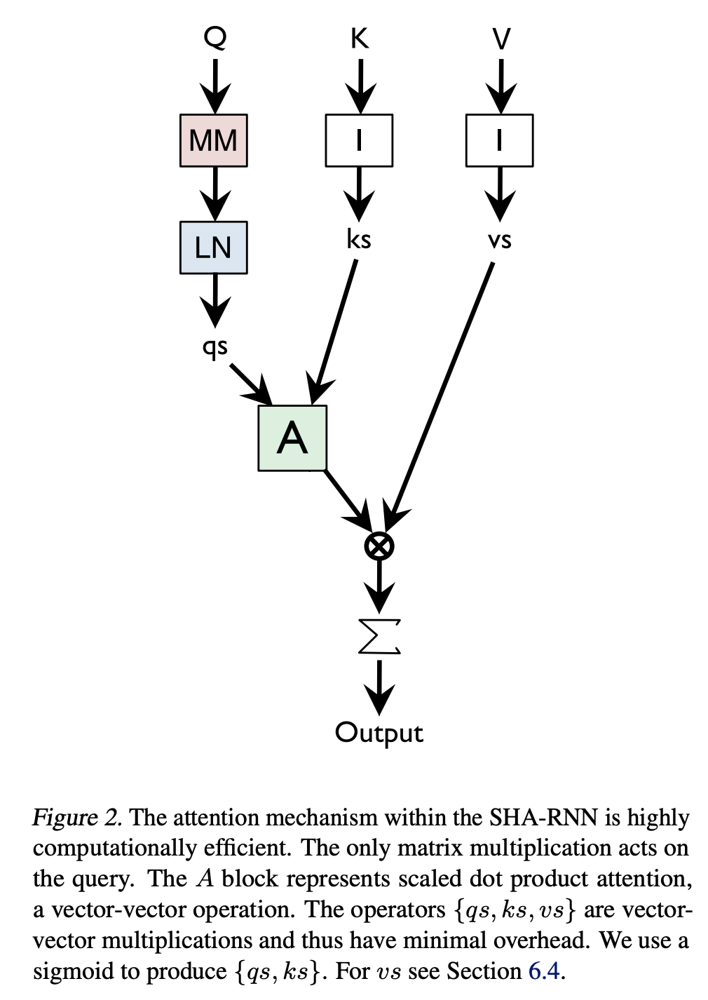
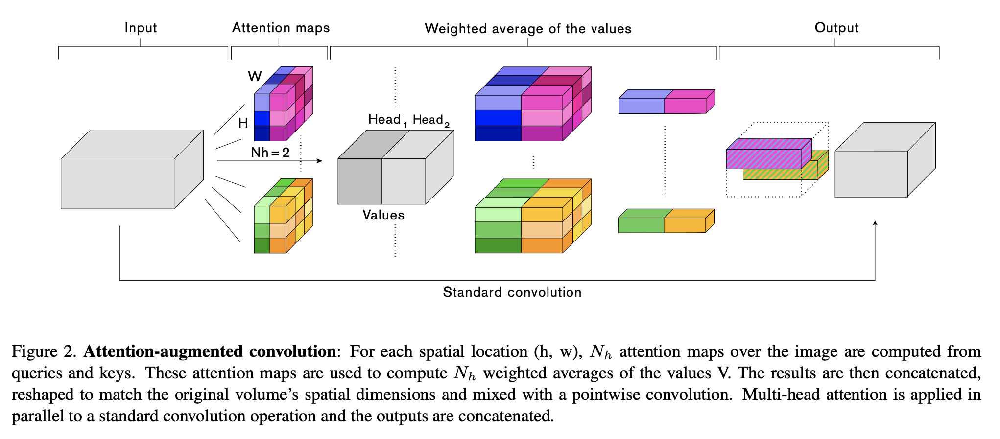
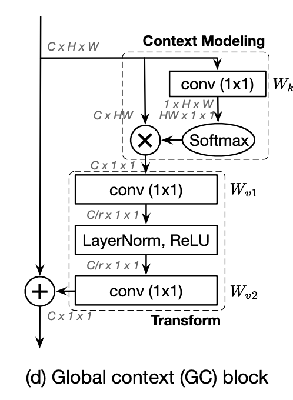
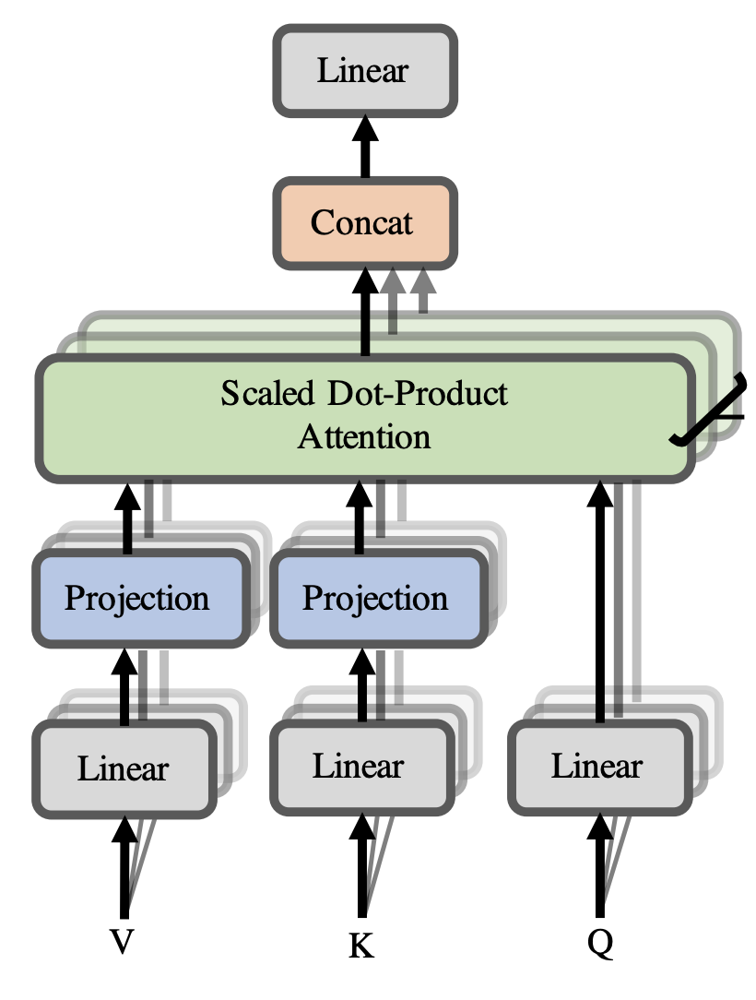

# Multi-Head Attention

**Multi-head Attention** is a module for attention mechanisms which runs through an attention mechanism several times in parallel. The independent attention outputs are then concatenated and linearly transformed into the expected dimension. Intuitively, multiple attention heads allows for attending to parts of the sequence differently (e.g. longer-term dependencies versus shorter-term dependencies). 

$$ \text{MultiHead}\left(\textbf{Q}, \textbf{K}, \textbf{V}\right) = \left[\text{head}_{1},\dots,\text{head}_{h}\right]\textbf{W}_{0}$$

$$\text{where} \text{ head}_{i} = \text{Attention} \left(\textbf{Q}\textbf{W}_{i}^{Q}, \textbf{K}\textbf{W}_{i}^{K}, \textbf{V}\textbf{W}_{i}^{V} \right) $$

Above $\textbf{W}$ are all learnable parameter matrices.

Note that scaled dot-product attention is most commonly used in this module, although in principle it can be swapped out for other types of attention mechanism.

Source: [Lilian Weng](https://lilianweng.github.io/lil-log/2018/06/24/attention-attention.html#a-family-of-attention-mechanisms) 

# SAGAN Self-Attention Module

The **SAGAN Self-Attention Module** is a self-attention module used in the Self-Attention GAN architecture for image synthesis.

The image features from the previous hidden layer $\textbf{x} \in \mathbb{R}^{C\text{x}N}$ are first transformed into two feature spaces $\textbf{f}$, $\textbf{g}$ to calculate the attention, where $\textbf{f(x) = W}_{\textbf{f}}{\textbf{x}}$, $\textbf{g}(\textbf{x})=\textbf{W}_{\textbf{g}}\textbf{x}$:

$$\beta_{j, i} = \frac{\exp\left(s_{ij}\right)}{\sum^{N}_{i=1}\exp\left(s_{ij}\right)} $$

$$ \text{where } s_{ij} = \textbf{f}(\textbf{x}_{i})^{T}\textbf{g}(\textbf{x}_{i}) $$

and $\beta_{j, i}$ indicates the extent to which the model attends to the $i$th location when synthesizing the $j$th region. Here, $C$ is the number of channels and $N$ is the number of feature
locations of features from the previous hidden layer. The output of the attention layer is $\textbf{o} = \left(\textbf{o}_{\textbf{1}}, \textbf{o}_{\textbf{2}}, \ldots, \textbf{o}_{\textbf{j}} , \ldots, \textbf{o}_{\textbf{N}}\right) \in \mathbb{R}^{C\text{x}N}$ , where,

$$ \textbf{o}_{\textbf{j}} = \textbf{v}\left(\sum^{N}_{i=1}\beta_{j, i}\textbf{h}\left(\textbf{x}_{\textbf{i}}\right)\right) $$

$$ \textbf{h}\left(\textbf{x}_{\textbf{i}}\right) = \textbf{W}_{\textbf{h}}\textbf{x}_{\textbf{i}} $$

$$ \textbf{v}\left(\textbf{x}_{\textbf{i}}\right) = \textbf{W}_{\textbf{v}}\textbf{x}_{\textbf{i}} $$

In the above formulation, $\textbf{W}_{\textbf{g}} \in \mathbb{R}^{\bar{C}\text{x}C}$, $W_{f} \in \mathbb{R}^{\bar{C}\text{x}C}$, $\textbf{W}_{\textbf{h}} \in \mathbb{R}^{\bar{C}\text{x}C}$ and $\textbf{W}_{\textbf{v}} \in \mathbb{R}^{C\text{x}\bar{C}}$ are the learned weight matrices, which are implemented as $1$×$1$ convolutions. 

In addition, the module further multiplies the output of the attention layer by a scale parameter and add back the input feature map. Therefore, the final output is given by,

$$\textbf{y}_{\textbf{i}} = \gamma\textbf{o}_{\textbf{i}} + \textbf{x}_{\textbf{i}}$$

where $\gamma$ is a learnable scalar and it is initialized as 0. Introducing $\gamma$ allows the network to first rely on the cues in the local neighborhood – since this is easier – and then gradually learn to assign more weight to the non-local evidence.

# Spatial Attention Module

A **Spatial Attention Module** is a module for spatial attention in convolutional neural networks. It generates a spatial attention map by utilizing the inter-spatial relationship of features. Different from the channel attention, the spatial attention focuses on where is an informative part, which is complementary to the channel attention. To compute the spatial attention, we first apply average-pooling and max-pooling operations along the channel axis and concatenate them to generate an efficient feature descriptor. On the concatenated feature descriptor, we apply a convolution layer to generate a spatial attention map $\textbf{M}_{s}\left(F\right) \in \mathcal{R}^{H×W}$ which encodes where to emphasize or suppress. We describe the detailed operation below.

We aggregate channel information of a feature map by using two pooling operations, generating two 2D maps: $\mathbf{F}^{s}_{avg} \in \mathbb{R}^{1\times{H}\times{W}}$ and $\mathbf{F}^{s}_{max} \in \mathbb{R}^{1\times{H}\times{W}}$. Each denotes average-pooled features and max-pooled features across the channel. Those are then concatenated and convolved by a standard convolution layer, producing the 2D spatial attention map. In short, the spatial attention is computed as:

$$ \textbf{M}_{s}\left(F\right) = \sigma\left(f^{7x7}\left(\left[\text{AvgPool}\left(F\right);\text{MaxPool}\left(F\right)\right]\right)\right) $$

$$ \textbf{M}_{s}\left(F\right) = \sigma\left(f^{7x7}\left(\left[\mathbf{F}^{s}_{avg};\mathbf{F}^{s}_{max} \right]\right)\right) $$

where $\sigma$ denotes the sigmoid function and $f^{7×7}$ represents a convolution operation with the filter size of 7 × 7.

# Channel Attention Module

A **Channel Attention Module** is a module for channel-based attention in convolutional neural networks. We produce a channel attention map by exploiting the inter-channel relationship of features. As each channel of a feature map is considered as a feature detector, channel attention focuses on ‘what’ is meaningful given an input image. To compute the channel attention efficiently, we squeeze the spatial dimension of the input feature map. 

We first aggregate spatial information of a feature map by using both average-pooling and max-pooling operations, generating two different spatial context descriptors: $\mathbf{F}^{c}_{avg}$ and $\mathbf{F}^{c}_{max}$, which denote average-pooled features and max-pooled features respectively. 

Both descriptors are then forwarded to a shared network to produce our channel attention map $\mathbf{M}_{c} \in \mathbb{R}^{C\times{1}\times{1}}$. The shared network is composed of multi-layer perceptron (MLP) with one hidden layer. To reduce parameter overhead, the hidden activation size is set to $\mathbb{R}^{C/r×1×1}$, where $r$ is the reduction ratio. After the shared network is applied to each descriptor, we merge the output feature vectors using element-wise summation. In short, the channel attention is computed as:

$$  \mathbf{M_{c}}\left(\mathbf{F}\right) = \sigma\left(\text{MLP}\left(\text{AvgPool}\left(\mathbf{F}\right)\right)+\text{MLP}\left(\text{MaxPool}\left(\mathbf{F}\right)\right)\right) $$

$$  \mathbf{M_{c}}\left(\mathbf{F}\right) = \sigma\left(\mathbf{W_{1}}\left(\mathbf{W_{0}}\left(\mathbf{F}^{c}_{avg}\right)\right) +\mathbf{W_{1}}\left(\mathbf{W_{0}}\left(\mathbf{F}^{c}_{max}\right)\right)\right) $$

where $\sigma$ denotes the sigmoid function, $\mathbf{W}_{0} \in \mathbb{R}^{C/r\times{C}}$, and $\mathbf{W}_{1} \in \mathbb{R}^{C\times{C/r}}$. Note that the MLP weights, $\mathbf{W}_{0}$ and $\mathbf{W}_{1}$, are shared for both inputs and the ReLU activation function is followed by $\mathbf{W}_{0}$.

Note that the channel attention module with just average pooling is the same as the SE module.

# Spatial Attention-Guided Mask

**A Spatial Attention-Guided Mask** predicts a segmentation mask on each detected box with a spatial attention map that helps to focus on informative pixels and suppress noise. The goal is to guide the mask head for spotlighting meaningful pixels and repressing uninformative ones. 

Once features inside the predicted RoIs are extracted by RoI Align with 14×14 resolution, those features are fed into four conv layers and the spatial attention module (SAM) sequentially. To exploit the spatial attention map $A_{sag}\left(X_{i}\right) \in \mathcal{R}^{1\times{W}\times{H}}$ as a feature descriptor given input feature map $X_{i} \in \mathcal{R}^{C×W×H}$, the SAM first generates pooled features $P_{avg}, P_{max} \in \mathcal{R}^{1\times{W}\times{H}}$ by both average and max pooling operations respectively along the channel axis and aggregates them via concatenation. Then it is followed by a 3 × 3 conv layer and normalized by the sigmoid function. The computation process
is summarized as follow:

$$
A_{sag}\left(X_{i}\right) = \sigma\left(F_{3\times{3}}(P_{max} \cdot P_{avg})\right)
$$

where $\sigma$ denotes the sigmoid function, $F_{3\times{3}}$ is 3 × 3 conv layer and $\cdot$ represents concatenate operation. Finally, the attention guided feature map $X_{sag} ∈ \mathcal{R}^{C\times{W}\times{H}}$ is computed as:

$$
X_{sag} = A_{sag}\left(X_{i}\right) \otimes X_{i}
$$

where ⊗ denotes element-wise multiplication. After then, a 2 × 2 deconv upsamples the spatially attended feature map to 28 × 28 resolution. Lastly, a 1 × 1 conv is applied for predicting class-specific masks.

# Single-Headed Attention

**Single-Headed Attention** is a single-headed attention module used in the SHA-RNN language model. The principle design reasons for single-headedness were simplicity (avoiding running out of memory) and scepticism about the benefits of using multiple heads.

# Point-wise Spatial Attention

**Point-wise Spatial Attention (PSA)** is a semantic segmentation module.

# Attention-augmented Convolution

**Attention-augmented Convolution** is a type of convolution with a two-dimensional relative self-attention mechanism that can replace convolutions as a stand-alone computational primitive for image classification. It employs scaled-dot product attention and multi-headed attention as with Transformers.

Concatenating convolutional and attentional feature maps: Formally, consider an original convolution operator with kernel size $k$, $F_{in}$ input filters and $F_{out}$ output filters. The corresponding attention augmented convolution can be written as"

$$\text{AAConv}\left(X\right) = \text{Concat}\left[\text{Conv}(X), \text{MHA}(X)\right] $$

We denote $v = \frac{d_{v}}{F_{out}}$, the ratio of attentional channels to number of original output filters and $\kappa = \frac{d_{k}}{F_{out}}$ the ratio of key depth to number of original output filters. Similarly to the convolution, the attention augmented convolution 1) is equivariant to translation and 2) can readily operate on inputs of different spatial dimensions.

# Global Context Block

A **Global Context Block** is an image model block for global context modeling; this has the benefits of the simplified non-local (SNL) block with effective modeling on long-range dependency, and the squeeze-excitation (SE) block with lightweight computation. In this framework, we have (a) global attention pooling, which adopts a 1x1 convolution $W_{k}$ and softmax function to obtain the attention weights, and then performs the attention pooling to obtain the global context features, (b) feature transform via a 1x1 convolution $W_{v}$; (c) feature aggregation, which employs addition to aggregate the global context features to the features of each position. The GC block is proposed as a lightweight way to achieve global context modeling.

# CBAM

**Convolutional Block Attention Module (CBAM)** is an attention module for convolutional neural networks. Given an intermediate feature map, the module sequentially infers attention maps along two separate dimensions, channel and spatial, then the attention maps are multiplied to the input feature map for adaptive feature refinement.

Given an intermediate feature map $\mathbf{F} \in \mathbb{R}^{C×H×W}$ as input, CBAM sequentially infers a 1D channel attention map $\mathbf{M}_{c} \in \mathbb{R}^{C×1×1}$ and a 2D spatial attention map $\mathbf{M}_{s} \in \mathbb{R}^{1×H×W}$. The overall attention process can be summarized as:

$$ \mathbf{F}' = \mathbf{M}_{c}\left(\mathbf{F}\right) \otimes \mathbf{F} $$

$$ \mathbf{F}'' = \mathbf{M}_{s}\left(\mathbf{F'}\right) \otimes \mathbf{F'} $$

During multiplication, the attention values are broadcasted (copied) accordingly: channel attention values are broadcasted along the spatial dimension, and vice versa. $\mathbf{F}''$ is the final refined
output.

# Multi-Head Linear Attention

**Multi-Head Linear Attention** is a type of linear multi-head self-attention module, proposed with the [Linformer](https://paperswithcode.com/method/linformer) architecture. The main idea is to add two linear projection matrices $E_{i}, F_{i} \in \mathbb{R}^{n\times{k}}$ when computing key and value. We first project the original $\left(n \times d\right)$-dimensional key and value layers $KW_{i}^{K}$ and $VW_{i}^{V}$ into $\left(k\times{d}\right)$-dimensional projected key and value layers. We then compute a $\left(n\times{k}\right)$ dimensional context mapping $\bar{P}$ using scaled-dot product attention:

$$ \bar{\text{head}_{i}} = \text{Attention}\left(QW^{Q}_{i}, E_{i}KW_{i}^{K}, F_{i}VW_{i}^{V}\right) $$

$$ \bar{\text{head}_{i}} = \text{softmax}\left(\frac{QW^{Q}_{i}\left(E_{i}KW_{i}^{K}\right)^{T}}{\sqrt{d_{k}}}\right) \cdot F_{i}VW_{i}^{V} $$

Finally, we compute context embeddings for each head using $\bar{P} \cdot \left(F_{i}{V}W_{i}^{V}\right)$.

# Graph Self-Attention

**Graph Self-Attention (GSA)** is a self-attention module used in the [BP-Transformer](https://paperswithcode.com/method/bp-transformer) architecture, and is based on the [graph attentional layer](https://paperswithcode.com/method/graph-attentional-layer).

For a given node $u$, we update its representation according to its neighbour nodes, formulated as $\mathbf{h}_{u} \leftarrow \text{GSA}\left(\mathcal{G}, \mathbf{h}^{u}\right)$.

Let $\mathbf{A}\left(u\right)$ denote the set of the neighbour nodes of $u$ in $\mathcal{G}$, $\text{GSA}\left(\mathcal{G}, \mathbf{h}^{u}\right)$ is detailed as follows:

$$ \mathbf{A}^{u} = \text{concat}\left({\mathbf{h}_{v} | v \in \mathcal{A}\left(u\right)}\right) $$

$$ \mathbf{Q}^{u}_{i} = \mathbf{H}_{k}\mathbf{W}^{Q}_{i},\mathbf{K}_{i}^{u} = \mathbf{A}^{u}\mathbf{W}^{K}_{i},\mathbf{V}^{u}_{i} = \mathbf{A}^{u}\mathbf{W}_{i}^{V} $$

$$ \text{head}^{u}_{i} = \text{softmax}\left(\frac{\mathbf{Q}^{u}_{i}\mathbf{K}_{i}^{uT}}{\sqrt{d}}\right)\mathbf{V}_{i}^{u} $$

$$ \text{GSA}\left(\mathcal{G}, \mathbf{h}^{u}\right) = \left[\text{head}^{u}_{1}, \dots, \text{head}^{u}_{h}\right]\mathbf{W}^{O}$$

where d is the dimension of h, and $\mathbf{W}^{Q}_{i}$, $\mathbf{W}^{K}_{i}$ and $\mathbf{W}^{V}_{i}$ are trainable parameters of the $i$-th attention head.

