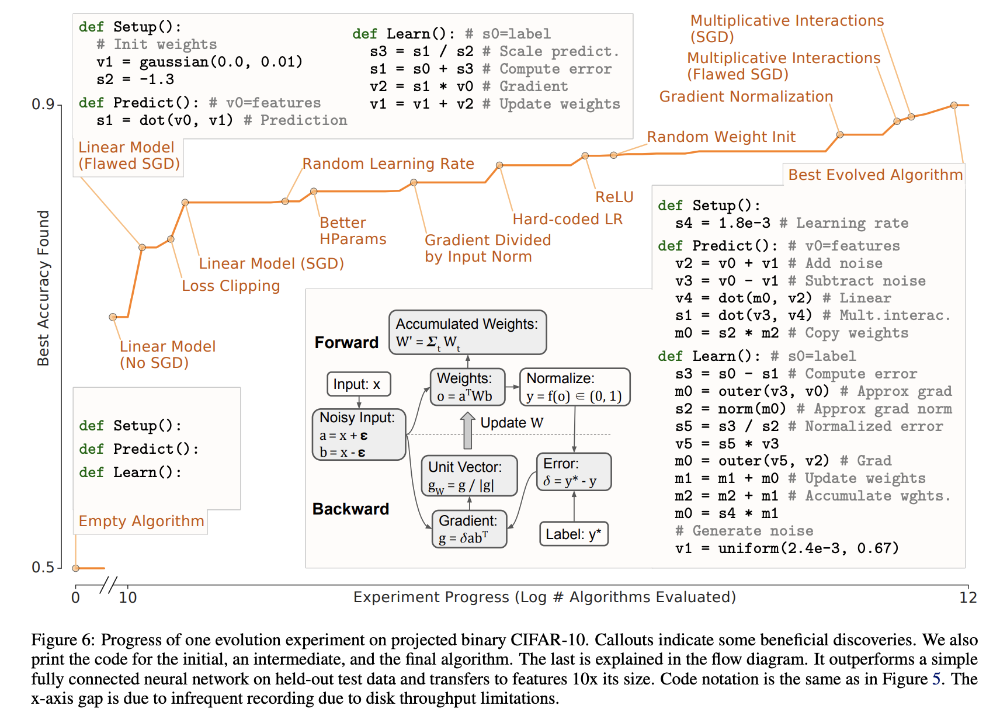

# [AutoML-Zero](https://paperswithcode.com/method/automl-zero)

**AutoML-Zero** is an AutoML technique that aims to search a fine-grained space simultaneously for the model, optimization procedure, initialization, and so on, permitting much less human-design and even allowing the discovery of non-neural network algorithms. It represents ML algorithms as computer programs comprised of three component functions, Setup, Predict, and Learn, that performs initialization, prediction and learning. The instructions in these functions apply basic mathematical operations on a small memory. The operation and memory addresses used by each instruction are free parameters in the search space, as is the size of the component functions. While this reduces expert design, the consequent sparsity means that random search cannot make enough progress. To overcome this difficulty, the authors use small proxy tasks and migration techniques to build an optimized infrastructure capable of searching through 10,000 models/second/cpu core.

Evolutionary methods can find solutions in the AutoML-Zero search space despite its enormous
size and sparsity. The authors show that by randomly modifying the programs and periodically selecting the best performing ones on given tasks/datasets, AutoML-Zero discovers reasonable algorithms. They start from empty programs and using data labeled by “teacher” neural networks with random weights, and demonstrate  evolution can discover neural networks trained by gradient descent. Following this, they minimize bias toward known algorithms by switching to binary classification tasks extracted from CIFAR-10 and allowing a larger set of possible operations. This discovers interesting techniques like multiplicative interactions, normalized gradient and weight averaging. Finally, they show it is possible for evolution to adapt the algorithm to the type of task provided. For example, dropout-like operations emerge when the task needs regularization and learning rate decay appears when the task requires faster convergence.

source: [source](https://arxiv.org/abs/2003.03384v2)
