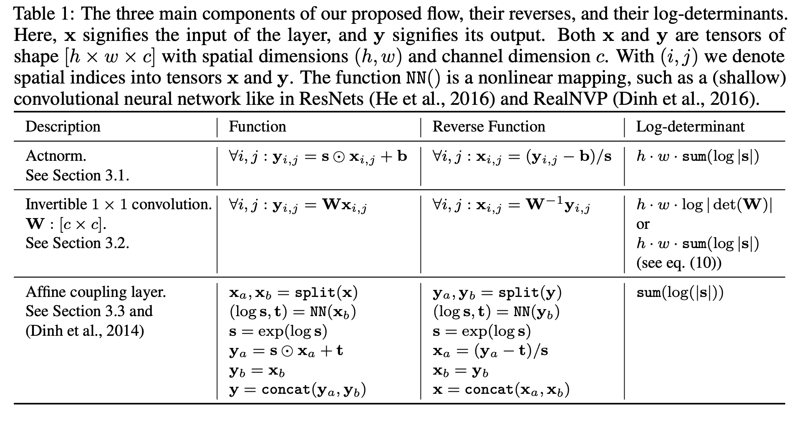

# [Affine Coupling](https://paperswithcode.com/method/affine-coupling)

**Affine Coupling** is a method for implementing a normalizing flow (where we stack a sequence of invertible bijective transformation functions). Affine coupling is one of these bijective transformation functions. Specifically, it is an example of a reversible transformation where the forward function, the reverse function and the log-determinant are computationally efficient. For the forward function, we split the input dimension into two parts:

$$ \mathbf{x}_{a}, \mathbf{x}_{b} = \text{split}\left(\mathbf{x}\right) $$

The second part stays the same $\mathbf{x}_{b} = \mathbf{y}_{b}$, while the first part  $\mathbf{x}_{a}$ undergoes an affine transformation, where the parameters for this transformation are learnt using the second part $\mathbf{x}_{b}$ being put through a neural network. Together we have:

$$ \left(\log{\mathbf{s}, \mathbf{t}}\right) = \text{NN}\left(\mathbf{x}_{b}\right) $$

$$ \mathbf{s} = \exp\left(\log{\mathbf{s}}\right) $$

$$ \mathbf{y}_{a} = \mathbf{s} \odot \mathbf{x}_{a} + \mathbf{t}  $$

$$ \mathbf{y}_{b} = \mathbf{x}_{b} $$

$$ \mathbf{y} = \text{concat}\left(\mathbf{y}_{a}, \mathbf{y}_{b}\right) $$

Image: [GLOW](https://arxiv.org/pdf/1807.03039.pdf)

source: [source](http://arxiv.org/abs/1410.8516v6)
