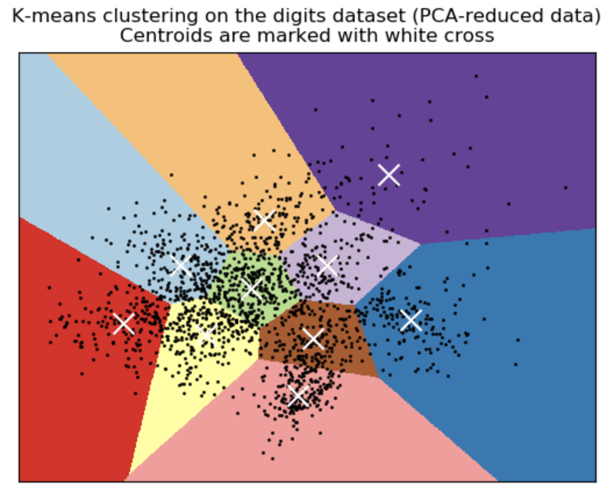

# [k-Means Clustering](https://paperswithcode.com/method/k-means-clustering)

**k-Means Clustering** is a clustering algorithm that divides a training set into $k$ different clusters of examples that are near each other. It works by initializing $k$ different centroids {$\mu\left(1\right),\ldots,\mu\left(k\right)$} to different values, then alternating between two steps until convergence:

(i) each training example is assigned to cluster $i$ where $i$ is the index of the nearest centroid $\mu^{(i)}$

(ii) each centroid $\mu^{(i)}$ is updated to the mean of all training examples $x^{(j)}$ assigned to cluster $i$.

Text Source: Deep Learning, Goodfellow et al

Image Source: [scikit-learn](https://scikit-learn.org/stable/auto_examples/cluster/plot_kmeans_digits.html)

