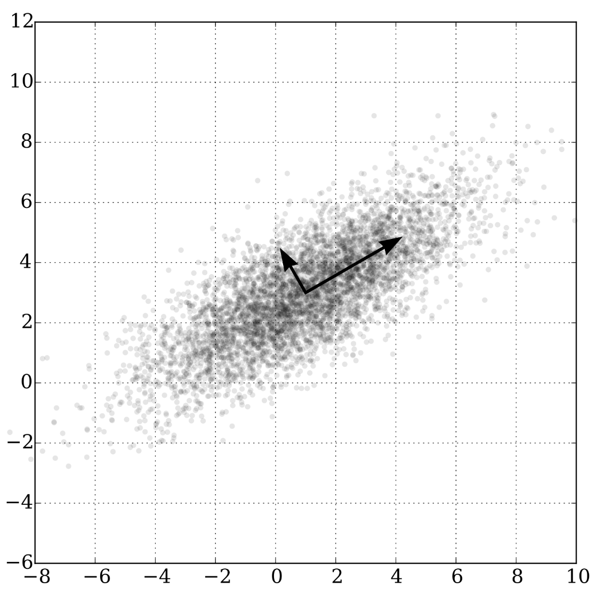

# [PCA](https://paperswithcode.com/method/pca)

**Principle Components Analysis (PCA)** is an unsupervised method primary used for dimensionality reduction within machine learning.  PCA is calculated via a singular value decomposition (SVD) of the design matrix, or alternatively, by calculating the covariance matrix of the data and performing eigenvalue decomposition on the covariance matrix. The results of PCA provide a low-dimensional picture of the structure of the data and the leading (uncorrelated) latent factors determining variation in the data.

Image Source: [Wikipedia](https://en.wikipedia.org/wiki/Principal_component_analysis#/media/File:GaussianScatterPCA.svg)

