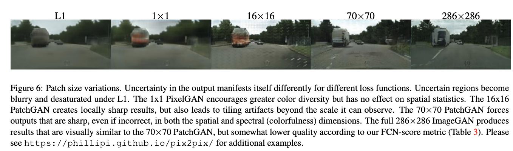
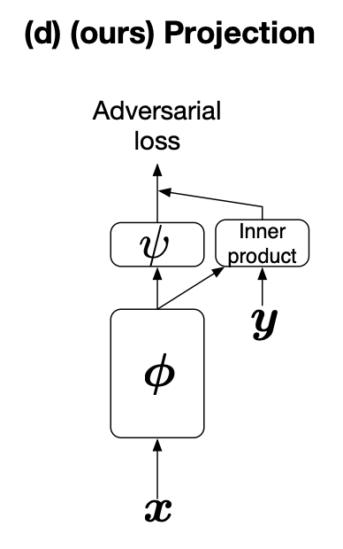
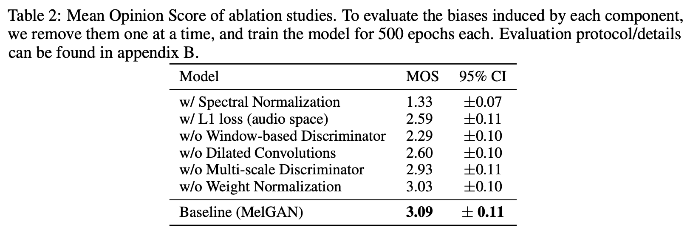
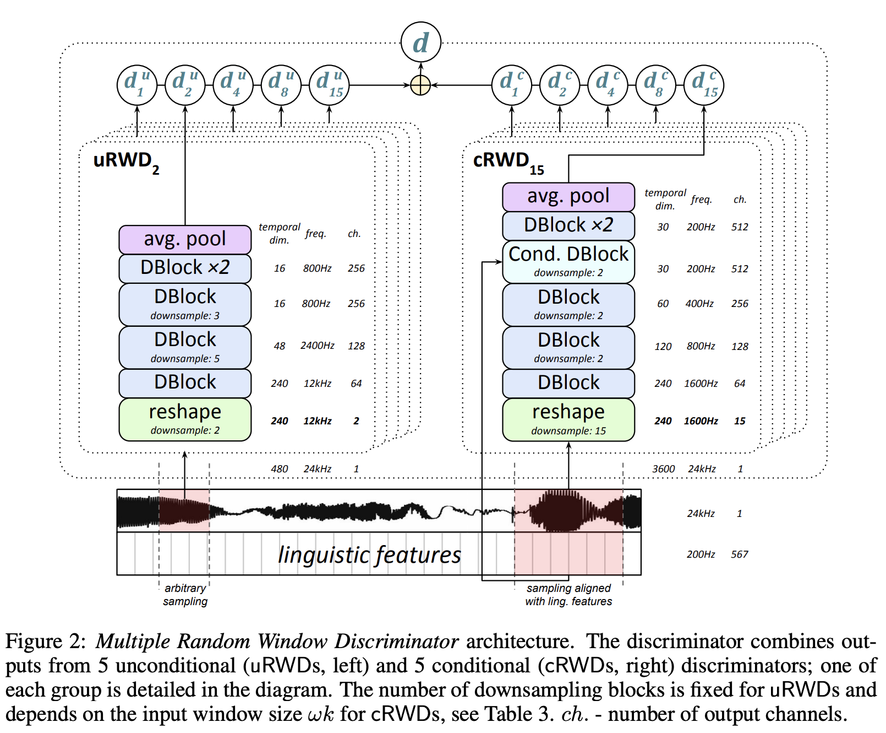

# PatchGAN

**PatchGAN** is a type of discriminator for generative adversarial networks which only penalizes structure at the scale of local image patches. The PatchGAN discriminator tries to classify if each $N \times N$ patch in an image is real or fake. This discriminator is run convolutionally across the image, averaging all responses to provide the ultimate output of $D$. Such a discriminator effectively models the image as a Markov random field, assuming independence between pixels separated by more than a patch diameter. It can be understood as a type of texture/style loss.

# Projection Discriminator

A **Projection Discriminator** is a type of discriminator for generative adversarial networks. It is motivated by a probabilistic model in which the distribution of the conditional variable $\textbf{y}$ given $\textbf{x}$ is discrete or uni-modal continuous distributions.

If we look at the original solution for the loss function $\mathcal{L}_{D}$ in the vanilla GANs, we can decompose it into the sum of two log-likelihood ratios:

$$ f^{*}\left(\mathbf{x}, \mathbf{y}\right) = \log\frac{q\left(\mathbf{x}\mid{\mathbf{y}}\right)q\left(\mathbf{y}\right)}{p\left(\mathbf{x}\mid{\mathbf{y}}\right)p\left(\mathbf{y}\right)} = \log\frac{q\left(\mathbf{y}\mid{\mathbf{x}}\right)}{p\left(\mathbf{y}\mid{\mathbf{x}}\right)} + \log\frac{q\left(\mathbf{x}\right)}{p\left(\mathbf{x}\right)}  = r\left(\mathbf{y\mid{x}}\right) + r\left(\mathbf{x}\right) $$

We can model the log likelihood ratio $r\left(\mathbf{y\mid{x}}\right)$ and  $r\left(\mathbf{x}\right)$ by some parametric functions $f_{1}$ and $f_{2}$ respectively. If we make a standing assumption that $p\left(y\mid{x}\right)$ and $q\left(y\mid{x}\right)$ are simple distributions like those that are Gaussian or discrete log linear on the feature space, then the parametrization of the following form becomes natural:

$$ f\left(\mathbf{x}, \mathbf{y}; \theta\right) = f_{1}\left(\mathbf{x}, \mathbf{y}; \theta\right) + f_{2}\left(\mathbf{x}; \theta\right) = \mathbf{y}^{T}V\phi\left(\mathbf{x}; \theta_{\phi}\right) + \psi\left(\phi(\mathbf{x}; \theta_{\phi}); \theta_{\psi}\right) $$

where $V$ is the embedding matrix of $y$, $\phi\left(·, \theta_{\phi}\right)$ is a vector output function of $x$, and $\psi\left(·, \theta_{\psi}\right)$ is a scalar function of the same $\phi\left(\mathbf{x}; \theta_{\phi}\right)$ that appears in $f_{1}$. The learned parameters $\theta = ${$V, \theta_{\phi}, \theta_{\psi}$} are trained to optimize the adversarial loss. This model of the discriminator is the projection.

# Window-based Discriminator

A **Window-based Discriminator** is a type of discriminator for generative adversarial networks. It is analogous to a [PatchGAN](https://paperswithcode.com/method/patchgan) but designed for audio. While a standard GAN discriminator learns to classify between distributions of entire audio sequences, window-based discriminator learns to classify between distribution of small audio chunks. Since the discriminator loss is computed over the overlapping windows where each window is very large (equal to the receptive field of the discriminator), the model learns to maintain coherence across patches.

# Multiple Random Window Discriminator

**Multiple Random Window Discriminator** is a discriminator used for the [GAN-TTS](https://paperswithcode.com/method/gan-tts) text-to-speech architecture. These discriminators operate on randomly sub-sampled fragments of the real or generated samples. The ensemble allows for the evaluation of audio in different complementary ways, and is obtained by taking
a Cartesian product of two parameter spaces: (i) the size of the random windows fed into the discriminator; (ii) whether a discriminator is conditioned on linguistic and pitch features. For example,
in the authors' best-performing model, they consider five window sizes (240, 480, 960, 1920, 3600 samples), which yields 10 discriminators in total. 

Using random windows of different size, rather than the full generated sample, has a data augmentation effect and also reduces the computational complexity of RWDs. In the first layer of each discriminator, the MRWD reshapes (downsamples) the input raw waveform to a constant
temporal dimension $\omega = 240$ by moving consecutive blocks of samples into the channel dimension, i.e. from $\left[\omega_{k}, 1\right]$ to $\left[\omega, k\right]$, where $k$ is the downsampling factor (e.g. $k = 8$ for input window size $1920$). This way, all the RWDs have the same architecture and similar computational complexity despite different window sizes. 

The conditional discriminators have access to linguistic and pitch features, and can measure whether
the generated audio matches the input conditioning. This means that random windows in conditional
discriminators need to be aligned with the conditioning frequency to preserve the correspondence
between the waveform and linguistic features within the sampled window. This limits the valid sampling to that of the frequency of the conditioning signal (200Hz, or every 5ms). The unconditional
discriminators, on the contrary, only evaluate whether the generated audio sounds realistic regardless
of the conditioning. The random windows for these discriminators are sampled without constraints
at full 24kHz frequency, which further increases the amount of training data. 

For the architecture, the discriminators consists of blocks (DBlocks) that are similar to the [GBlocks](https://paperswithcode.com/method/gblock) used in the generator, but without batch normalisation. Unconditional RWDs are composed entirely of DBlocks. In conditional RWDs, the input waveform is gradually downsampled by DBlocks, until the temporal dimension of the activation is equal to that of the conditioning, at which point a conditional DBlock is used. This joint information is then passed to the remaining DBlocks, whose final output is average-pooled to obtain a scalar. The dilation factors in the DBlocks’ convolutions follow the pattern 1, 2, 1, 2 – unlike the generator, the discriminator operates on a relatively small window, and the authors did not observe any benefit from using larger dilation factors.

# [Multiple Random Window Discriminator](__url)

**Multiple Random Window Discriminator** is a discriminator used for the [GAN-TTS](https://paperswithcode.com/method/gan-tts) text-to-speech architecture. These discriminators operate on randomly sub-sampled fragments of the real or generated samples. The ensemble allows for the evaluation of audio in different complementary ways, and is obtained by taking
a Cartesian product of two parameter spaces: (i) the size of the random windows fed into the discriminator; (ii) whether a discriminator is conditioned on linguistic and pitch features. For example,
in the authors' best-performing model, they consider five window sizes (240, 480, 960, 1920, 3600 samples), which yields 10 discriminators in total. 

Using random windows of different size, rather than the full generated sample, has a data augmentation effect and also reduces the computational complexity of RWDs. In the first layer of each discriminator, the MRWD reshapes (downsamples) the input raw waveform to a constant
temporal dimension $\omega = 240$ by moving consecutive blocks of samples into the channel dimension, i.e. from $\left[\omega_{k}, 1\right]$ to $\left[\omega, k\right]$, where $k$ is the downsampling factor (e.g. $k = 8$ for input window size $1920$). This way, all the RWDs have the same architecture and similar computational complexity despite different window sizes. 

The conditional discriminators have access to linguistic and pitch features, and can measure whether
the generated audio matches the input conditioning. This means that random windows in conditional
discriminators need to be aligned with the conditioning frequency to preserve the correspondence
between the waveform and linguistic features within the sampled window. This limits the valid sampling to that of the frequency of the conditioning signal (200Hz, or every 5ms). The unconditional
discriminators, on the contrary, only evaluate whether the generated audio sounds realistic regardless
of the conditioning. The random windows for these discriminators are sampled without constraints
at full 24kHz frequency, which further increases the amount of training data. 

For the architecture, the discriminators consists of blocks (DBlocks) that are similar to the [GBlocks](https://paperswithcode.com/method/gblock) used in the generator, but without batch normalisation. Unconditional RWDs are composed entirely of DBlocks. In conditional RWDs, the input waveform is gradually downsampled by DBlocks, until the temporal dimension of the activation is equal to that of the conditioning, at which point a conditional DBlock is used. This joint information is then passed to the remaining DBlocks, whose final output is average-pooled to obtain a scalar. The dilation factors in the DBlocks’ convolutions follow the pattern 1, 2, 1, 2 – unlike the generator, the discriminator operates on a relatively small window, and the authors did not observe any benefit from using larger dilation factors.

source: [source]https://arxiv.org/abs/1909.11646v2
# [Multiple Random Window Discriminator](https://paperswithcode.com/method/multiple-random-window-discriminator)

**Multiple Random Window Discriminator** is a discriminator used for the [GAN-TTS](https://paperswithcode.com/method/gan-tts) text-to-speech architecture. These discriminators operate on randomly sub-sampled fragments of the real or generated samples. The ensemble allows for the evaluation of audio in different complementary ways, and is obtained by taking
a Cartesian product of two parameter spaces: (i) the size of the random windows fed into the discriminator; (ii) whether a discriminator is conditioned on linguistic and pitch features. For example,
in the authors' best-performing model, they consider five window sizes (240, 480, 960, 1920, 3600 samples), which yields 10 discriminators in total. 

Using random windows of different size, rather than the full generated sample, has a data augmentation effect and also reduces the computational complexity of RWDs. In the first layer of each discriminator, the MRWD reshapes (downsamples) the input raw waveform to a constant
temporal dimension $\omega = 240$ by moving consecutive blocks of samples into the channel dimension, i.e. from $\left[\omega_{k}, 1\right]$ to $\left[\omega, k\right]$, where $k$ is the downsampling factor (e.g. $k = 8$ for input window size $1920$). This way, all the RWDs have the same architecture and similar computational complexity despite different window sizes. 

The conditional discriminators have access to linguistic and pitch features, and can measure whether
the generated audio matches the input conditioning. This means that random windows in conditional
discriminators need to be aligned with the conditioning frequency to preserve the correspondence
between the waveform and linguistic features within the sampled window. This limits the valid sampling to that of the frequency of the conditioning signal (200Hz, or every 5ms). The unconditional
discriminators, on the contrary, only evaluate whether the generated audio sounds realistic regardless
of the conditioning. The random windows for these discriminators are sampled without constraints
at full 24kHz frequency, which further increases the amount of training data. 

For the architecture, the discriminators consists of blocks (DBlocks) that are similar to the [GBlocks](https://paperswithcode.com/method/gblock) used in the generator, but without batch normalisation. Unconditional RWDs are composed entirely of DBlocks. In conditional RWDs, the input waveform is gradually downsampled by DBlocks, until the temporal dimension of the activation is equal to that of the conditioning, at which point a conditional DBlock is used. This joint information is then passed to the remaining DBlocks, whose final output is average-pooled to obtain a scalar. The dilation factors in the DBlocks’ convolutions follow the pattern 1, 2, 1, 2 – unlike the generator, the discriminator operates on a relatively small window, and the authors did not observe any benefit from using larger dilation factors.

source: [source]https://arxiv.org/abs/1909.11646v2
