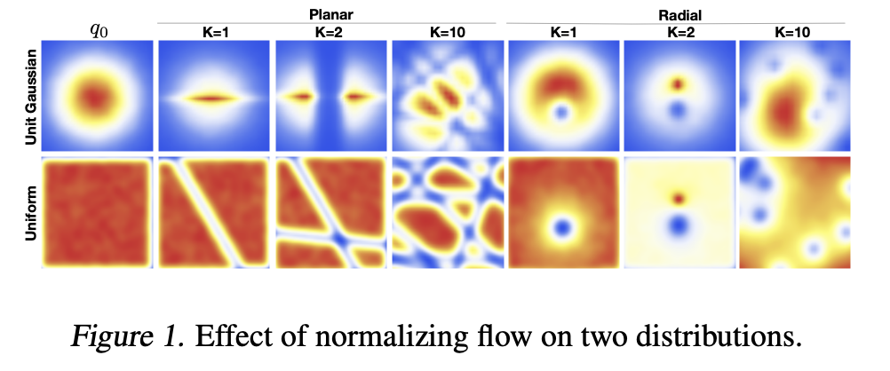

# [Normalizing Flows](https://paperswithcode.com/method/normalizing-flows)

**Normalizing Flows** are a method for constructing complex distributions by transforming a
probability density through a series of invertible mappings. By repeatedly applying the rule for change of variables, the initial density ‘flows’ through the sequence of invertible mappings. At the end of this sequence we obtain a valid probability distribution and hence this type of flow is referred to as a normalizing flow.

In the case of finite flows, the basic rule for the transformation of densities considers an invertible, smooth mapping $f : \mathbb{R}^{d} \rightarrow \mathbb{R}^{d}$ with inverse $f^{-1} = g$, i.e. the composition $g \cdot f\left(z\right) = z$. If we use this mapping to transform a random variable $z$ with distribution $q\left(z\right)$, the resulting random variable $z' = f\left(z\right)$ has a distribution:

$$ q\left(\mathbf{z}'\right) = q\left(\mathbf{z}\right)\bigl\vert{\text{det}}\frac{\delta{f}^{-1}}{\delta{\mathbf{z'}}}\bigr\vert = q\left(\mathbf{z}\right)\bigl\vert{\text{det}}\frac{\delta{f}}{\delta{\mathbf{z}}}\bigr\vert ^{-1} $$
?
where the last equality can be seen by applying the chain rule (inverse function theorem) and is a property of Jacobians of invertible functions. We can construct arbitrarily complex densities by composing several simple maps and successively applying the above equation. The density $q_{K}\left(\mathbf{z}\right)$ obtained by successively transforming a random variable $z_{0}$ with distribution $q_{0}$ through a chain of $K$ transformations $f_{k}$ is:

$$ z_{K} = f_{K} \cdot \dots \cdot f_{2} \cdot f_{1}\left(z_{0}\right) $$

$$ \ln{q}_{K}\left(z_{K}\right) = \ln{q}_{0}\left(z_{0}\right) − \sum^{K}_{k=1}\ln\vert\det\frac{\delta{f_{k}}}{\delta{\mathbf{z_{k-1}}}}\vert $$
?
The path traversed by the random variables $z_{k} = f_{k}\left(z_{k}−1\right)$ with initial distribution $q_{0}\left(z_{0}\right)$ is called the flow and the path formed by the successive distributions $q_{k}$ is a normalizing flow.

source: [source](http://arxiv.org/abs/1505.05770v6)
