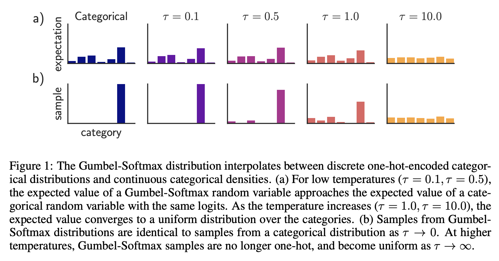

# [Gumbel Softmax](https://paperswithcode.com/method/gumbel-softmax)

**Gumbel-Softmax** is a continuous distribution that has the property that it can be smoothly annealed into a categorical distribution, and whose parameter gradients can be easily computed via the reparameterization trick.

source: [source]http://arxiv.org/abs/1611.01144v5
