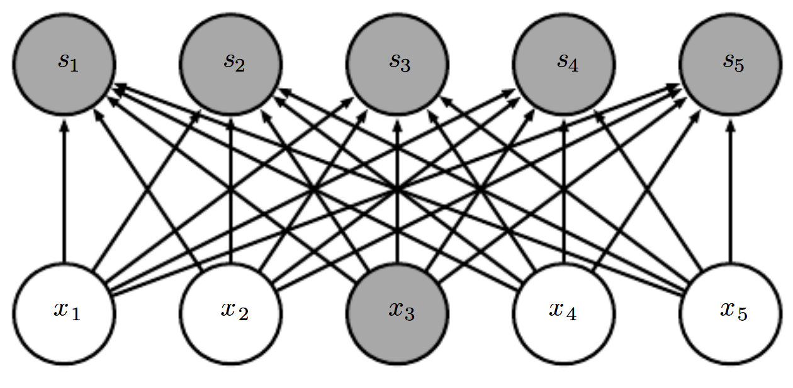
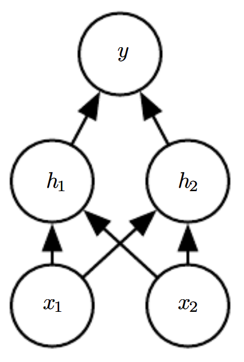
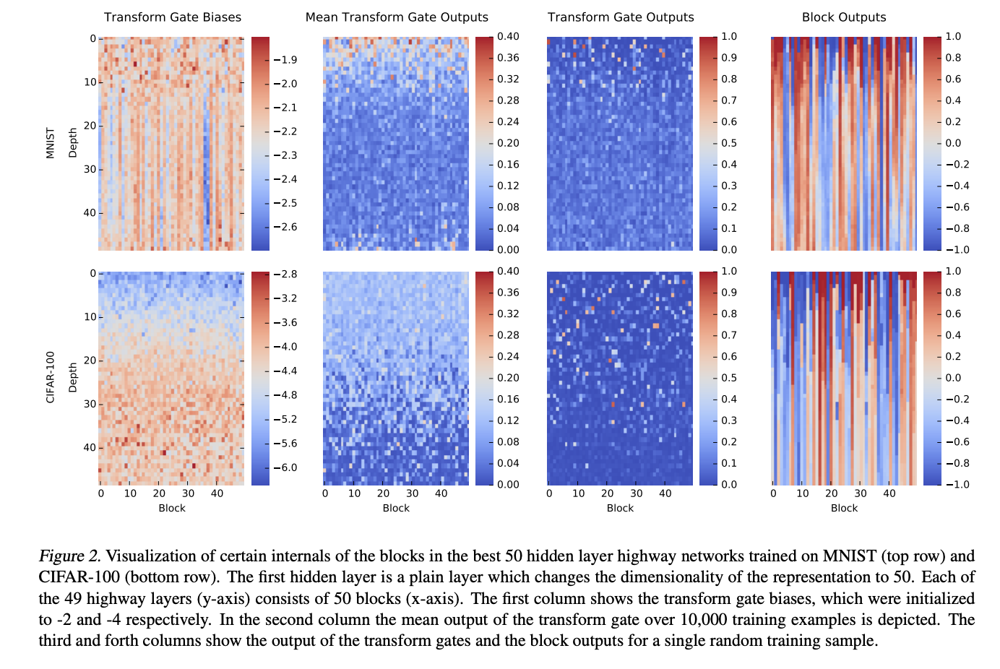
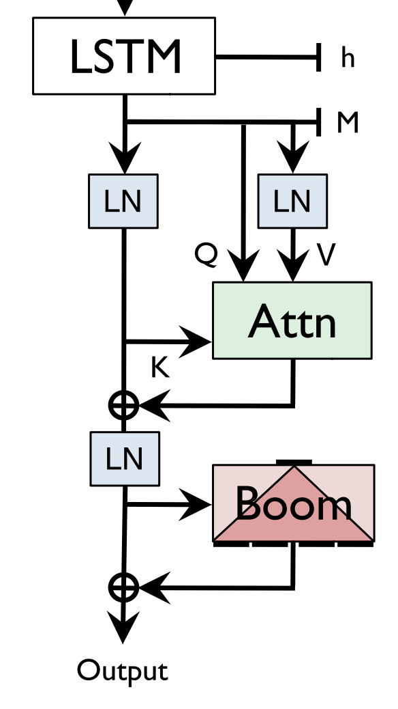

# Dense Connections

**Dense Connections**, or **Fully Connected Connections**, are a type of layer in a deep neural network that use a linear operation where every input is connected to every output by a weight. This means there are $n_{\text{inputs}}*n_{\text{outputs}}$ parameters, which can lead to a lot of parameters for a sizeable network.

$$h_{l} = g\left(\textbf{W}^{T}h_{l-1}\right)$$

where $g$ is an activation function.

Image Source: Deep Learning by Goodfellow, Bengio and Courville

# Feedforward Network

A **Feedforward Network**, or a **Multilayer Perceptron (MLP)**, is a neural network with solely densely connected layers. This is the classic neural network architecture of the literature. It consists of inputs $x$ passed through units $h$ (of which there can be many layers) to predict a target $y$. Activation functions are generally chosen to be non-linear to allow for flexible functional approximation.

Image Source: Deep Learning, Goodfellow et al

# Linear Layer

A **Linear Layer** is a projection $\mathbf{XW + b}$.

# Highway Network

A **Highway Network** is an architecture designed to ease gradient-based training of very deep networks. They allow unimpeded information flow across several layers on "information highways". The architecture is characterized by the use of gating units which learn to regulate the flow of information through a network. Highway networks with hundreds of layers can be trained directly using stochastic gradient descent and with a variety of activation functions.

# Boom Layer

A **Boom Layer** is a type of feedforward layer that is closely related to the feedforward layers used in Transformers. The layer takes a vector of the form $v \in \mathbb{R}^{H}$ and uses a matrix
multiplication with a GeLU activation to produce a vector $u \in \mathbb{R}^{N\times{H}}$. We then break $u$ into $N$ vectors and sum those together, producing $w \in \mathbb{R}^{H}$. This minimizes computation and removes an entire matrix of parameters compared to traditional down-projection layers.

The Figure to the right shows the Boom Layer used in the context of SHA-RNN from the original paper.

